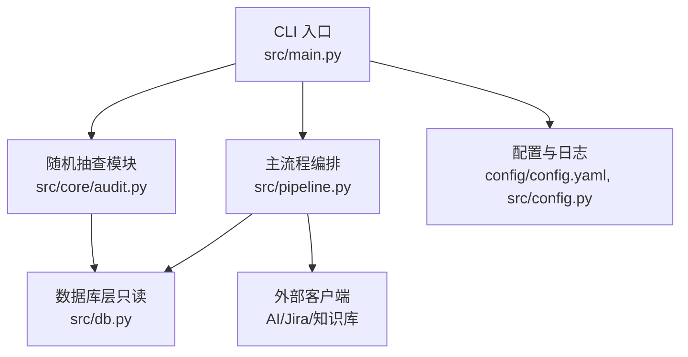
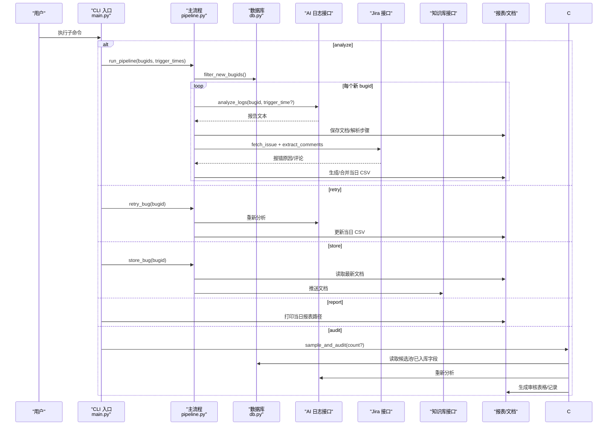
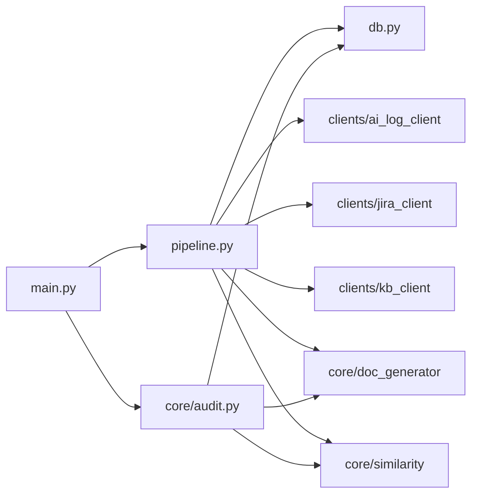

# CLI 命令参考

<cite>
**本文引用的文件**
- [src/main.py](file://src/main.py)
- [src/pipeline.py](file://src/pipeline.py)
- [src/core/audit.py](file://src/core/audit.py)
- [src/db.py](file://src/db.py)
- [config/config.yaml](file://config/config.yaml)
- [README.md](file://README.md)
- [tests/test_pipeline.py](file://tests/test_pipeline.py)
- [tests/test_audit.py](file://tests/test_audit.py)
</cite>

## 目录
1. [简介](#简介)
2. [项目结构](#项目结构)
3. [核心组件](#核心组件)
4. [架构总览](#架构总览)
5. [详细命令参考](#详细命令参考)
6. [依赖关系分析](#依赖关系分析)
7. [性能与最佳实践](#性能与最佳实践)
8. [故障排查指南](#故障排查指南)
9. [结论](#结论)

## 简介
本工具提供五个 CLI 子命令，用于 Bug 文档沉淀与质量保障闭环：analyze（bugid 分析）、retry（失败重试）、store（知识库入库）、report（报表查看）、audit（随机抽查）。工具运行结果不写入数据库，仅生成文档与每日 CSV 结论报表；知识库入库由开发手工触发。

## 项目结构
- CLI 入口与参数解析：src/main.py
- 主流程编排（去重、AI 分析、比对、报表）：src/pipeline.py
- 随机抽查复核：src/core/audit.py
- 数据库只读访问（去重、候选池、已入库字段读取）：src/db.py
- 全局配置与路径管理：config/config.yaml、src/config.py
- 使用示例与说明：README.md
- 端到端测试用例：tests/test_pipeline.py、tests/test_audit.py

图表来源
- [src/main.py:63-90](file://src/main.py#L63-L90)
- [src/pipeline.py:54-105](file://src/pipeline.py#L54-L105)
- [src/core/audit.py:96-142](file://src/core/audit.py#L96-L142)
- [src/db.py:67-132](file://src/db.py#L67-L132)
- [config/config.yaml:1-63](file://config/config.yaml#L1-L63)

章节来源
- [README.md:1-76](file://README.md#L1-L76)
- [src/main.py:1-111](file://src/main.py#L1-L111)

## 核心组件
- 命令行解析与分发：构建子命令 analyze/retry/store/report/audit，统一异常处理与退出码。
- 主流程 pipeline：步骤1 去重过滤、步骤2 AI 分析与文档生成、步骤3 Jira 比对并输出当日 CSV。
- 随机抽查 audit：从已入库表抽样重新分析，对比库存储字段，生成人工审核表格。
- 数据库 db：只读查询 bug_records 去重、抽取审计候选池、读取已入库根因与流程字段。
- 配置 config：加载 YAML，管理输出目录、接口超时、阈值等。

章节来源
- [src/main.py:18-90](file://src/main.py#L18-L90)
- [src/pipeline.py:18-105](file://src/pipeline.py#L18-L105)
- [src/core/audit.py:22-142](file://src/core/audit.py#L22-L142)
- [src/db.py:19-132](file://src/db.py#L19-L132)
- [config/config.yaml:10-63](file://config/config.yaml#L10-L63)

## 架构总览

图表来源
- [src/main.py:29-60](file://src/main.py#L29-L60)
- [src/pipeline.py:18-105](file://src/pipeline.py#L18-L105)
- [src/core/audit.py:65-142](file://src/core/audit.py#L65-L142)
- [src/db.py:67-132](file://src/db.py#L67-L132)

## 详细命令参考

### analyze（bugid 分析）
- 功能：对传入的 bugid 列表执行去重、AI 分析、Jira 比对，生成当日结论报表与文档。
- 语法：python -m src.main analyze <bugid...> [--trigger-time "BUGID=时间"]
- 必需参数：
  - bugids：一个或多个 Jira bugid。
- 可选参数：
  - --trigger-time：可多次指定，格式为 bugid=时间。
- 执行流程：
  - 去重过滤：基于数据库 bug_records 表进行只读比对，过滤已存在与本批重复项。
  - AI 分析：调用 AI 日志接口获取报告，生成 docs/日期/bugid.md，并解析步骤。
  - Jira 比对：提取报错原因与评论，经 Agent 过滤后与文档步骤做相似性比对。
  - 报表输出：汇总本次结果生成或合并 reports/日期_daily.csv。
- 返回状态码：
  - 成功：进程退出码 0。
  - 失败：捕获异常时退出码 1（例如参数格式错误、外部接口异常等）。
- 输出结果：
  - 文档：docs/日期/bugid.md。
  - 报表：reports/日期_daily.csv（含 bugid、触发时间、分析状态、根因一致、步骤一致、相似度、文档路径、错误信息、分析时间等列）。
- 使用示例：
  - 基础分析：python -m src.main analyze BUG-1001 BUG-1002
  - 带触发时间：python -m src.main analyze BUG-1001 --trigger-time "BUG-1001=2026-08-12 10:00:00"
  - 批量+多触发时间：python -m src.main analyze BUG-1001 BUG-1002 --trigger-time "BUG-1001=2026-08-12 10:00:00" --trigger-time "BUG-1002=2026-08-12 11:00:00"
- 复杂场景：
  - 输入包含重复 bugid：批内重复会被过滤，仅分析一次。
  - 部分失败：单个 bug 分析失败不会中断整体流程，失败行会记录到报表中。
- 注意事项：
  - 工具不写数据库，仅读 bug_records 表进行去重。
  - 同日多次运行按 bugid 覆盖合并，避免重复行。

章节来源
- [src/main.py:29-33](file://src/main.py#L29-L33)
- [src/main.py:63-72](file://src/main.py#L63-L72)
- [src/pipeline.py:54-86](file://src/pipeline.py#L54-L86)
- [tests/test_pipeline.py:21-47](file://tests/test_pipeline.py#L21-L47)
- [tests/test_pipeline.py:50-58](file://tests/test_pipeline.py#L50-L58)

### retry（失败重试）
- 功能：对指定 bugid 重新执行 AI 分析与比对，更新当日结论报表。
- 语法：python -m src.main retry <bugid>
- 必需参数：
  - bugid：需要重试的 Jira bugid。
- 执行流程：
  - 重新调用 AI 日志接口，生成文档与步骤。
  - 与 Jira 报错原因与评论进行比对。
  - 将结果写入/覆盖当日报表中的该 bugid 记录。
- 返回状态码：
  - 成功：0。
  - 失败：1（如外部接口异常、无文档等）。
- 输出结果：
  - 文档：docs/日期/bugid.md。
  - 报表：reports/日期_daily.csv（对应 bugid 的记录被覆盖更新）。
- 使用示例：
  - python -m src.main retry BUG-1001
- 注意事项：
  - 适用于之前分析失败的 bug，直至分析正确为止。

章节来源
- [src/main.py:36-39](file://src/main.py#L36-L39)
- [src/pipeline.py:89-93](file://src/pipeline.py#L89-L93)
- [tests/test_pipeline.py:73-83](file://tests/test_pipeline.py#L73-L83)

### store（知识库入库）
- 功能：在开发确认分析正确后，手工将指定 bugid 的分析文档推入知识库。
- 语法：python -m src.main store <bugid>
- 必需参数：
  - bugid：需要入库的 Jira bugid。
- 执行流程：
  - 查找该 bugid 的最新分析文档。
  - 读取文档内容并调用知识库接口推送。
- 返回状态码：
  - 成功：0。
  - 失败：1（如无文档、接口异常等）。
- 输出结果：
  - 控制台提示“分析文档已推入知识库”。
- 使用示例：
  - python -m src.main store BUG-1001
- 注意事项：
  - 此步骤不做自动化校验，是否入库完全由执行人决定。
  - 若未生成分析文档，将抛出 FileNotFoundError。

章节来源
- [src/main.py:42-45](file://src/main.py#L42-L45)
- [src/pipeline.py:96-105](file://src/pipeline.py#L96-L105)
- [tests/test_pipeline.py:61-71](file://tests/test_pipeline.py#L61-L71)

### report（报表查看）
- 功能：查看当日结论报表路径（默认当天，也可指定日期）。
- 语法：python -m src.main report [--date YYYY-MM-DD]
- 可选参数：
  - --date：日期，格式 YYYY-MM-DD，默认当天。
- 执行流程：
  - 计算报表路径 reports/日期_daily.csv。
  - 若文件不存在则抛出 FileNotFoundError。
- 返回状态码：
  - 成功：0。
  - 失败：1（报表不存在）。
- 输出结果：
  - 控制台打印报表路径。
- 使用示例：
  - python -m src.main report
  - python -m src.main report --date 2026-08-12

章节来源
- [src/main.py:48-54](file://src/main.py#L48-L54)

### audit（随机抽查）
- 功能：从数据库已入库表中随机抽取指定数量 bugid，重新分析并与库存储字段对比，生成人工审核表格。
- 语法：python -m src.main audit [--count N]
- 可选参数：
  - --count：抽样数量，默认取配置 audit.sample_count（30）。
- 执行流程：
  - 读取已入库表（kb_analysis）全部 bugid 与触发时间作为候选池。
  - 排除历史已抽查过的 bugid（记录在 reports/audited_bugids.csv）。
  - 对每个抽样 bugid 重新调用 AI 接口，生成文档并与库存储的根因与分析流程做相似度对比。
  - 生成审核表格 reports/audit_comparison.csv，并追加本次抽查记录到 audited_bugids.csv。
- 返回状态码：
  - 成功：0。
  - 失败：1（如无可抽查 bugid、接口异常等）。
- 输出结果：
  - 审核表格：reports/audit_comparison.csv（含 bugid、触发时间、新根因结论、已入库根因分析、根因相似度、已入库分析流程、流程相似度、文档路径、抽查时间、人工审核结论等列）。
  - 已抽查记录：reports/audited_bugids.csv。
- 使用示例：
  - python -m src.main audit
  - python -m src.main audit --count 20
- 注意事项：
  - 若可用候选不足请求数量，将抽查全部可用候选。
  - 若候选池为空，将抛出 ValueError。

章节来源
- [src/main.py:57-60](file://src/main.py#L57-L60)
- [src/main.py:86-89](file://src/main.py#L86-L89)
- [src/core/audit.py:96-142](file://src/core/audit.py#L96-L142)
- [tests/test_audit.py:38-96](file://tests/test_audit.py#L38-L96)

## 依赖关系分析
- main 依赖 pipeline、db、core.audit、config。
- pipeline 依赖 db、clients（ai_log_client、jira_client、kb_client）、core（doc_generator、filter、report、similarity）。
- audit 依赖 db、clients.ai_log_client、core.doc_generator、core.similarity、config。
- db 依赖 sqlalchemy、config。

图表来源
- [src/main.py:11-13](file://src/main.py#L11-L13)
- [src/pipeline.py:8-13](file://src/pipeline.py#L8-L13)
- [src/core/audit.py:15-18](file://src/core/audit.py#L15-L18)
- [src/db.py:9-12](file://src/db.py#L9-L12)

## 性能与最佳实践
- 批量分析建议：
  - 合理拆分 bugid 批次，避免单次过大导致外部接口超时或内存压力。
  - 利用 --trigger-time 精确指定触发时间，提高 AI 分析准确性。
- 重试策略：
  - 对失败 bug 使用 retry 命令逐条重试，直至分析正确。
  - 关注日志与报表中的 error_msg，定位问题根因。
- 抽查优化：
  - 使用 --count 控制抽样规模，避免候选池过小导致频繁报错。
  - 定期执行 audit，确保知识库内容与最新分析保持一致。
- 配置调优：
  - 调整 similarity.threshold 与 root_cause_hit_ratio 以适配不同场景。
  - 设置合适的 ai_log_api.timeout、jira_api.timeout、knowledge_base_api.timeout。
- 输出管理：
  - 定期归档 docs、reports、logs，避免磁盘占用过高。
  - 通过 report 命令快速定位当日报表路径，便于后续处理。

[本节为通用指导，无需具体文件引用]

## 故障排查指南
- 常见错误与处理：
  - 当日报表不存在：执行 report 时报错，请先运行 analyze 生成报表。
  - 无可抽查 bugid：audit 报 ValueError，检查 kb_analysis 表是否有数据。
  - 无分析文档入库：store 报 FileNotFoundError，先执行 analyze 生成文档。
  - 触发时间参数格式错误：--trigger-time 必须为 bugid=时间，否则抛 ValueError。
- 日志与诊断：
  - 查看 logs/app_YYYY-MM-DD.log，定位外部接口调用与异常堆栈。
  - 检查 reports/audit_comparison.csv 的人工审核结论列，了解失败原因。
- 外部接口问题：
  - 确认 config.yaml 中 mock 开关与 url、认证信息是否正确。
  - 适当增加 timeout，或在网络不稳定时重试。
- 数据库问题：
  - 确认 database.url 指向正确的 SQLite 或 MySQL。
  - 检查 bug_records、kb_analysis 表结构与字段映射是否与配置一致。

章节来源
- [src/main.py:101-106](file://src/main.py#L101-L106)
- [src/pipeline.py:67-83](file://src/pipeline.py#L67-L83)
- [src/core/audit.py:111-131](file://src/core/audit.py#L111-L131)
- [config/config.yaml:5-36](file://config/config.yaml#L5-L36)

## 结论
本 CLI 提供了完整的 Bug 文档沉淀与质量保障能力：analyze 负责批量分析与报表生成，retry 支持失败重试，store 实现手工入库，report 提供报表查看，audit 完成随机抽查与一致性验证。通过合理的参数组合与配置调优，开发者可以高效地维护高质量的知识库，并确保分析结果的准确性与可追溯性。