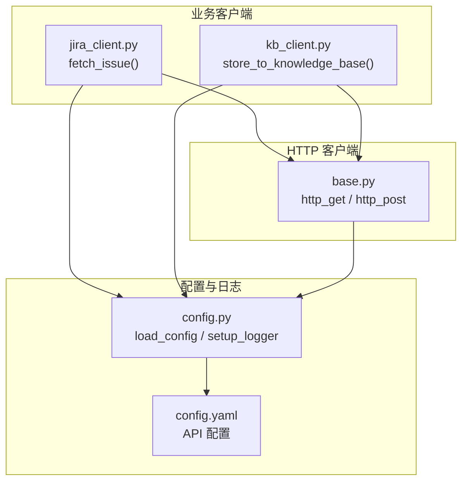
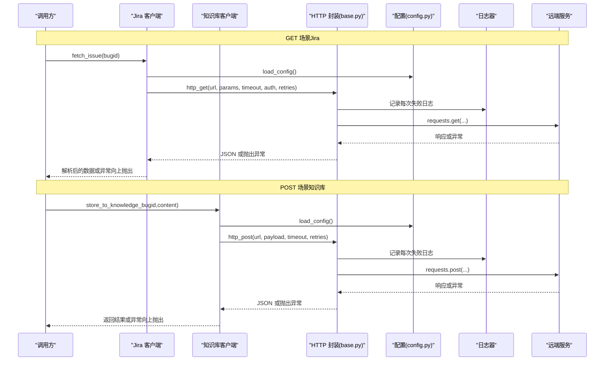
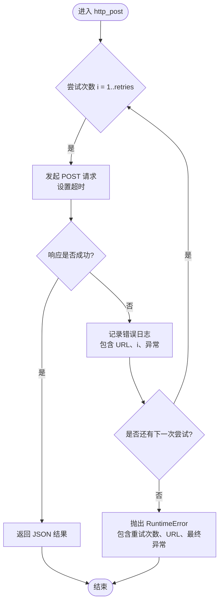
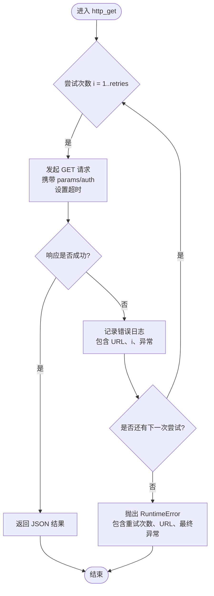
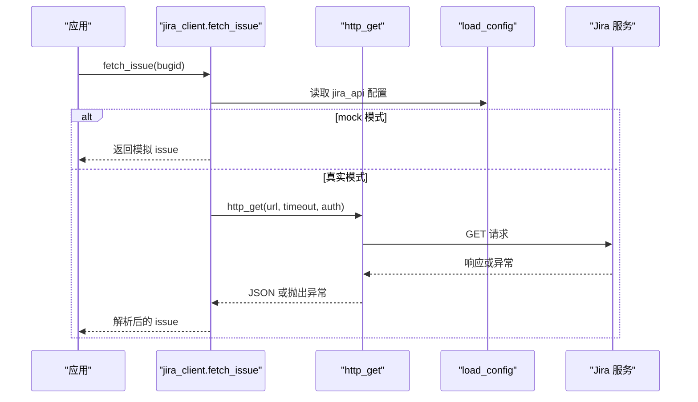
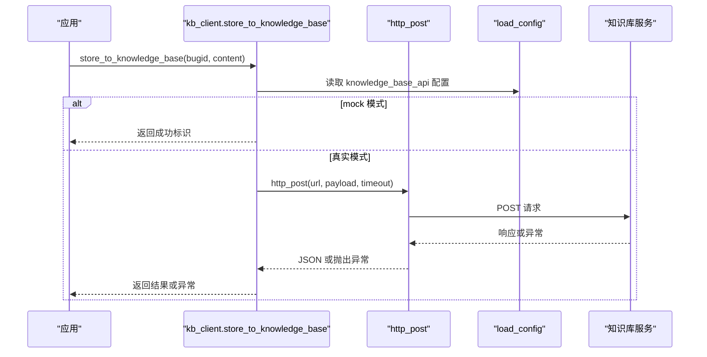
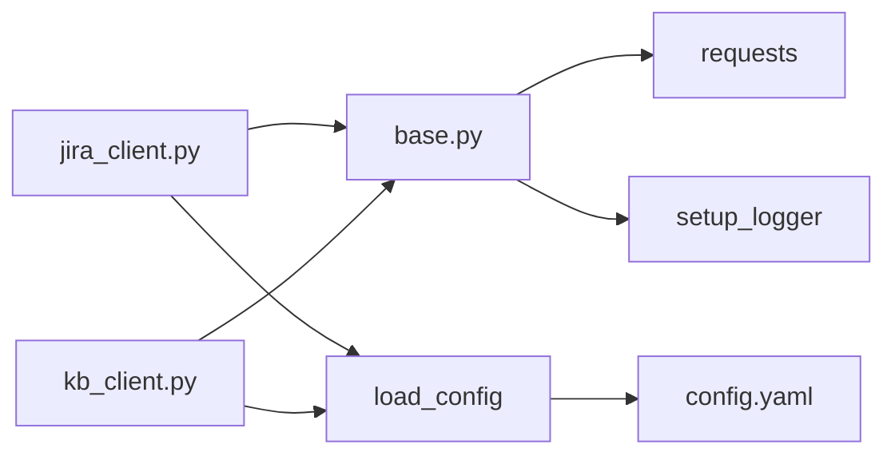

# HTTP 客户端封装

<cite>
**本文引用的文件**
- [base.py](file://src/clients/base.py)
- [jira_client.py](file://src/clients/jira_client.py)
- [kb_client.py](file://src/clients/kb_client.py)
- [config.py](file://src/config.py)
- [config.yaml](file://config/config.yaml)
- [test_pipeline.py](file://tests/test_pipeline.py)
</cite>

## 目录
1. [简介](#简介)
2. [项目结构](#项目结构)
3. [核心组件](#核心组件)
4. [架构总览](#架构总览)
5. [详细组件分析](#详细组件分析)
6. [依赖关系分析](#依赖关系分析)
7. [性能与可靠性](#性能与可靠性)
8. [故障排查指南](#故障排查指南)
9. [结论](#结论)
10. [附录：使用示例与最佳实践](#附录：使用示例与最佳实践)

## 简介
本模块提供统一的 HTTP 客户端封装，聚焦于 GET/POST 请求的通用能力：超时控制、重试机制、统一错误日志与异常抛出。上层业务客户端（如 Jira 客户端、知识库入库客户端）直接复用该封装，避免重复实现网络层逻辑，确保一致的错误处理与可观测性。

## 项目结构
- src/clients/base.py：定义 http_get 与 http_post，内置重试、超时、错误日志与异常抛出。
- src/clients/jira_client.py：基于 http_get 获取 Jira 问题信息，支持 mock 模式与认证参数透传。
- src/clients/kb_client.py：基于 http_post 将分析结果写入知识库接口，支持 mock 模式。
- src/config.py：配置加载与日志初始化；为 HTTP 客户端提供 logger。
- config/config.yaml：各 API 的 URL、超时、认证等配置项。
- tests/test_pipeline.py：端到端流程测试，间接体现 HTTP 客户端在业务流程中的使用。

图表来源
- [base.py:12-38](file://src/clients/base.py#L12-L38)
- [jira_client.py:32-43](file://src/clients/jira_client.py#L32-L43)
- [kb_client.py:8-23](file://src/clients/kb_client.py#L8-L23)
- [config.py:17-25,37-58:17-25](file://src/config.py#L17-L25)
- [config.yaml:19-35](file://config/config.yaml#L19-L35)

章节来源
- [base.py:1-39](file://src/clients/base.py#L1-L39)
- [jira_client.py:1-54](file://src/clients/jira_client.py#L1-L54)
- [kb_client.py:1-24](file://src/clients/kb_client.py#L1-L24)
- [config.py:1-59](file://src/config.py#L1-L59)
- [config.yaml:1-63](file://config/config.yaml#L1-L63)

## 核心组件
- http_post(url, payload, timeout=30, retries=DEFAULT_RETRIES)
  - 功能：发送 POST 请求，返回 JSON；失败时按次数重试并记录错误日志；全部失败后抛出运行时异常。
  - 关键行为：
    - 默认重试次数：3 次（DEFAULT_RETRIES）。
    - 超时：默认 30 秒，可通过参数覆盖。
    - 错误日志：每次失败均记录 URL、尝试次数与异常信息。
    - 异常抛出：最后一次失败后抛出包含重试次数、URL 与最终异常的 RuntimeError。
- http_get(url, params=None, timeout=30, auth=None, retries=DEFAULT_RETRIES)
  - 功能：发送 GET 请求，返回 JSON；失败时按次数重试并记录错误日志；全部失败后抛出运行时异常。
  - 关键行为：
    - 默认重试次数：3 次。
    - 超时：默认 30 秒，可通过参数覆盖。
    - 认证：支持通过 auth 元组传递用户名与令牌（例如 Jira Basic Auth）。
    - 错误日志：每次失败均记录 URL、尝试次数与异常信息。
    - 异常抛出：最后一次失败后抛出包含重试次数、URL 与最终异常的 RuntimeError。

章节来源
- [base.py:8-38](file://src/clients/base.py#L8-L38)

## 架构总览
HTTP 客户端作为底层能力被多个业务客户端复用。配置由 YAML 集中管理，日志由统一 logger 输出到控制台与按日归档的文件。

图表来源
- [jira_client.py:32-43](file://src/clients/jira_client.py#L32-L43)
- [kb_client.py:8-23](file://src/clients/kb_client.py#L8-L23)
- [base.py:12-38](file://src/clients/base.py#L12-L38)
- [config.py:17-25,37-58:17-25](file://src/config.py#L17-L25)

## 详细组件分析

### http_post 实现原理与流程
- 输入：
  - url：目标接口地址。
  - payload：JSON 负载字典。
  - timeout：单次请求超时时间（秒），默认 30。
  - retries：重试次数，默认 3。
- 执行流程：
  - 循环尝试 retries 次。
  - 每次发起 POST 请求，设置超时。
  - 若响应状态码非成功，raise_for_status 抛出异常进入重试分支。
  - 捕获异常并记录错误日志（包含 URL、尝试次数、异常信息）。
  - 若所有尝试均失败，抛出包含重试次数、URL 与最终异常的 RuntimeError。
- 复杂度：
  - 时间复杂度 O(retries)，空间复杂度 O(1)。
- 优化点：
  - 可根据业务需要引入指数退避与抖动策略，降低瞬时拥塞压力。
  - 对幂等性判断进行差异化重试（仅对可重试错误重试）。

图表来源
- [base.py:12-23](file://src/clients/base.py#L12-L23)

章节来源
- [base.py:12-23](file://src/clients/base.py#L12-L23)

### http_get 实现原理与流程
- 输入：
  - url：目标接口地址。
  - params：查询参数字典（可选）。
  - timeout：单次请求超时时间（秒），默认 30。
  - auth：认证元组（用户名, 令牌），用于 Basic Auth 等场景。
  - retries：重试次数，默认 3。
- 执行流程：
  - 循环尝试 retries 次。
  - 每次发起 GET 请求，携带 params 与 auth，设置超时。
  - 若响应状态码非成功，raise_for_status 抛出异常进入重试分支。
  - 捕获异常并记录错误日志（包含 URL、尝试次数、异常信息）。
  - 若所有尝试均失败，抛出包含重试次数、URL 与最终异常的 RuntimeError。
- 复杂度：
  - 时间复杂度 O(retries)，空间复杂度 O(1)。
- 优化点：
  - 同 http_post，建议结合指数退避与抖动策略。
  - 针对特定错误类型（如 5xx、网络异常）进行差异化重试。

图表来源
- [base.py:26-38](file://src/clients/base.py#L26-L38)

章节来源
- [base.py:26-38](file://src/clients/base.py#L26-L38)

### 业务客户端集成示例

#### Jira 客户端（GET）
- 功能：根据 bugid 获取 issue 信息，支持 mock 模式与 Basic Auth。
- 调用链：
  - 读取配置（URL、timeout、认证）。
  - 构造 URL 与认证参数。
  - 调用 http_get 获取数据。
  - 解析 fields.description 与 comments。
- 典型用法：
  - 正常模式：传入 username/token 进行认证。
  - Mock 模式：直接返回模拟数据，便于开发与测试。

图表来源
- [jira_client.py:32-43](file://src/clients/jira_client.py#L32-L43)
- [base.py:26-38](file://src/clients/base.py#L26-L38)
- [config.yaml:19-27](file://config/config.yaml#L19-L27)

章节来源
- [jira_client.py:1-54](file://src/clients/jira_client.py#L1-L54)

#### 知识库客户端（POST）
- 功能：将分析文档内容提交至知识库接口，支持 mock 模式。
- 调用链：
  - 读取配置（URL、timeout、字段映射）。
  - 构造 payload（bugid_field、content_field）。
  - 调用 http_post 提交数据。
  - 返回接口响应或抛出异常。
- 典型用法：
  - 开发阶段使用 mock 快速验证流程。
  - 生产环境关闭 mock，启用真实接口。

图表来源
- [kb_client.py:8-23](file://src/clients/kb_client.py#L8-L23)
- [base.py:12-23](file://src/clients/base.py#L12-L23)
- [config.yaml:29-35](file://config/config.yaml#L29-L35)

章节来源
- [kb_client.py:1-24](file://src/clients/kb_client.py#L1-L24)

## 依赖关系分析
- base.py 依赖：
  - requests：HTTP 客户端库。
  - src.config.setup_logger：统一日志器。
- jira_client.py 依赖：
  - src.clients.base.http_get：GET 请求封装。
  - src.config.load_config/setup_logger：配置与日志。
- kb_client.py 依赖：
  - src.clients.base.http_post：POST 请求封装。
  - src.config.load_config/setup_logger：配置与日志。
- 配置文件：
  - config.yaml 中定义了各 API 的 URL、超时、认证与字段映射。

图表来源
- [base.py:1-6](file://src/clients/base.py#L1-L6)
- [jira_client.py:1-5](file://src/clients/jira_client.py#L1-L5)
- [kb_client.py:1-4](file://src/clients/kb_client.py#L1-L4)
- [config.py:17-25](file://src/config.py#L17-L25)
- [config.yaml:19-35](file://config/config.yaml#L19-L35)

章节来源
- [base.py:1-6](file://src/clients/base.py#L1-L6)
- [jira_client.py:1-5](file://src/clients/jira_client.py#L1-L5)
- [kb_client.py:1-4](file://src/clients/kb_client.py#L1-L4)
- [config.py:17-25](file://src/config.py#L17-L25)
- [config.yaml:19-35](file://config/config.yaml#L19-L35)

## 性能与可靠性
- 重试机制：
  - 默认重试次数为 3 次，可在调用处覆盖。
  - 当前实现为固定间隔重试；建议在生产环境中引入指数退避与随机抖动，以降低雪崩风险。
- 超时策略：
  - 默认超时 30 秒，可按接口特性调整（如 AI 日志分析接口配置为 60 秒）。
  - 合理设置超时可避免资源长期占用与线程阻塞。
- 错误日志：
  - 每次失败均记录 URL、尝试次数与异常信息，便于定位问题。
  - 日志同时输出到控制台与按日期归档的文件，便于审计与回溯。
- 异常处理：
  - 统一在最后一次失败后抛出 RuntimeError，包含重试次数、URL 与最终异常，便于上层捕获与告警。
- 可扩展性：
  - 可抽象出可重试错误集合与不可重试错误集合，精细化控制重试策略。
  - 可接入熔断与降级机制，提升系统韧性。

[本节为通用指导，不直接分析具体文件]

## 故障排查指南
- 常见问题：
  - 接口超时：检查 config.yaml 中对应接口的 timeout 配置，适当增大。
  - 认证失败：确认 jira_api 的 username 与 token 是否正确填写。
  - 网络异常：查看日志中的错误信息与尝试次数，确认服务端可用性。
  - 重试耗尽：若多次重试仍失败，优先检查服务端状态码与错误消息。
- 日志位置：
  - 控制台输出与 logs/app_YYYY-MM-DD.log 文件。
- 定位步骤：
  - 从日志中查找“第 N 次请求失败”的记录，确认 URL 与异常。
  - 核对 config.yaml 中对应接口的配置。
  - 必要时临时增加重试次数或延长超时以观察现象。

章节来源
- [config.py:37-58](file://src/config.py#L37-L58)
- [config.yaml:19-35](file://config/config.yaml#L19-L35)

## 结论
本 HTTP 客户端封装提供了简洁一致的 GET/POST 请求能力，内置重试、超时与统一错误日志，显著降低了业务客户端的网络层复杂度。通过配置化与日志化，提升了可维护性与可观测性。建议在后续迭代中引入指数退避、差异化重试与熔断降级，进一步提升系统的鲁棒性与弹性。

[本节为总结性内容，不直接分析具体文件]

## 附录：使用示例与最佳实践

### 使用示例
- 调用 Jira 获取 issue（GET）
  - 参考路径：[jira_client.py:32-43](file://src/clients/jira_client.py#L32-L43)
  - 说明：读取配置，构造 URL 与认证，调用 http_get，解析 fields.description 与 comments。
- 调用知识库入库（POST）
  - 参考路径：[kb_client.py:8-23](file://src/clients/kb_client.py#L8-L23)
  - 说明：读取配置，构造 payload，调用 http_post，返回结果或抛出异常。
- 端到端流程测试
  - 参考路径：[test_pipeline.py:21-83](file://tests/test_pipeline.py#L21-L83)
  - 说明：通过 pipeline 运行与分析，间接验证 HTTP 客户端在业务流程中的使用。

章节来源
- [jira_client.py:32-43](file://src/clients/jira_client.py#L32-L43)
- [kb_client.py:8-23](file://src/clients/kb_client.py#L8-L23)
- [test_pipeline.py:21-83](file://tests/test_pipeline.py#L21-L83)

### 最佳实践建议
- 超时时间设置
  - 根据接口 SLA 设置合理的 timeout，避免过长导致资源占用与过短导致误判。
  - 对于耗时较长的接口（如 AI 分析），可适当提高超时（例如 60 秒）。
- 重试次数配置
  - 默认 3 次适用于大多数场景；对不稳定网络或服务可适度增加。
  - 建议结合指数退避与抖动，避免瞬时拥塞。
- 错误处理策略
  - 区分可重试与不可重试错误，仅对可重试错误进行重试。
  - 在最后一次失败后抛出明确异常，便于上层捕获与告警。
- 认证与安全
  - 敏感信息（username、token）应通过配置管理，避免硬编码。
  - 使用 HTTPS 与最小权限原则。
- 可观测性
  - 充分利用统一日志器，记录关键路径与异常信息。
  - 定期巡检日志文件，发现潜在问题。

[本节为通用指导，不直接分析具体文件]