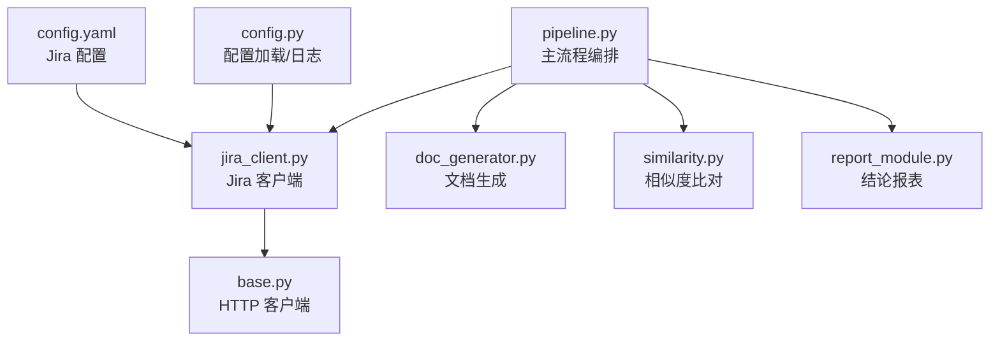
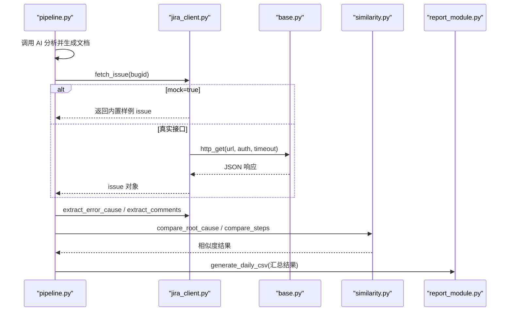
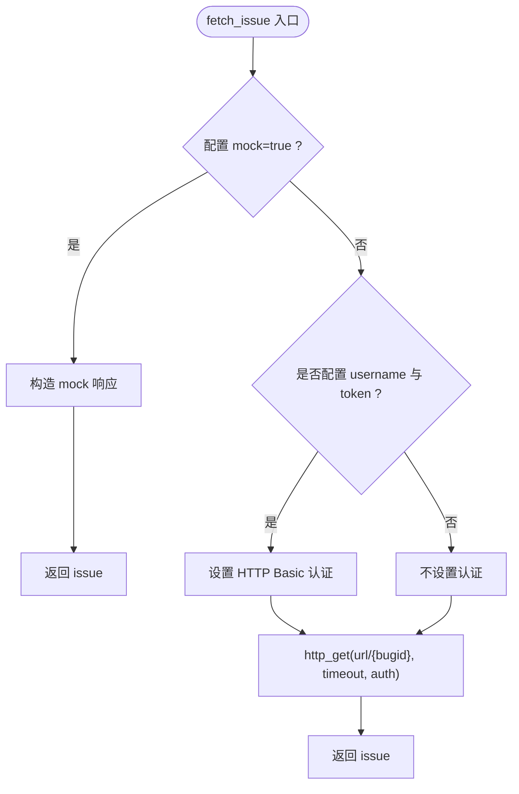
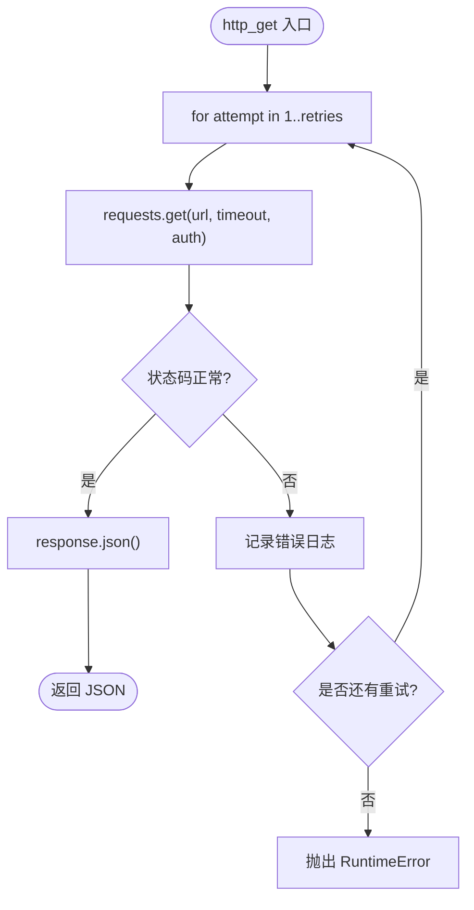
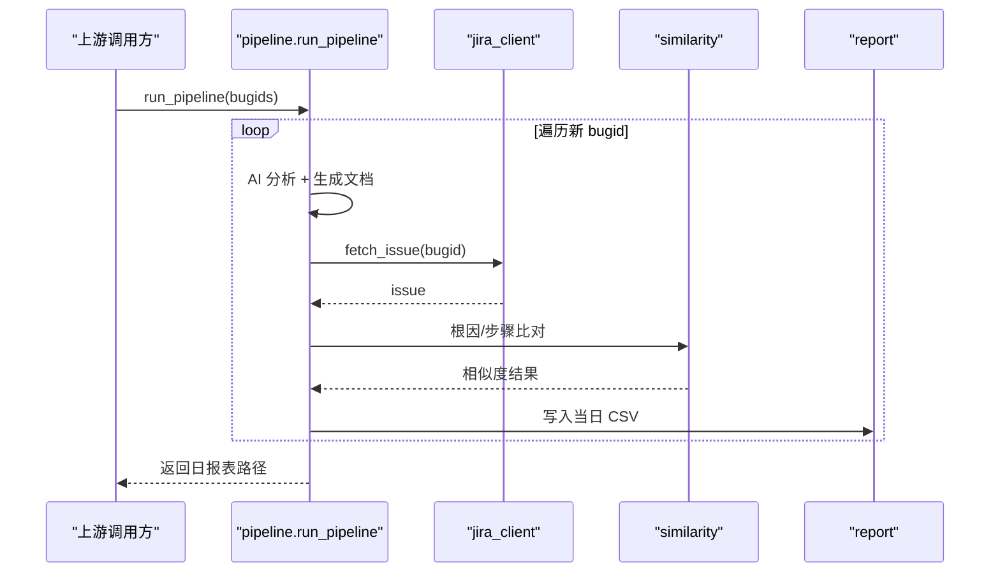
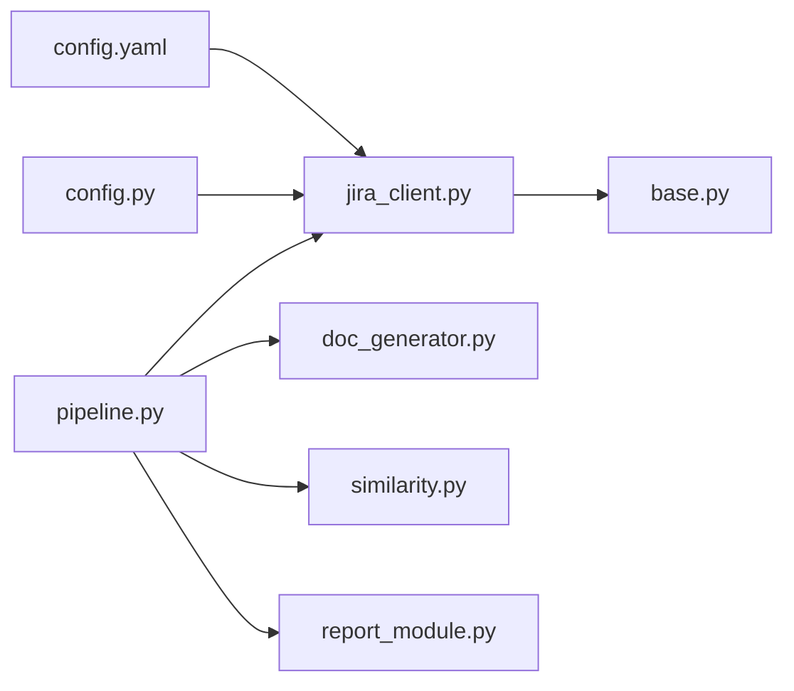

# Jira 集成

<cite>
**本文引用的文件**
- [src/clients/jira_client.py](file://src/clients/jira_client.py)
- [src/clients/base.py](file://src/clients/base.py)
- [config/config.yaml](file://config/config.yaml)
- [src/config.py](file://src/config.py)
- [src/pipeline.py](file://src/pipeline.py)
- [README.md](file://README.md)
</cite>

## 目录
1. [简介](#简介)
2. [项目结构](#项目结构)
3. [核心组件](#核心组件)
4. [架构总览](#架构总览)
5. [详细组件分析](#详细组件分析)
6. [依赖关系分析](#依赖关系分析)
7. [性能与可靠性](#性能与可靠性)
8. [故障排查指南](#故障排查指南)
9. [结论](#结论)
10. [附录：使用示例与最佳实践](#附录使用示例与最佳实践)

## 简介
本模块提供与 Jira REST API 的集成能力，用于在 Bug 分析流程中获取问题信息（如报错原因）与评论历史，并参与“根因一致性”和“步骤相似性”的双重比对。当前实现支持两种运行模式：
- Mock 模式：通过内置样例数据快速验证流程，便于开发与测试。
- 真实接口模式：通过用户名+Token 进行 HTTP Basic 认证调用 Jira REST API。

该集成与主业务流程紧密耦合，位于“AI 日志分析 → 文档生成 → Jira 比对 → 结论报表”的关键路径上。

## 项目结构
围绕 Jira 集成的关键文件与职责如下：
- src/clients/jira_client.py：封装 Jira 客户端，负责 issue 查询、字段提取、评论提取，以及 mock 响应构造。
- src/clients/base.py：通用 HTTP 客户端，提供带重试与统一错误日志的 GET/POST 请求能力。
- config/config.yaml：Jira 接口配置项（URL、超时、认证、mock 开关等）。
- src/config.py：配置文件加载与日志初始化。
- src/pipeline.py：主流程编排，串联 AI 分析、文档生成、Jira 比对与结论报表输出。
- README.md：整体使用说明与流程说明。

图表来源
- [src/pipeline.py:18-51](file://src/pipeline.py#L18-L51)
- [src/clients/jira_client.py:32-53](file://src/clients/jira_client.py#L32-L53)
- [src/clients/base.py:26-38](file://src/clients/base.py#L26-L38)
- [config/config.yaml:19-28](file://config/config.yaml#L19-L28)
- [src/config.py:17-25](file://src/config.py#L17-L25)

章节来源
- [README.md:7-13](file://README.md#L7-L13)
- [src/pipeline.py:1-14](file://src/pipeline.py#L1-L14)

## 核心组件
- Jira 客户端（jira_client.py）
  - fetch_issue(bugid)：根据 bugid 获取 issue 信息；若启用 mock，则返回内置样例数据；否则调用 Jira REST API。
  - extract_error_cause(issue)：从 fields.description 提取报错原因。
  - extract_comments(issue)：从 comments 字段提取评论列表。
- HTTP 客户端（base.py）
  - http_get(url, params, timeout, auth, retries)：GET 请求，默认重试 3 次，失败记录日志并抛出异常。
  - http_post(url, payload, timeout, retries)：POST 请求，行为同 GET。
- 配置加载（config.py + config.yaml）
  - load_config()：读取 YAML 配置并缓存。
  - jira_api.*：包含 url、timeout、username、token、mock 等开关与参数。

章节来源
- [src/clients/jira_client.py:32-53](file://src/clients/jira_client.py#L32-L53)
- [src/clients/base.py:12-38](file://src/clients/base.py#L12-L38)
- [src/config.py:17-25](file://src/config.py#L17-L25)
- [config/config.yaml:19-28](file://config/config.yaml#L19-L28)

## 架构总览
Jira 集成在主流程中的位置与交互如下：
- pipeline._analyze_single 先调用 AI 日志分析并生成文档，再调用 jira_client.fetch_issue 获取 issue。
- 从 issue 中提取报错原因与评论，评论经过滤后得到“分析步骤”。
- 将 AI 报告文本与 Jira 报错原因做关键词命中比例比对；将文档步骤与评论步骤做相似性比对。
- 综合判定“根因一致”和“步骤一致”，写入当日结论报表。

图表来源
- [src/pipeline.py:18-51](file://src/pipeline.py#L18-L51)
- [src/clients/jira_client.py:32-53](file://src/clients/jira_client.py#L32-L53)
- [src/clients/base.py:26-38](file://src/clients/base.py#L26-L38)

## 详细组件分析

### Jira 客户端（jira_client.py）
- 功能要点
  - fetch_issue：根据配置决定走 mock 或真实接口；真实接口时组装 URL 为 {url}/{bugid}，并使用 username/token 作为 HTTP Basic 认证。
  - extract_error_cause：安全地从 fields.description 取值，缺失时返回空串。
  - extract_comments：安全地取 comments 列表，缺失时返回空列表。
- 数据契约
  - 输入：bugid（字符串）
  - 输出：issue 字典，包含 fields.description 与 comments 列表（mock 模式下由 _build_mock_response 构造）
- 错误处理
  - 当进入真实接口时，底层 http_get 会重试并记录错误日志，最终抛出自定义 RuntimeError 以提示上层。

图表来源
- [src/clients/jira_client.py:32-43](file://src/clients/jira_client.py#L32-L43)
- [src/clients/base.py:26-38](file://src/clients/base.py#L26-L38)

章节来源
- [src/clients/jira_client.py:18-53](file://src/clients/jira_client.py#L18-L53)

### HTTP 客户端（base.py）
- 功能要点
  - http_get/http_post：统一封装 requests 调用，支持超时与重试（默认 3 次），失败记录日志并抛出异常。
- 错误处理策略
  - 每次失败记录错误日志，循环重试直至成功或达到最大次数。
  - 超过重试次数后抛出 RuntimeError，携带最后一次错误信息，便于上层定位。

图表来源
- [src/clients/base.py:26-38](file://src/clients/base.py#L26-L38)

章节来源
- [src/clients/base.py:1-39](file://src/clients/base.py#L1-L39)

### 配置与认证（config.yaml + config.py）
- 配置项
  - jira_api.mock：是否使用 mock 数据（开发/测试建议开启）。
  - jira_api.url：Jira REST API 基础地址（例如 /rest/api/2/issue）。
  - jira_api.timeout：请求超时秒数。
  - jira_api.username / jira_api.token：HTTP Basic 认证所需凭据。
- 加载机制
  - load_config() 读取 YAML 并全局缓存，避免重复 IO。
  - setup_logger() 初始化日志，统一格式与输出目标。

章节来源
- [config/config.yaml:19-28](file://config/config.yaml#L19-L28)
- [src/config.py:17-25](file://src/config.py#L17-L25)

### 与主业务流程的集成（pipeline.py）
- 角色定位
  - 在“AI 分析 → 文档生成 → Jira 比对”链路中，Jira 提供“外部事实源”（报错原因与评论），用于校验 AI 生成的文档质量。
- 调用时序
  - 对每个 bugid，先完成 AI 分析与文档生成，再调用 Jira 获取 issue，随后进行双重比对并汇总到日报表。
- 容错设计
  - 单个 bug 分析失败不会中断整体流程，失败结果会被记录到结论报表中，便于后续人工复核与重试。

图表来源
- [src/pipeline.py:54-86](file://src/pipeline.py#L54-L86)
- [src/pipeline.py:18-51](file://src/pipeline.py#L18-L51)

章节来源
- [src/pipeline.py:1-105](file://src/pipeline.py#L1-L105)

## 依赖关系分析
- 直接依赖
  - jira_client 依赖 base.http_get 发起网络请求。
  - pipeline 依赖 jira_client、ai_log_client、doc_generator、similarity、report_module。
- 间接依赖
  - 所有模块共享 config.load_config 与 setup_logger，保证配置与日志的一致性。
- 潜在风险
  - 若 Jira 服务不可用或认证失败，http_get 会在重试耗尽后抛出异常，导致当前 bug 分析失败，但不影响其他 bug 的处理。

图表来源
- [src/clients/jira_client.py:32-43](file://src/clients/jira_client.py#L32-L43)
- [src/pipeline.py:18-51](file://src/pipeline.py#L18-L51)
- [src/clients/base.py:26-38](file://src/clients/base.py#L26-L38)

章节来源
- [src/clients/jira_client.py:1-54](file://src/clients/jira_client.py#L1-L54)
- [src/pipeline.py:1-105](file://src/pipeline.py#L1-L105)
- [src/clients/base.py:1-39](file://src/clients/base.py#L1-L39)

## 性能与可靠性
- 超时控制
  - 通过配置 jira_api.timeout 控制单次请求超时，避免阻塞。
- 重试机制
  - 底层 http_get 默认重试 3 次，提升在网络抖动或服务瞬断时的成功率。
- 并发与吞吐
  - 当前实现为串行处理 bugid；如需更高吞吐，可在 pipeline 层引入并发执行（注意限流与幂等）。
- 资源占用
  - 仅涉及轻量级 JSON 解析与内存对象构建，CPU/内存开销较低。

[本节为通用指导，无需特定文件引用]

## 故障排查指南
- 权限不足（401/403）
  - 检查 config.yaml 中 jira_api.username 与 jira_api.token 是否正确填写。
  - 确认账号具备对应项目的读取权限。
- 网络超时
  - 增大 jira_api.timeout；检查网络连通性与代理设置。
  - 观察日志中 GET 请求失败的重试次数与错误信息。
- 数据格式错误
  - 确保 Jira 返回的 issue 包含 fields.description 与 comments；若缺失，extract_* 方法会返回空值，不影响后续流程但可能影响比对结果。
- 接口不可用
  - 确认 jira_api.url 正确且可达；必要时切换至 mock 模式验证流程。
- 单点失败不影响整体
  - pipeline 捕获异常并将失败结果写入日报表，可据此定位具体 bugid 的问题。

章节来源
- [src/clients/base.py:12-38](file://src/clients/base.py#L12-L38)
- [src/pipeline.py:68-83](file://src/pipeline.py#L68-L83)
- [config/config.yaml:19-28](file://config/config.yaml#L19-L28)

## 结论
本集成以最小侵入的方式将 Jira 数据纳入 Bug 分析闭环，通过“根因关键词命中 + 步骤相似性”双重指标评估 AI 分析质量，并以日报表形式沉淀结论。其优势在于：
- 易于切换 mock/真实环境，便于开发与测试。
- 统一的 HTTP 客户端封装，具备重试与日志能力。
- 与主流程解耦良好，单点失败不影响整体。

在生产环境中，建议：
- 严格管理凭据（username/token），避免硬编码。
- 合理设置超时与重试，结合监控告警。
- 定期抽查与审计，确保比对阈值与业务现状匹配。

[本节为总结性内容，无需特定文件引用]

## 附录：使用示例与最佳实践

### 认证配置方式
- 用户名+Token（HTTP Basic）
  - 在 config.yaml 的 jira_api 下配置 username 与 token。
  - 关闭 mock 后，fetch_issue 会使用上述凭据发起请求。
- Mock 模式
  - 将 jira_api.mock 设为 true，即可使用内置样例数据进行联调与测试。

章节来源
- [config/config.yaml:19-28](file://config/config.yaml#L19-L28)
- [src/clients/jira_client.py:32-43](file://src/clients/jira_client.py#L32-L43)

### Jira API 调用流程
- 请求参数构建
  - URL：{jira_api.url}/{bugid}
  - 认证：若配置了 username 与 token，则以元组形式传入 http_get 的 auth 参数。
  - 超时：使用 jira_api.timeout。
- 响应数据解析
  - 期望返回 JSON，包含 fields.description 与 comments。
  - 通过 extract_error_cause 与 extract_comments 安全提取。
- 错误处理策略
  - 底层 http_get 会重试并记录日志；超过重试次数抛出异常，pipeline 捕获后将失败结果写入日报表。

章节来源
- [src/clients/jira_client.py:32-53](file://src/clients/jira_client.py#L32-L53)
- [src/clients/base.py:26-38](file://src/clients/base.py#L26-L38)
- [src/pipeline.py:68-83](file://src/pipeline.py#L68-L83)

### 常见操作示例（概念性）
- 查询 Bug 信息
  - 调用 fetch_issue(bugid)，返回 issue 字典，再通过 extract_error_cause 获取报错原因。
- 获取评论历史
  - 调用 extract_comments(issue) 获取评论列表，交由评论过滤模块提取“分析步骤”。
- 更新问题状态
  - 当前实现未包含写操作；如需更新状态，可在 pipeline 中新增写接口调用（需额外考虑权限与幂等）。

[本节为概念性示例，不直接展示代码片段]

### 与主业务流程的集成要点
- 在 pipeline 中，Jira 数据用于与 AI 分析结果进行双重比对，形成“根因一致/步骤一致”的结论。
- 结论写入当日 CSV 报表，供复盘与手工入库决策。
- 失败重试：对失败的 bug，可通过 retry_bug 重新分析并覆盖当日报表记录。

章节来源
- [src/pipeline.py:18-51](file://src/pipeline.py#L18-L51)
- [src/pipeline.py:89-93](file://src/pipeline.py#L89-L93)