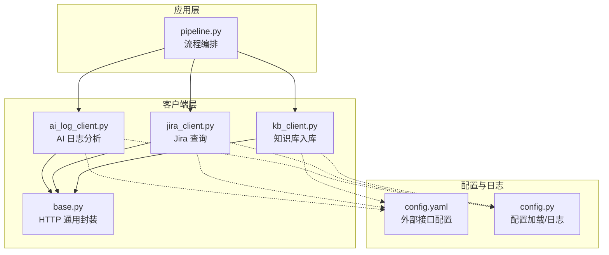
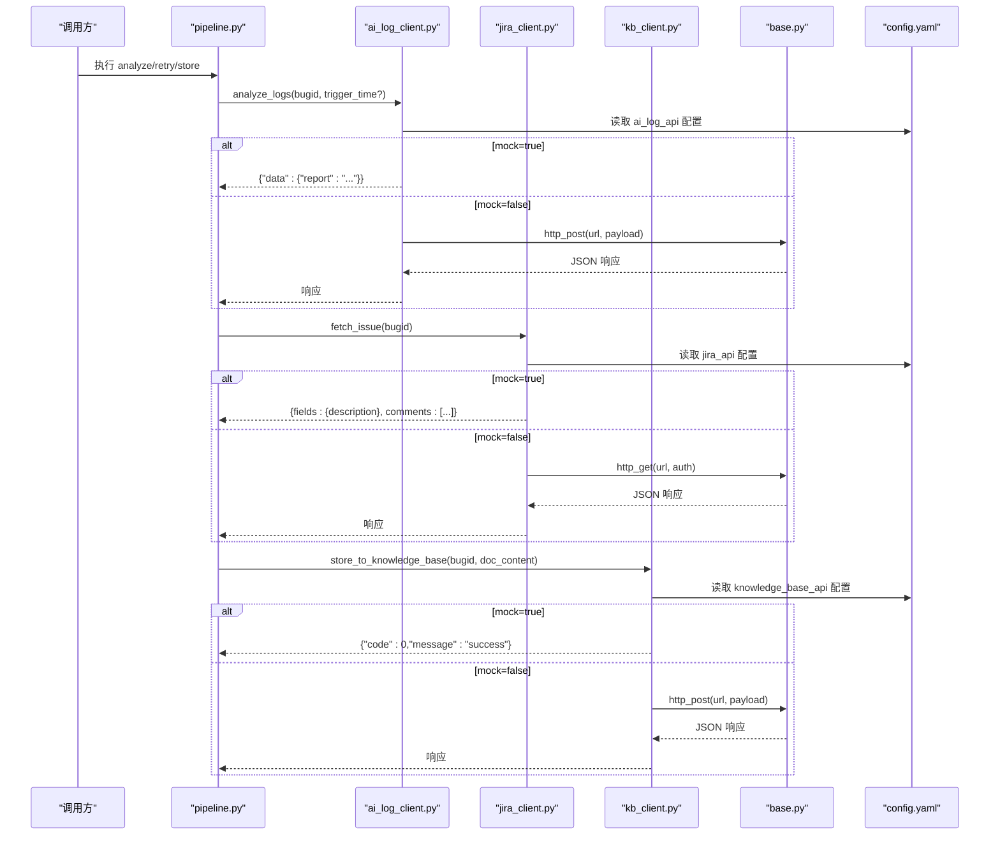
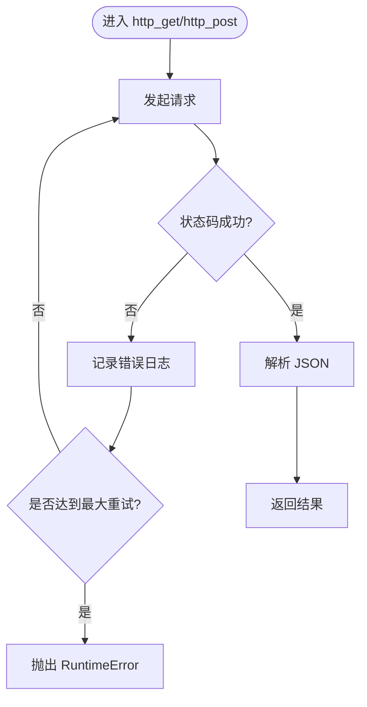
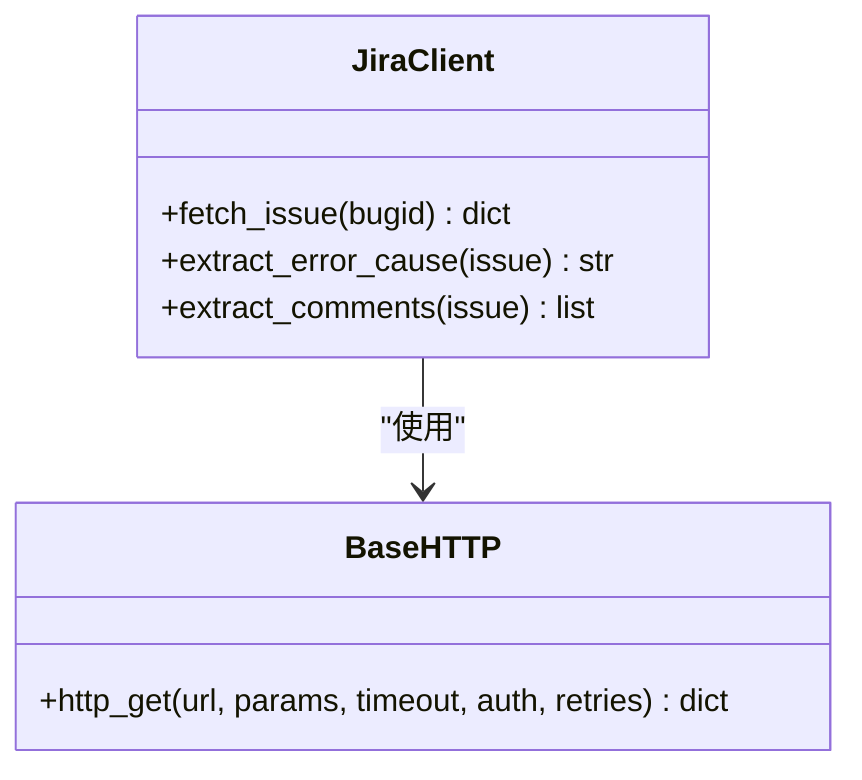
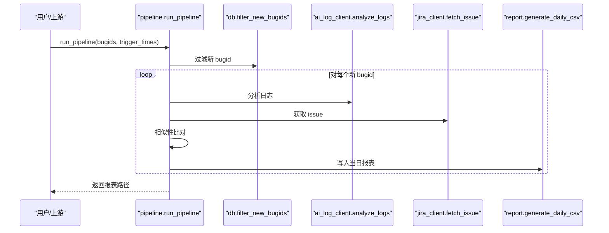
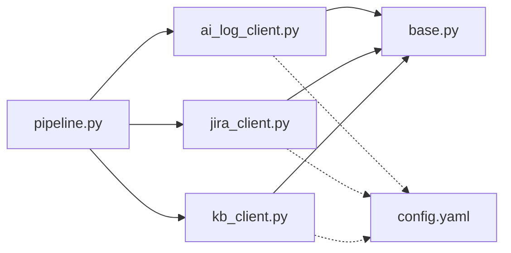

# 外部集成

<cite>
**本文引用的文件**
- [base.py](file://src/clients/base.py)
- [jira_client.py](file://src/clients/jira_client.py)
- [kb_client.py](file://src/clients/kb_client.py)
- [ai_log_client.py](file://src/clients/ai_log_client.py)
- [config.yaml](file://config/config.yaml)
- [config.py](file://src/config.py)
- [pipeline.py](file://src/pipeline.py)
- [README.md](file://README.md)
</cite>

## 目录
1. [简介](#简介)
2. [项目结构](#项目结构)
3. [核心组件](#核心组件)
4. [架构总览](#架构总览)
5. [详细组件分析](#详细组件分析)
6. [依赖关系分析](#依赖关系分析)
7. [性能与可靠性](#性能与可靠性)
8. [故障排查指南](#故障排查指南)
9. [结论](#结论)
10. [附录：配置与安全](#附录：配置与安全)

## 简介
本模块负责与三个外部服务进行集成：AI 日志分析工具、Jira REST API、知识库系统。通过统一的 HTTP 客户端封装，提供请求重试、错误处理与统一接口抽象；在 Jira 客户端中实现问题信息查询、评论获取等能力；在知识库客户端中实现文档推送与元数据管理；并提供完整的 mock 模式以支持开发与测试。

## 项目结构
外部集成相关代码集中在 src/clients 目录下，配合全局配置 config/config.yaml 与配置加载模块 src/config.py，形成“配置驱动 + 客户端封装”的清晰分层。主流程编排位于 src/pipeline.py，串联 AI 分析、Jira 比对与知识库入库（手工触发）。

图表来源
- [pipeline.py:1-105](file://src/pipeline.py#L1-L105)
- [ai_log_client.py:1-56](file://src/clients/ai_log_client.py#L1-L56)
- [jira_client.py:1-54](file://src/clients/jira_client.py#L1-L54)
- [kb_client.py:1-24](file://src/clients/kb_client.py#L1-L24)
- [base.py:1-39](file://src/clients/base.py#L1-L39)
- [config.yaml:1-63](file://config/config.yaml#L1-L63)
- [config.py:1-59](file://src/config.py#L1-L59)

章节来源
- [README.md:1-76](file://README.md#L1-L76)
- [pipeline.py:1-105](file://src/pipeline.py#L1-L105)

## 核心组件
- 通用 HTTP 客户端封装（base.py）
  - 提供 http_get/http_post 两个统一方法，内置超时、重试与错误日志记录。
  - 默认重试次数为 3，失败时记录每次尝试的错误信息，最终抛出 RuntimeError。
- AI 日志分析客户端（ai_log_client.py）
  - analyze_logs：调用 AI 接口或返回 mock 报告；extract_report：从响应中提取报告文本。
  - 支持根据 bugid 注入不一致场景用于验证失败分支。
- Jira 客户端（jira_client.py）
  - fetch_issue：按 bugid 获取问题详情（description/comments），支持认证与 mock。
  - extract_error_cause/extract_comments：从 issue 中抽取报错原因与评论列表。
- 知识库客户端（kb_client.py）
  - store_to_knowledge_base：将分析文档推入知识库，支持字段映射与 mock。

章节来源
- [base.py:1-39](file://src/clients/base.py#L1-L39)
- [ai_log_client.py:1-56](file://src/clients/ai_log_client.py#L1-L56)
- [jira_client.py:1-54](file://src/clients/jira_client.py#L1-L54)
- [kb_client.py:1-24](file://src/clients/kb_client.py#L1-L24)

## 架构总览
整体采用“配置驱动 + 客户端解耦”的设计：
- 配置集中管理：所有外部服务的 URL、超时、认证、mock 开关、字段映射均在 config.yaml 中定义。
- 客户端职责单一：每个外部服务一个客户端模块，内部复用 base.py 的 HTTP 能力。
- 流程编排清晰：pipeline.py 串联 AI 分析、Jira 比对与知识库入库（手工触发），失败不中断整体流程。

图表来源
- [pipeline.py:18-105](file://src/pipeline.py#L18-L105)
- [ai_log_client.py:32-56](file://src/clients/ai_log_client.py#L32-L56)
- [jira_client.py:32-54](file://src/clients/jira_client.py#L32-L54)
- [kb_client.py:8-24](file://src/clients/kb_client.py#L8-L24)
- [base.py:12-39](file://src/clients/base.py#L12-L39)
- [config.yaml:10-35](file://config/config.yaml#L10-L35)

## 详细组件分析

### 通用 HTTP 客户端封装（base.py）
- 功能要点
  - http_post：POST 请求，自动解析 JSON，失败重试并记录错误日志。
  - http_get：GET 请求，支持 params 与 auth，失败重试并记录错误日志。
  - 默认超时 30s，默认重试 3 次；异常统一捕获并在最后一次抛出 RuntimeError。
- 设计考量
  - 通过统一入口屏蔽底层 requests 差异，便于后续扩展（如连接池、指标埋点）。
  - 错误日志包含 URL、尝试次数与异常信息，便于定位网络或服务端问题。

图表来源
- [base.py:12-39](file://src/clients/base.py#L12-L39)

章节来源
- [base.py:1-39](file://src/clients/base.py#L1-L39)

### AI 日志分析客户端（ai_log_client.py）
- 功能要点
  - analyze_logs：根据配置选择 mock 或直接调用真实接口；支持传入 trigger_time。
  - extract_report：从响应 data.report 提取报告文本，缺失时报错明确。
  - 内置 MOCK_ROOT_CAUSE/MOCK_STEPS，支持 FAIL 场景构造不一致数据。
- 使用建议
  - 开发调试阶段开启 mock，快速验证流程；接入真实接口后关闭 mock 并填写字段映射。

章节来源
- [ai_log_client.py:1-56](file://src/clients/ai_log_client.py#L1-L56)

### Jira 客户端（jira_client.py）
- 功能要点
  - fetch_issue：根据 bugid 获取问题详情；支持 username/token 认证；mock 模式返回固定结构与评论内容。
  - extract_error_cause：从 fields.description 提取报错原因。
  - extract_comments：从 comments 字段提取评论列表。
- 典型用法
  - 在 pipeline 中用于获取根因与评论，供后续相似性比对。

图表来源
- [jira_client.py:18-54](file://src/clients/jira_client.py#L18-L54)
- [base.py:26-39](file://src/clients/base.py#L26-L39)

章节来源
- [jira_client.py:1-54](file://src/clients/jira_client.py#L1-L54)

### 知识库客户端（kb_client.py）
- 功能要点
  - store_to_knowledge_base：将 bugid 与分析文档内容推送到知识库；支持字段映射（bugid_field/content_field）。
  - mock 模式直接返回成功标识，便于联调。
- 使用建议
  - 仅在确认分析正确后由开发手工触发 store，避免自动化误入库。

章节来源
- [kb_client.py:1-24](file://src/clients/kb_client.py#L1-L24)

### 流程编排（pipeline.py）
- 步骤说明
  - 去重：基于数据库只读比对过滤已存在 bugid。
  - AI 分析：调用 AI 接口生成文档，解析步骤。
  - Jira 比对：获取报错原因与评论，经 Agent 过滤后与文档做双重相似性比对。
  - 报表：汇总生成当日 CSV 结论表；单个失败不影响整体流程。
  - 入库：store_bug 仅推送最新文档到知识库，不做自动化校验。

图表来源
- [pipeline.py:54-86](file://src/pipeline.py#L54-L86)

章节来源
- [pipeline.py:1-105](file://src/pipeline.py#L1-L105)

## 依赖关系分析
- 模块耦合
  - pipeline 依赖 ai_log_client、jira_client、kb_client，三者均依赖 base.py 的 HTTP 能力。
  - 所有客户端通过 config.yaml 获取外部服务地址、超时、认证与字段映射，降低硬编码耦合。
- 外部依赖
  - requests：HTTP 请求库。
  - PyYAML：配置文件解析。
  - logging：日志输出。

图表来源
- [pipeline.py:1-105](file://src/pipeline.py#L1-L105)
- [ai_log_client.py:1-56](file://src/clients/ai_log_client.py#L1-L56)
- [jira_client.py:1-54](file://src/clients/jira_client.py#L1-L54)
- [kb_client.py:1-24](file://src/clients/kb_client.py#L1-L24)
- [base.py:1-39](file://src/clients/base.py#L1-L39)
- [config.yaml:1-63](file://config/config.yaml#L1-L63)

章节来源
- [config.yaml:10-35](file://config/config.yaml#L10-L35)

## 性能与可靠性
- 重试机制
  - 默认 3 次重试，适用于瞬时网络抖动或服务端限流；可根据接口特性调整。
- 超时控制
  - GET/POST 默认 30s；AI 接口可配置更长超时（如 60s），避免长耗时任务被中断。
- 错误处理
  - 统一捕获异常并记录上下文；最终抛出 RuntimeError 以便上层区分失败类型。
- 批处理容错
  - pipeline 中对单个 bug 的分析失败进行捕获，不影响其他 bug 的处理与报表生成。
- Mock 模式
  - 通过配置开关快速切换，减少对外部系统的依赖，提升联调效率。

[本节为通用指导，无需特定文件引用]

## 故障排查指南
- 常见问题
  - 接口超时：检查 config.yaml 中的 timeout 设置与目标服务负载情况。
  - 认证失败：核对 jira_api.username/token 是否正确，必要时启用更详细的日志。
  - 字段映射错误：确保 ai_log_api/knowledge_base_api 的字段名与实际接口一致。
  - Mock 未生效：确认对应模块的配置项 mock 是否为 true。
- 日志定位
  - 查看 logs/app_YYYY-MM-DD.log，关注 http/jira/ai_log/kb 等命名空间日志。
  - 若出现 RuntimeError，结合日志中的 URL、尝试次数与异常信息进行定位。

章节来源
- [config.py:37-59](file://src/config.py#L37-L59)
- [base.py:12-39](file://src/clients/base.py#L12-L39)

## 结论
本集成方案通过统一的 HTTP 客户端封装与配置驱动，实现了 AI 日志分析、Jira 查询与知识库推送的稳定对接。Mock 模式降低了联调成本，流程编排保证了高可用性与可观测性。建议在生产环境逐步关闭 mock，完善认证与监控，并根据业务需求调整重试与超时策略。

[本节为总结性内容，无需特定文件引用]

## 附录：配置与安全
- 配置要点
  - ai_log_api：mock/url/timeout/字段映射（bugid_field、trigger_time_field）。
  - jira_api：mock/url/timeout/username/token/字段映射（bugid_field）。
  - knowledge_base_api：mock/url/timeout/字段映射（bugid_field、content_field）。
- 安全建议
  - 敏感信息（token）建议使用环境变量或密钥管理服务注入，避免明文写入配置文件。
  - 限制对外网访问范围，使用内网域名或白名单策略。
  - 对日志中的敏感信息进行脱敏处理（当前实现未显式脱敏，需按需增强）。

章节来源
- [config.yaml:10-35](file://config/config.yaml#L10-L35)
- [README.md:21-29](file://README.md#L21-L29)