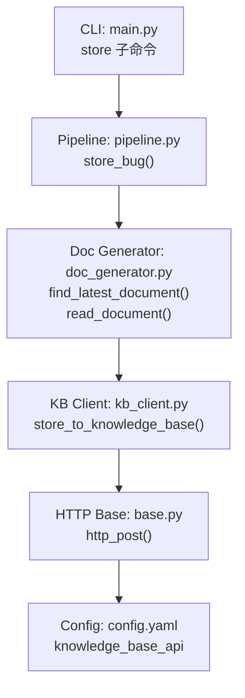
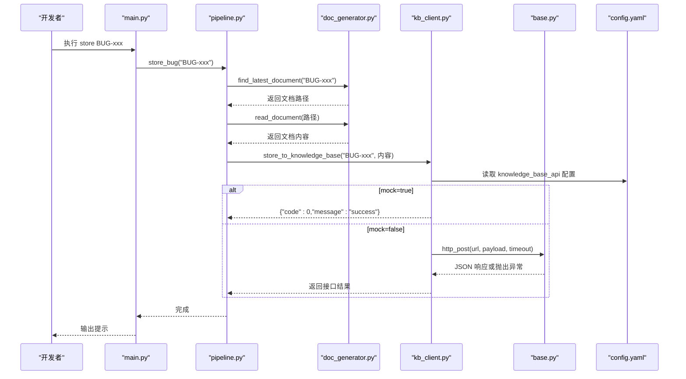
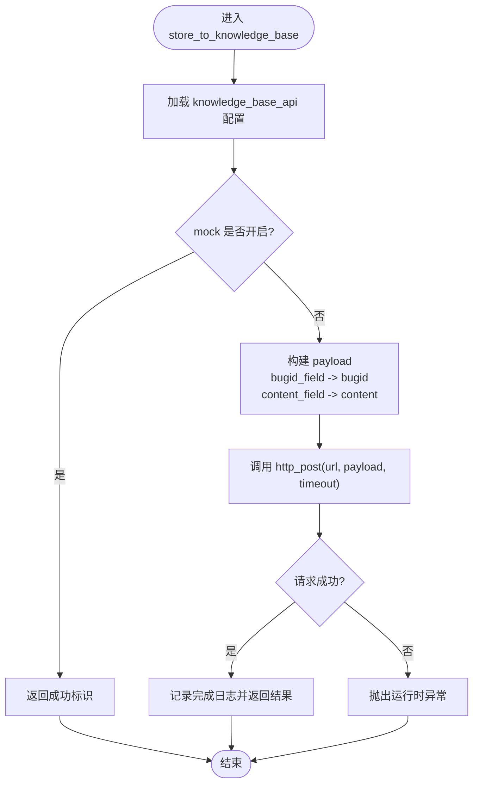
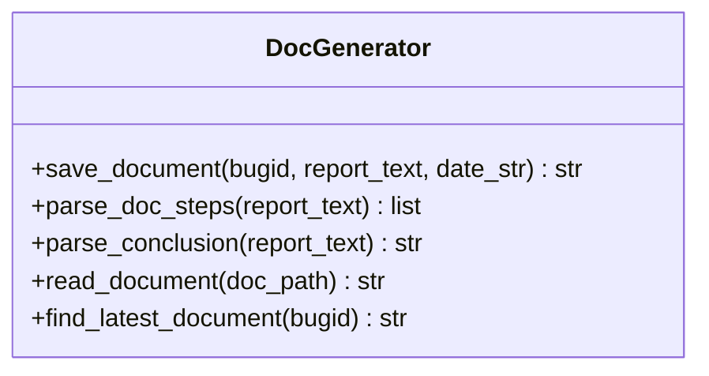
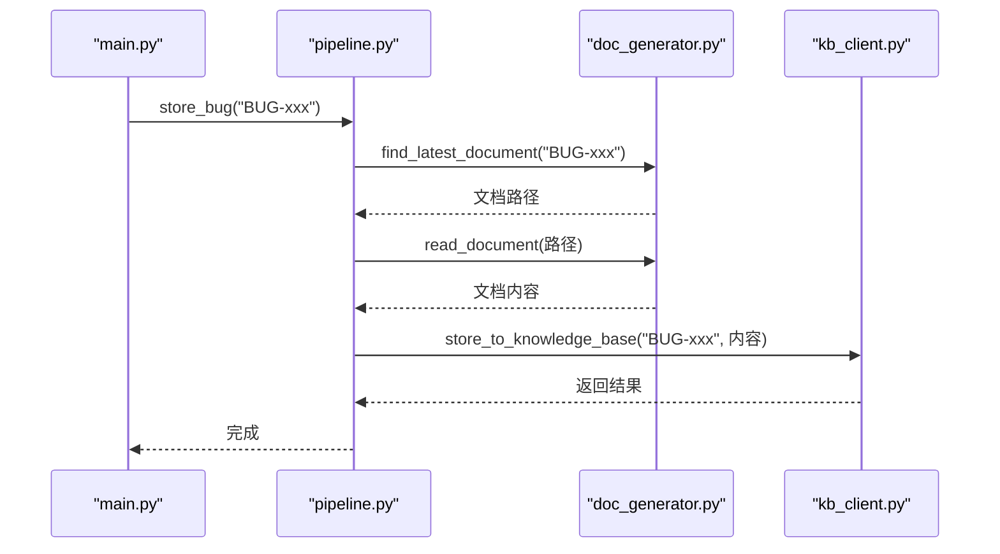
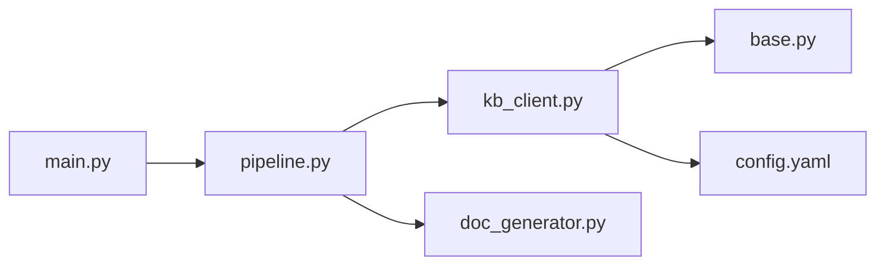

# 知识库集成

<cite>
**本文引用的文件**
- [kb_client.py](file://src/clients/kb_client.py)
- [base.py](file://src/clients/base.py)
- [config.yaml](file://config/config.yaml)
- [doc_generator.py](file://src/core/doc_generator.py)
- [pipeline.py](file://src/pipeline.py)
- [main.py](file://src/main.py)
- [README.md](file://README.md)
</cite>

## 目录
1. [简介](#简介)
2. [项目结构](#项目结构)
3. [核心组件](#核心组件)
4. [架构总览](#架构总览)
5. [详细组件分析](#详细组件分析)
6. [依赖关系分析](#依赖关系分析)
7. [性能与可靠性](#性能与可靠性)
8. [故障排查指南](#故障排查指南)
9. [结论](#结论)
10. [附录：使用示例](#附录使用示例)

## 简介
本模块负责将“Bug 文档沉淀工具”的分析结果推送到外部知识库，实现知识沉淀闭环。其核心能力包括：
- 文档上传：读取本地生成的 Markdown 分析文档并推送至知识库接口
- 元数据管理：通过配置映射 bugid 与 content 字段名，适配不同知识库 API 的入参格式
- 批量操作：由上层流程驱动多次调用，实现按批入库
- 认证与连接：基于配置文件的 URL、超时、Mock 开关；HTTP 客户端统一封装重试与错误日志
- 推送流程：Markdown 文档生成 → 元数据提取（bugid/content）→ 版本管理（最新文档）→ 接口推送
- 错误处理：网络异常、权限失败、数据格式错误等均有统一捕获与记录
- 集成关系：与文档生成模块紧密协作，在“分析正确后手工入库”的流程中发挥关键作用

## 项目结构
围绕知识库集成的关键文件与职责如下：
- src/clients/kb_client.py：知识库入库客户端，封装 store_to_knowledge_base
- src/clients/base.py：通用 HTTP 客户端，提供 http_post/http_get，内置重试与错误日志
- config/config.yaml：知识库接口地址、超时、字段映射、Mock 开关
- src/core/doc_generator.py：Markdown 文档生成、读取、查找最新版本
- src/pipeline.py：主流程编排，包含 store_bug 入口
- src/main.py：CLI 入口，暴露 store 子命令触发入库
- README.md：整体流程说明与使用方式

图表来源
- [main.py:42-45](file://src/main.py#L42-L45)
- [pipeline.py:96-104](file://src/pipeline.py#L96-L104)
- [doc_generator.py:67-79](file://src/core/doc_generator.py#L67-L79)
- [kb_client.py:8-23](file://src/clients/kb_client.py#L8-L23)
- [base.py:12-23](file://src/clients/base.py#L12-L23)
- [config.yaml:29-35](file://config/config.yaml#L29-L35)

章节来源
- [main.py:42-45](file://src/main.py#L42-L45)
- [pipeline.py:96-104](file://src/pipeline.py#L96-L104)
- [doc_generator.py:67-79](file://src/core/doc_generator.py#L67-L79)
- [kb_client.py:8-23](file://src/clients/kb_client.py#L8-L23)
- [base.py:12-23](file://src/clients/base.py#L12-L23)
- [config.yaml:29-35](file://config/config.yaml#L29-L35)

## 核心组件
- 知识库客户端（kb_client.py）
  - 功能：根据配置组装 payload（bugid_field、content_field），调用 http_post 推送
  - Mock 模式：当配置开启时直接返回成功标识，便于开发与联调
- HTTP 基础客户端（base.py）
  - 功能：POST/GET 请求封装，默认重试次数为 3，统一错误日志
  - 超时：可配置 timeout，避免长时间阻塞
- 文档生成器（doc_generator.py）
  - 功能：保存 Markdown 文档到 docs/YYYY-MM-DD/bugid.md；读取指定路径文档；查找最新日期的文档
- 流程编排（pipeline.py）
  - 功能：store_bug 从文件系统定位最新文档并调用 kb_client 入库
- CLI 入口（main.py）
  - 功能：提供 store 子命令，供开发手动触发入库

章节来源
- [kb_client.py:8-23](file://src/clients/kb_client.py#L8-L23)
- [base.py:12-23](file://src/clients/base.py#L12-L23)
- [doc_generator.py:14-29](file://src/core/doc_generator.py#L14-L29)
- [doc_generator.py:59-79](file://src/core/doc_generator.py#L59-L79)
- [pipeline.py:96-104](file://src/pipeline.py#L96-L104)
- [main.py:42-45](file://src/main.py#L42-L45)

## 架构总览
知识库集成的端到端流程如下：
- 开发者执行 CLI 命令 store BUG-xxx
- 流程层定位该 bug 的最新分析文档（按日期倒序）
- 读取文档内容，构造 payload（bugid_field、content_field）
- 调用 HTTP 客户端 POST 到知识库接口（支持 Mock）
- 记录日志并返回结果；失败时抛出运行时异常

图表来源
- [main.py:42-45](file://src/main.py#L42-L45)
- [pipeline.py:96-104](file://src/pipeline.py#L96-L104)
- [doc_generator.py:67-79](file://src/core/doc_generator.py#L67-L79)
- [kb_client.py:8-23](file://src/clients/kb_client.py#L8-L23)
- [base.py:12-23](file://src/clients/base.py#L12-L23)
- [config.yaml:29-35](file://config/config.yaml#L29-L35)

## 详细组件分析

### 知识库客户端（kb_client.py）
- 设计要点
  - 从配置加载 knowledge_base_api 的 url、timeout、字段映射与 mock 开关
  - Mock 模式下直接返回成功标识，便于测试与联调
  - 真实模式下构造 payload，调用 http_post 并记录日志
- 复杂度与性能
  - 单次调用时间复杂度 O(1)，主要耗时在网络 I/O
  - 超时由配置控制，避免长连接阻塞
- 错误处理
  - 网络异常、权限验证失败、数据格式错误均由 http_post 捕获并重试
  - 最终未成功则抛出 RuntimeError，便于上层捕获与告警

图表来源
- [kb_client.py:8-23](file://src/clients/kb_client.py#L8-L23)
- [base.py:12-23](file://src/clients/base.py#L12-L23)
- [config.yaml:29-35](file://config/config.yaml#L29-L35)

章节来源
- [kb_client.py:8-23](file://src/clients/kb_client.py#L8-L23)
- [base.py:12-23](file://src/clients/base.py#L12-L23)
- [config.yaml:29-35](file://config/config.yaml#L29-L35)

### 文档生成与版本管理（doc_generator.py）
- 功能
  - save_document：按日期分目录生成 Markdown 文档，命名规则 docs/YYYY-MM-DD/bugid.md
  - read_document：读取指定路径文档，不存在时报错
  - find_latest_document：按日期倒序查找最新版本的文档
- 版本管理策略
  - 以日期作为版本维度，新分析覆盖同 bugid 的新日期文档
  - 入库时自动选择最新日期的文档，保证推送的是最新分析结果

图表来源
- [doc_generator.py:14-29](file://src/core/doc_generator.py#L14-L29)
- [doc_generator.py:59-79](file://src/core/doc_generator.py#L59-L79)

章节来源
- [doc_generator.py:14-29](file://src/core/doc_generator.py#L14-L29)
- [doc_generator.py:59-79](file://src/core/doc_generator.py#L59-L79)

### 流程编排与 CLI（pipeline.py、main.py）
- pipeline.store_bug
  - 定位最新文档 → 读取内容 → 调用 kb_client 入库
  - 不自动化校验，完全由执行人判断是否入库
- main.cmd_store
  - 解析命令行参数，调用 pipeline.store_bug
  - 输出提示信息

图表来源
- [main.py:42-45](file://src/main.py#L42-L45)
- [pipeline.py:96-104](file://src/pipeline.py#L96-L104)
- [doc_generator.py:67-79](file://src/core/doc_generator.py#L67-L79)
- [kb_client.py:8-23](file://src/clients/kb_client.py#L8-L23)

章节来源
- [main.py:42-45](file://src/main.py#L42-L45)
- [pipeline.py:96-104](file://src/pipeline.py#L96-L104)

## 依赖关系分析
- kb_client 依赖 base.http_post 进行网络请求
- kb_client 依赖 config 获取知识库接口配置
- pipeline 依赖 doc_generator 定位与读取文档
- main 通过 pipeline 暴露 store 子命令
- 所有组件共享统一的日志初始化与输出路径

图表来源
- [kb_client.py:8-23](file://src/clients/kb_client.py#L8-L23)
- [base.py:12-23](file://src/clients/base.py#L12-L23)
- [pipeline.py:96-104](file://src/pipeline.py#L96-L104)
- [doc_generator.py:67-79](file://src/core/doc_generator.py#L67-L79)
- [main.py:42-45](file://src/main.py#L42-L45)

章节来源
- [kb_client.py:8-23](file://src/clients/kb_client.py#L8-L23)
- [base.py:12-23](file://src/clients/base.py#L12-L23)
- [pipeline.py:96-104](file://src/pipeline.py#L96-L104)
- [doc_generator.py:67-79](file://src/core/doc_generator.py#L67-L79)
- [main.py:42-45](file://src/main.py#L42-L45)

## 性能与可靠性
- 性能
  - 单次入库为 I/O 密集型，耗时取决于网络与知识库接口响应
  - 可通过调整 timeout 与重试次数优化稳定性
- 可靠性
  - 统一的重试机制（默认 3 次）提升弱网环境成功率
  - Mock 模式便于快速验证与回归测试
  - 日志记录完整，便于问题定位与审计

[本节为通用指导，不直接分析具体文件]

## 故障排查指南
- 网络异常
  - 现象：http_post 抛出异常并记录错误日志
  - 处理：检查网络连通性、代理设置、防火墙策略；适当增加 timeout 或重试次数
- 权限验证失败
  - 现象：HTTP 状态码非 2xx，raise_for_status 抛出异常
  - 处理：确认知识库接口鉴权方式（如 Token、Basic Auth）已在配置或客户端中正确设置
- 数据格式错误
  - 现象：payload 字段名不匹配导致服务端拒绝
  - 处理：核对 config.yaml 中的 bugid_field、content_field 与服务端契约一致
- 文档缺失
  - 现象：find_latest_document 或 read_document 抛出 FileNotFoundError
  - 处理：先执行 analyze 生成文档，再执行 store；确认 docs 目录下存在对应 bugid 的 .md 文件

章节来源
- [base.py:12-23](file://src/clients/base.py#L12-L23)
- [doc_generator.py:59-79](file://src/core/doc_generator.py#L59-L79)
- [config.yaml:29-35](file://config/config.yaml#L29-L35)

## 结论
知识库集成模块以最小侵入的方式实现了“分析结果 → 知识库”的推送链路。通过配置化字段映射与 Mock 开关，既保证了对接灵活性，又提升了开发与联调效率。结合文档生成器的版本管理能力，确保入库的是最新分析结果。统一的 HTTP 客户端提供了稳定的重试与错误处理能力，配合完善的日志记录，便于问题定位与运维监控。

[本节为总结性内容，不直接分析具体文件]

## 附录：使用示例
- 前置条件
  - 已运行 analyze 生成 docs/YYYY-MM-DD/BUG-xxx.md
  - 配置 config.yaml 中 knowledge_base_api 的 url、timeout、字段映射与 mock 开关
- 推送分析结果到知识库
  - 执行命令：python -m src.main store BUG-xxx
  - 流程：定位最新文档 → 读取内容 → 调用知识库接口 → 记录日志
- 查询已有文档
  - 查看 docs/YYYY-MM-DD/BUG-xxx.md 是否存在与内容是否正确
  - 如需重新分析，执行 python -m src.main retry BUG-xxx
- 更新文档内容
  - 重新运行 analyze 或 retry，生成新的分析文档
  - 再次执行 store 推送最新版本
- 批量操作
  - 通过多次执行 store 命令或使用脚本循环调用，实现批量入库
  - 注意：当前实现为单条推送，批量需在上层编排

章节来源
- [README.md:30-49](file://README.md#L30-L49)
- [main.py:42-45](file://src/main.py#L42-L45)
- [pipeline.py:96-104](file://src/pipeline.py#L96-L104)
- [doc_generator.py:67-79](file://src/core/doc_generator.py#L67-L79)