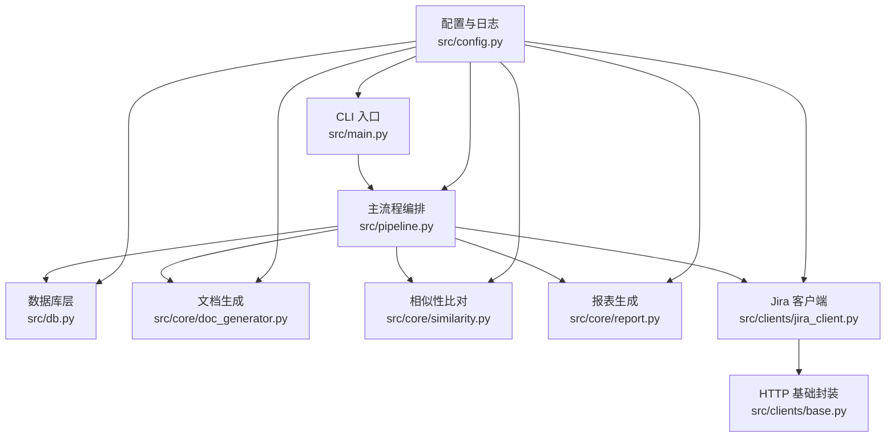
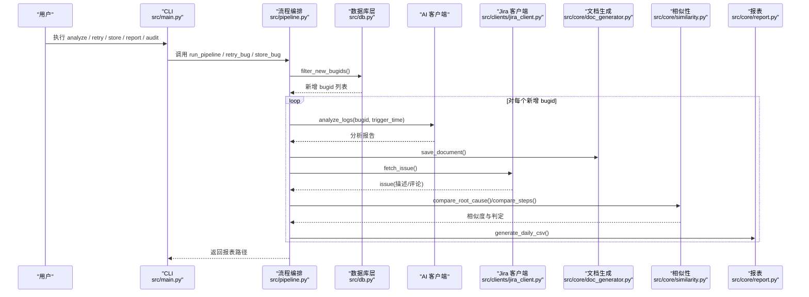
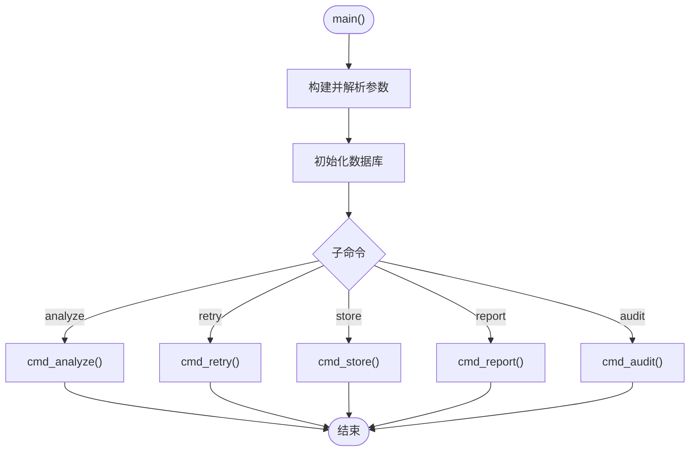
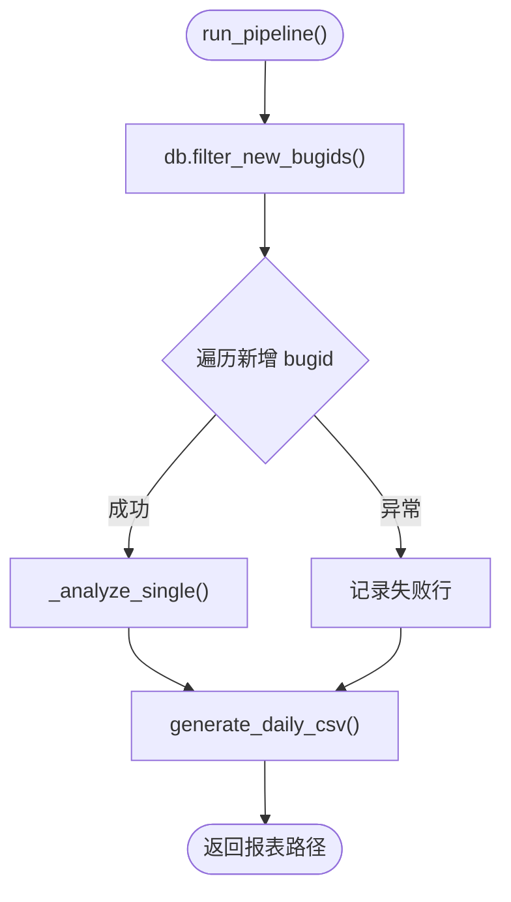
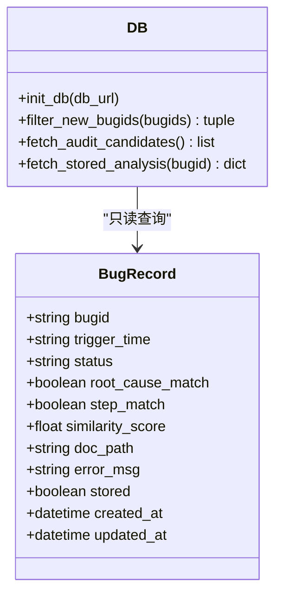
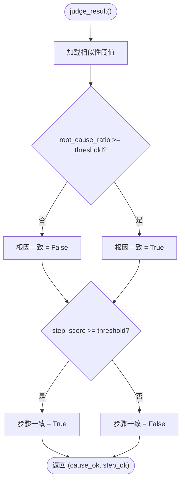
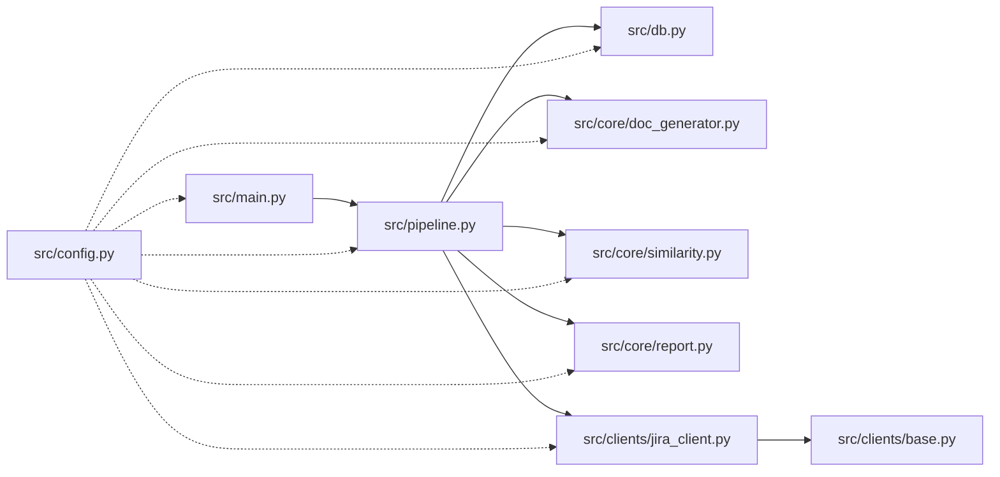

# 开发者指南

<cite>
**本文引用的文件**
- [README.md](file://README.md)
- [requirements.txt](file://requirements.txt)
- [config/config.yaml](file://config/config.yaml)
- [src/main.py](file://src/main.py)
- [src/config.py](file://src/config.py)
- [src/pipeline.py](file://src/pipeline.py)
- [src/db.py](file://src/db.py)
- [src/core/doc_generator.py](file://src/core/doc_generator.py)
- [src/core/filter.py](file://src/core/filter.py)
- [src/core/similarity.py](file://src/core/similarity.py)
- [src/core/report.py](file://src/core/report.py)
- [src/clients/base.py](file://src/clients/base.py)
- [src/clients/jira_client.py](file://src/clients/jira_client.py)
- [tests/conftest.py](file://tests/conftest.py)
</cite>

## 目录
1. [简介](#简介)
2. [项目结构](#项目结构)
3. [核心组件](#核心组件)
4. [架构总览](#架构总览)
5. [详细组件分析](#详细组件分析)
6. [依赖关系分析](#依赖关系分析)
7. [性能与扩展性](#性能与扩展性)
8. [调试与排障](#调试与排障)
9. [代码规范与开发流程](#代码规范与开发流程)
10. [新功能开发指南](#新功能开发指南)
11. [发布与版本管理](#发布与版本管理)
12. [社区贡献与问题反馈](#社区贡献与问题反馈)
13. [结论](#结论)

## 简介
本项目为“Bug 文档沉淀工具”，围绕「bugid 去重 → AI 日志分析生成文档 → Jira 报错原因/评论比对 → 每日结论报表 → 知识库手工入库」的闭环流程，提供命令行工具、配置化外部接口、可插拔的相似性比对与报告输出。工具运行结果不写入数据库，仅生成文档与 CSV 结论；知识库入库由开发手工触发，确保可控与可追溯。

## 项目结构
- config/config.yaml：全局配置（数据库、AI/Jira/知识库接口、相似性阈值、抽查配置、输出路径）
- src/main.py：CLI 入口（analyze/retry/store/report/audit）
- src/pipeline.py：主流程编排（去重→AI 分析→Jira 比对→报表）
- src/db.py：数据库层（只读查询：去重、抽查候选池、已入库字段读取）
- src/core/*：核心处理（文档生成、评论过滤、相似性比对、报表、审计）
- src/clients/*：外部接口客户端（HTTP 基础封装、Jira、AI、知识库）
- tests/*：pytest 测试用例与夹具
- docs/reports/logs：运行时产物（按日期分目录）

图表来源
- [src/main.py:1-111](file://src/main.py#L1-L111)
- [src/pipeline.py:1-105](file://src/pipeline.py#L1-L105)
- [src/db.py:1-132](file://src/db.py#L1-L132)
- [src/core/doc_generator.py:1-79](file://src/core/doc_generator.py#L1-L79)
- [src/core/similarity.py:1-75](file://src/core/similarity.py#L1-L75)
- [src/core/report.py:1-66](file://src/core/report.py#L1-L66)
- [src/clients/jira_client.py:1-54](file://src/clients/jira_client.py#L1-L54)
- [src/clients/base.py:1-39](file://src/clients/base.py#L1-L39)
- [src/config.py:1-59](file://src/config.py#L1-L59)

章节来源
- [README.md:62-75](file://README.md#L62-L75)
- [config/config.yaml:1-63](file://config/config.yaml#L1-L63)

## 核心组件
- CLI 入口：解析子命令并分发到 pipeline 或 core 模块，统一异常与日志
- 流程编排：串联去重、AI 分析、文档生成、Jira 比对、结论报表
- 数据库层：只读访问 bug_records 表进行去重；支持抽查候选池与已入库字段读取
- 文档生成：按日期+bugid 生成 Markdown，提取步骤与根因段落
- 评论过滤：从 Jira 评论中筛选与分析相关的步骤文本
- 相似性比对：根因关键词命中比例 + 步骤 TF-IDF 余弦相似度，基于配置阈值判定
- 报表生成：当日 CSV 合并覆盖，保证多次运行幂等
- 外部客户端：统一的 HTTP 重试与错误日志，支持 mock 模式快速联调

章节来源
- [src/main.py:1-111](file://src/main.py#L1-L111)
- [src/pipeline.py:1-105](file://src/pipeline.py#L1-L105)
- [src/db.py:1-132](file://src/db.py#L1-L132)
- [src/core/doc_generator.py:1-79](file://src/core/doc_generator.py#L1-L79)
- [src/core/filter.py:1-49](file://src/core/filter.py#L1-L49)
- [src/core/similarity.py:1-75](file://src/core/similarity.py#L1-L75)
- [src/core/report.py:1-66](file://src/core/report.py#L1-L66)
- [src/clients/base.py:1-39](file://src/clients/base.py#L1-L39)
- [src/clients/jira_client.py:1-54](file://src/clients/jira_client.py#L1-L54)

## 架构总览
系统采用“CLI → 流程编排 → 核心处理 → 外部客户端”的分层架构，配置集中管理，日志统一初始化，数据流以内存对象为主，持久化产物为文档与 CSV。

图表来源
- [src/main.py:29-60](file://src/main.py#L29-L60)
- [src/pipeline.py:18-86](file://src/pipeline.py#L18-L86)
- [src/db.py:67-88](file://src/db.py#L67-L88)
- [src/clients/jira_client.py:32-54](file://src/clients/jira_client.py#L32-L54)
- [src/core/doc_generator.py:14-29](file://src/core/doc_generator.py#L14-L29)
- [src/core/similarity.py:34-75](file://src/core/similarity.py#L34-L75)
- [src/core/report.py:46-66](file://src/core/report.py#L46-L66)

## 详细组件分析

### CLI 入口（src/main.py）
- 职责：参数解析、子命令分发、统一异常与日志
- 关键点：Windows UTF-8 输出修复；db.init_db 在入口初始化；各子命令委托 pipeline 或 core

图表来源
- [src/main.py:93-111](file://src/main.py#L93-L111)
- [src/main.py:29-60](file://src/main.py#L29-L60)

章节来源
- [src/main.py:1-111](file://src/main.py#L1-L111)

### 流程编排（src/pipeline.py）
- 职责：串联去重、AI 分析、文档生成、Jira 比对、结论报表
- 关键点：单个 bug 失败不中断整体流程；支持 retry 单独重跑；store 仅推送最新文档

图表来源
- [src/pipeline.py:54-86](file://src/pipeline.py#L54-L86)
- [src/pipeline.py:18-52](file://src/pipeline.py#L18-L52)

章节来源
- [src/pipeline.py:1-105](file://src/pipeline.py#L1-L105)

### 数据库层（src/db.py）
- 职责：只读查询（去重、抽查候选池、已入库字段）
- 关键点：SQLite 相对路径自动修正；Session 懒初始化；SQL 动态列名来自配置

图表来源
- [src/db.py:19-35](file://src/db.py#L19-L35)
- [src/db.py:42-57](file://src/db.py#L42-L57)
- [src/db.py:67-88](file://src/db.py#L67-L88)
- [src/db.py:91-132](file://src/db.py#L91-L132)

章节来源
- [src/db.py:1-132](file://src/db.py#L1-L132)

### 文档生成（src/core/doc_generator.py）
- 职责：保存 Markdown 文档、提取步骤、读取/查找最新文档
- 关键点：按日期分目录；正则匹配序号步骤；未找到文档抛错

章节来源
- [src/core/doc_generator.py:1-79](file://src/core/doc_generator.py#L1-L79)

### 评论过滤（src/core/filter.py）
- 职责：从 Jira 评论中提取与分析相关的步骤文本
- 关键点：关键词过滤 + 前缀清理 + 分隔符拆分；预留 Agent 扩展点

章节来源
- [src/core/filter.py:1-49](file://src/core/filter.py#L1-L49)

### 相似性比对（src/core/similarity.py）
- 职责：根因关键词命中比例 + 步骤 TF-IDF 余弦相似度
- 关键点：停用词过滤；逐条最佳匹配求平均；阈值来自配置

图表来源
- [src/core/similarity.py:69-75](file://src/core/similarity.py#L69-L75)
- [src/core/similarity.py:23-49](file://src/core/similarity.py#L23-L49)
- [src/core/similarity.py:52-66](file://src/core/similarity.py#L52-L66)

章节来源
- [src/core/similarity.py:1-75](file://src/core/similarity.py#L1-L75)

### 报表生成（src/core/report.py）
- 职责：生成/合并当日 CSV 结论报表
- 关键点：按 bugid 覆盖合并；UTF-8-SIG 编码避免 Excel 乱码

章节来源
- [src/core/report.py:1-66](file://src/core/report.py#L1-L66)

### 外部客户端（src/clients/*）
- base.py：统一 POST/GET 请求，带超时与重试
- jira_client.py：mock 模式与真实 API 切换，提取描述与评论

章节来源
- [src/clients/base.py:1-39](file://src/clients/base.py#L1-L39)
- [src/clients/jira_client.py:1-54](file://src/clients/jira_client.py#L1-L54)

## 依赖关系分析
- 模块耦合：pipeline 依赖 db、doc_generator、similarity、report、jira_client；main 仅负责调度
- 外部依赖：requests、SQLAlchemy、pandas、scikit-learn、PyYAML、jieba、pytest、allure-pytest
- 配置驱动：所有外部接口与阈值均通过 config.yaml 注入，便于 mock/真实切换

图表来源
- [src/main.py:1-111](file://src/main.py#L1-L111)
- [src/pipeline.py:1-105](file://src/pipeline.py#L1-L105)
- [src/db.py:1-132](file://src/db.py#L1-L132)
- [src/core/doc_generator.py:1-79](file://src/core/doc_generator.py#L1-L79)
- [src/core/similarity.py:1-75](file://src/core/similarity.py#L1-L75)
- [src/core/report.py:1-66](file://src/core/report.py#L1-L66)
- [src/clients/jira_client.py:1-54](file://src/clients/jira_client.py#L1-L54)
- [src/clients/base.py:1-39](file://src/clients/base.py#L1-L39)
- [src/config.py:1-59](file://src/config.py#L1-L59)

章节来源
- [requirements.txt:1-9](file://requirements.txt#L1-L9)

## 性能与扩展性
- 性能要点
  - 相似性计算使用 TF-IDF + 余弦相似度，适合中小规模文本；若数据量增大，可考虑批量向量化或缓存向量
  - 评论过滤当前为规则+关键词，可扩展为 LLM Agent 提升语义准确性
  - 报表合并使用 pandas，注意大文件 I/O；可按需分页或增量写入
- 扩展点
  - 新增外部接口：参照 clients/jira_client.py 实现新客户端，并在 pipeline 中接入
  - 自定义处理器：在 core 下新增模块，通过 pipeline 编排调用
  - 配置扩展：在 config.yaml 增加键值，并在对应模块 load_config 后使用

[本节为通用指导，不直接分析具体文件]

## 调试与排障
- 日志分析
  - 统一通过 setup_logger 初始化，控制台与按日归档文件双输出
  - 关键模块日志：main、pipeline、db、doc_gen、filter、similarity、report、http、jira
- 常见问题定位
  - 数据库连接：检查 config.yaml 的 database.url 与 SQLite 路径解析
  - 外部接口：确认 mock 开关与 url/timeout/认证；查看 http 客户端重试日志
  - 相似性阈值：调整 similarity.threshold 与 root_cause_hit_ratio
  - 报表缺失：确认 reports 目录权限与当日 CSV 是否生成
- Allure 报告
  - 运行 pytest --alluredir=allure-results 并 allure serve 查看可视化报告

章节来源
- [src/config.py:37-59](file://src/config.py#L37-L59)
- [src/clients/base.py:12-39](file://src/clients/base.py#L12-L39)
- [README.md:52-60](file://README.md#L52-L60)

## 代码规范与开发流程
- Python 编码规范
  - 模块职责单一，命名清晰；函数短小且可测试
  - 使用 logging 统一输出，避免 print；异常捕获后记录上下文
  - 配置集中管理，禁止硬编码 URL/阈值
- Git 工作流
  - 分支策略：feature/* 功能分支，develop 集成，release/* 发布分支，hotfix/* 紧急修复
  - 提交信息：类型+范围+简述（如 feat(pipeline): 增加重试逻辑）
  - 合并前：本地测试通过、lint 通过、变更影响评估
- 代码审查标准
  - 功能正确性与边界条件
  - 日志与错误处理完备
  - 配置与外部依赖可替换（mock/真实）
  - 测试覆盖率与回归风险

[本节为通用指导，不直接分析具体文件]

## 新功能开发指南
- 扩展现有功能
  - 在 core 下新增模块，遵循现有接口约定；在 pipeline 中编排调用
  - 示例：新增“评论情感分析”处理器，可在 filter.py 的 _agent_filter 扩展点接入
- 添加新的外部接口支持
  - 新建 clients/xxx_client.py，复用 base.py 的 http_get/post
  - 在 config.yaml 增加接口配置项，并在客户端中读取
  - 在 pipeline 中调用新客户端，并将结果纳入比对或报表
- 编写测试用例
  - 使用 pytest 组织用例，结合 tests/conftest.py 的临时数据库与隔离输出目录
  - 针对外部接口优先使用 mock 模式，验证业务逻辑与边界
  - 生成 Allure 报告，便于可视化追踪

章节来源
- [tests/conftest.py:1-34](file://tests/conftest.py#L1-L34)
- [src/clients/base.py:12-39](file://src/clients/base.py#L12-L39)
- [config/config.yaml:10-36](file://config/config.yaml#L10-L36)

## 发布与版本管理
- 版本管理
  - 使用语义化版本（主.次.补丁），在 release 分支打 tag
  - 变更日志：每次发布维护 CHANGELOG，记录新增、修复、破坏性变更
- 兼容性保证
  - 对外部接口变更保持向后兼容，提供默认值与降级策略
  - 配置项新增时保留旧键兼容，逐步废弃旧键
- 发布流程
  - 代码冻结 → 全量测试 → 生成文档与报表样例 → 打包与签名 → 发布说明与回滚预案

[本节为通用指导，不直接分析具体文件]

## 社区贡献与问题反馈
- 贡献方式
  - Fork 仓库，创建 feature 分支，提交 PR 至 develop
  - 附带测试用例与变更说明
- 问题反馈渠道
  - 提交 Issue：描述环境、复现步骤、期望行为与实际行为
  - 日志附件：附上 logs 与 allure 报告链接

[本节为通用指导，不直接分析具体文件]

## 结论
本指南覆盖了代码规范、Git 工作流、代码审查、新功能开发、调试技巧、项目结构与依赖、扩展开发、发布流程与社区贡献。遵循本文档可高效参与开发与维护，确保系统稳定、可演进与可观测。