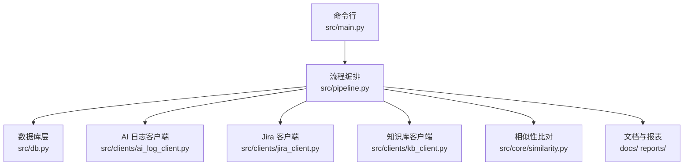
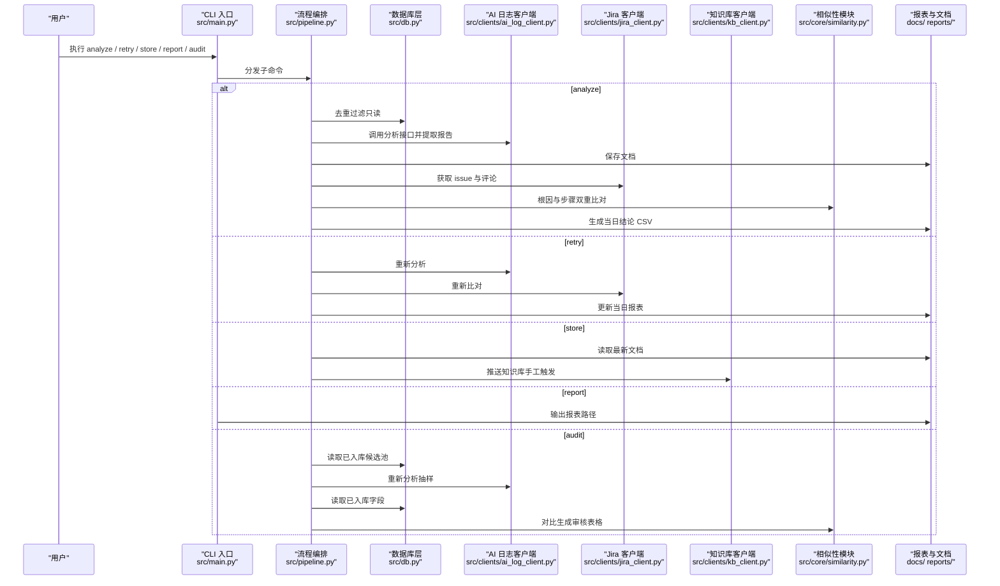
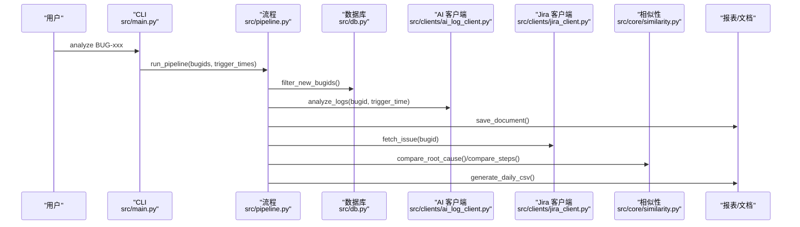
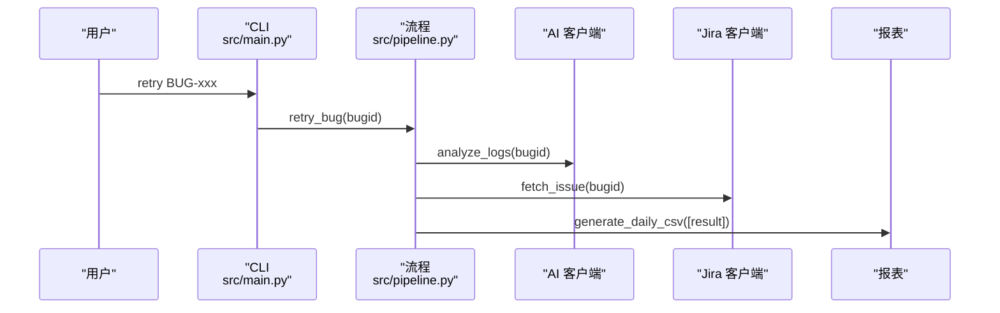
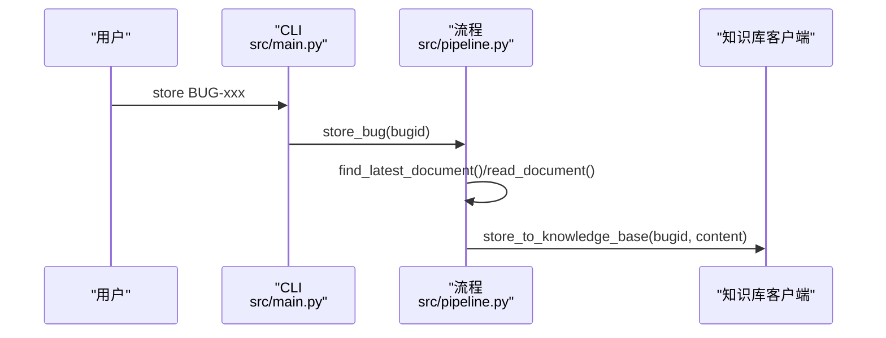
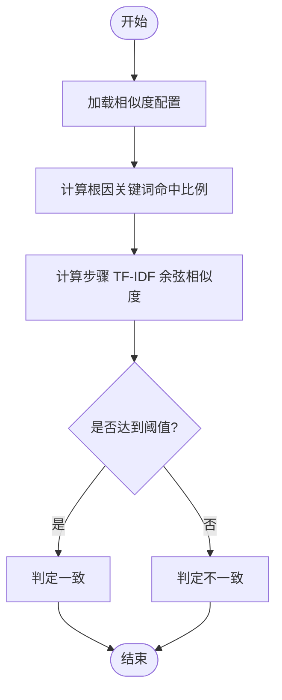
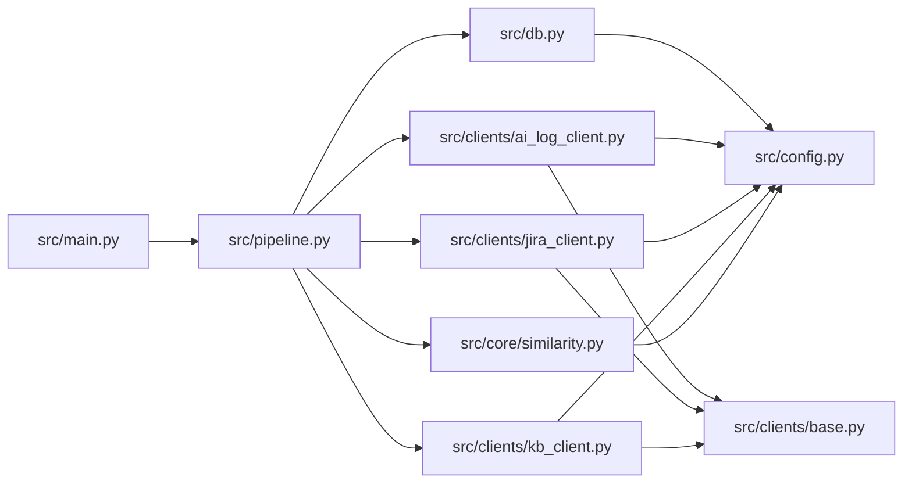

# 快速开始

<cite>
**本文引用的文件**
- [README.md](file://README.md)
- [requirements.txt](file://requirements.txt)
- [config/config.yaml](file://config/config.yaml)
- [src/main.py](file://src/main.py)
- [src/pipeline.py](file://src/pipeline.py)
- [src/db.py](file://src/db.py)
- [src/clients/base.py](file://src/clients/base.py)
- [src/clients/ai_log_client.py](file://src/clients/ai_log_client.py)
- [src/clients/jira_client.py](file://src/clients/jira_client.py)
- [src/clients/kb_client.py](file://src/clients/kb_client.py)
- [src/core/similarity.py](file://src/core/similarity.py)
</cite>

## 目录
1. [简介](#简介)
2. [项目结构](#项目结构)
3. [核心组件](#核心组件)
4. [架构总览](#架构总览)
5. [详细组件分析](#详细组件分析)
6. [依赖关系分析](#依赖关系分析)
7. [性能注意事项](#性能注意事项)
8. [故障排查指南](#故障排查指南)
9. [结论](#结论)
10. [附录：常用命令速查](#附录：常用命令速查)

## 简介
本工具用于“Bug 文档沉淀与故障分析闭环”，实现 bugid 去重、AI 日志分析生成文档、Jira 报错原因与评论比对、每日结论报表输出，以及知识库手工入库与随机抽查复核。工具运行结果不写入数据库，仅生成文档与 CSV 结论；是否推入知识库由开发通过 store 命令手工决定。

## 项目结构
- 配置：config/config.yaml（数据库、外部接口、相似度阈值、抽查配置、输出路径）
- CLI 入口：src/main.py（analyze/retry/store/report/audit 子命令）
- 流程编排：src/pipeline.py（串联去重、AI 分析、文档生成、Jira 比对、报表生成）
- 数据库层：src/db.py（只读查询 bug_records、抽查候选池、已入库字段读取）
- 客户端：src/clients/*（AI 日志分析、Jira、知识库，支持 mock）
- 核心处理：src/core/*（评论过滤、相似性比对、文档生成、报表、抽查）
- 输出：docs/（按日期分文件夹的分析文档）、reports/（每日结论与审核表格）、logs/（运行日志）

图表来源
- [src/main.py:63-90](file://src/main.py#L63-L90)
- [src/pipeline.py:54-86](file://src/pipeline.py#L54-L86)
- [src/db.py:67-88](file://src/db.py#L67-L88)
- [src/clients/ai_log_client.py:32-48](file://src/clients/ai_log_client.py#L32-L48)
- [src/clients/jira_client.py:32-43](file://src/clients/jira_client.py#L32-L43)
- [src/clients/kb_client.py:8-23](file://src/clients/kb_client.py#L8-L23)
- [src/core/similarity.py:34-74](file://src/core/similarity.py#L34-L74)

章节来源
- [README.md:62-75](file://README.md#L62-L75)

## 核心组件
- CLI 入口：提供 analyze、retry、store、report、audit 五个子命令，负责参数解析与调度
- 流程编排：执行 bugid 去重、调用 AI 分析、生成文档、拉取 Jira 信息、进行根因与步骤双重比对、生成当日结论 CSV
- 数据库层：只读查询 bug_records 表进行去重；读取已入库表作为抽查候选池；读取已入库的根因与分析流程字段
- 客户端封装：统一 HTTP 请求、重试与错误日志；AI/Jira/知识库三个外部接口均支持 mock
- 相似性模块：基于中文分词与 TF-IDF 余弦相似度计算步骤相似度；关键词命中比例判定根因一致性
- 配置与日志：YAML 全局配置；按日归档日志文件

章节来源
- [src/main.py:1-111](file://src/main.py#L1-L111)
- [src/pipeline.py:1-105](file://src/pipeline.py#L1-L105)
- [src/db.py:1-132](file://src/db.py#L1-L132)
- [src/clients/base.py:1-39](file://src/clients/base.py#L1-L39)
- [src/clients/ai_log_client.py:1-57](file://src/clients/ai_log_client.py#L1-L57)
- [src/clients/jira_client.py:1-54](file://src/clients/jira_client.py#L1-L54)
- [src/clients/kb_client.py:1-24](file://src/clients/kb_client.py#L1-L24)
- [src/core/similarity.py:1-75](file://src/core/similarity.py#L1-L75)

## 架构总览
下图展示从命令行到各子系统的数据流与控制流：

图表来源
- [src/main.py:63-90](file://src/main.py#L63-L90)
- [src/pipeline.py:54-105](file://src/pipeline.py#L54-L105)
- [src/db.py:67-132](file://src/db.py#L67-L132)
- [src/clients/ai_log_client.py:32-57](file://src/clients/ai_log_client.py#L32-L57)
- [src/clients/jira_client.py:32-54](file://src/clients/jira_client.py#L32-L54)
- [src/clients/kb_client.py:8-23](file://src/clients/kb_client.py#L8-L23)
- [src/core/similarity.py:34-74](file://src/core/similarity.py#L34-L74)

## 详细组件分析

### 环境准备与安装
- Python 环境要求：使用标准 Python 环境即可
- 依赖安装：在项目根目录执行 pip install -r requirements.txt
- 首次运行前确保 config/config.yaml 存在并可读

章节来源
- [README.md:15-19](file://README.md#L15-L19)
- [requirements.txt:1-9](file://requirements.txt#L1-L9)

### 配置文件设置（config/config.yaml）
- 数据库连接
  - database.url：默认 SQLite 开箱即用；可替换为 MySQL 连接串
  - database.table_name：用于去重的表名，默认 bug_records
- 外部 API 接口
  - ai_log_api：AI 日志分析接口，mock=true 时使用内置样例数据；接入真实接口时改为 false 并填写 url、timeout 及入参字段映射（bugid_field、trigger_time_field）
  - jira_api：Jira RESTAPI，mock=true 时使用内置样例数据；接入真实接口时填写 url、timeout、认证（username、token）与 bugid_field
  - knowledge_base_api：知识库入库接口，mock=true 时使用内置样例数据；接入真实接口时填写 url、timeout、bugid_field、content_field
- 相似度阈值
  - similarity.threshold：步骤相似性判定阈值（0~1），大于等于该值判定为一致
  - similarity.root_cause_hit_ratio：根因关键词命中比例阈值
- 随机抽查
  - audit.sample_count：默认抽样数量（30）
  - audit.audited_file、audit.report_file：抽查记录与审核表格文件名
  - audit.kb_table、audit.bugid_column、audit.trigger_time_column、audit.root_cause_column、audit.process_column：对接真实库时按实际表结构与字段名修改
- 输出路径
  - output.doc_dir：分析文档目录（docs/YYYY-MM-DD/bugid.md）
  - output.report_dir：每日报表目录（reports/YYYY-MM-DD_daily.csv）
  - output.log_dir：运行日志目录

章节来源
- [config/config.yaml:1-63](file://config/config.yaml#L1-L63)

### 基本使用示例
- 分析 bugid 列表（步骤1~3，--trigger-time 可选，可多次指定）
  - 命令：python -m src.main analyze BUG-1001 BUG-1002 --trigger-time "BUG-1001=2026-08-12 10:00:00"
  - 说明：结果只生成文档与 CSV 结论报表，不写入数据库
- 失败 bug 重新分析（开发手工触发，直至正确）
  - 命令：python -m src.main retry BUG-1001
- 手工将分析文档推入知识库（是否入库自行判断）
  - 命令：python -m src.main store BUG-1001
- 查看当日结论报表路径（默认当天）
  - 命令：python -m src.main report --date 2026-08-12
- 随机抽查：从数据库抽 30 个已入库 bugid 重新分析，与库存储字段对比生成人工审核表格
  - 命令：python -m src.main audit
  - 调整抽样数：python -m src.main audit --count 20

章节来源
- [README.md:30-50](file://README.md#L30-L50)
- [src/main.py:63-90](file://src/main.py#L63-L90)

### 关键流程时序（analyze）

图表来源
- [src/main.py:29-33](file://src/main.py#L29-L33)
- [src/pipeline.py:18-86](file://src/pipeline.py#L18-L86)
- [src/db.py:67-88](file://src/db.py#L67-L88)
- [src/clients/ai_log_client.py:32-57](file://src/clients/ai_log_client.py#L32-L57)
- [src/clients/jira_client.py:32-54](file://src/clients/jira_client.py#L32-L54)
- [src/core/similarity.py:34-74](file://src/core/similarity.py#L34-L74)

### 关键流程时序（retry）

图表来源
- [src/main.py:36-39](file://src/main.py#L36-L39)
- [src/pipeline.py:89-93](file://src/pipeline.py#L89-L93)

### 关键流程时序（store）

图表来源
- [src/main.py:42-45](file://src/main.py#L42-L45)
- [src/pipeline.py:96-105](file://src/pipeline.py#L96-L105)
- [src/clients/kb_client.py:8-23](file://src/clients/kb_client.py#L8-L23)

### 复杂逻辑流程图（相似性判定）

图表来源
- [src/core/similarity.py:52-74](file://src/core/similarity.py#L52-L74)
- [config/config.yaml:37-42](file://config/config.yaml#L37-L42)

## 依赖关系分析
- 外部依赖：requests、SQLAlchemy、pandas、scikit-learn、PyYAML、jieba、pytest、allure-pytest
- 内部模块耦合
  - main.py 依赖 pipeline、db、core.audit、config
  - pipeline.py 依赖 db、clients（ai_log、jira、kb）、core（doc_generator、filter、report、similarity）
  - db.py 依赖 config、SQLAlchemy
  - clients/* 依赖 base、config
  - core/similarity.py 依赖 config、jieba、sklearn

图表来源
- [src/main.py:1-15](file://src/main.py#L1-L15)
- [src/pipeline.py:1-15](file://src/pipeline.py#L1-L15)
- [src/db.py:1-15](file://src/db.py#L1-L15)
- [src/clients/base.py:1-6](file://src/clients/base.py#L1-L6)
- [src/clients/ai_log_client.py:1-5](file://src/clients/ai_log_client.py#L1-L5)
- [src/clients/jira_client.py:1-5](file://src/clients/jira_client.py#L1-L5)
- [src/clients/kb_client.py:1-5](file://src/clients/kb_client.py#L1-L5)
- [src/core/similarity.py:1-11](file://src/core/similarity.py#L1-L11)

章节来源
- [requirements.txt:1-9](file://requirements.txt#L1-L9)

## 性能注意事项
- 相似度计算使用 TF-IDF 与余弦相似度，对文本长度敏感；建议控制单次批量大小，避免过长文本导致内存与耗时上升
- 外部接口调用具备重试机制（默认 3 次），合理设置 timeout 以避免长时间阻塞
- 数据库层为只读查询，注意在大数据量场景下优化 SQL 或索引（如 kb_table 的 bugid 列）
- 日志按日归档，避免单日志文件过大影响 IO 性能

[本节为通用指导，无需特定文件引用]

## 故障排查指南
- 常见配置问题
  - 未安装依赖：pip install -r requirements.txt
  - 配置文件缺失或不可读：确保 config/config.yaml 存在且可被读取
  - 数据库连接失败：检查 database.url 是否正确；SQLite 相对路径会基于项目根目录解析
  - 外部接口未启用真实模式：ai_log_api/jira_api/knowledge_base_api 的 mock=false 时需填写 url、timeout 与字段映射；Jira 需配置 username/token
  - 相似度阈值不合理：根据业务调整 similarity.threshold 与 root_cause_hit_ratio
- 常见问题定位
  - 分析失败：查看 logs/app_YYYY-MM-DD.log 中的错误日志；pipeline 中单个 bug 失败不会中断整体流程，会在结论报表中标记 failed
  - 报表不存在：report 命令会提示当日报表不存在，请先执行 analyze 生成
  - 知识库入库失败：检查 knowledge_base_api 配置与返回码；mock 模式下会返回成功标识
- 测试与报告
  - 运行测试并生成 Allure 结果：python -m pytest tests --alluredir=allure-results
  - 查看 Allure 报告：allure serve allure-results

章节来源
- [README.md:52-60](file://README.md#L52-L60)
- [src/main.py:93-106](file://src/main.py#L93-L106)
- [src/pipeline.py:66-86](file://src/pipeline.py#L66-L86)
- [src/clients/base.py:12-38](file://src/clients/base.py#L12-L38)
- [config/config.yaml:1-63](file://config/config.yaml#L1-L63)

## 结论
通过本快速开始指南，你可以在最短时间内完成环境准备、配置与第一个分析任务。建议先使用 mock 模式验证端到端流程，再切换到真实接口；根据业务需求调整相似度阈值与抽查策略，确保分析质量与效率平衡。

[本节为总结性内容，无需特定文件引用]

## 附录：常用命令速查
- 分析：python -m src.main analyze BUG-1001 BUG-1002 --trigger-time "BUG-1001=2026-08-12 10:00:00"
- 重试：python -m src.main retry BUG-1001
- 入库：python -m src.main store BUG-1001
- 报表：python -m src.main report --date 2026-08-12
- 抽查：python -m src.main audit --count 20

章节来源
- [README.md:30-50](file://README.md#L30-L50)
- [src/main.py:63-90](file://src/main.py#L63-L90)