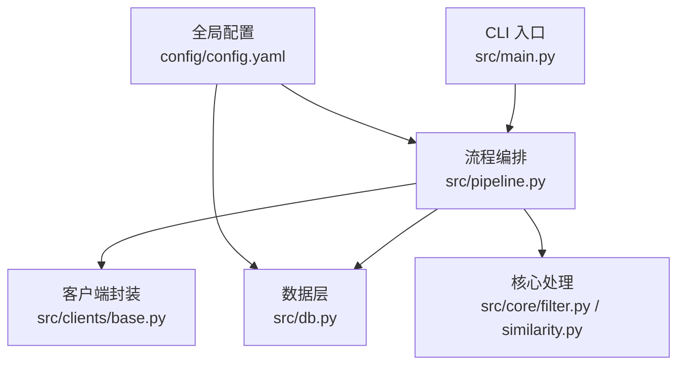
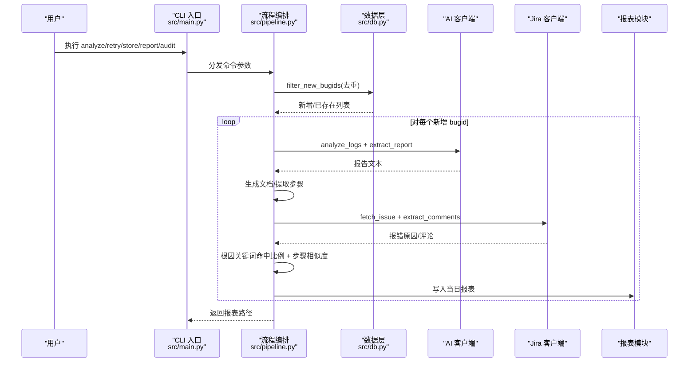
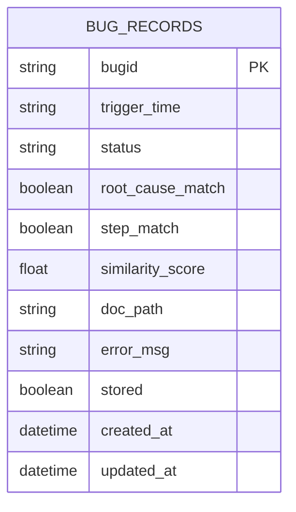
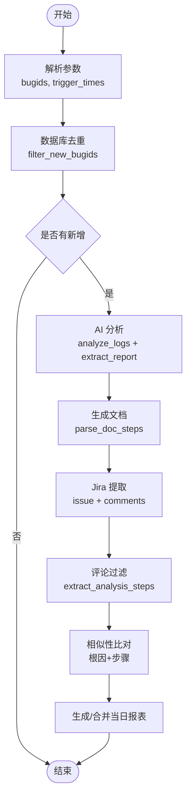
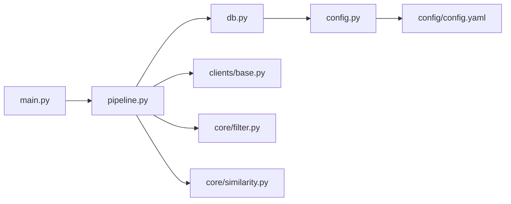

# 数据模型

<cite>
**本文引用的文件**
- [config.yaml](file://config/config.yaml)
- [db.py](file://src/db.py)
- [config.py](file://src/config.py)
- [main.py](file://src/main.py)
- [pipeline.py](file://src/pipeline.py)
- [filter.py](file://src/core/filter.py)
- [similarity.py](file://src/core/similarity.py)
- [base.py](file://src/clients/base.py)
- [README.md](file://README.md)
- [test_db.py](file://tests/test_db.py)
</cite>

## 目录
1. [简介](#简介)
2. [项目结构](#项目结构)
3. [核心组件](#核心组件)
4. [架构总览](#架构总览)
5. [详细组件分析](#详细组件分析)
6. [依赖关系分析](#依赖关系分析)
7. [性能考虑](#性能考虑)
8. [故障排查指南](#故障排查指南)
9. [结论](#结论)
10. [附录](#附录)

## 简介
本文件围绕“数据模型”目标，系统化说明：
- 数据库设计：bug_records 表结构、字段定义、索引与约束。
- 配置文件结构：config.yaml 各配置项含义、默认值与环境变量覆盖机制。
- 数据流转过程：外部 API 数据如何转换为内部对象、验证与清洗策略。
- 数据生命周期管理：创建、更新、查询、归档策略。
- 数据安全考虑：敏感信息保护、访问控制、审计日志。
- 数据迁移与版本管理指导。

## 项目结构
本项目采用分层组织：
- 配置层：config/config.yaml 集中管理数据库、外部接口、相似度阈值、输出路径等。
- 入口与编排：src/main.py 提供 CLI；src/pipeline.py 编排主流程（去重→AI 分析→比对→报表）。
- 数据层：src/db.py 使用 SQLAlchemy 声明式模型，仅对 bug_records 进行只读查询。
- 核心处理：src/core/filter.py（评论过滤）、src/core/similarity.py（相似性计算）。
- 客户端封装：src/clients/base.py 统一 HTTP 请求重试与错误日志。
- 测试与文档：tests/ 与 README.md。

图表来源
- [main.py:63-90](file://src/main.py#L63-L90)
- [pipeline.py:54-86](file://src/pipeline.py#L54-L86)
- [db.py:19-35](file://src/db.py#L19-L35)
- [config.yaml:1-63](file://config/config.yaml#L1-L63)

章节来源
- [README.md:62-75](file://README.md#L62-L75)
- [config.yaml:1-63](file://config/config.yaml#L1-L63)

## 核心组件
- 数据库模型 BugRecord：用于 bugid 去重的只读表映射，包含状态、相似度、文档路径等字段。
- 配置加载器：读取 YAML 并缓存，提供路径解析与日志初始化。
- 流程编排：串联去重、AI 分析、Jira 比对、生成每日 CSV 报表。
- 评论过滤与相似性计算：从 Jira 评论提取步骤，基于 TF-IDF 余弦相似度判定一致性。
- HTTP 客户端：统一超时、重试与错误日志。

章节来源
- [db.py:19-35](file://src/db.py#L19-L35)
- [config.py:17-34](file://src/config.py#L17-L34)
- [pipeline.py:18-86](file://src/pipeline.py#L18-L86)
- [filter.py:19-48](file://src/core/filter.py#L19-L48)
- [similarity.py:17-74](file://src/core/similarity.py#L17-L74)
- [base.py:12-38](file://src/clients/base.py#L12-L38)

## 架构总览
系统通过 CLI 触发不同子命令，进入 pipeline 编排，调用 db 层进行 bugid 去重，再依次调用 AI 日志分析、Jira RESTAPI，执行根因与步骤双重比对，最终输出文档与当日 CSV 报表。知识库入库为手工操作，不纳入自动化流程。

图表来源
- [main.py:63-90](file://src/main.py#L63-L90)
- [pipeline.py:18-86](file://src/pipeline.py#L18-L86)
- [db.py:67-88](file://src/db.py#L67-L88)

## 详细组件分析

### 数据库设计与 schema
- 表名：由配置 database.table_name 决定，默认 bug_records。
- 模型类：BugRecord，使用 SQLAlchemy declarative_base 声明。
- 字段定义与约束：
  - bugid：主键，字符串长度最大 64，唯一标识。
  - trigger_time：可选，记录上游传入的触发时间。
  - status：默认 pending，表示分析状态（success/failed/pending）。
  - root_cause_match：布尔，根因比对是否一致。
  - step_match：布尔，步骤比对是否一致。
  - similarity_score：浮点，步骤相似度得分。
  - doc_path：可选，生成的分析文档路径。
  - error_msg：可选，失败时的错误信息。
  - stored：布尔，是否已入知识库。
  - created_at/updated_at：时间戳，自动维护。
- 索引与约束：
  - bugid 作为主键，天然具备唯一性与快速查找能力。
  - 其他字段未显式建立额外索引；如需按状态或时间范围查询，可在实际部署时按需添加索引。
- 工具行为：
  - 工具仅进行只读查询（去重、抽查候选池、读取已入库分析字段），不写入 bug_records。
  - 测试用例验证了“工具不写库”的约束。

图表来源
- [db.py:19-35](file://src/db.py#L19-L35)
- [test_db.py:44-54](file://tests/test_db.py#L44-L54)

章节来源
- [db.py:19-35](file://src/db.py#L19-L35)
- [test_db.py:1-54](file://tests/test_db.py#L1-L54)

### 配置文件结构与覆盖机制
- 位置：config/config.yaml。
- 主要分组与含义：
  - database：url（连接串，默认 SQLite）、table_name（比对表名）。
  - ai_log_api：mock、url、timeout、入参字段映射（bugid_field、trigger_time_field）。
  - jira_api：mock、url、timeout、认证（username/token）、字段映射。
  - knowledge_base_api：mock、url、timeout、字段映射（bugid_field、content_field）。
  - similarity：threshold（步骤相似度阈值）、root_cause_hit_ratio（根因命中比例阈值）。
  - audit：sample_count、audited_file、report_file、kb_table 及字段映射（bugid_column、trigger_time_column、root_cause_column、process_column）。
  - output：doc_dir、report_dir、log_dir。
- 默认值：
  - 所有 key 在 config.yaml 中均有默认值，便于开箱即用。
- 环境变量覆盖机制：
  - 当前实现未内置环境变量覆盖逻辑；若需支持，可在 load_config 中读取环境变量后合并到配置字典。
  - 建议：在 src/config.py 的 load_config 中增加环境变量读取与覆盖步骤，以支持运行时动态调整。

章节来源
- [config.yaml:1-63](file://config/config.yaml#L1-L63)
- [config.py:17-34](file://src/config.py#L17-L34)

### 数据流转与清洗
- 输入：
  - CLI 接收 bugid 列表与可选触发时间映射。
- 去重：
  - 通过 db.filter_new_bugids 将输入与数据库中的 bug_records 比对，返回新增与已存在列表，同时过滤批内重复。
- AI 分析与文档生成：
  - 调用 AI 日志分析接口获取报告文本，保存为 docs/日期/bugid.md，并提取步骤用于后续比对。
- Jira 数据提取与清洗：
  - 调用 Jira RESTAPI 获取 issue，提取报错原因与评论。
  - 评论经 filter.extract_analysis_steps 规则过滤（关键词匹配、前缀去除、分隔符拆分、长度过滤）得到分析步骤。
- 相似性比对：
  - 根因：基于关键词命中比例（jieba 分词、停用词过滤）。
  - 步骤：TF-IDF 向量 + 余弦相似度，逐条最佳匹配求平均。
  - 判定：依据 similarity.threshold 与 root_cause_hit_ratio 得出一致与否。
- 输出：
  - 文档：docs/日期/bugid.md。
  - 报表：reports/日期_daily.csv（同日多次运行按 bugid 覆盖合并）。
  - 审计：reports/audited_bugids.csv、reports/audit_comparison.csv（随机抽查场景）。

图表来源
- [pipeline.py:18-86](file://src/pipeline.py#L18-L86)
- [filter.py:29-48](file://src/core/filter.py#L29-L48)
- [similarity.py:34-74](file://src/core/similarity.py#L34-L74)

章节来源
- [pipeline.py:18-86](file://src/pipeline.py#L18-L86)
- [filter.py:1-49](file://src/core/filter.py#L1-L49)
- [similarity.py:1-75](file://src/core/similarity.py#L1-L75)

### 数据生命周期管理
- 创建：
  - 工具不直接创建 bug_records 记录；去重阶段仅读取已有记录。
  - 文档与报表在运行期创建（docs、reports）。
- 更新：
  - 工具不更新 bug_records；当日报表按 bugid 覆盖更新。
  - 审计过程中会追加 audited_bugids.csv 记录。
- 查询：
  - 去重：基于 bugid 主键批量 IN 查询。
  - 抽查：读取 kb_table 的 bugid 与触发时间，以及指定 bugid 的已入库分析字段。
- 归档：
  - 文档按日期分目录存放；报表按日期命名；日志按日期归档。
  - 可通过文件系统策略进行历史归档与清理。

章节来源
- [db.py:67-132](file://src/db.py#L67-L132)
- [pipeline.py:54-105](file://src/pipeline.py#L54-L105)
- [config.py:28-34](file://src/config.py#L28-L34)

### 数据安全考虑
- 敏感信息保护：
  - Jira 认证（username/token）与知识库接口 URL 等敏感配置位于 config.yaml，应通过安全方式注入（如密钥管理服务或受控环境），避免硬编码。
  - 建议在 load_config 中支持从环境变量读取敏感项，并在日志中脱敏输出。
- 访问控制：
  - 数据库连接串与表名由配置控制；生产环境建议使用最小权限账户，限制对 bug_records 的读写权限（工具仅读）。
- 审计日志：
  - 日志按日期归档至 logs/app_YYYY-MM-DD.log，记录关键操作与错误。
  - 审计抽查结果与已抽查记录保存在 reports 目录，便于追溯。

章节来源
- [config.yaml:19-35](file://config/config.yaml#L19-L35)
- [config.py:37-58](file://src/config.py#L37-L58)
- [base.py:12-38](file://src/clients/base.py#L12-L38)

### 数据迁移与版本管理
- 表结构变更：
  - 当前 BugRecord 使用 declarative_base，init_db 会 create_all，适用于开发/测试环境快速建表。
  - 生产环境建议引入迁移工具（如 Alembic），以版本化方式管理 schema 演进。
- 配置变更：
  - 新增/修改配置项应在 config.yaml 中维护默认值，并在 README 中同步说明。
  - 若引入环境变量覆盖，需在 config.py 中明确优先级与兼容策略。
- 向后兼容：
  - 对外部接口字段映射（如 bugid_field、content_field）保持可配置，便于对接不同版本接口。
  - 相似度阈值与审计字段映射也应保持可配置，降低耦合。

章节来源
- [db.py:42-57](file://src/db.py#L42-L57)
- [config.yaml:10-35](file://config/config.yaml#L10-L35)
- [config.py:17-34](file://src/config.py#L17-L34)

## 依赖关系分析
- 模块耦合：
  - main.py 依赖 pipeline、db、core.audit。
  - pipeline 依赖 db、clients、core（doc_generator、filter、report、similarity）。
  - db 依赖 config 与 SQLAlchemy。
  - core.similarity 依赖 jieba、sklearn。
  - clients.base 依赖 requests。
- 外部依赖：
  - AI 日志分析接口、Jira RESTAPI、知识库接口均通过配置开关 mock 切换。
- 潜在循环依赖：
  - 当前无循环导入；模块边界清晰。

图表来源
- [main.py:6-15](file://src/main.py#L6-L15)
- [pipeline.py:6-14](file://src/pipeline.py#L6-L14)
- [db.py:6-16](file://src/db.py#L6-L16)
- [config.py:1-16](file://src/config.py#L1-L16)

章节来源
- [main.py:6-15](file://src/main.py#L6-L15)
- [pipeline.py:6-14](file://src/pipeline.py#L6-L14)
- [db.py:6-16](file://src/db.py#L6-L16)
- [config.py:1-16](file://src/config.py#L1-L16)

## 性能考虑
- 去重查询：
  - 使用 IN 查询一次性比对多个 bugid，减少往返次数。
  - 建议在生产数据库上为 bugid 建立主键索引（已具备），必要时可按状态或时间范围添加复合索引。
- 相似性计算：
  - TF-IDF 向量化与余弦相似度在小规模文本下性能良好；若数据量增长，可考虑分批处理或缓存向量。
- 网络请求：
  - 客户端默认重试 3 次，超时可配置；合理设置 timeout 与 retries 以避免阻塞。
- I/O：
  - 文档与报表按日归档，注意磁盘空间管理与轮转策略。

[本节为通用性能讨论，不直接分析具体文件]

## 故障排查指南
- 常见问题：
  - 接口超时或失败：检查 config.yaml 中 url、timeout、mock 设置；查看日志中的 POST/GET 错误记录。
  - 评论过滤结果为空：确认评论中包含关键词（日志分析、分析步骤、排查步骤、根因、定位），并符合前缀与分隔符规范。
  - 相似度得分低：调整 similarity.threshold 与 root_cause_hit_ratio；检查分词与停用词配置。
  - 报表未生成：确认输出路径配置正确且目录存在；检查 pipeline 异常捕获与日志。
- 调试建议：
  - 启用 mock 模式隔离外部依赖。
  - 使用 report 命令查看当日报表路径，确认生成位置。
  - 通过 audit 命令抽样复核，对比已入库字段与新分析结果。

章节来源
- [base.py:12-38](file://src/clients/base.py#L12-L38)
- [filter.py:19-48](file://src/core/filter.py#L19-L48)
- [similarity.py:69-74](file://src/core/similarity.py#L69-L74)
- [main.py:48-60](file://src/main.py#L48-L60)

## 结论
本项目的数据模型围绕“只读去重 + 外部接口驱动 + 本地文档与报表输出”的设计展开：
- bug_records 表作为权威源，仅提供去重与抽查所需的最小只读能力。
- 配置驱动外部接口与相似度阈值，便于灵活适配与灰度切换。
- 数据清洗与比对集中在核心模块，保证可测试性与可维护性。
- 安全与审计通过日志与文件记录保障，生产环境建议增强敏感信息保护与访问控制。
- 未来可通过迁移工具与环境变量覆盖进一步提升可运维性与灵活性。

[本节为总结性内容，不直接分析具体文件]

## 附录

### 数据库 schema 图（文字版）
- 表：bug_records
- 字段：
  - bugid（主键，唯一）
  - trigger_time（可选）
  - status（默认 pending）
  - root_cause_match（布尔）
  - step_match（布尔）
  - similarity_score（浮点）
  - doc_path（可选）
  - error_msg（可选）
  - stored（布尔）
  - created_at（时间戳）
  - updated_at（时间戳）

章节来源
- [db.py:19-35](file://src/db.py#L19-L35)

### 配置文件示例（节选说明）
- database.url：数据库连接串，默认 SQLite。
- database.table_name：比对表名，默认 bug_records。
- ai_log_api/jira_api/knowledge_base_api：mock、url、timeout、字段映射。
- similarity：threshold、root_cause_hit_ratio。
- audit：sample_count、文件映射、kb_table 与字段映射。
- output：doc_dir、report_dir、log_dir。

章节来源
- [config.yaml:1-63](file://config/config.yaml#L1-L63)