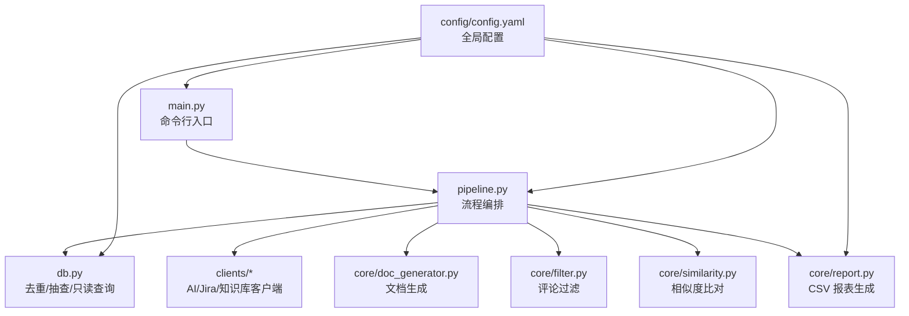
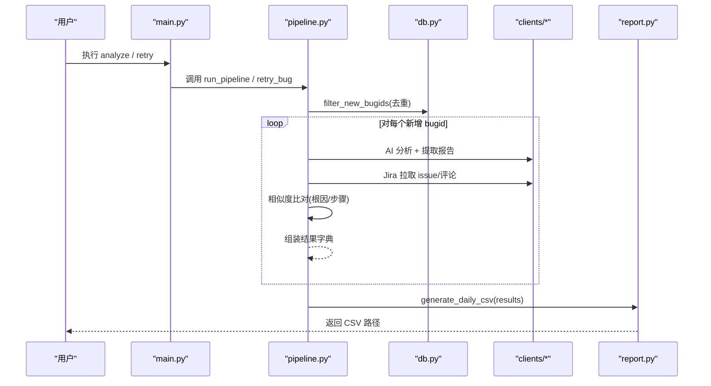
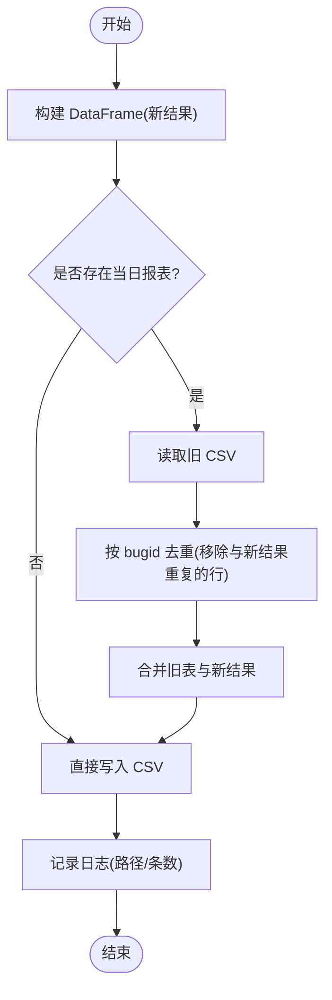
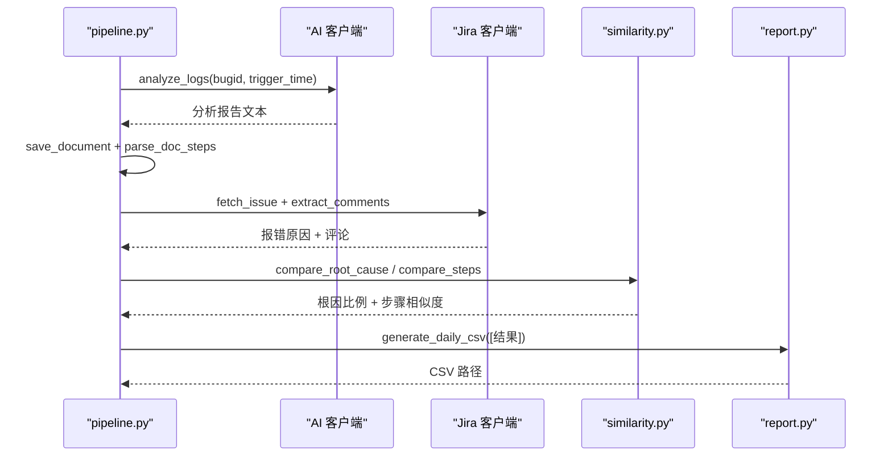
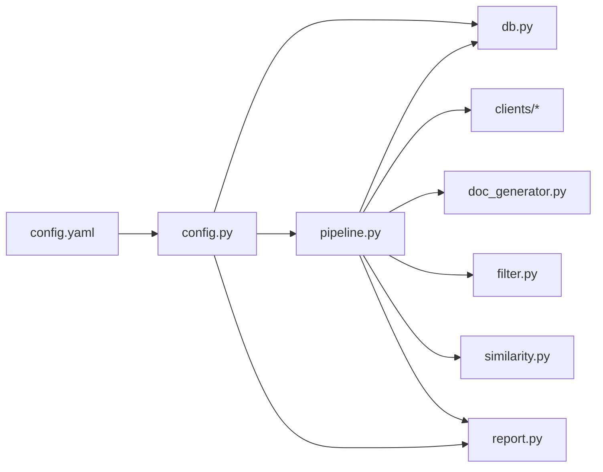

# 报告生成器

<cite>
**本文引用的文件**
- [src/core/report.py](file://src/core/report.py)
- [src/pipeline.py](file://src/pipeline.py)
- [src/db.py](file://src/db.py)
- [src/config.py](file://src/config.py)
- [config/config.yaml](file://config/config.yaml)
- [src/main.py](file://src/main.py)
- [README.md](file://README.md)
</cite>

## 目录
1. [简介](#简介)
2. [项目结构](#项目结构)
3. [核心组件](#核心组件)
4. [架构总览](#架构总览)
5. [详细组件分析](#详细组件分析)
6. [依赖关系分析](#依赖关系分析)
7. [性能考虑](#性能考虑)
8. [故障排查指南](#故障排查指南)
9. [结论](#结论)
10. [附录](#附录)

## 简介
本模块实现“每日 CSV 结论报表”的自动生成与合并，用于汇总 AI 日志分析与 Jira 比对后的结论。其核心职责包括：
- 将内存中的分析结果转换为统一字段结构的行数据
- 按日期生成/合并当日 CSV 报表（reports/YYYY-MM-DD_daily.csv）
- 提供去重覆盖策略（同 bugid 新结果覆盖旧结果）
- 与数据库层、主流程编排、配置系统协作，完成端到端的数据流

该模块不直接读写数据库，仅负责输出 CSV；数据过滤、排序等逻辑由上游 pipeline 与 db 层共同完成。

## 项目结构
围绕报告生成的关键文件与职责如下：
- src/core/report.py：报表生成核心，定义列头、行转换、CSV 写入与合并
- src/pipeline.py：主流程编排，串联去重、AI 分析、Jira 比对，并调用 report 生成 CSV
- src/db.py：数据库只读查询（bugid 去重、抽查候选池、已入库字段读取）
- src/config.py：全局配置加载、路径解析、日志初始化
- config/config.yaml：外部接口、相似性阈值、输出路径等配置
- src/main.py：CLI 入口，分发 analyze/retry/store/report/audit 子命令
- README.md：使用说明与目录结构说明

图表来源
- [src/main.py:1-111](file://src/main.py#L1-L111)
- [src/pipeline.py:1-105](file://src/pipeline.py#L1-L105)
- [src/db.py:1-132](file://src/db.py#L1-L132)
- [src/core/report.py:1-66](file://src/core/report.py#L1-L66)
- [config/config.yaml:1-63](file://config/config.yaml#L1-L63)

章节来源
- [README.md:1-76](file://README.md#L1-L76)
- [src/main.py:1-111](file://src/main.py#L1-L111)
- [src/pipeline.py:1-105](file://src/pipeline.py#L1-L105)
- [src/core/report.py:1-66](file://src/core/report.py#L1-L66)
- [src/db.py:1-132](file://src/db.py#L1-L132)
- [src/config.py:1-59](file://src/config.py#L1-L59)
- [config/config.yaml:1-63](file://config/config.yaml#L1-L63)

## 核心组件
- 报表列定义与行映射：定义中文表头，将内存结果字典映射为 CSV 行，处理布尔值与时间格式
- 日报生成与合并：按日期生成 CSV，若存在则读取旧表并按 bugid 去重合并，新结果覆盖旧行
- 配置与路径：通过配置获取输出目录，确保目录存在并返回绝对路径
- 日志记录：使用统一日志器记录生成过程与统计信息

章节来源
- [src/core/report.py:15-66](file://src/core/report.py#L15-L66)
- [src/config.py:28-34](file://src/config.py#L28-L34)

## 架构总览
报告生成在整体流水线中的位置与交互如下：
- main 接收 analyze/retry 等命令，调用 pipeline
- pipeline 执行步骤1（db 去重）、步骤2（AI 分析+文档生成）、步骤3（Jira 比对+相似度计算），收集结果列表
- pipeline 调用 report.generate_daily_csv 生成/合并当日 CSV
- 配置决定输出路径、相似性阈值、审计抽样等

图表来源
- [src/main.py:29-54](file://src/main.py#L29-L54)
- [src/pipeline.py:18-86](file://src/pipeline.py#L18-L86)
- [src/db.py:67-88](file://src/db.py#L67-L88)
- [src/core/report.py:46-66](file://src/core/report.py#L46-L66)

## 详细组件分析

### 报表生成器（report.py）
- 数据结构与字段映射
  - 列定义：包含 bugid、触发时间、分析状态、根因一致、步骤一致、步骤相似度、文档路径、错误信息、分析时间
  - 行转换：将内存结果字典映射到上述列，布尔值转中文展示，时间格式化，缺失值用“-”占位
- CSV 生成与合并
  - 按日期生成 reports/YYYY-MM-DD_daily.csv
  - 若文件已存在，读取旧表，移除与新结果中相同 bugid 的行，再拼接新结果
  - 使用 utf-8-sig 编码保证 Excel 打开不乱码
- 日志与统计
  - 记录生成路径、本次写入条数、合计条数

图表来源
- [src/core/report.py:46-66](file://src/core/report.py#L46-L66)

章节来源
- [src/core/report.py:15-66](file://src/core/report.py#L15-L66)

### 主流程编排（pipeline.py）
- 单条分析流程
  - 调用 AI 日志分析工具，提取报告文本并保存文档
  - 从文档解析步骤，从 Jira 拉取 issue 与评论，评论经 Agent 过滤得到分析步骤
  - 双重比对：根因关键词命中比例、步骤 TF-IDF 余弦相似度
  - 根据配置阈值判定一致与否，组装结果字典
- 批量处理与失败隔离
  - 遍历新增 bugid，单个失败不影响整体流程，记录失败结果
  - 最终汇总 results 调用 report 生成/合并 CSV
- 重试与入库
  - retry_bug：重新分析指定 bugid 并更新当日报表
  - store_bug：手工将分析文档推入知识库（不做自动校验）

图表来源
- [src/pipeline.py:18-86](file://src/pipeline.py#L18-L86)
- [src/core/similarity.py:17-75](file://src/core/similarity.py#L17-L75)
- [src/core/report.py:46-66](file://src/core/report.py#L46-L66)

章节来源
- [src/pipeline.py:18-105](file://src/pipeline.py#L18-L105)

### 数据库层（db.py）
- 只读查询
  - filter_new_bugids：从数据库读取已存在的 bugid，结合批内重复过滤，返回新增与已存在列表
  - fetch_audit_candidates：读取已入库表的 bugid 与触发时间，供随机抽查
  - fetch_stored_analysis：读取已入库分析的根因与分析流程字段，用于人工审核对比
- 连接与建表
  - init_db：创建引擎、自动建表、支持 SQLite 相对路径解析
  - _get_session：懒初始化 Session

章节来源
- [src/db.py:19-132](file://src/db.py#L19-L132)

### 配置系统（config.py 与 config.yaml）
- 配置加载与缓存：load_config 读取 YAML 并缓存
- 路径解析：get_path 基于 output 配置项返回绝对路径并确保目录存在
- 日志初始化：setup_logger 同时输出控制台与按日归档的文件日志
- 关键配置项
  - database.url/table_name：数据库连接串与表名
  - ai_log_api/jira_api/knowledge_base_api：外部接口开关、URL、超时、字段映射
  - similarity.threshold/root_cause_hit_ratio：相似度阈值与根因命中比例
  - audit.sample_count/kb_table/字段映射：抽查数量与库表映射
  - output.doc_dir/report_dir/log_dir：输出目录

章节来源
- [src/config.py:1-59](file://src/config.py#L1-L59)
- [config/config.yaml:1-63](file://config/config.yaml#L1-L63)

### CLI 入口（main.py）
- 子命令
  - analyze：执行步骤1~3，生成当日报表
  - retry：失败重试，更新当日报表
  - store：手工入库
  - report：查看当日报表路径
  - audit：随机抽查并生成审核表格
- 参数解析与异常处理：Windows 控制台编码切换、异常捕获与错误日志

章节来源
- [src/main.py:1-111](file://src/main.py#L1-L111)

## 依赖关系分析
- 模块耦合
  - report 依赖 config 的路径与日志，不直接依赖 db/pipeline
  - pipeline 聚合 db、clients、doc_generator、filter、similarity、report，承担编排职责
  - db 依赖 config 的配置与日志
- 外部依赖
  - AI 日志分析接口、Jira RESTAPI、知识库接口（可 mock）
  - jieba、sklearn 用于分词与相似度计算
  - pandas 用于 CSV 读写与合并
  - SQLAlchemy 用于数据库连接与查询

图表来源
- [src/config.py:1-59](file://src/config.py#L1-L59)
- [src/pipeline.py:1-105](file://src/pipeline.py#L1-L105)
- [src/db.py:1-132](file://src/db.py#L1-L132)
- [src/core/report.py:1-66](file://src/core/report.py#L1-L66)

章节来源
- [src/pipeline.py:1-105](file://src/pipeline.py#L1-L105)
- [src/db.py:1-132](file://src/db.py#L1-L132)
- [src/core/report.py:1-66](file://src/core/report.py#L1-L66)
- [src/config.py:1-59](file://src/config.py#L1-L59)

## 性能考虑
- 大数据量处理建议
  - 分批处理：对大批量 bugid 分批调用 pipeline，避免单次内存占用过高
  - 并发控制：对外部接口（AI/Jira）进行限流与重试，避免请求风暴
  - 相似度计算优化：对长文本先做截断或摘要，减少 TF-IDF 向量维度
  - CSV 合并优化：大表合并时注意内存，必要时分块写入或使用增量更新
- 阈值与指标
  - similarity.threshold 与 root_cause_hit_ratio 可根据业务场景调整，平衡召回与准确率
- 存储与编码
  - 使用 utf-8-sig 编码确保 Excel 兼容
  - 日志按日归档，便于问题定位与容量管理

[本节为通用性能建议，不直接分析具体代码文件]

## 故障排查指南
- 常见问题
  - 当日报表不存在：需先执行 analyze 生成；可通过 report 子命令查看路径
  - 中文乱码：确认 CSV 使用 utf-8-sig 编码；Windows 控制台已切换 UTF-8
  - 相似度结果为空：检查输入文本是否为空；确认分词与停用词配置
  - 外部接口失败：检查 mock 开关与 URL、超时、认证配置；关注 pipeline 中的异常捕获与失败结果记录
- 日志定位
  - 查看 logs/app_YYYY-MM-DD.log 中的 report、pipeline、db、similarity 等模块日志
  - 关注“去重完成”“相似度比对完成”“每日结论报表已生成”等关键日志

章节来源
- [src/main.py:93-106](file://src/main.py#L93-L106)
- [src/pipeline.py:67-86](file://src/pipeline.py#L67-L86)
- [src/core/report.py:61-65](file://src/core/report.py#L61-L65)
- [src/config.py:37-58](file://src/config.py#L37-L58)

## 结论
report.py 作为报告生成器的核心，提供了稳定的 CSV 输出能力，配合 pipeline 的编排与 db 的只读查询，实现了“分析结果汇总—CSV 格式生成—数据聚合统计”的闭环。通过配置化阈值与路径，系统具备良好的可扩展性与可维护性。对于大数据量场景，建议采用分批、限流与相似度优化策略，进一步提升稳定性与性能。

[本节为总结性内容，不直接分析具体代码文件]

## 附录

### 数据结构与字段映射
- 报表列（中文表头）
  - bugid：唯一标识
  - 触发时间：上游传入的时间字符串
  - 分析状态：success/failed/pending
  - 根因一致：布尔值转中文（是/否/-）
  - 步骤一致：布尔值转中文（是/否/-）
  - 步骤相似度：浮点数（保留三位小数）
  - 文档路径：生成的分析文档路径
  - 错误信息：失败时的错误消息（截断）
  - 分析时间：分析完成时间（格式化）

章节来源
- [src/core/report.py:15-43](file://src/core/report.py#L15-L43)

### 文件格式规范
- 文件名：YYYY-MM-DD_daily.csv
- 编码：utf-8-sig（Excel 友好）
- 去重策略：按 bugid 去重，新结果覆盖旧行
- 目录：reports/（由配置 output.report_dir 决定）

章节来源
- [src/core/report.py:46-66](file://src/core/report.py#L46-L66)
- [config/config.yaml:58-63](file://config/config.yaml#L58-L63)

### 与数据库查询的集成方式
- 去重：db.filter_new_bugids 读取已存在 bugid，结合批内重复过滤，返回新增列表
- 抽查：db.fetch_audit_candidates 读取已入库 bugid 与触发时间
- 审核：db.fetch_stored_analysis 读取已入库分析的根因与流程字段

章节来源
- [src/db.py:67-132](file://src/db.py#L67-L132)

### 数据过滤与排序逻辑
- 过滤
  - 批内重复：seen 集合记录已处理 bugid
  - 数据库已存在：in_(bugids) 查询过滤
  - 评论过滤：规则+关键词提取分析步骤
- 排序
  - 当前未实现显式排序；如需按时间或相似度排序，可在生成 DataFrame 后添加排序逻辑

章节来源
- [src/db.py:67-88](file://src/db.py#L67-L88)
- [src/core/filter.py:19-49](file://src/core/filter.py#L19-L49)

### 报表定制选项与模板配置
- 相似性阈值：similarity.threshold 与 root_cause_hit_ratio
- 输出路径：output.doc_dir/report_dir/log_dir
- 审计抽样：audit.sample_count 与 kb_table/字段映射
- 扩展点：similarity.compare_steps 预留 LLM 评判接口；filter._agent_filter 预留 LLM Agent 接入

章节来源
- [config/config.yaml:37-56](file://config/config.yaml#L37-L56)
- [src/core/similarity.py:69-75](file://src/core/similarity.py#L69-L75)
- [src/core/filter.py:24-27](file://src/core/filter.py#L24-L27)

### 批量处理功能
- 支持多 bugid 一次性分析，失败隔离，最终汇总生成 CSV
- 重试机制：retry_bug 针对单个 bugid 重新分析并更新报表

章节来源
- [src/pipeline.py:54-93](file://src/pipeline.py#L54-L93)

### 代码示例（以路径引用代替具体代码）
- 生成日报表：参考 [src/core/report.py:46-66](file://src/core/report.py#L46-L66)
- 主流程编排：参考 [src/pipeline.py:18-86](file://src/pipeline.py#L18-L86)
- 去重与抽查：参考 [src/db.py:67-132](file://src/db.py#L67-L132)
- CLI 使用：参考 [src/main.py:29-54](file://src/main.py#L29-L54)

### 业务含义与使用场景
- 业务含义：汇总 AI 分析与 Jira 比对结论，形成可追溯的每日报表，支撑质量度量与复盘
- 使用场景：日常缺陷分析、失败重试跟踪、知识入库前的人工审核、批量回归验证

[本节为概念性内容，不直接分析具体代码文件]