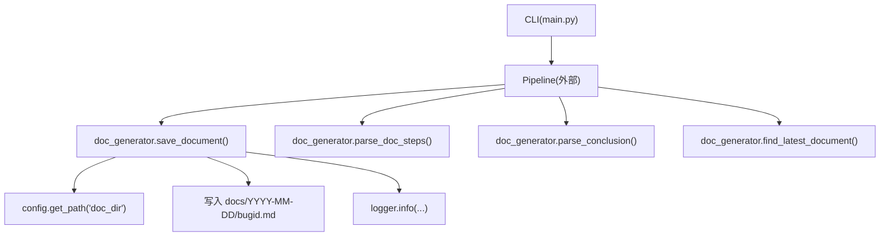
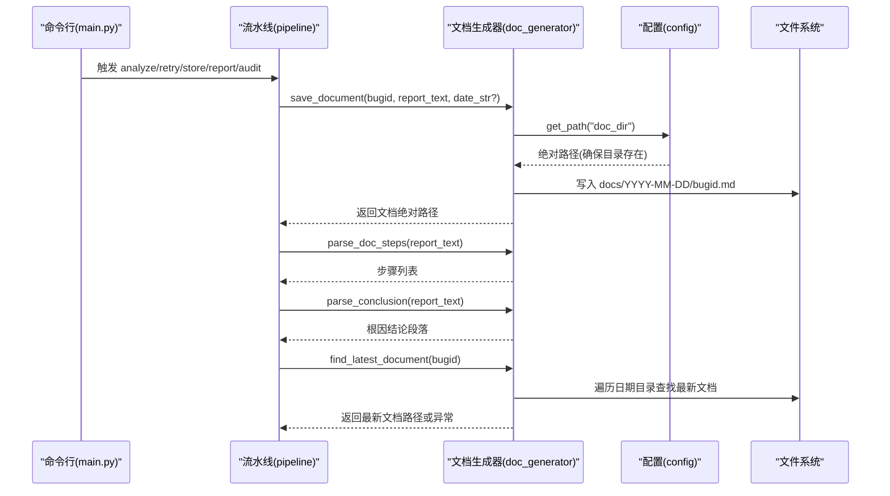
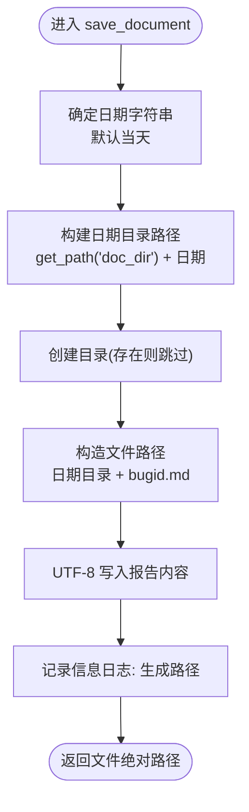
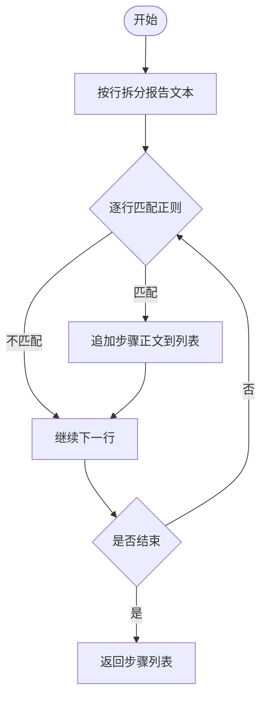
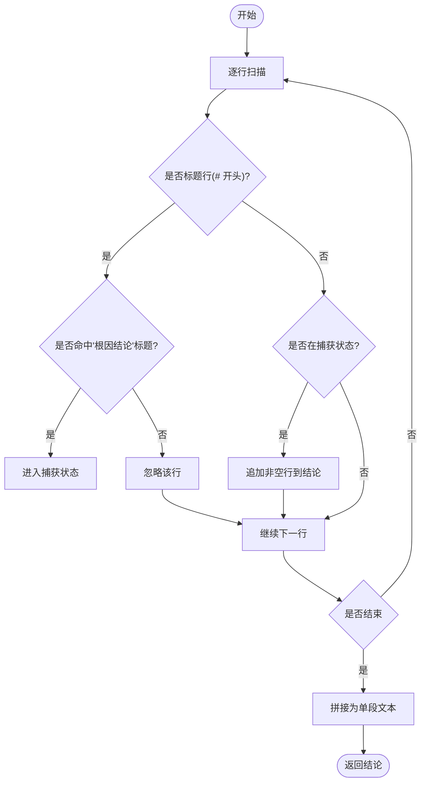
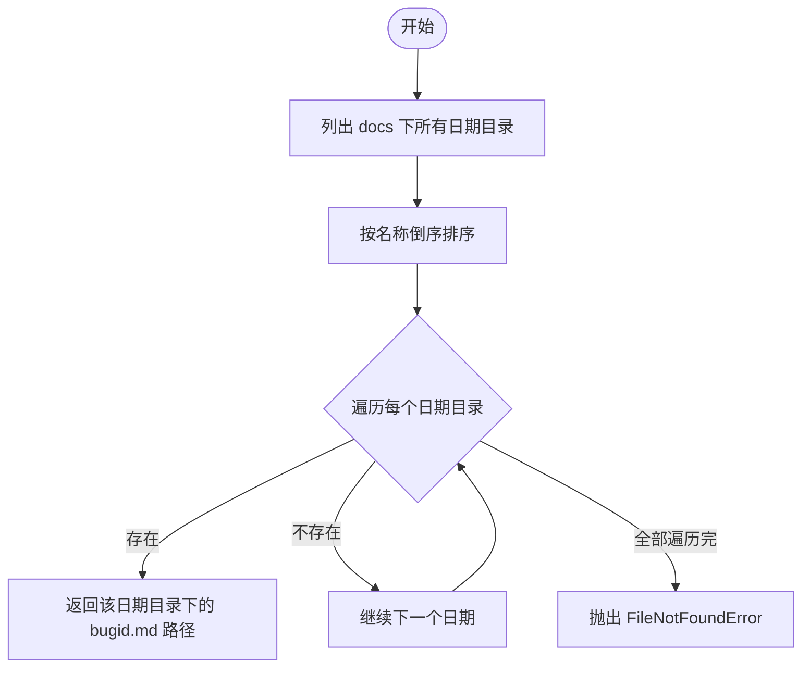
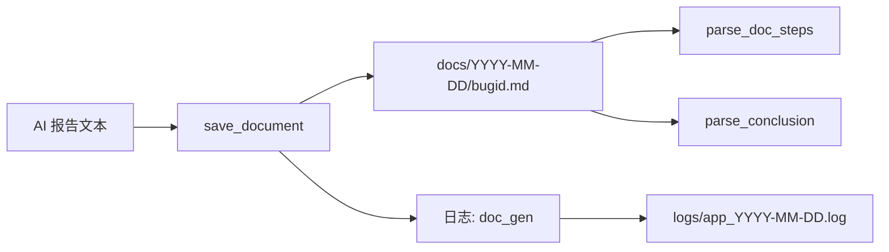

# 文档生成器

<cite>
**本文引用的文件**
- [doc_generator.py](file://src/core/doc_generator.py)
- [config.py](file://src/config.py)
- [config.yaml](file://config/config.yaml)
- [main.py](file://src/main.py)
- [README.md](file://README.md)
- [DEMO-1.md](file://docs/2026-08-12/DEMO-1.md)
</cite>

## 目录
1. [简介](#简介)
2. [项目结构](#项目结构)
3. [核心组件](#核心组件)
4. [架构总览](#架构总览)
5. [详细组件分析](#详细组件分析)
6. [依赖关系分析](#依赖关系分析)
7. [性能考虑](#性能考虑)
8. [故障排查指南](#故障排查指南)
9. [结论](#结论)
10. [附录](#附录)

## 简介
本模块负责将 AI 日志分析工具返回的报告文本标准化为 Markdown 分析文档，并按日期分文件夹、以 bugid 命名进行保存与检索。同时提供从报告文本中提取“带序号的分析步骤”和“根因结论段落”的能力，便于后续相似性比对与报表生成。该模块通过配置系统统一管理输出路径与日志记录，具备明确的错误处理策略与可观测的日志输出。

## 项目结构
- 核心实现位于 src/core/doc_generator.py，提供文档保存、解析与查找能力。
- 配置与日志由 src/config.py 提供：加载 YAML 配置、统一获取输出目录（含自动创建）、初始化双通道日志（控制台 + 按日归档文件）。
- 运行期产物：
  - docs/YYYY-MM-DD/bugid.md：按日期分目录保存的分析文档。
  - logs/app_YYYY-MM-DD.log：按日归档的运行日志。
  - reports/YYYY-MM-DD_daily.csv：每日结论报表（由 pipeline/report 模块生成，本文不展开）。
- CLI 入口在 src/main.py，负责参数解析与命令分发；pipeline 编排调用 doc_generator 完成文档生成与后续流程。

图表来源
- [doc_generator.py:14-79](file://src/core/doc_generator.py#L14-L79)
- [config.py:28-58](file://src/config.py#L28-L58)
- [main.py:29-60](file://src/main.py#L29-L60)

章节来源
- [README.md:62-75](file://README.md#L62-L75)
- [config.yaml:58-63](file://config/config.yaml#L58-L63)

## 核心组件
- save_document(bugid, report_text, date_str=None) -> str
  - 功能：将分析报告保存为 Markdown 文档，路径为 docs/YYYY-MM-DD/bugid.md。
  - 输入：
    - bugid: 字符串，Jira bug 编号，用作文件名。
    - report_text: 字符串，AI 分析返回的报告内容。
    - date_str: 可选，日期字符串（YYYY-MM-DD），默认当天。
  - 输出：生成的文档绝对路径。
  - 行为：
    - 若未指定日期，使用当前日期。
    - 自动创建目标日期目录（不存在则创建）。
    - 以 UTF-8 编码写入 Markdown 文件。
    - 记录信息日志：包含最终文件路径。
- parse_doc_steps(report_text) -> list
  - 功能：从报告文本中逐行匹配“带序号的分析步骤”，提取步骤正文。
  - 匹配模式：行首允许空白，后接数字与分隔符（点、顿号或右括号），再跟空格与步骤内容。
  - 输出：步骤文本列表。
  - 行为：统计并记录提取到的步骤数量。
- parse_conclusion(report_text) -> str
  - 功能：提取“根因结论”标题下的段落内容，直到遇到下一个标题为止。
  - 行为：
    - 扫描行，定位包含“根因结论”的标题行。
    - 捕获其后非空行，拼接为单段文本。
    - 遇到下一个标题行即停止。
- read_document(doc_path) -> str
  - 功能：读取已生成的分析文档内容。
  - 行为：若文件不存在，抛出 FileNotFoundError，提示具体路径。
- find_latest_document(bugid) -> str
  - 功能：在 docs 目录下查找指定 bugid 的最新日期的分析文档。
  - 行为：
    - 列出所有日期子目录，按名称倒序（YYYY-MM-DD 字典序即时间序）遍历。
    - 首次命中即返回对应绝对路径。
    - 若未找到，抛出 FileNotFoundError，提示需先执行 analyze 生成。

章节来源
- [doc_generator.py:14-79](file://src/core/doc_generator.py#L14-L79)

## 架构总览
文档生成器作为数据处理流水线的一环，承担“报告文本 -> 标准化 Markdown 文档”的职责，并提供结构化抽取能力供后续比对与报表使用。其关键交互如下：

图表来源
- [doc_generator.py:14-79](file://src/core/doc_generator.py#L14-L79)
- [config.py:28-58](file://src/config.py#L28-L58)
- [main.py:29-60](file://src/main.py#L29-L60)

## 详细组件分析

### 文档保存与路径管理：save_document
- 路径规则：
  - 基础目录来自配置 output.doc_dir（默认 docs）。
  - 日期子目录格式 YYYY-MM-DD，自动创建。
  - 文件名固定为 bugid.md。
- 编码与覆盖：
  - 使用 UTF-8 编码写入。
  - 同名文件会被覆盖（适合重试场景）。
- 日志与可观测性：
  - 成功时记录信息日志，包含完整路径，便于审计与回溯。
- 错误处理：
  - 目录创建失败或写入失败会向上抛出 IO 异常，调用方应捕获并记录。

图表来源
- [doc_generator.py:14-29](file://src/core/doc_generator.py#L14-L29)
- [config.py:28-34](file://src/config.py#L28-L34)

章节来源
- [doc_generator.py:14-29](file://src/core/doc_generator.py#L14-L29)
- [config.yaml:58-63](file://config/config.yaml#L58-L63)

### 步骤提取：parse_doc_steps
- 正则模式说明：
  - 匹配行首空白后，数字 + 分隔符（点、顿号或右括号）+ 空格 + 步骤内容。
  - 支持多种中文/英文序号风格。
- 复杂度：
  - 时间 O(N)，N 为行数；空间 O(K)，K 为匹配到的步骤数。
- 适用场景：
  - 用于后续步骤相似度比对与人工审核。
- 注意事项：
  - 仅匹配“整行”符合模式的行，避免误匹配到普通段落。

图表来源
- [doc_generator.py:32-40](file://src/core/doc_generator.py#L32-L40)

章节来源
- [doc_generator.py:32-40](file://src/core/doc_generator.py#L32-L40)

### 根因结论提取：parse_conclusion
- 行为逻辑：
  - 定位包含“根因结论”的标题行。
  - 捕获其后非空行，直到遇到下一个标题行（以 # 开头）为止。
  - 将捕获的行拼接为单段文本返回。
- 复杂度：
  - 时间 O(N)，N 为行数；空间 O(M)，M 为结论段落字符数。
- 适用场景：
  - 用于根因关键词命中比例计算与报表字段填充。

图表来源
- [doc_generator.py:43-56](file://src/core/doc_generator.py#L43-L56)

章节来源
- [doc_generator.py:43-56](file://src/core/doc_generator.py#L43-L56)

### 文档读取：read_document
- 行为：
  - 检查文件是否存在，不存在则抛出 FileNotFoundError，附带具体路径。
  - 存在则以 UTF-8 读取全文返回。
- 错误处理：
  - 明确区分“文件不存在”与“其他 IO 异常”，便于上层区分处理。

章节来源
- [doc_generator.py:59-64](file://src/core/doc_generator.py#L59-L64)

### 最新文档查找：find_latest_document
- 行为：
  - 基于配置输出目录 docs，列出所有日期子目录。
  - 按名称倒序遍历（YYYY-MM-DD 字典序即时间序），首次命中返回绝对路径。
  - 未找到时抛出 FileNotFoundError，提示需先执行 analyze 生成。
- 复杂度：
  - 时间 O(D + 1)，D 为日期目录数量；空间 O(1)。
- 适用场景：
  - 重试、入库前校验等需要“最新一次分析结果”的流程。

图表来源
- [doc_generator.py:67-79](file://src/core/doc_generator.py#L67-L79)

章节来源
- [doc_generator.py:67-79](file://src/core/doc_generator.py#L67-L79)

## 依赖关系分析
- 配置依赖：
  - get_path("doc_dir") 返回 docs 的绝对路径并确保目录存在。
  - setup_logger("doc_gen") 初始化日志，输出至控制台与 logs/app_YYYY-MM-DD.log。
- 外部集成：
  - 与 pipeline 协作：pipeline 调用 save_document 生成文档，并调用 parse_* 系列函数进行结构化抽取。
  - 与 CLI 协作：main.py 提供 analyze/retry/store/report/audit 子命令，间接驱动文档生成与读取。
- 数据流：
  - AI 报告文本 -> save_document -> 磁盘 Markdown。
  - Markdown -> parse_doc_steps / parse_conclusion -> 结构化数据 -> 相似性比对与报表。

图表来源
- [doc_generator.py:14-79](file://src/core/doc_generator.py#L14-L79)
- [config.py:37-58](file://src/config.py#L37-L58)

章节来源
- [config.py:28-58](file://src/config.py#L28-L58)
- [main.py:29-60](file://src/main.py#L29-L60)

## 性能考虑
- 文件 I/O：
  - 单次写入操作，I/O 开销较小；批量处理时应注意并发写入同一目录时的锁竞争（当前实现为顺序写入，无并发冲突）。
- 正则匹配：
  - parse_doc_steps 对每行进行一次正则匹配，时间复杂度线性；对于超长报告建议分批处理或限制行数。
- 目录遍历：
  - find_latest_document 按日期目录倒序遍历，通常目录数量较少，性能可接受；若 docs 下历史日期极多，可考虑缓存最近 N 个日期目录。
- 日志写入：
  - 日志采用按日归档文件，避免单文件过大；在高吞吐场景下，可适当调整日志级别以减少 I/O。

[本节为通用性能建议，不直接分析具体文件]

## 故障排查指南
- 常见问题与处理：
  - 找不到分析文档：
    - 现象：find_latest_document 抛出 FileNotFoundError。
    - 原因：未执行 analyze 或未生成对应 bugid 的文档。
    - 处理：先执行 analyze 生成文档，或确认 bugid 与日期是否正确。
  - 读取文档失败：
    - 现象：read_document 抛出 FileNotFoundError。
    - 原因：传入路径错误或文件被删除。
    - 处理：核对路径，重新生成文档。
  - 步骤提取为空：
    - 现象：parse_doc_steps 返回空列表。
    - 原因：报告文本未按规范书写序号步骤。
    - 处理：检查报告模板，确保步骤行符合“数字 + 分隔符 + 空格 + 内容”的格式。
  - 根因结论为空：
    - 现象：parse_conclusion 返回空字符串。
    - 原因：报告中缺少“根因结论”标题或其后无内容。
    - 处理：完善报告模板，确保标题与内容存在。
- 日志定位：
  - 查看 logs/app_YYYY-MM-DD.log，搜索 doc_gen 相关日志，确认文档生成与步骤提取过程。
  - 结合 main.py 的命令输出，定位具体失败的子命令与参数。

章节来源
- [doc_generator.py:59-79](file://src/core/doc_generator.py#L59-L79)
- [config.py:37-58](file://src/config.py#L37-L58)
- [main.py:93-106](file://src/main.py#L93-L106)

## 结论
文档生成器模块以简洁清晰的接口实现了 Bug 分析报告的标准化存储与结构化抽取，配合配置系统与日志机制，具备良好的可维护性与可观测性。通过日期分目录与 bugid 命名的文件组织方式，便于后续检索、比对与归档。建议在大规模使用时关注日志量与目录规模，必要时引入缓存与限流策略。

[本节为总结性内容，不直接分析具体文件]

## 附录

### API 参考（函数签名与行为摘要）
- save_document(bugid: str, report_text: str, date_str: str = None) -> str
  - 保存分析报告为 Markdown，路径 docs/YYYY-MM-DD/bugid.md，返回绝对路径。
- parse_doc_steps(report_text: str) -> list
  - 提取带序号的步骤行，返回步骤文本列表。
- parse_conclusion(report_text: str) -> str
  - 提取“根因结论”标题下的段落内容，返回拼接后的单段文本。
- read_document(doc_path: str) -> str
  - 读取指定路径的文档内容，不存在则抛出 FileNotFoundError。
- find_latest_document(bugid: str) -> str
  - 查找指定 bugid 的最新日期文档，不存在则抛出 FileNotFoundError。

章节来源
- [doc_generator.py:14-79](file://src/core/doc_generator.py#L14-L79)

### 配置文件项（输出路径）
- output.doc_dir: 分析文档根目录（默认 docs）。
- output.report_dir: 每日报表目录（默认 reports）。
- output.log_dir: 运行日志目录（默认 logs）。

章节来源
- [config.yaml:58-63](file://config/config.yaml#L58-L63)

### 示例文档结构
- 示例文档 DEMO-1.md 展示了标准 Markdown 结构：
  - 标题：Bug DEMO-1 日志分析报告
  - 根因结论：一段描述性文字
  - 分析步骤：带序号的多行步骤

章节来源
- [DEMO-1.md:1-10](file://docs/2026-08-12/DEMO-1.md#L1-L10)