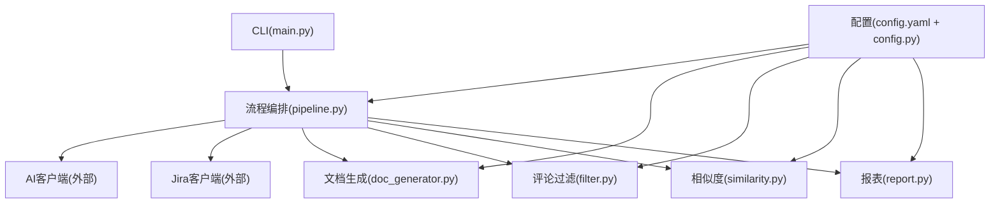
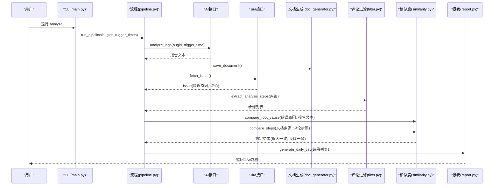
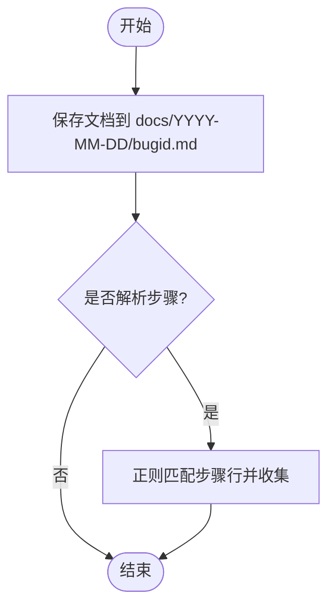
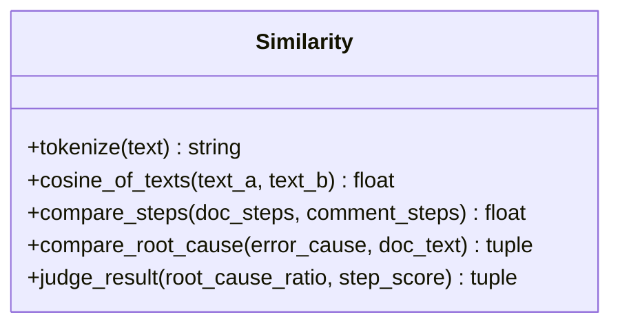
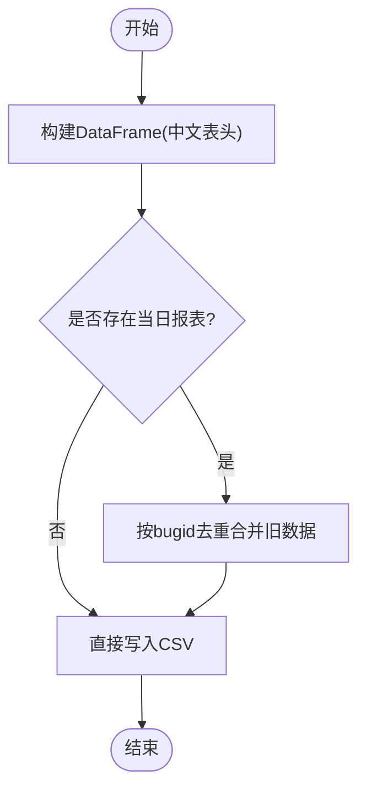
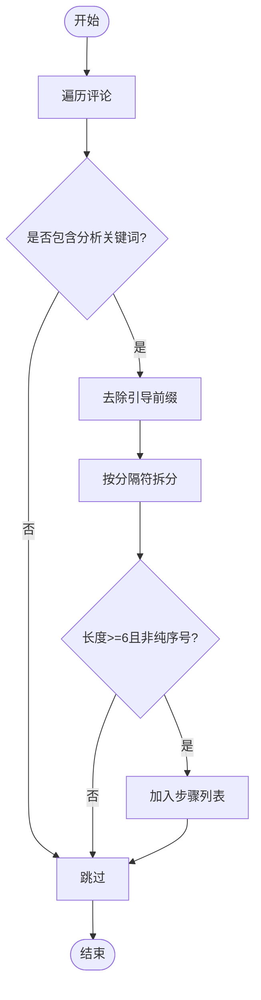
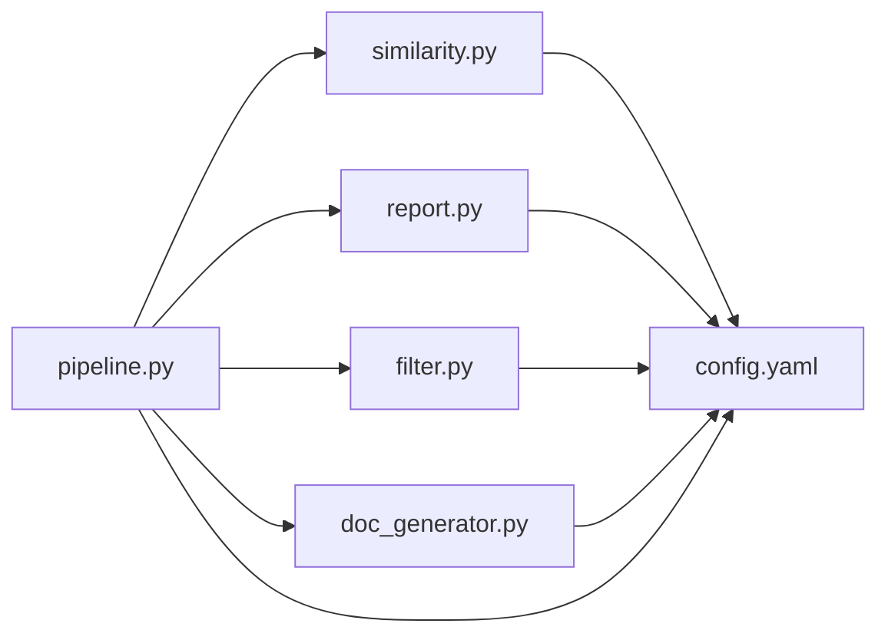

# 核心模块

<cite>
**本文引用的文件**
- [doc_generator.py](file://src/core/doc_generator.py)
- [similarity.py](file://src/core/similarity.py)
- [report.py](file://src/core/report.py)
- [filter.py](file://src/core/filter.py)
- [config.yaml](file://config/config.yaml)
- [config.py](file://src/config.py)
- [pipeline.py](file://src/pipeline.py)
- [main.py](file://src/main.py)
- [test_filter.py](file://tests/test_filter.py)
- [test_similarity.py](file://tests/test_similarity.py)
</cite>

## 目录
1. [简介](#简介)
2. [项目结构](#项目结构)
3. [核心组件](#核心组件)
4. [架构总览](#架构总览)
5. [详细组件分析](#详细组件分析)
6. [依赖关系分析](#依赖关系分析)
7. [性能考虑](#性能考虑)
8. [故障排查指南](#故障排查指南)
9. [结论](#结论)
10. [附录：使用示例与模式](#附录使用示例与模式)

## 简介
本技术文档聚焦四个核心处理模块，覆盖其功能、实现细节、输入输出、算法逻辑、配置项、协作方式、性能优化建议与常见问题解决方案。四个模块分别为：
- doc_generator.py：标准化 bug 分析报告生成（保存 Markdown、解析步骤与结论）
- similarity.py：根因关键词匹配和步骤相似性计算（TF-IDF 余弦相似度、阈值判定）
- report.py：每日 CSV 结论报表生成（按天合并、中文表头、去重覆盖）
- filter.py：从 Jira 评论中提取有效分析步骤（规则+关键词过滤）

这些模块由 pipeline.py 编排，配合 config.yaml 与 src/config.py 完成配置与日志管理，并通过 main.py 暴露 CLI 命令。

## 项目结构
- 核心模块位于 src/core/，分别承担文档生成、相似度计算、报表生成、评论过滤职责
- 配置集中管理于 config/config.yaml，通过 src/config.py 加载并缓存
- 主流程编排位于 src/pipeline.py，串联 AI 分析、Jira 数据获取、文档生成、相似度比对与报表输出
- CLI 入口在 src/main.py，提供 analyze/retry/store/report/audit 等子命令

图表来源
- [main.py:63-90](file://src/main.py#L63-L90)
- [pipeline.py:18-86](file://src/pipeline.py#L18-L86)
- [config.py:17-34](file://src/config.py#L17-L34)

章节来源
- [main.py:1-111](file://src/main.py#L1-L111)
- [pipeline.py:1-105](file://src/pipeline.py#L1-L105)
- [config.py:1-59](file://src/config.py#L1-L59)

## 核心组件
- 文档生成器：负责将 AI 生成的报告文本保存为按日期分目录的 Markdown 文档，并提供步骤提取、结论段落提取、最新文档查找能力
- 相似度计算：基于 jieba 分词与 TF-IDF 向量化的余弦相似度，对“报错原因关键词”与“分析文档”进行命中比例计算；对“文档步骤”与“评论步骤”逐条最佳匹配后求平均相似度；依据配置阈值判定一致与否
- 报表生成：将内存中的分析结果转换为带中文表头的 DataFrame，按天生成 CSV，支持同日报复覆盖合并
- 评论过滤：从 Jira 评论区中筛选与分析相关的评论，去除引导前缀并按分隔符拆分得到步骤列表

章节来源
- [doc_generator.py:14-79](file://src/core/doc_generator.py#L14-L79)
- [similarity.py:17-75](file://src/core/similarity.py#L17-L75)
- [report.py:22-66](file://src/core/report.py#L22-L66)
- [filter.py:19-49](file://src/core/filter.py#L19-L49)

## 架构总览
整体工作流如下：
- CLI 接收 bugid 列表与触发时间参数
- pipeline 执行数据库去重过滤，调用 AI 接口生成分析报告并保存为 Markdown
- 同时从 Jira 拉取错误原因与评论，评论经 filter 提取为步骤
- 使用 similarity 进行根因关键词命中比例与步骤相似度计算，并依据配置阈值判定一致与否
- 汇总结果生成当日 CSV 报表

图表来源
- [main.py:29-33](file://src/main.py#L29-L33)
- [pipeline.py:18-86](file://src/pipeline.py#L18-L86)
- [doc_generator.py:14-29](file://src/core/doc_generator.py#L14-L29)
- [filter.py:29-49](file://src/core/filter.py#L29-L49)
- [similarity.py:34-75](file://src/core/similarity.py#L34-L75)
- [report.py:46-66](file://src/core/report.py#L46-L66)

## 详细组件分析

### 文档生成器（doc_generator.py）
- 主要职责
  - 保存分析报告为 Markdown 文档，按日期分目录，文件名以 bugid 命名
  - 从报告文本中提取带序号的步骤行
  - 提取“根因结论”段落内容
  - 读取指定文档或查找最新日期的文档
- 关键函数与行为
  - save_document：创建日期目录并写入 bugid.md，记录日志并返回绝对路径
  - parse_doc_steps：正则匹配“数字+标点+空格”开头的步骤行，收集步骤文本
  - parse_conclusion：定位“## 根因结论”标题，捕获至下一标题前的非空行拼接为结论
  - read_document：校验文件存在并读取内容
  - find_latest_document：按日期倒序遍历，返回最新 bugid.md 路径，不存在则抛出明确异常
- 输入输出
  - save_document：输入 bugid、report_text、可选 date_str；输出文档绝对路径
  - parse_doc_steps：输入报告文本；输出一维字符串列表（步骤）
  - parse_conclusion：输入报告文本；输出结论字符串
  - read_document：输入文档路径；输出文档内容
  - find_latest_document：输入 bugid；输出最新文档路径
- 配置与依赖
  - 使用 src/config.get_path("doc_dir") 获取文档根目录
  - 使用 setup_logger 记录生成过程
- 复杂度与性能
  - 文件 IO 为主，时间复杂度 O(N) 与行数相关；正则匹配开销较小
- 错误处理
  - 文件不存在时抛出 FileNotFoundError，便于上层统一处理
- 使用模式
  - pipeline 中先保存文档，再解析步骤用于相似度计算；store 流程中查找最新文档并读取内容推入知识库

图表来源
- [doc_generator.py:14-40](file://src/core/doc_generator.py#L14-L40)

章节来源
- [doc_generator.py:14-79](file://src/core/doc_generator.py#L14-L79)

### 相似度计算（similarity.py）
- 主要职责
  - 中文分词与停用词过滤
  - 两段文本的 TF-IDF 余弦相似度计算
  - 文档步骤与评论步骤的逐条最佳匹配平均相似度
  - 报错原因关键词在分析文档中的命中比例
  - 根据配置阈值判定根因与步骤是否一致
- 关键函数与行为
  - tokenize：jieba 分词，过滤单字与停用词，空格拼接
  - cosine_of_texts：构建 TF-IDF 向量并计算余弦相似度，空输入返回 0.0
  - compare_steps：对每个文档步骤，在评论步骤中取最大相似度，最终求平均
  - compare_root_cause：对报错原因分词去重，统计在文档中出现的关键词比例
  - judge_result：读取 similarity.threshold 与 root_cause_hit_ratio，返回布尔判定
- 输入输出
  - cosine_of_texts：输入两段文本；输出浮点相似度
  - compare_steps：输入文档步骤列表与评论步骤列表；输出平均相似度
  - compare_root_cause：输入错误原因与文档文本；输出(命中比例, 命中关键词列表)
  - judge_result：输入根因比例与步骤相似度；输出(根因一致, 步骤一致)
- 配置与依赖
  - 使用 load_config()["similarity"] 获取阈值
  - 依赖 jieba、sklearn 的 TfidfVectorizer 与 cosine_similarity
- 复杂度与性能
  - TF-IDF 向量化与相似度计算复杂度与词汇量与文本长度相关；compare_steps 为 O(D*C)，D 为文档步骤数，C 为评论步骤数
- 错误处理
  - 空输入直接返回 0.0，避免异常中断
- 使用模式
  - pipeline 中先比较根因关键词命中比例，再比较步骤相似度，最后用 judge_result 判定一致性

图表来源
- [similarity.py:17-75](file://src/core/similarity.py#L17-L75)

章节来源
- [similarity.py:17-75](file://src/core/similarity.py#L17-L75)
- [test_similarity.py:7-72](file://tests/test_similarity.py#L7-L72)

### 报表生成（report.py）
- 主要职责
  - 将内存中的分析结果转换为带中文表头的 DataFrame
  - 生成当日报表 CSV，支持多次运行覆盖合并
- 关键函数与行为
  - _bool_text：布尔值转中文展示，None 显示“-”
  - _to_row：将单条结果映射为报表行字段
  - generate_daily_csv：构造 DataFrame，若已存在当日报表则按 bugid 去重合并，最终以 utf-8-sig 编码写入
- 输入输出
  - generate_daily_csv：输入结果列表与可选日期；输出 CSV 绝对路径
- 配置与依赖
  - 使用 get_path("report_dir") 获取报表目录
  - 依赖 pandas 进行数据处理
- 复杂度与性能
  - 合并逻辑为 O(N+M)，N 为新结果数量，M 为旧报表行数；编码与写入为线性复杂度
- 错误处理
  - 未提供必要字段时使用默认值“-”，保证报表完整性
- 使用模式
  - pipeline 汇总所有 bug 的分析结果后调用该函数生成/合并报表

图表来源
- [report.py:22-66](file://src/core/report.py#L22-L66)

章节来源
- [report.py:22-66](file://src/core/report.py#L22-L66)

### 评论过滤（filter.py）
- 主要职责
  - 从 Jira 评论区中筛选与分析相关的评论
  - 去除引导前缀并按分隔符拆分为步骤列表
- 关键函数与行为
  - _is_analysis_comment：判断评论是否包含分析关键词
  - _agent_filter：占位函数，当前直接返回原文，预留接入 LLM Agent 做语义提炼
  - extract_analysis_steps：遍历评论，过滤噪音，去除前缀，按分隔符拆分，过滤过短片段与纯序号片段
- 输入输出
  - extract_analysis_steps：输入评论列表；输出分析步骤列表
- 配置与依赖
  - 使用 setup_logger 记录过滤过程
  - 依赖正则表达式进行前缀与分隔符处理
- 复杂度与性能
  - 线性扫描评论列表，正则替换与拆分开销较低
- 错误处理
  - 空评论与 None 安全处理，避免异常
- 使用模式
  - pipeline 中在获取 Jira 评论后调用该函数提取步骤，供相似度计算使用

图表来源
- [filter.py:19-49](file://src/core/filter.py#L19-L49)

章节来源
- [filter.py:19-49](file://src/core/filter.py#L19-L49)
- [test_filter.py:7-36](file://tests/test_filter.py#L7-L36)

## 依赖关系分析
- 模块间依赖
  - pipeline.py 依赖 doc_generator、filter、similarity、report 以及外部 AI/Jira 客户端
  - similarity.py 依赖配置与 sklearn/jieba
  - report.py 依赖 pandas 与配置路径
  - filter.py 依赖正则与日志
  - doc_generator.py 依赖配置路径与日志
- 配置依赖
  - config.yaml 定义 similarity 阈值、输出目录、API 开关等
  - config.py 提供全局配置加载与路径获取、日志初始化
- 外部依赖
  - AI 日志分析工具接口（可 mock）
  - Jira REST API（可 mock）
  - 知识库入库接口（可 mock）

图表来源
- [pipeline.py:8-13](file://src/pipeline.py#L8-L13)
- [config.yaml:37-63](file://config/config.yaml#L37-L63)
- [config.py:17-34](file://src/config.py#L17-L34)

章节来源
- [pipeline.py:1-105](file://src/pipeline.py#L1-L105)
- [config.yaml:1-63](file://config/config.yaml#L1-L63)
- [config.py:1-59](file://src/config.py#L1-L59)

## 性能考虑
- 相似度计算
  - TF-IDF 向量化与余弦相似度计算成本较高，建议在批量处理时对文本集合复用向量化器以减少重复计算
  - compare_steps 为 O(D*C)，可通过限制步骤数量或使用近似匹配策略降低复杂度
- 文件 IO
  - 文档保存与报表写入为磁盘 IO 操作，建议在高并发场景下使用缓冲或异步写入
- 日志
  - 日志按天归档，注意日志文件大小与轮转策略，避免磁盘占用过高
- 配置阈值
  - similarity.threshold 与 root_cause_hit_ratio 可根据业务数据调优，平衡召回与准确率

[本节为通用性能讨论，不直接分析具体文件]

## 故障排查指南
- 文档不存在
  - 现象：find_latest_document 抛出 FileNotFoundError
  - 解决：确保先执行 analyze 生成文档，检查 docs 目录结构与权限
- 评论过滤结果为空
  - 现象：extract_analysis_steps 返回空列表
  - 解决：检查评论是否包含分析关键词，调整 ANALYSIS_KEYWORDS 或前缀/分隔符正则
- 相似度始终为 0
  - 现象：cosine_of_texts 返回 0.0
  - 解决：检查文本是否为空或分词后为空，确认停用词设置合理
- 报表无更新
  - 现象：generate_daily_csv 未合并新结果
  - 解决：检查 bugid 是否重复，确认 CSV 编码与路径正确
- 配置未生效
  - 现象：阈值判定不符合预期
  - 解决：核对 config.yaml 中 similarity 配置，确认 load_config 正确加载

章节来源
- [doc_generator.py:67-79](file://src/core/doc_generator.py#L67-L79)
- [filter.py:29-49](file://src/core/filter.py#L29-L49)
- [similarity.py:23-75](file://src/core/similarity.py#L23-L75)
- [report.py:46-66](file://src/core/report.py#L46-L66)
- [config.yaml:37-63](file://config/config.yaml#L37-L63)

## 结论
四个核心模块围绕“AI 分析→文档沉淀→Jira 对比→相似度判定→报表输出”的主线紧密协作，形成完整的 bug 分析与知识沉淀闭环。通过配置化阈值与可扩展的评论过滤机制，系统具备良好的可维护性与扩展性。后续可在评论过滤与相似度计算中引入 LLM 提升语义理解能力，并在性能层面优化向量化与 IO 操作。

[本节为总结性内容，不直接分析具体文件]

## 附录：使用示例与模式
- CLI 命令
  - analyze：传入 bugid 列表与可选 --trigger-time，执行完整流程并生成当日报表
  - retry：重新分析指定 bugid，更新当日报表
  - store：手工将指定 bugid 的最新分析文档推入知识库
  - report：查看当日报表路径
  - audit：随机抽查已入库 bugid 重新分析并生成人工审核表格
- 典型调用链
  - pipeline.run_pipeline → _analyze_single → AI/Jira 调用 → 文档生成 → 评论过滤 → 相似度计算 → 报表生成
- 测试用例参考
  - 评论过滤：验证仅提取分析类评论，噪音被过滤
  - 相似度：验证相同文本相似度接近 1，不同文本相似度较低；步骤比对与阈值判定符合预期

章节来源
- [main.py:29-90](file://src/main.py#L29-L90)
- [pipeline.py:18-105](file://src/pipeline.py#L18-L105)
- [test_filter.py:7-36](file://tests/test_filter.py#L7-L36)
- [test_similarity.py:7-72](file://tests/test_similarity.py#L7-L72)