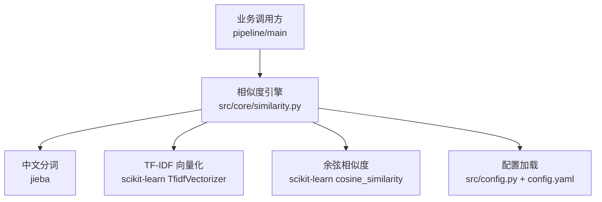
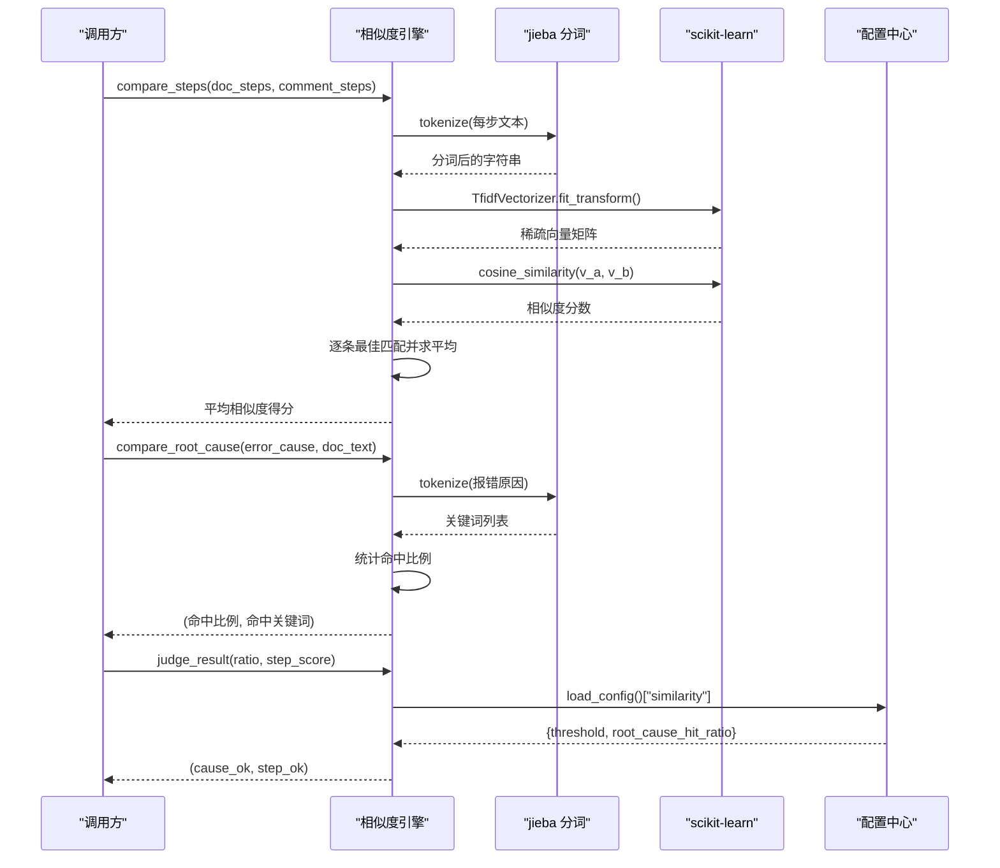
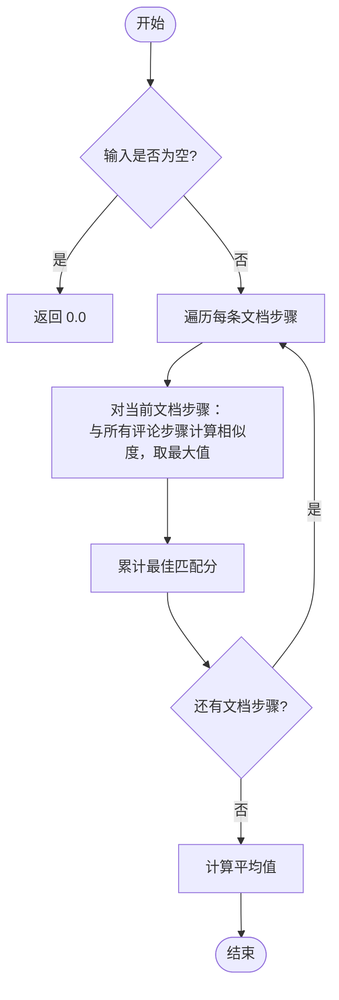
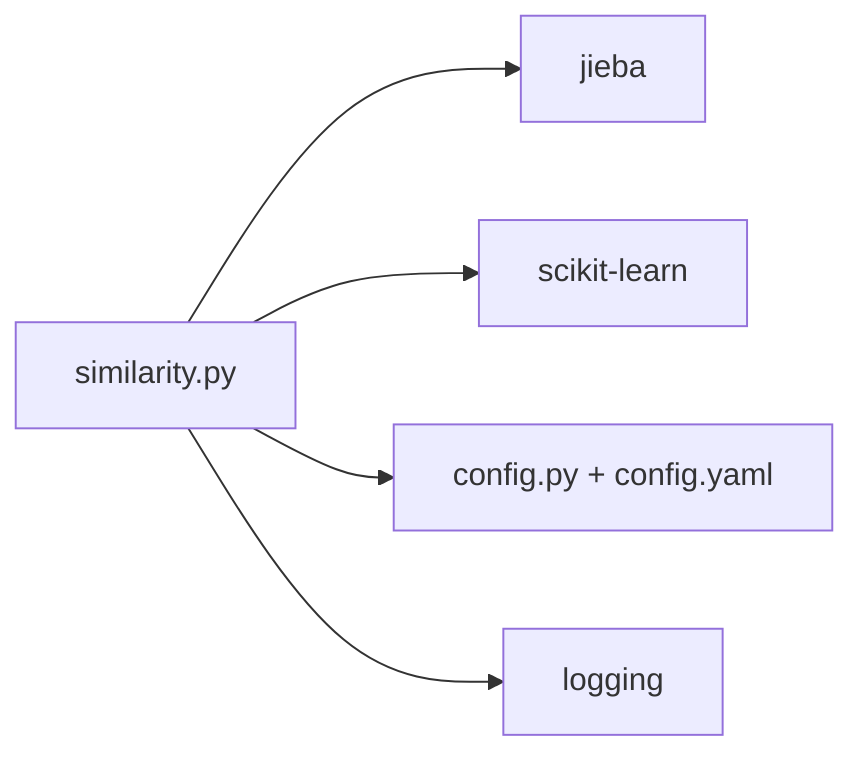

# 相似度计算引擎

<cite>
**本文引用的文件**
- [similarity.py](file://src/core/similarity.py)
- [config.yaml](file://config/config.yaml)
- [config.py](file://src/config.py)
- [requirements.txt](file://requirements.txt)
- [test_similarity.py](file://tests/test_similarity.py)
- [README.md](file://README.md)
- [DEMO-1.md](file://docs/2026-08-12/DEMO-1.md)
</cite>

## 目录
1. [简介](#简介)
2. [项目结构](#项目结构)
3. [核心组件](#核心组件)
4. [架构总览](#架构总览)
5. [详细组件分析](#详细组件分析)
6. [依赖关系分析](#依赖关系分析)
7. [性能与内存优化](#性能与内存优化)
8. [故障排查指南](#故障排查指南)
9. [结论](#结论)
10. [附录：使用示例与最佳实践](#附录使用示例与最佳实践)

## 简介
本模块实现“根因关键词匹配 + 步骤相似性计算”的相似度引擎，用于对 Bug 分析结果进行自动化验证。其核心能力包括：
- 中文分词与停用词过滤（基于 jieba）
- TF-IDF 向量化与余弦相似度计算（基于 scikit-learn）
- 步骤级最佳匹配求平均的相似度评分
- 根因关键词命中比例统计
- 基于配置的阈值判定一致性

该引擎可无缝集成到 Bug 文档沉淀工具的整体流程中，支撑“AI 日志分析 → Jira 报错原因/评论比对 → 每日结论报表”的闭环。

## 项目结构
相似度引擎位于 src/core/similarity.py，通过配置模块加载阈值参数，依赖 jieba 进行中文分词，依赖 scikit-learn 完成 TF-IDF 与余弦相似度计算。测试用例覆盖典型场景与边界条件。

图表来源
- [similarity.py:1-75](file://src/core/similarity.py#L1-L75)
- [config.py:17-25](file://src/config.py#L17-L25)
- [config.yaml:37-42](file://config/config.yaml#L37-L42)

章节来源
- [README.md:1-76](file://README.md#L1-L76)
- [similarity.py:1-75](file://src/core/similarity.py#L1-L75)

## 核心组件
- 中文分词与停用词过滤：将原始文本切分为有意义的词元，去除常见停用词与单字噪声。
- TF-IDF 向量化：将两段文本分别转换为稀疏向量，衡量词频与逆文档频率。
- 余弦相似度：计算两个向量夹角的余弦值，取值范围 0~1，越大越相似。
- 步骤相似性：逐条文档步骤与评论步骤做最佳匹配，取最大值后求平均。
- 根因关键词匹配：从报错原因中提取关键词，统计在分析文档中的命中比例。
- 阈值判定：根据配置文件中的阈值判断根因与步骤是否一致。

章节来源
- [similarity.py:17-75](file://src/core/similarity.py#L17-L75)
- [config.yaml:37-42](file://config/config.yaml#L37-L42)

## 架构总览
相似度引擎作为核心处理层，向上被主流程调用，向下依赖分词与机器学习库，并通过配置中心读取阈值。

图表来源
- [similarity.py:23-75](file://src/core/similarity.py#L23-L75)
- [config.py:17-25](file://src/config.py#L17-L25)
- [config.yaml:37-42](file://config/config.yaml#L37-L42)

## 详细组件分析

### 中文分词与停用词过滤
- 使用 jieba 对输入文本进行分词。
- 过滤长度小于 2 的词以及预设停用词集合，减少噪声干扰。
- 输出以空格拼接的分词串，便于后续向量化。

算法要点
- 时间复杂度：O(n)，n 为字符数（分词过程近似线性）。
- 空间复杂度：O(k)，k 为有效词元数量。

章节来源
- [similarity.py:13-20](file://src/core/similarity.py#L13-L20)

### TF-IDF 向量化与余弦相似度
- 使用 scikit-learn 的 TfidfVectorizer 将两段文本转为稀疏向量。
- 使用 cosine_similarity 计算两向量夹角余弦值，得到 0~1 的相似度。

数学公式
- TF-IDF：term frequency × inverse document frequency
- 余弦相似度：cos(θ) = (A·B) / (||A|| · ||B||)

复杂度与特性
- 构建词表与向量化：O(m·d)，m 为样本数，d 为词表大小。
- 余弦相似度：O(d)，d 为向量维度（稀疏表示下实际非零项数量）。
- 适合短文本对比，但对同义词、语义相近但用词不同的情况敏感度有限。

章节来源
- [similarity.py:23-31](file://src/core/similarity.py#L23-L31)
- [requirements.txt:4-6](file://requirements.txt#L4-L6)

### 步骤相似性计算
- 对每条文档步骤，与所有评论步骤计算相似度，取最高分作为该步的最佳匹配分。
- 最终得分为所有文档步骤最佳匹配分的平均值。

流程图

图表来源
- [similarity.py:34-49](file://src/core/similarity.py#L34-L49)

章节来源
- [similarity.py:34-49](file://src/core/similarity.py#L34-L49)

### 根因关键词匹配
- 对报错原因进行分词，过滤停用词与单字，去重并保持顺序。
- 统计这些关键词在分析文档中的出现次数，计算命中比例。

算法要点
- 命中比例 = 命中的关键词数 / 总关键词数
- 若未提取到有效关键词，返回 0.0 且命中列表为空

章节来源
- [similarity.py:52-66](file://src/core/similarity.py#L52-L66)

### 阈值判定
- 从配置中读取 similarity.threshold 与 similarity.root_cause_hit_ratio。
- 比较根因命中比例与步骤相似度得分，返回布尔对 (cause_ok, step_ok)。

章节来源
- [similarity.py:69-75](file://src/core/similarity.py#L69-L75)
- [config.yaml:37-42](file://config/config.yaml#L37-L42)

## 依赖关系分析
- jieba：中文分词，提供高质量中文切分能力。
- scikit-learn：TF-IDF 向量化与余弦相似度计算，提供高效稀疏矩阵运算。
- PyYAML：加载全局配置，支持多环境参数管理。
- 日志：统一日志输出，便于问题定位与审计。

图表来源
- [similarity.py:5-11](file://src/core/similarity.py#L5-L11)
- [config.py:1-11](file://src/config.py#L1-L11)
- [requirements.txt:4-6](file://requirements.txt#L4-L6)

章节来源
- [requirements.txt:1-9](file://requirements.txt#L1-L9)
- [config.py:17-25](file://src/config.py#L17-L25)

## 性能与内存优化
- 批量向量化：当需要多次比较时，复用 TfidfVectorizer 或预先构建词表，避免重复 fit_transform。
- 稀疏矩阵：scikit-learn 默认使用稀疏表示，内存占用与词表规模成正比；建议限制最大特征数或过滤低频词。
- 分词缓存：对高频文本可缓存分词结果，减少重复分词开销。
- 阈值调优：根据业务数据分布调整 threshold 与 root_cause_hit_ratio，平衡召回与精确率。
- 日志与监控：记录关键步骤耗时与中间指标，辅助定位瓶颈。

[本节为通用指导，不直接分析具体文件]

## 故障排查指南
- 输入为空：compare_steps 与 compare_root_cause 对空输入有保护，返回 0 或空列表，需检查上游数据质量。
- 分词结果为空：若分词后无有效词元，相似度返回 0.0；检查停用词设置与文本内容。
- 阈值不合理：若大量误判，调整 config.yaml 中的 similarity.threshold 与 root_cause_hit_ratio。
- 性能问题：大数据量下关注 TfidfVectorizer 的 fit/transform 成本，考虑分批或缓存策略。

章节来源
- [similarity.py:23-31](file://src/core/similarity.py#L23-L31)
- [similarity.py:34-49](file://src/core/similarity.py#L34-L49)
- [similarity.py:52-66](file://src/core/similarity.py#L52-L66)
- [config.yaml:37-42](file://config/config.yaml#L37-L42)

## 结论
相似度引擎以简洁可靠的算法组合实现了根因关键词匹配与步骤相似性计算，满足 Bug 分析结果的自动化验证需求。通过可配置阈值与完善的测试覆盖，可在不同业务场景中快速适配与调优。结合日志与监控，可进一步提升稳定性与可维护性。

[本节为总结，不直接分析具体文件]

## 附录：使用示例与最佳实践

### 基本用法
- 文本相似度：对两段文本计算 TF-IDF 余弦相似度，适用于短句或短语对比。
- 步骤相似度：对文档步骤与评论步骤进行逐条最佳匹配并求平均，评估整体流程一致性。
- 根因匹配：对报错原因关键词进行命中比例统计，评估根因结论的一致性。
- 阈值判定：依据配置阈值输出布尔结果，便于下游流程决策。

参考路径
- [similarity.py:23-75](file://src/core/similarity.py#L23-L75)

### 配置说明
- similarity.threshold：步骤相似性判定阈值（0~1），大于等于该值判定为一致。
- similarity.root_cause_hit_ratio：根因关键词最低命中比例阈值。

参考路径
- [config.yaml:37-42](file://config/config.yaml#L37-L42)

### 测试用例参考
- 完全相同文本相似度接近 1。
- 完全不相关文本相似度较低。
- 空输入返回 0 且不报错。
- 阈值判定符合预期。

参考路径
- [test_similarity.py:9-71](file://tests/test_similarity.py#L9-L71)

### 与外部系统的集成
- AI 日志分析：生成分析文档（如 docs/日期/bugid.md），供根因与步骤比对使用。
- Jira RESTAPI：提取报错原因与评论区评论，作为步骤比对的输入。
- 知识库接口：手工入库确认后的分析结果。

参考路径
- [README.md:7-13](file://README.md#L7-L13)
- [DEMO-1.md:1-10](file://docs/2026-08-12/DEMO-1.md#L1-L10)

### 适用场景与局限性
- 适用场景：短文本相似度对比、步骤流程一致性校验、根因关键词命中评估。
- 局限性：对同义词与语义相近但用词不同的文本敏感度有限；长文本可能引入噪声；阈值需按业务数据调优。

[本节为概念性说明，不直接分析具体文件]