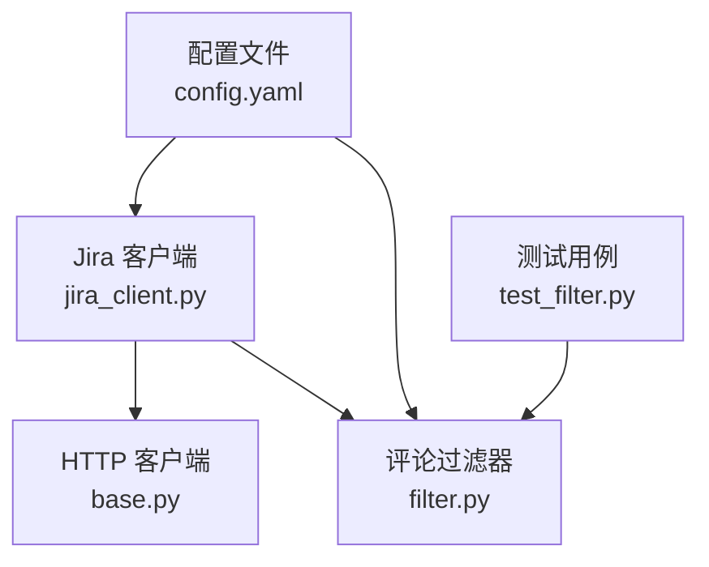
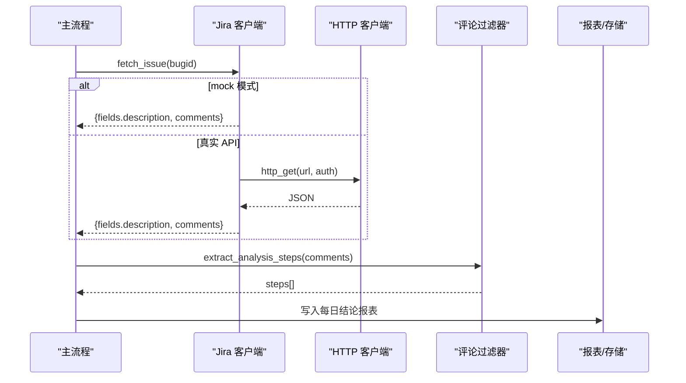
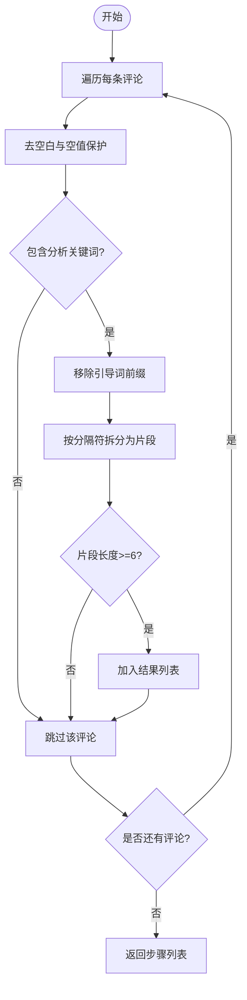
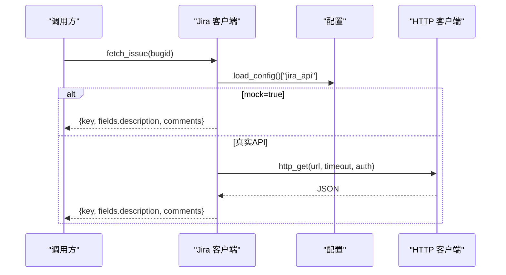
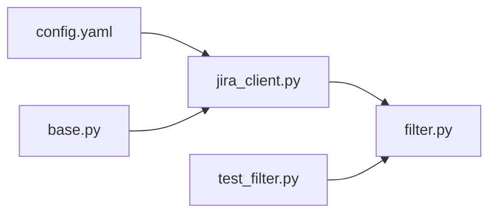

# 评论过滤器

<cite>
**本文引用的文件**
- [src/core/filter.py](file://src/core/filter.py)
- [src/clients/jira_client.py](file://src/clients/jira_client.py)
- [src/clients/base.py](file://src/clients/base.py)
- [config/config.yaml](file://config/config.yaml)
- [tests/test_filter.py](file://tests/test_filter.py)
- [README.md](file://README.md)
</cite>

## 目录
1. [简介](#简介)
2. [项目结构](#项目结构)
3. [核心组件](#核心组件)
4. [架构总览](#架构总览)
5. [详细组件分析](#详细组件分析)
6. [依赖关系分析](#依赖关系分析)
7. [性能考量](#性能考量)
8. [故障排查指南](#故障排查指南)
9. [结论](#结论)
10. [附录](#附录)

## 简介
本模块负责从 Jira 评论中抽取“日志分析步骤”等有效信息，过滤掉日常沟通噪音，为后续与 AI 分析报告进行根因与步骤相似性比对提供高质量输入。当前实现采用“规则 + 关键词”的轻量策略，并预留了接入 LLM Agent 做语义提炼的扩展点。

## 项目结构
- 评论过滤位于 src/core/filter.py，提供统一的提取入口 extract_analysis_steps。
- Jira 数据获取由 src/clients/jira_client.py 完成，支持 mock 模式与真实 REST API 调用。
- HTTP 通用客户端封装在 src/clients/base.py，提供带重试与统一错误日志的 GET/POST。
- 配置集中在 config/config.yaml，包含 jira_api、ai_log_api、知识库接口、相似度阈值等。
- 测试用例位于 tests/test_filter.py，覆盖正常、空值与无分析评论场景。

图表来源
- [src/clients/jira_client.py:1-54](file://src/clients/jira_client.py#L1-L54)
- [src/clients/base.py:1-39](file://src/clients/base.py#L1-L39)
- [src/core/filter.py:1-49](file://src/core/filter.py#L1-L49)
- [config/config.yaml:19-27](file://config/config.yaml#L19-L27)
- [tests/test_filter.py:1-36](file://tests/test_filter.py#L1-L36)

章节来源
- [README.md:1-76](file://README.md#L1-L76)

## 核心组件
- 评论过滤：extract_analysis_steps(comments) 将原始评论列表清洗、筛选、拆分，输出结构化分析步骤列表。
- Jira 客户端：fetch_issue(bugid) 根据 bugid 拉取 issue（description、comments），支持 mock；extract_comments(issue) 提取评论列表。
- HTTP 客户端：http_get/http_post 提供超时、重试、统一错误日志。
- 配置：jira_api.mock/url/timeout/auth 等开关与参数。

章节来源
- [src/core/filter.py:1-49](file://src/core/filter.py#L1-L49)
- [src/clients/jira_client.py:1-54](file://src/clients/jira_client.py#L1-L54)
- [src/clients/base.py:1-39](file://src/clients/base.py#L1-L39)
- [config/config.yaml:19-27](file://config/config.yaml#L19-L27)

## 架构总览
评论过滤在整体流水线中的位置如下：AI 生成文档 → 拉取 Jira 评论 → 过滤出分析步骤 → 与文档步骤做相似性比对 → 写入每日报表。

图表来源
- [src/clients/jira_client.py:18-43](file://src/clients/jira_client.py#L18-L43)
- [src/clients/base.py:26-38](file://src/clients/base.py#L26-L38)
- [src/core/filter.py:29-48](file://src/core/filter.py#L29-L48)

## 详细组件分析

### 评论过滤器（filter.py）
- 功能目标：从 Jira 评论区评论中提取有效的“日志分析步骤”，过滤无关沟通内容。
- 关键机制：
  - 关键词匹配：使用一组与日志分析相关的关键词快速判定评论是否相关。
  - 前缀清理：去除“日志分析步骤：”“分析步骤：”“排查步骤：”“日志分析：”等引导词。
  - 文本拆分：按中英文分号、句号、换行切分为候选步骤片段。
  - 长度过滤：丢弃过短或纯序号片段，保留有意义的步骤。
  - 可扩展点：_agent_filter 占位函数，便于未来接入 LLM Agent 进行语义提炼。
- 复杂度：对 N 条评论，每条评论做一次关键词扫描、一次正则替换、一次分割与若干片段校验，时间复杂度近似 O(N·L)，空间复杂度 O(S)（S 为输出步骤数）。
- 错误处理：对 None/空字符串安全处理；未命中关键词直接跳过；异常由上层捕获。

图表来源
- [src/core/filter.py:19-48](file://src/core/filter.py#L19-L48)

章节来源
- [src/core/filter.py:1-49](file://src/core/filter.py#L1-L49)
- [tests/test_filter.py:1-36](file://tests/test_filter.py#L1-L36)

### Jira 客户端（jira_client.py）
- 功能目标：根据 bugid 获取 issue 的 description 与 comments，供后续分析与比对。
- Mock 支持：当配置开启 mock 时，返回内置样例数据，便于开发与测试。
- 真实 API：读取配置中的 url、username、token、timeout，通过 http_get 发起请求。
- 数据提取：extract_error_cause 与 extract_comments 分别提取报错原因与评论列表。

图表来源
- [src/clients/jira_client.py:18-43](file://src/clients/jira_client.py#L18-L43)
- [src/clients/base.py:26-38](file://src/clients/base.py#L26-L38)
- [config/config.yaml:19-27](file://config/config.yaml#L19-L27)

章节来源
- [src/clients/jira_client.py:1-54](file://src/clients/jira_client.py#L1-L54)
- [src/clients/base.py:1-39](file://src/clients/base.py#L1-L39)
- [config/config.yaml:19-27](file://config/config.yaml#L19-L27)

### HTTP 客户端（base.py）
- 功能目标：封装 requests 的 GET/POST，提供统一的重试次数、超时、错误日志。
- 重试策略：默认重试 3 次，记录每次失败原因，最终抛出运行时异常。
- 适用场景：Jira、AI 日志分析、知识库入库等外部接口调用。

章节来源
- [src/clients/base.py:1-39](file://src/clients/base.py#L1-L39)

### 配置（config.yaml）
- jira_api：mock 开关、url、timeout、认证字段。
- ai_log_api/knowledge_base_api：对应外部服务配置。
- similarity：步骤相似性阈值与根因命中比例阈值。
- audit：抽查抽样数量与文件路径。
- output：文档、报表、日志输出目录。

章节来源
- [config/config.yaml:1-63](file://config/config.yaml#L1-L63)

## 依赖关系分析
- filter.py 依赖配置模块的日志初始化，不直接依赖网络层。
- jira_client.py 依赖 base.py 的 http_get 与配置加载。
- 测试用例仅依赖 filter 模块，验证过滤逻辑的正确性与鲁棒性。

图表来源
- [src/clients/jira_client.py:1-54](file://src/clients/jira_client.py#L1-L54)
- [src/clients/base.py:1-39](file://src/clients/base.py#L1-L39)
- [src/core/filter.py:1-49](file://src/core/filter.py#L1-L49)
- [config/config.yaml:19-27](file://config/config.yaml#L19-L27)
- [tests/test_filter.py:1-36](file://tests/test_filter.py#L1-L36)

章节来源
- [src/core/filter.py:1-49](file://src/core/filter.py#L1-L49)
- [src/clients/jira_client.py:1-54](file://src/clients/jira_client.py#L1-L54)
- [src/clients/base.py:1-39](file://src/clients/base.py#L1-L39)
- [config/config.yaml:19-27](file://config/config.yaml#L19-L27)
- [tests/test_filter.py:1-36](file://tests/test_filter.py#L1-L36)

## 性能考量
- 时间复杂度：对 N 条评论，主要开销在于关键词匹配、正则替换与分割，整体近似线性。
- 内存占用：仅维护输出步骤列表，空间开销与有效步骤数量成正比。
- 批处理建议：
  - 批量传入评论列表，避免逐条调用带来的 Python 层循环开销。
  - 若评论量极大，可考虑分块处理（如每次处理 1000 条）以降低峰值内存。
- 正则优化：
  - 预编译正则表达式已在模块级定义，减少重复编译开销。
  - 可根据业务新增更多分隔符或前缀模式，保持单一职责与可维护性。
- 可扩展性：
  - _agent_filter 作为扩展点，可在高噪声环境下引入 LLM 做语义提炼，提升召回率与准确率。
  - 可通过配置化关键词与前缀模式，适配不同团队表达习惯。

[本节为通用性能指导，无需特定文件引用]

## 故障排查指南
- 无输出步骤：
  - 检查评论是否包含分析关键词；若无，则不会进入拆分流程。
  - 确认前缀是否正确匹配；若格式不一致，需调整 PREFIX_PATTERN。
- 步骤过短被过滤：
  - 当前要求片段长度至少为 6；若业务允许更短片段，可调整长度阈值。
- Jira 数据为空：
  - 检查 jira_api.mock 是否为 true；若为 false，确认 url、username、token、timeout 配置正确。
  - 查看 HTTP 客户端日志，确认是否存在网络错误或鉴权失败。
- 日志定位：
  - 使用 setup_logger 输出的控制台与文件日志，关注 filter、jira、http 三个命名空间。

章节来源
- [src/core/filter.py:19-48](file://src/core/filter.py#L19-L48)
- [src/clients/jira_client.py:18-43](file://src/clients/jira_client.py#L18-L43)
- [src/clients/base.py:12-38](file://src/clients/base.py#L12-L38)
- [config/config.yaml:19-27](file://config/config.yaml#L19-L27)

## 结论
评论过滤器以轻量规则与关键词为核心，实现了从 Jira 评论中高效抽取“日志分析步骤”的能力，并通过可扩展的 _agent_filter 为未来引入语义过滤预留空间。配合 Jira 客户端与 HTTP 通用封装，形成稳定可靠的数据获取与处理链路，满足日常自动化比对与报表生成的需求。

[本节为总结性内容，无需特定文件引用]

## 附录

### 正则表达式与解析规则
- 关键词集合：用于快速判断评论是否与日志分析相关。
- 分隔符模式：按中英文分号、句号、换行拆分步骤片段。
- 前缀模式：去除“日志分析步骤：”“分析步骤：”“排查步骤：”“日志分析：”等引导词。
- 长度阈值：过滤过短片段，降低噪音。

章节来源
- [src/core/filter.py:11-16](file://src/core/filter.py#L11-L16)

### 与 Jira API 的集成方式
- Mock 模式：配置 jira_api.mock=true 时，返回内置样例数据，便于开发测试。
- 真实 API：配置 url、username、token、timeout，通过 http_get 获取 issue 的 description 与 comments。
- 数据提取：extract_comments(issue) 返回评论列表，供 filter 处理。

章节来源
- [src/clients/jira_client.py:18-53](file://src/clients/jira_client.py#L18-L53)
- [config/config.yaml:19-27](file://config/config.yaml#L19-L27)

### 过滤规则配置与自定义解析模式
- 关键词与前缀：可在 filter.py 中扩展 ANALYSIS_KEYWORDS 与 PREFIX_PATTERN，适配新表达。
- 长度阈值：可按业务需要调整最小片段长度。
- 扩展点：在 _agent_filter 中接入 LLM Agent，进行语义提炼与降噪。

章节来源
- [src/core/filter.py:11-26](file://src/core/filter.py#L11-L26)

### 错误处理机制
- 空值保护：对 None/空字符串安全处理，避免异常。
- 网络异常：HTTP 客户端统一重试与错误日志，最终抛出运行时异常。
- 日志记录：filter、jira、http 命名空间输出关键节点日志，便于问题定位。

章节来源
- [src/core/filter.py:35-47](file://src/core/filter.py#L35-L47)
- [src/clients/base.py:12-38](file://src/clients/base.py#L12-L38)

### 代码示例（路径引用）
- 基本用法：从评论列表提取分析步骤
  - [src/core/filter.py:29-48](file://src/core/filter.py#L29-L48)
- 单元测试：覆盖正常、空值与无分析评论场景
  - [tests/test_filter.py:9-35](file://tests/test_filter.py#L9-L35)
- Jira 数据获取：mock 与真实 API 切换
  - [src/clients/jira_client.py:18-43](file://src/clients/jira_client.py#L18-L43)