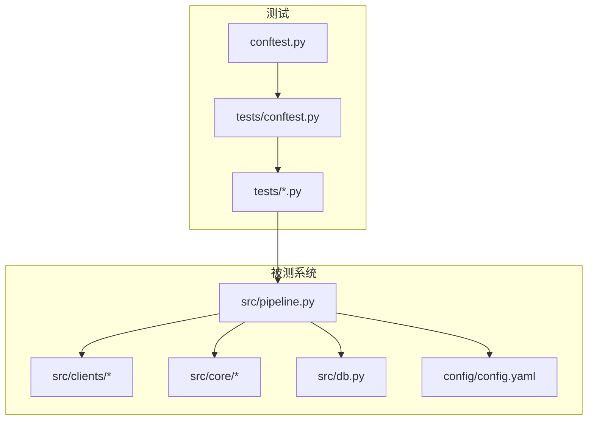
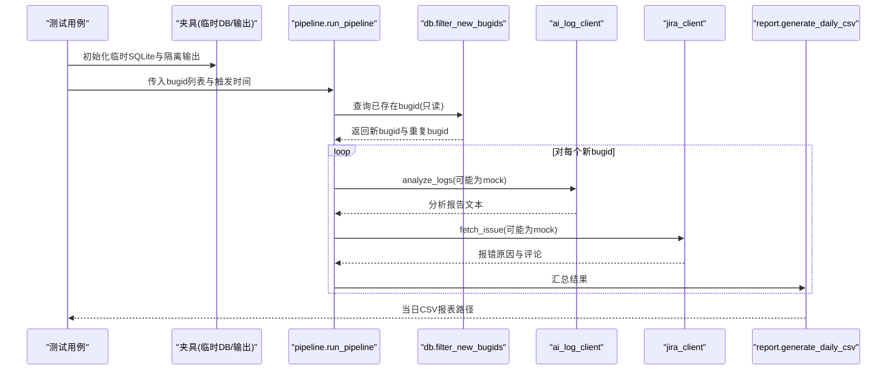
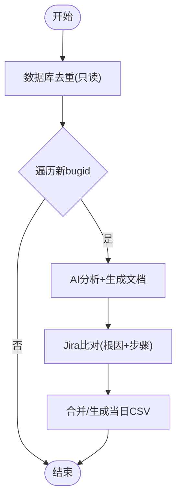
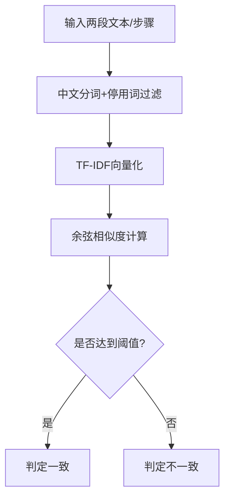
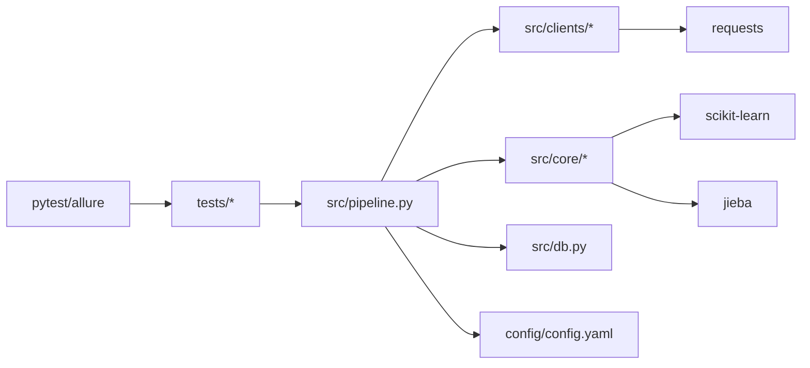

# 测试策略

<cite>
**本文引用的文件**
- [README.md](file://README.md)
- [requirements.txt](file://requirements.txt)
- [config/config.yaml](file://config/config.yaml)
- [conftest.py](file://conftest.py)
- [tests/conftest.py](file://tests/conftest.py)
- [tests/test_pipeline.py](file://tests/test_pipeline.py)
- [tests/test_similarity.py](file://tests/test_similarity.py)
- [tests/test_filter.py](file://tests/test_filter.py)
- [tests/test_db.py](file://tests/test_db.py)
- [tests/test_audit.py](file://tests/test_audit.py)
- [src/pipeline.py](file://src/pipeline.py)
- [src/core/similarity.py](file://src/core/similarity.py)
- [src/clients/base.py](file://src/clients/base.py)
</cite>

## 目录
1. [简介](#简介)
2. [项目结构](#项目结构)
3. [核心组件](#核心组件)
4. [架构总览](#架构总览)
5. [详细组件分析](#详细组件分析)
6. [依赖分析](#依赖分析)
7. [性能考虑](#性能考虑)
8. [故障排查指南](#故障排查指南)
9. [结论](#结论)
10. [附录](#附录)

## 简介
本测试策略文档面向“Bug 文档沉淀工具”的自动化测试体系，覆盖测试框架选择、测试组织、数据管理、测试类型（单元/集成/端到端）、Mock 策略、Allure 报告生成与解读、并行执行配置、持续集成中的执行与报告收集、调试技巧与常见问题排查。目标是让读者在不深入源码的情况下也能理解并维护该项目的质量保障体系。

## 项目结构
本项目采用分层与按功能模块组织的代码结构：
- src：业务实现（客户端封装、核心处理、数据库层、主流程编排）
- tests：pytest 用例与夹具
- config：全局配置（含 mock 开关、阈值、输出路径等）
- allure-results：pytest 运行产生的 Allure 原始结果
- docs/reports/logs：运行时产物（由测试隔离到临时目录）

图表来源
- [tests/conftest.py:1-34](file://tests/conftest.py#L1-L34)
- [conftest.py:1-6](file://conftest.py#L1-L6)
- [src/pipeline.py:1-105](file://src/pipeline.py#L1-L105)
- [config/config.yaml:1-63](file://config/config.yaml#L1-L63)

章节来源
- [README.md:52-76](file://README.md#L52-L76)
- [requirements.txt:1-9](file://requirements.txt#L1-L9)
- [config/config.yaml:1-63](file://config/config.yaml#L1-L63)

## 核心组件
- 测试夹具与隔离
  - 根级 conftest 确保 src 包可导入
  - tests/conftest 提供自动夹具：每个测试使用独立 SQLite 临时库与隔离的输出目录（docs/reports/logs），避免用例间污染
- 测试类型
  - 单元测试：相似性比对、评论过滤等纯函数逻辑
  - 集成测试：数据库只读去重、外部接口通过配置 mock 模式验证
  - 端到端测试：完整流程 run_pipeline、重试 retry_bug、手工入库 store_bug、随机抽查 audit
- 测试数据管理
  - 通过夹具将输出重定向到 tmp_path
  - 数据库层直接插入少量种子数据用于断言
  - 配置项中开启 mock 以屏蔽真实网络调用
- Allure 报告
  - 使用 @allure.feature/@allure.story 标注用例
  - pytest 命令 --alluredir=allure-results 生成结果，配合 allure serve 查看

章节来源
- [conftest.py:1-6](file://conftest.py#L1-L6)
- [tests/conftest.py:1-34](file://tests/conftest.py#L1-L34)
- [tests/test_similarity.py:1-72](file://tests/test_similarity.py#L1-L72)
- [tests/test_filter.py:1-36](file://tests/test_filter.py#L1-L36)
- [tests/test_db.py:1-54](file://tests/test_db.py#L1-L54)
- [tests/test_pipeline.py:1-83](file://tests/test_pipeline.py#L1-L83)
- [tests/test_audit.py:1-96](file://tests/test_audit.py#L1-L96)
- [README.md:52-60](file://README.md#L52-L60)

## 架构总览
下图展示了从测试到被测系统的调用关系，以及关键的外部依赖（AI/Jira/知识库）在测试中通过配置进入 mock 模式。

图表来源
- [tests/test_pipeline.py:19-47](file://tests/test_pipeline.py#L19-L47)
- [src/pipeline.py:18-86](file://src/pipeline.py#L18-L86)
- [config/config.yaml:10-35](file://config/config.yaml#L10-L35)

## 详细组件分析

### 端到端流程测试（test_pipeline）
- 目标：验证步骤1~3全部产出（去重、AI 分析、文档生成、Jira 比对、结论报表），并覆盖重试与手工入库场景
- 关键点
  - 批内重复 bugid 被过滤，最终报表仅包含唯一的新增 bugid
  - 成功用例的文档路径存在且文件名符合约定
  - 失败用例的步骤一致性判定为不一致
  - 工具不写数据库，仅生成文档与 CSV
  - 重试后报表按 bugid 覆盖更新，不产生重复行
  - store 仅推送已有文档，缺失时报错

图表来源
- [src/pipeline.py:54-86](file://src/pipeline.py#L54-L86)
- [tests/test_pipeline.py:19-83](file://tests/test_pipeline.py#L19-L83)

章节来源
- [tests/test_pipeline.py:1-83](file://tests/test_pipeline.py#L1-L83)
- [src/pipeline.py:1-105](file://src/pipeline.py#L1-L105)

### 相似性比对测试（test_similarity）
- 目标：验证文本余弦相似度、步骤集合相似度、根因关键词命中比例与阈值判定
- 关键点
  - 相同文本相似度接近 1；无关文本相似度较低
  - 空输入返回 0 分且不报错
  - judge_result 依据配置阈值判定一致/不一致

图表来源
- [src/core/similarity.py:17-75](file://src/core/similarity.py#L17-L75)
- [tests/test_similarity.py:1-72](file://tests/test_similarity.py#L1-L72)

章节来源
- [tests/test_similarity.py:1-72](file://tests/test_similarity.py#L1-L72)
- [src/core/similarity.py:1-75](file://src/core/similarity.py#L1-L75)

### 评论过滤测试（test_filter）
- 目标：验证仅提取日志分析相关评论，噪音评论被过滤；空/None 输入安全处理
- 关键点
  - 正确识别“日志分析步骤：...”格式并拆分步骤
  - 无分析类评论时返回空列表
  - 容错处理 None 与空字符串

章节来源
- [tests/test_filter.py:1-36](file://tests/test_filter.py#L1-L36)

### 数据库层测试（test_db）
- 目标：验证 bugid 只读去重查询的正确性与约束
- 关键点
  - 已存在的 bugid 被过滤，新的通过
  - 同一批输入中的重复也会被过滤
  - 工具不写入数据库，查询前后记录数不变

章节来源
- [tests/test_db.py:1-54](file://tests/test_db.py#L1-L54)

### 随机抽查复核测试（test_audit）
- 目标：验证抽样、排除已抽查、候选不足与空池异常
- 关键点
  - 生成审核表格，相似度指标符合预期
  - 已抽查记录同步写入 audited_bugids.csv
  - 下次抽查不再抽取已抽查过的 bugid
  - 候选耗尽或库为空时抛出异常

章节来源
- [tests/test_audit.py:1-96](file://tests/test_audit.py#L1-L96)

### Mock 策略与外部接口模拟
- 配置驱动
  - config/config.yaml 中 ai_log_api/jira_api/knowledge_base_api 均支持 mock: true，测试默认启用，避免真实网络调用
- HTTP 客户端封装
  - base.py 提供 http_post/http_get 统一超时、重试与错误日志
- 测试数据准备
  - 通过夹具将输出目录指向临时路径，避免污染真实 reports/docs/logs
  - 数据库层直接插入种子数据用于断言（如 kb_analysis 表）
- 断言方法
  - 使用 pandas 读取 CSV 断言列值与行数
  - 使用 os.path.exists 断言文件存在性
  - 使用 pytest.raises 断言异常路径

章节来源
- [config/config.yaml:10-35](file://config/config.yaml#L10-L35)
- [src/clients/base.py:1-39](file://src/clients/base.py#L1-L39)
- [tests/conftest.py:1-34](file://tests/conftest.py#L1-L34)
- [tests/test_pipeline.py:14-83](file://tests/test_pipeline.py#L14-L83)
- [tests/test_audit.py:15-35](file://tests/test_audit.py#L15-L35)

### Allure 测试报告生成与解读
- 生成方式
  - 运行命令：python -m pytest tests --alluredir=allure-results
  - 查看报告：allure serve allure-results
- 用例标注
  - @allure.feature/@allure.story 用于分类与故事化展示
- 报告内容
  - 测试结果统计、失败详情、附件（如有）、步骤与日志（可扩展）

章节来源
- [README.md:52-60](file://README.md#L52-L60)
- [tests/test_pipeline.py:19-21](file://tests/test_pipeline.py#L19-L21)
- [tests/test_similarity.py:7-9](file://tests/test_similarity.py#L7-L9)
- [tests/test_filter.py:7-9](file://tests/test_filter.py#L7-L9)
- [tests/test_db.py:16-18](file://tests/test_db.py#L16-L18)
- [tests/test_audit.py:38-40](file://tests/test_audit.py#L38-L40)

## 依赖分析
- 测试依赖
  - pytest、allure-pytest、pandas、SQLAlchemy、requests、scikit-learn、jieba、PyYAML
- 被测依赖
  - pipeline 依赖 db、clients、core、config
  - clients 封装 HTTP 请求，支持超时与重试
  - core 提供相似性、评论过滤、文档生成、报表、审计
  - config 提供全局配置与日志初始化

图表来源
- [requirements.txt:1-9](file://requirements.txt#L1-L9)
- [src/pipeline.py:1-15](file://src/pipeline.py#L1-L15)
- [src/clients/base.py:1-6](file://src/clients/base.py#L1-L6)
- [src/core/similarity.py:1-11](file://src/core/similarity.py#L1-L11)

章节来源
- [requirements.txt:1-9](file://requirements.txt#L1-L9)
- [src/pipeline.py:1-15](file://src/pipeline.py#L1-L15)

## 性能考虑
- 测试隔离与开销
  - 每个测试使用独立 SQLite 临时库与临时输出目录，避免磁盘竞争与数据污染
- 相似度计算
  - TF-IDF 向量构建与余弦相似度在小样本下开销可控；若数据量增大，可考虑缓存向量或批量计算
- 外部接口
  - 测试阶段启用 mock，避免网络延迟与不稳定；生产环境需合理设置 timeout 与 retries
- 并发执行
  - 由于夹具已将输出与数据库隔离，测试具备较好的并行安全性；可按需启用 pytest-xdist 进行并行加速

[本节为通用指导，无需特定文件引用]

## 故障排查指南
- 常见问题
  - 测试间数据污染：确认夹具 autouse 生效，输出目录与数据库路径指向临时位置
  - 外部接口调用失败：检查 config 中对应模块的 mock 开关是否为 true；必要时切换到真实接口并补充认证信息
  - 报告未生成：确认 generate_daily_csv 被调用且输出路径可写；检查权限与磁盘空间
  - 抽查候选不足：当可用候选少于请求数量时会返回实际可用数量；库为空则抛异常
- 调试技巧
  - 打印中间结果：在 pipeline 与 core 中增加日志，结合 allure 附件输出关键数据
  - 缩小范围：先运行单条用例定位问题，再逐步扩大范围
  - 断言细化：对 CSV 列名与数据类型进行断言，便于快速定位字段变更导致的失败

章节来源
- [tests/conftest.py:8-33](file://tests/conftest.py#L8-L33)
- [config/config.yaml:10-35](file://config/config.yaml#L10-L35)
- [src/pipeline.py:68-86](file://src/pipeline.py#L68-L86)
- [tests/test_audit.py:74-96](file://tests/test_audit.py#L74-L96)

## 结论
本项目构建了清晰的三层测试体系：单元测试保证核心算法正确性，集成测试验证数据库与外部接口的交互（通过 mock），端到端测试覆盖完整业务流程。借助夹具的数据隔离与配置驱动的 mock 策略，测试具备良好的稳定性与可维护性。Allure 报告提供了可视化的结果呈现，便于团队快速定位问题。建议在持续集成中固定运行命令与报告收集步骤，并结合并行执行提升效率。

[本节为总结性内容，无需特定文件引用]

## 附录

### 测试编写最佳实践
- 命名规范
  - 测试文件按模块划分，函数名体现测试意图（如 test_run_pipeline_end_to_end）
  - 使用 @allure.feature/@allure.story 进行分类与故事化
- 数据隔离
  - 所有持久化操作通过夹具隔离到临时目录与临时数据库
  - 需要种子数据的场景，在测试内部创建最小数据集
- 并行执行
  - 当前夹具设计支持并行；如需加速，可使用 pytest-xdist 并避免共享状态
- 断言策略
  - 优先断言关键业务结果（如 CSV 列值、文件存在性、异常类型）
  - 对边界条件（空输入、候选不足、库为空）进行显式断言

章节来源
- [tests/test_pipeline.py:19-83](file://tests/test_pipeline.py#L19-L83)
- [tests/test_similarity.py:7-72](file://tests/test_similarity.py#L7-L72)
- [tests/test_filter.py:7-36](file://tests/test_filter.py#L7-L36)
- [tests/test_db.py:16-54](file://tests/test_db.py#L16-L54)
- [tests/test_audit.py:38-96](file://tests/test_audit.py#L38-L96)

### 持续集成中的测试执行与报告收集
- 安装依赖
  - pip install -r requirements.txt
- 运行测试
  - python -m pytest tests --alluredir=allure-results
- 生成报告
  - allure serve allure-results（本地查看）
  - CI 中可将 allure-results 作为工件归档，供后续查看

章节来源
- [README.md:52-60](file://README.md#L52-L60)
- [requirements.txt:1-9](file://requirements.txt#L1-L9)