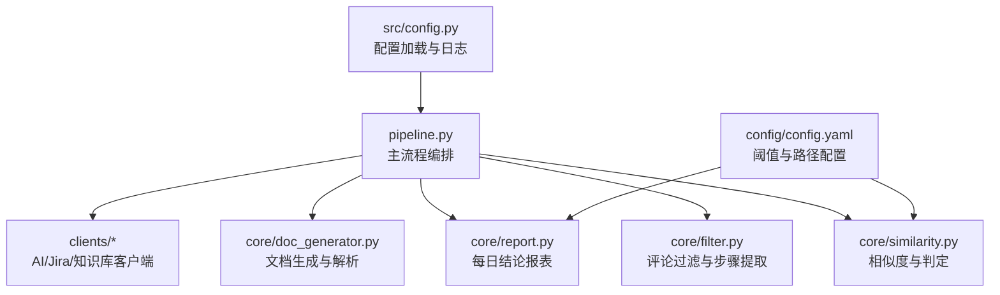
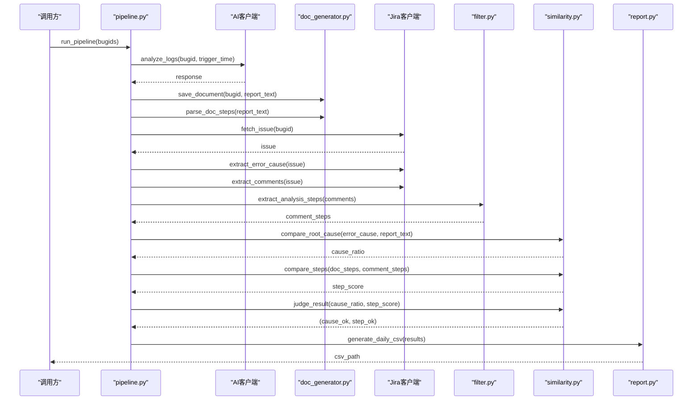
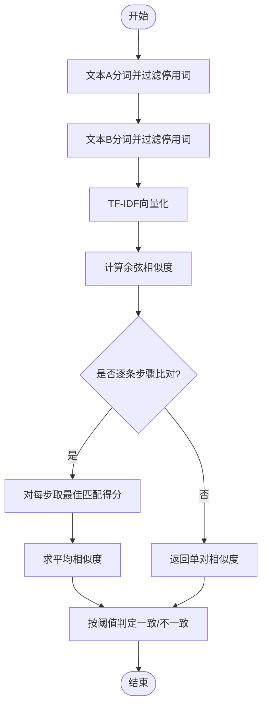
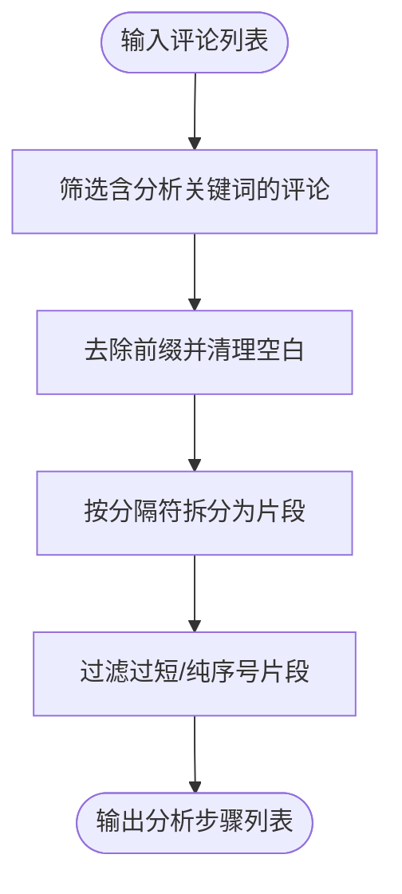
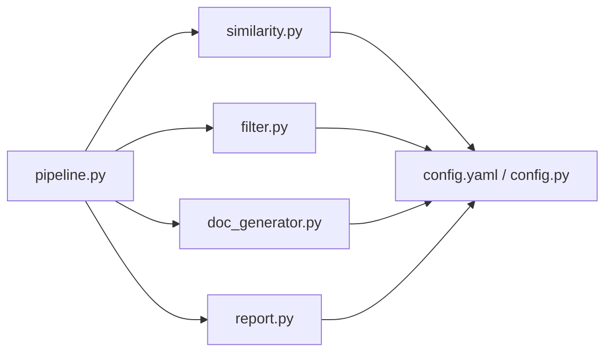

# 分析逻辑扩展

<cite>
**本文引用的文件**
- [similarity.py](file://src/core/similarity.py)
- [filter.py](file://src/core/filter.py)
- [doc_generator.py](file://src/core/doc_generator.py)
- [pipeline.py](file://src/pipeline.py)
- [report.py](file://src/core/report.py)
- [config.yaml](file://config/config.yaml)
- [config.py](file://src/config.py)
- [test_similarity.py](file://tests/test_similarity.py)
- [test_filter.py](file://tests/test_filter.py)
- [README.md](file://README.md)
</cite>

## 目录
1. [简介](#简介)
2. [项目结构](#项目结构)
3. [核心组件](#核心组件)
4. [架构总览](#架构总览)
5. [详细组件分析](#详细组件分析)
6. [依赖关系分析](#依赖关系分析)
7. [性能优化建议](#性能优化建议)
8. [故障排查指南](#故障排查指南)
9. [结论](#结论)
10. [附录：扩展示例与测试方法](#附录扩展示例与测试方法)

## 简介
本文件面向“分析逻辑扩展”，聚焦以下目标：
- 如何扩展相似度算法以支持不同的比对策略
- 详细说明 TF-IDF 向量化与余弦相似度的实现原理
- 解释如何自定义根因关键词匹配规则（含权重设置、模糊匹配）
- 说明如何扩展评论过滤器以支持新的分析步骤提取模式
- 提供具体扩展示例：新增相似度计算方法、自定义过滤规则、扩展文档生成模板
- 给出算法性能优化建议与测试方法

## 项目结构
本项目围绕“AI 日志分析 → 文档生成 → Jira 评论/报错原因比对 → 结论报表”的主流程组织代码，核心扩展点集中在 similarity、filter、doc_generator 三个模块，并通过 pipeline 串联。

图表来源
- [pipeline.py:18-51](file://src/pipeline.py#L18-L51)
- [similarity.py:23-74](file://src/core/similarity.py#L23-L74)
- [filter.py:29-48](file://src/core/filter.py#L29-L48)
- [doc_generator.py:14-40](file://src/core/doc_generator.py#L14-L40)
- [report.py:46-65](file://src/core/report.py#L46-L65)
- [config.yaml:37-62](file://config/config.yaml#L37-L62)
- [config.py:17-58](file://src/config.py#L17-L58)

章节来源
- [README.md:7-13](file://README.md#L7-L13)
- [pipeline.py:1-105](file://src/pipeline.py#L1-L105)

## 核心组件
- 相似度模块（similarity.py）
  - 文本分词与停用词过滤
  - TF-IDF 向量化与余弦相似度计算
  - 步骤级逐条最佳匹配求平均
  - 根因关键词命中比例计算
  - 基于配置的阈值判定
- 评论过滤模块（filter.py）
  - 关键词识别分析类评论
  - 前缀去除与分隔符拆分
  - 预留 Agent 过滤接口
- 文档生成模块（doc_generator.py）
  - 按日期与 bugid 生成 Markdown 文档
  - 从报告文本解析带序号的步骤行
  - 读取与查找最新文档
- 主流程（pipeline.py）
  - 串联 AI 分析、文档生成、Jira 数据获取、相似度比对、结论报表生成
- 报表模块（report.py）
  - 将内存结果写入当日 CSV，同 bugid 覆盖合并
- 配置（config.yaml, config.py）
  - 相似度阈值、输出路径、外部接口开关等

章节来源
- [similarity.py:1-75](file://src/core/similarity.py#L1-L75)
- [filter.py:1-49](file://src/core/filter.py#L1-L49)
- [doc_generator.py:1-79](file://src/core/doc_generator.py#L1-L79)
- [pipeline.py:1-105](file://src/pipeline.py#L1-L105)
- [report.py:1-66](file://src/core/report.py#L1-L66)
- [config.yaml:1-63](file://config/config.yaml#L1-L63)
- [config.py:1-59](file://src/config.py#L1-L59)

## 架构总览
下图展示了单次 bugid 分析的端到端调用链，包括 AI 分析、文档生成、Jira 数据抽取、相似度比对与报表落盘。

图表来源
- [pipeline.py:18-86](file://src/pipeline.py#L18-L86)
- [doc_generator.py:14-40](file://src/core/doc_generator.py#L14-L40)
- [filter.py:29-48](file://src/core/filter.py#L29-L48)
- [similarity.py:34-74](file://src/core/similarity.py#L34-L74)
- [report.py:46-65](file://src/core/report.py#L46-L65)

## 详细组件分析

### 相似度模块（TF-IDF 与余弦相似度）
- 分词与停用词
  - 使用中文分词器对输入文本进行切分，过滤长度小于 2 的词与常见停用词，提升向量质量。
- TF-IDF 向量化
  - 将两段文本分别分词后，通过 TF-IDF 向量化得到稀疏向量表示，捕捉词频与逆文档频率信息。
- 余弦相似度
  - 对两个向量计算余弦相似度，取值范围 0~1，值越大表示语义越接近。
- 步骤级比对
  - 对文档中的每条步骤，在评论步骤中取最高相似度作为该步得分，再对所有步骤求平均，得到整体步骤相似度。
- 根因关键词匹配
  - 对报错原因进行分词去重，统计在文档中命中的关键词比例。
- 阈值判定
  - 根据配置文件中的阈值，判断根因一致与步骤一致。

图表来源
- [similarity.py:17-31](file://src/core/similarity.py#L17-L31)
- [similarity.py:34-49](file://src/core/similarity.py#L34-L49)
- [similarity.py:52-74](file://src/core/similarity.py#L52-L74)

章节来源
- [similarity.py:1-75](file://src/core/similarity.py#L1-L75)
- [config.yaml:37-42](file://config/config.yaml#L37-L42)

### 评论过滤模块（可扩展的提取模式）
- 关键词识别
  - 仅处理包含“日志分析/分析步骤/排查步骤/根因/定位”等关键词的评论。
- 前缀去除与分割
  - 去除引导词前缀（如“日志分析步骤：”），按中英文分号、句号、换行分割为多个片段。
- 噪声过滤
  - 过滤过短片段与纯序号片段，保留有意义的步骤文本。
- 扩展点
  - 预留 _agent_filter 占位函数，可接入 LLM Agent 做语义提炼或更复杂的清洗。

图表来源
- [filter.py:19-48](file://src/core/filter.py#L19-L48)

章节来源
- [filter.py:1-49](file://src/core/filter.py#L1-L49)

### 文档生成模块（可扩展的模板与解析）
- 文档保存
  - 按日期创建子目录，以 bugid 命名 Markdown 文件。
- 步骤解析
  - 正则匹配带序号的行（如“1. 查看服务错误日志”），提取步骤内容。
- 结论段落解析
  - 从“## 根因结论”标题起捕获至下一标题前的内容。
- 扩展点
  - 可在保存前对报告文本进行模板化替换或结构化增强；也可扩展更多解析规则以适配不同报告格式。

章节来源
- [doc_generator.py:1-79](file://src/core/doc_generator.py#L1-L79)

### 主流程与报表
- 主流程
  - 依次执行：AI 分析 → 文档生成 → Jira 数据抽取 → 相似度比对 → 结论判定 → 报表生成。
  - 单个 bug 失败不中断整体流程，记录失败结果到报表。
- 报表
  - 生成当日 CSV，列名采用中文表头；同日多次运行按 bugid 覆盖合并。

章节来源
- [pipeline.py:18-105](file://src/pipeline.py#L18-L105)
- [report.py:15-65](file://src/core/report.py#L15-L65)

## 依赖关系分析
- similarity.py 依赖 jieba、sklearn 进行分词与相似度计算，依赖 config 加载阈值。
- filter.py 依赖正则表达式与配置日志。
- doc_generator.py 依赖 os、re、datetime 与配置路径。
- pipeline.py 依赖 db、clients、core 各模块与配置日志。
- report.py 依赖 pandas 与配置路径。

图表来源
- [similarity.py:9-11](file://src/core/similarity.py#L9-L11)
- [filter.py:7-9](file://src/core/filter.py#L7-L9)
- [doc_generator.py:6-8](file://src/core/doc_generator.py#L6-L8)
- [pipeline.py:8-13](file://src/pipeline.py#L8-L13)
- [report.py:9-13](file://src/core/report.py#L9-L13)
- [config.yaml:37-62](file://config/config.yaml#L37-L62)
- [config.py:17-58](file://src/config.py#L17-L58)

章节来源
- [pipeline.py:1-105](file://src/pipeline.py#L1-L105)

## 性能优化建议
- 分词与停用词
  - 复用分词结果与停用词集合，避免重复构建；对高频文本可缓存分词结果。
- TF-IDF 向量化
  - 批量向量化优于逐对计算；当步骤数量较大时，考虑预训练词表与固定维度以减少 fit_transform 开销。
  - 对稀疏矩阵进行内存友好操作，必要时降维或限制最大特征数。
- 相似度计算
  - 对大量步骤对，可采用近似最近邻或索引加速（如 FAISS）替代全量余弦计算。
- 评论过滤
  - 将正则编译对象缓存；对长评论先做快速关键词命中再进入复杂处理。
- 文档解析
  - 对大文档流式解析，减少一次性读入内存；对步骤行解析可使用增量扫描。
- 报表写入
  - 使用 pandas 的 append/concat 批量写入，避免频繁 I/O；注意编码 utf-8-sig 兼容 Excel。

[本节为通用性能指导，不直接分析具体文件]

## 故障排查指南
- 相似度为 0
  - 检查输入是否为空或分词后为空；确认停用词未过度过滤导致无有效词。
  - 参考路径：[similarity.py:23-31](file://src/core/similarity.py#L23-L31)
- 步骤比对异常低
  - 检查评论过滤是否正确提取步骤；确认分隔符与前缀处理是否符合实际评论格式。
  - 参考路径：[filter.py:29-48](file://src/core/filter.py#L29-L48)
- 根因命中比例异常
  - 检查报错原因分词与去重逻辑；确认文档文本是否包含预期关键词。
  - 参考路径：[similarity.py:52-66](file://src/core/similarity.py#L52-L66)
- 文档未找到
  - 确认文档生成路径与 bugid 命名；检查 find_latest_document 是否能定位到最新文档。
  - 参考路径：[doc_generator.py:67-79](file://src/core/doc_generator.py#L67-L79)
- 报表合并问题
  - 检查同日多次运行时的 bugid 覆盖逻辑；确认 CSV 编码与表头一致性。
  - 参考路径：[report.py:56-62](file://src/core/report.py#L56-L62)

章节来源
- [similarity.py:23-74](file://src/core/similarity.py#L23-L74)
- [filter.py:29-48](file://src/core/filter.py#L29-L48)
- [doc_generator.py:67-79](file://src/core/doc_generator.py#L67-L79)
- [report.py:56-62](file://src/core/report.py#L56-L62)

## 结论
- 当前相似度模块已具备 TF-IDF+余弦相似度与根因关键词匹配能力，并通过配置阈值进行一致/不一致判定。
- 评论过滤模块提供了可扩展的 Agent 接口，便于后续引入更智能的语义提炼。
- 文档生成与解析支持按日期与 bugid 管理，并支持步骤与结论段落的结构化提取。
- 主流程将各环节串联，保证失败隔离与结论报表落地。
- 扩展方向明确：相似度算法、过滤规则、文档模板均可按需定制与增强。

[本节为总结性内容，不直接分析具体文件]

## 附录：扩展示例与测试方法

### 扩展示例一：新增相似度计算方法
- 目标
  - 在不破坏现有逻辑的前提下，新增一种相似度计算方法（例如基于词重叠的 Jaccard 或基于嵌入的相似度）。
- 实现要点
  - 在 similarity.py 中新增函数 compute_new_similarity(text_a, text_b)，保持输入输出与 cosine_of_texts 一致。
  - 在 compare_steps 中增加策略选择（可通过配置项切换），对新方法进行批量化与缓存优化。
  - 在 judge_result 中可引入新方法的阈值配置。
- 配置扩展
  - 在 config.yaml 的 similarity 节点下新增 method 与对应阈值字段。
- 测试方法
  - 新增单元测试用例，验证相同文本得分为高、无关文本得分为低；对比新旧方法在不同语料上的稳定性。
  - 参考路径：[test_similarity.py:7-72](file://tests/test_similarity.py#L7-L72)

章节来源
- [similarity.py:23-74](file://src/core/similarity.py#L23-L74)
- [config.yaml:37-42](file://config/config.yaml#L37-L42)
- [test_similarity.py:7-72](file://tests/test_similarity.py#L7-L72)

### 扩展示例二：自定义过滤规则
- 目标
  - 扩展评论过滤以支持新的分析步骤提取模式（例如支持“排查步骤：”前缀、支持表格形式的步骤描述）。
- 实现要点
  - 在 filter.py 中扩展 ANALYSIS_KEYWORDS 与 PREFIX_PATTERN，适配新前缀与分隔符。
  - 在 _agent_filter 中接入 LLM Agent，进行语义提炼、去噪与标准化。
  - 增加对表格/列表格式的解析分支，确保步骤片段长度与语义完整性。
- 测试方法
  - 新增测试用例覆盖新前缀、新分隔符与噪声评论场景。
  - 参考路径：[test_filter.py:7-36](file://tests/test_filter.py#L7-L36)

章节来源
- [filter.py:11-48](file://src/core/filter.py#L11-L48)
- [test_filter.py:7-36](file://tests/test_filter.py#L7-L36)

### 扩展示例三：扩展文档生成模板
- 目标
  - 支持多种报告格式，自动识别并提取步骤与结论段落。
- 实现要点
  - 在 doc_generator.py 中新增多模式解析器，支持不同标题结构与步骤标记。
  - 在 save_document 前插入模板渲染环节，统一输出格式。
  - 扩展 parse_conclusion 以支持多标题层级与不同结论标识。
- 测试方法
  - 针对多种报告样例构造测试，验证步骤与结论提取的正确性与鲁棒性。
  - 参考路径：[doc_generator.py:14-57](file://src/core/doc_generator.py#L14-L57)

章节来源
- [doc_generator.py:14-57](file://src/core/doc_generator.py#L14-L57)

### 测试方法与覆盖率建议
- 单元测试
  - 相似度：覆盖相同/不同文本、空输入、边界阈值场景。
  - 过滤：覆盖噪音评论、无前缀、多分隔符、空列表与 None。
  - 文档：覆盖多格式步骤行、结论段落边界、文件不存在异常。
- 集成测试
  - 通过 pipeline.run_pipeline 模拟完整流程，验证端到端结果与报表合并。
- Allure 报告
  - 使用 pytest --alluredir=allure-results 生成可视化报告，便于回归与审计。
  - 参考路径：[README.md:52-60](file://README.md#L52-L60)

章节来源
- [test_similarity.py:7-72](file://tests/test_similarity.py#L7-L72)
- [test_filter.py:7-36](file://tests/test_filter.py#L7-L36)
- [README.md:52-60](file://README.md#L52-L60)