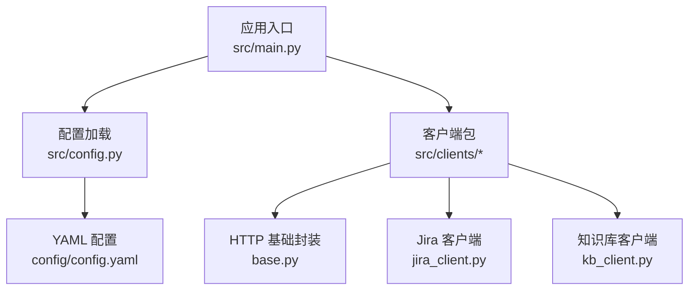
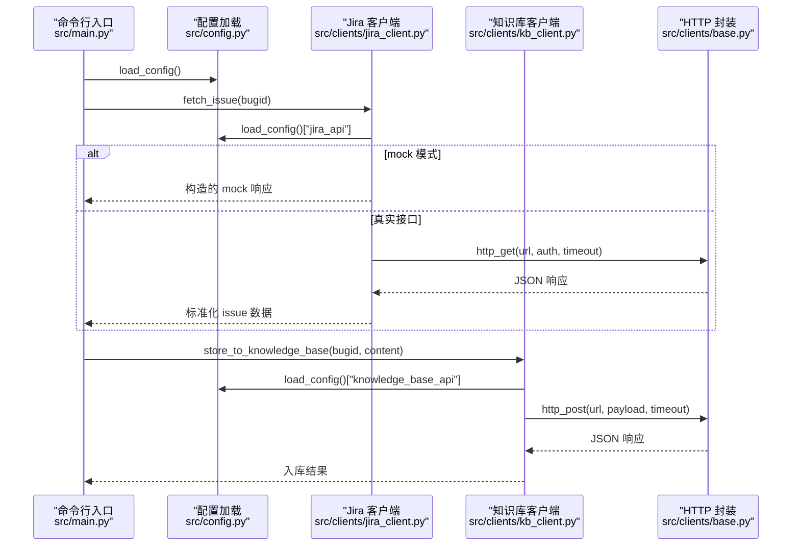
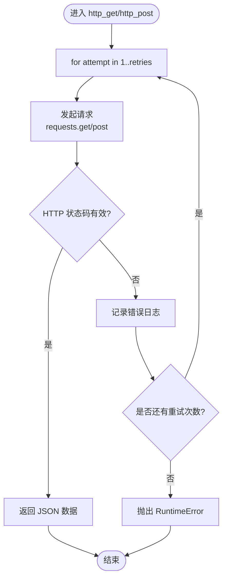
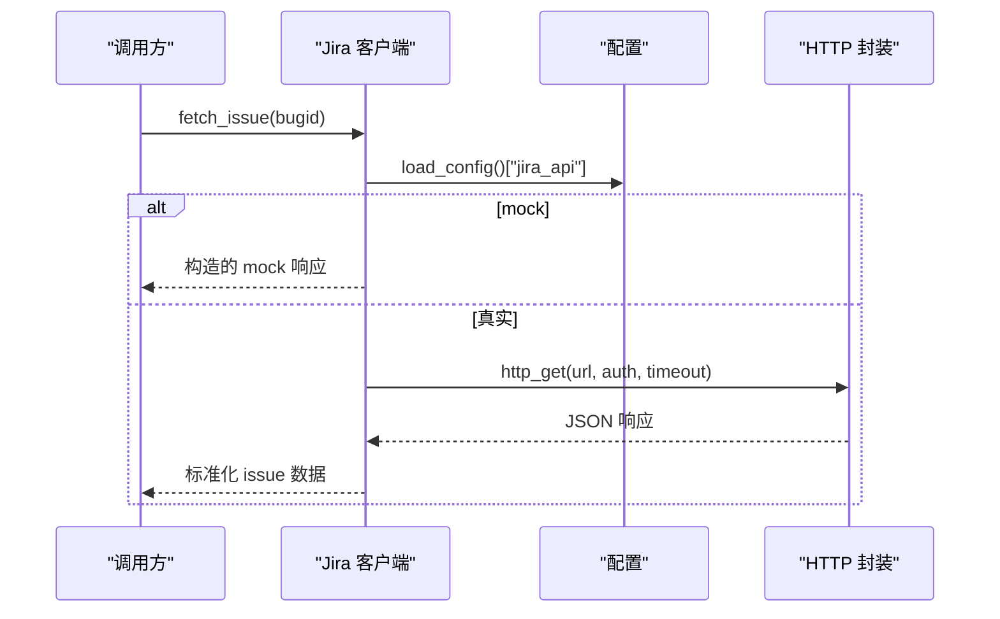
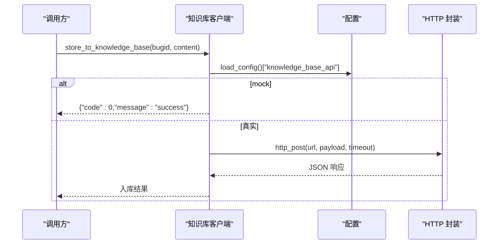
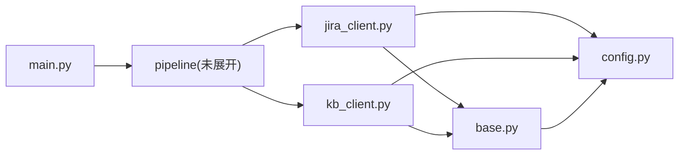

# 外部接口扩展

<cite>
**本文引用的文件**
- [src/clients/base.py](file://src/clients/base.py)
- [src/clients/jira_client.py](file://src/clients/jira_client.py)
- [src/clients/kb_client.py](file://src/clients/kb_client.py)
- [src/config.py](file://src/config.py)
- [config/config.yaml](file://config/config.yaml)
- [src/main.py](file://src/main.py)
- [tests/test_pipeline.py](file://tests/test_pipeline.py)
</cite>

## 目录
1. [简介](#简介)
2. [项目结构](#项目结构)
3. [核心组件](#核心组件)
4. [架构总览](#架构总览)
5. [详细组件分析](#详细组件分析)
6. [依赖关系分析](#依赖关系分析)
7. [性能与连接池建议](#性能与连接池建议)
8. [故障排查指南](#故障排查指南)
9. [结论](#结论)
10. [附录：新增客户端步骤与示例](#附录新增客户端步骤与示例)

## 简介
本文件面向需要在现有系统中扩展“外部服务客户端”的开发者，目标是说明如何通过继承 base.Client 类（当前以函数式 HTTP 封装为基座）添加新的外部服务支持；并详细说明 HTTP 客户端的封装机制（重试策略、超时处理、错误日志记录），以及如何扩展现有的 Jira 客户端或知识库客户端（API 端点配置、认证方式、数据格式转换）。文档还包含如何添加一个新外部服务客户端的完整流程（请求构造、响应处理、异常处理）、工厂模式与依赖注入的最佳实践建议，以及连接池管理、性能优化与安全考虑。

## 项目结构
- 客户端层位于 src/clients，提供通用 HTTP 封装与具体服务客户端（Jira、知识库等）。
- 配置层位于 src/config.py，负责加载 YAML 配置与初始化日志。
- 配置文件位于 config/config.yaml，集中管理各外部服务的 URL、超时、认证字段映射等。
- 入口与命令分发在 src/main.py，用于驱动整体流程。
- 测试用例在 tests/test_pipeline.py，覆盖端到端流程与手工入库场景。

图表来源
- [src/main.py:1-111](file://src/main.py#L1-L111)
- [src/config.py:1-59](file://src/config.py#L1-L59)
- [src/clients/base.py:1-39](file://src/clients/base.py#L1-L39)
- [src/clients/jira_client.py:1-54](file://src/clients/jira_client.py#L1-L54)
- [src/clients/kb_client.py:1-24](file://src/clients/kb_client.py#L1-L24)
- [config/config.yaml:1-63](file://config/config.yaml#L1-L63)

章节来源
- [src/main.py:1-111](file://src/main.py#L1-L111)
- [src/config.py:1-59](file://src/config.py#L1-L59)
- [config/config.yaml:1-63](file://config/config.yaml#L1-L63)

## 核心组件
- HTTP 基础封装（base.py）
  - 提供 http_get/http_post，统一实现重试、超时、错误日志记录与 JSON 返回。
  - 默认重试次数为 3，可通过参数覆盖。
- Jira 客户端（jira_client.py）
  - 根据 bugid 获取 issue 信息，支持 mock 模式与真实 API 调用。
  - 支持 Basic Auth（username/token）从配置读取。
  - 提供 extract_error_cause/extract_comments 等数据提取方法。
- 知识库客户端（kb_client.py）
  - 将分析结果推送到知识库接口，支持 mock 模式。
  - 通过配置映射 bugid/content 字段名，便于对接不同后端。
- 配置与日志（config.py + config.yaml）
  - 全局加载 YAML 配置，缓存避免重复 IO。
  - 按日期归档日志到 logs 目录，控制台与文件双输出。

章节来源
- [src/clients/base.py:1-39](file://src/clients/base.py#L1-L39)
- [src/clients/jira_client.py:1-54](file://src/clients/jira_client.py#L1-L54)
- [src/clients/kb_client.py:1-24](file://src/clients/kb_client.py#L1-L24)
- [src/config.py:1-59](file://src/config.py#L1-L59)
- [config/config.yaml:1-63](file://config/config.yaml#L1-L63)

## 架构总览
系统采用“配置驱动 + 客户端分层”的架构：
- 配置层：YAML 集中管理各外部服务地址、超时、认证、字段映射等。
- 客户端层：每个外部服务一个模块，复用 base 提供的 HTTP 能力，专注业务逻辑（如数据解析、mock 切换）。
- 入口层：main.py 提供 CLI 子命令，驱动 pipeline 与客户端协作。

图表来源
- [src/main.py:1-111](file://src/main.py#L1-L111)
- [src/config.py:1-59](file://src/config.py#L1-L59)
- [src/clients/jira_client.py:1-54](file://src/clients/jira_client.py#L1-L54)
- [src/clients/kb_client.py:1-24](file://src/clients/kb_client.py#L1-L24)
- [src/clients/base.py:1-39](file://src/clients/base.py#L1-L39)

## 详细组件分析

### HTTP 基础封装（base.py）
- 重试策略
  - 使用 for 循环进行固定次数重试（默认 3 次），每次失败记录错误日志并继续尝试。
  - 最终仍失败则抛出 RuntimeError，携带最后一次错误信息。
- 超时处理
  - GET/POST 均接受 timeout 参数，默认 30 秒，避免阻塞。
- 错误日志记录
  - 使用统一的 logger（http），记录每次失败的 URL、尝试次数与异常详情。
- 返回值约定
  - 成功时返回 response.json()，调用方无需再处理 HTTP 状态码。

图表来源
- [src/clients/base.py:12-38](file://src/clients/base.py#L12-L38)

章节来源
- [src/clients/base.py:1-39](file://src/clients/base.py#L1-L39)

### Jira 客户端（jira_client.py）
- 功能职责
  - 根据 bugid 获取 issue 信息，支持 mock 模式快速验证。
  - 提供 extract_error_cause/extract_comments 等数据提取方法。
- 认证方式
  - 当配置中存在 username 与 token 时，使用 Basic Auth 调用真实接口。
- 数据格式转换
  - 将原始 issue 数据转换为上层需要的结构化字段（description、comments）。
- Mock 策略
  - 当配置 jira_api.mock=true 时，直接返回内置的 mock 数据，便于测试与演示。

图表来源
- [src/clients/jira_client.py:18-43](file://src/clients/jira_client.py#L18-L43)
- [src/clients/base.py:26-38](file://src/clients/base.py#L26-L38)
- [config/config.yaml:19-27](file://config/config.yaml#L19-L27)

章节来源
- [src/clients/jira_client.py:1-54](file://src/clients/jira_client.py#L1-L54)
- [config/config.yaml:19-27](file://config/config.yaml#L19-L27)

### 知识库客户端（kb_client.py）
- 功能职责
  - 将分析文档内容推送到知识库接口，支持 mock 模式。
- 配置驱动
  - 通过 knowledge_base_api.url、timeout、bugid_field、content_field 控制行为。
- 数据格式转换
  - 将内部数据结构映射为接口所需字段名，便于对接不同后端。

图表来源
- [src/clients/kb_client.py:8-23](file://src/clients/kb_client.py#L8-L23)
- [src/clients/base.py:12-23](file://src/clients/base.py#L12-L23)
- [config/config.yaml:29-35](file://config/config.yaml#L29-L35)

章节来源
- [src/clients/kb_client.py:1-24](file://src/clients/kb_client.py#L1-L24)
- [config/config.yaml:29-35](file://config/config.yaml#L29-L35)

### 配置与日志（config.py + config.yaml）
- 配置加载
  - 全局缓存 _CONFIG，避免重复 IO。
  - 支持指定自定义配置文件路径。
- 日志初始化
  - 控制台与文件双输出，按日期归档到 logs 目录。
  - 各客户端通过 setup_logger(name) 获得独立命名空间日志。

章节来源
- [src/config.py:1-59](file://src/config.py#L1-L59)
- [config/config.yaml:1-63](file://config/config.yaml#L1-L63)

## 依赖关系分析
- main.py 依赖配置与数据库、pipeline，但不直接依赖具体客户端。
- 各客户端模块依赖 base 的 HTTP 封装与 config 的配置加载。
- 测试覆盖端到端流程，验证 mock 模式下行为正确性。

图表来源
- [src/main.py:1-111](file://src/main.py#L1-L111)
- [src/clients/jira_client.py:1-54](file://src/clients/jira_client.py#L1-L54)
- [src/clients/kb_client.py:1-24](file://src/clients/kb_client.py#L1-L24)
- [src/clients/base.py:1-39](file://src/clients/base.py#L1-L39)
- [src/config.py:1-59](file://src/config.py#L1-L59)

章节来源
- [src/main.py:1-111](file://src/main.py#L1-L111)
- [tests/test_pipeline.py:1-83](file://tests/test_pipeline.py#L1-L83)

## 性能与连接池建议
- 连接池管理
  - 当前 requests 默认会话会复用底层连接，但建议在高频调用场景显式创建 Session 并设置 ConnectionPool，减少握手开销。
  - 可结合 urllib3 的 PoolManager 调整 maxsize、block、timeout 等参数。
- 超时与重试
  - 合理设置 connect_timeout、read_timeout，避免长尾请求拖慢整体吞吐。
  - 对幂等 GET 请求可使用指数退避重试；非幂等 POST 需谨慎重试。
- 并发与限流
  - 使用线程池或异步 I/O（如 aiohttp）提升并发度，同时对外部服务实施限流保护。
- 资源回收
  - 确保 Session.close() 被调用，避免连接泄漏。
- 监控与度量
  - 增加指标采集（请求耗时、成功率、错误类型分布），便于定位瓶颈。

[本节为通用指导，不直接分析具体文件]

## 故障排查指南
- 常见问题
  - 网络超时：检查 timeout 配置与目标服务可用性。
  - 认证失败：确认 username/token 是否正确，必要时启用调试日志。
  - 重试耗尽：查看错误日志中“第 N 次请求失败”的记录，定位根因。
- 日志定位
  - 使用 setup_logger(name) 输出的日志，按模块区分（http、jira、kb 等）。
  - 日志文件位于 logs/app_YYYY-MM-DD.log，便于回溯。
- 测试验证
  - 在 mock 模式下验证客户端逻辑，再切换到真实接口逐步排查。

章节来源
- [src/config.py:37-58](file://src/config.py#L37-L58)
- [src/clients/base.py:12-38](file://src/clients/base.py#L12-L38)
- [src/clients/jira_client.py:32-43](file://src/clients/jira_client.py#L32-L43)
- [src/clients/kb_client.py:8-23](file://src/clients/kb_client.py#L8-L23)

## 结论
本项目通过 base 的 HTTP 封装实现了统一的重试、超时与错误日志机制，各客户端模块专注于业务逻辑与数据转换。配置驱动使得接入新服务成本低、风险可控。建议在后续演进中引入工厂模式与依赖注入，进一步提升可扩展性与可测试性；同时在生产环境加强连接池管理、并发控制与安全加固。

[本节为总结，不直接分析具体文件]

## 附录：新增客户端步骤与示例

### 步骤一：定义客户端模块
- 新建 src/clients/new_service_client.py，复用 base.http_get/http_post。
- 在 config/config.yaml 中添加 new_service_api 配置项（url、timeout、认证字段、字段映射）。

章节来源
- [src/clients/base.py:12-38](file://src/clients/base.py#L12-L38)
- [config/config.yaml:1-63](file://config/config.yaml#L1-L63)

### 步骤二：实现请求构造与响应处理
- 请求构造
  - 从配置读取 url、timeout、认证信息。
  - 构造 payload/params，必要时签名或加密。
- 响应处理
  - 调用 http_get/http_post 获取 JSON。
  - 将外部数据转换为内部模型（如 Pydantic 模型或字典）。
- 异常处理
  - 捕获网络异常、HTTP 状态码异常、JSON 解析异常。
  - 记录详细日志，必要时抛出领域异常供上层处理。

章节来源
- [src/clients/jira_client.py:32-43](file://src/clients/jira_client.py#L32-L43)
- [src/clients/kb_client.py:8-23](file://src/clients/kb_client.py#L8-L23)
- [src/clients/base.py:12-38](file://src/clients/base.py#L12-L38)

### 步骤三：Mock 与测试
- 在配置中开启 mock 模式，返回稳定数据。
- 编写单元测试覆盖正常与异常分支。
- 端到端测试参考 tests/test_pipeline.py 的模式。

章节来源
- [tests/test_pipeline.py:1-83](file://tests/test_pipeline.py#L1-L83)

### 工厂模式与依赖注入建议
- 工厂模式
  - 新增 src/clients/factory.py，根据配置或服务名动态创建客户端实例。
  - 优点：解耦调用方与具体实现，便于扩展与替换。
- 依赖注入
  - 通过构造函数或容器注入客户端实例，便于测试时替换为 Mock。
  - 可在 main.py 或 pipeline 中统一装配。

[本节为概念性指导，不直接分析具体文件]

### 安全考虑
- 认证信息
  - 使用环境变量或密钥管理服务存储敏感信息，避免硬编码。
- 传输安全
  - 强制 HTTPS，校验证书，禁用弱协议。
- 输入校验
  - 对入参进行严格校验，防止注入与越权访问。
- 最小权限
  - 为外部服务账号分配最小必要权限。

[本节为通用安全建议，不直接分析具体文件]