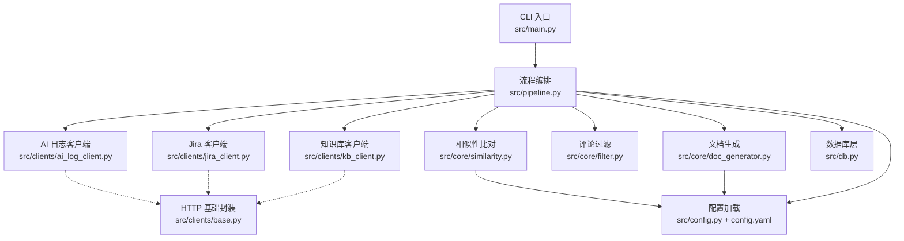
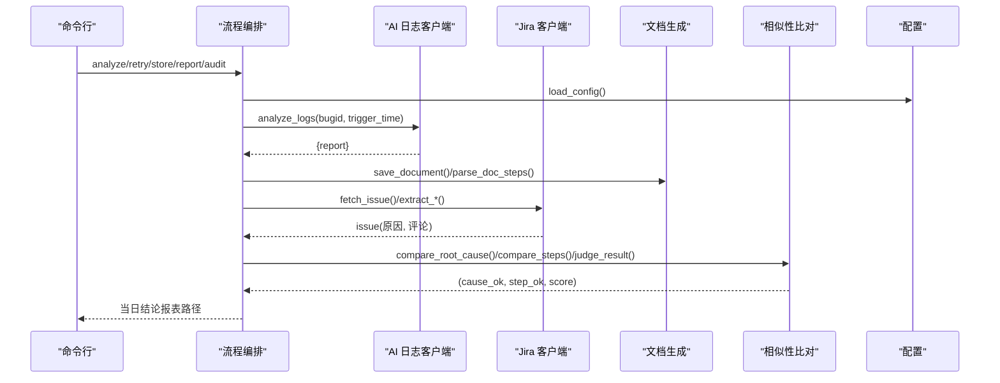
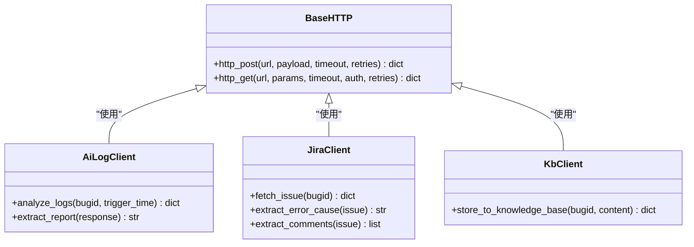
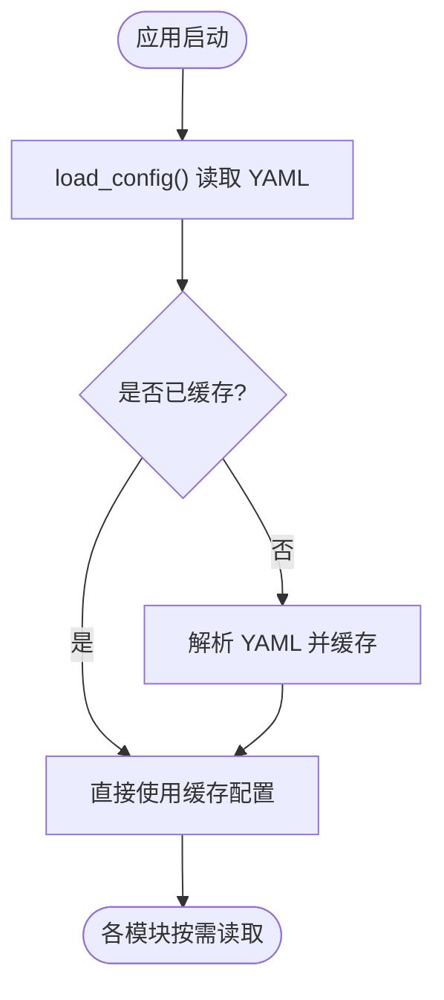
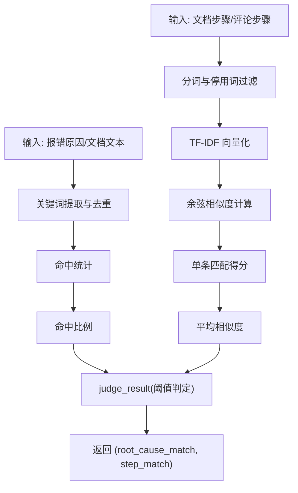
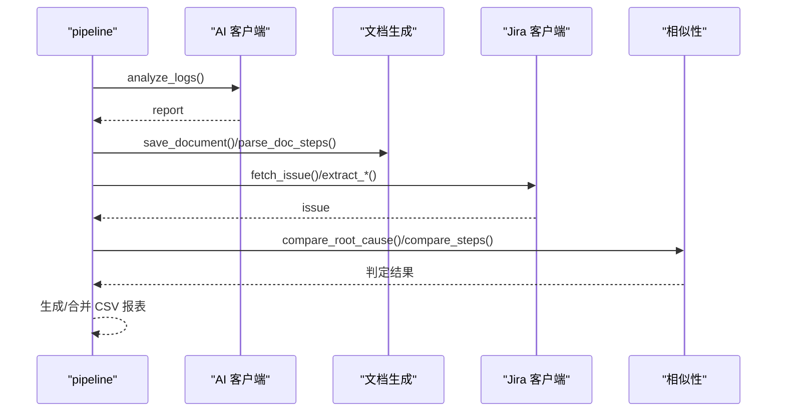
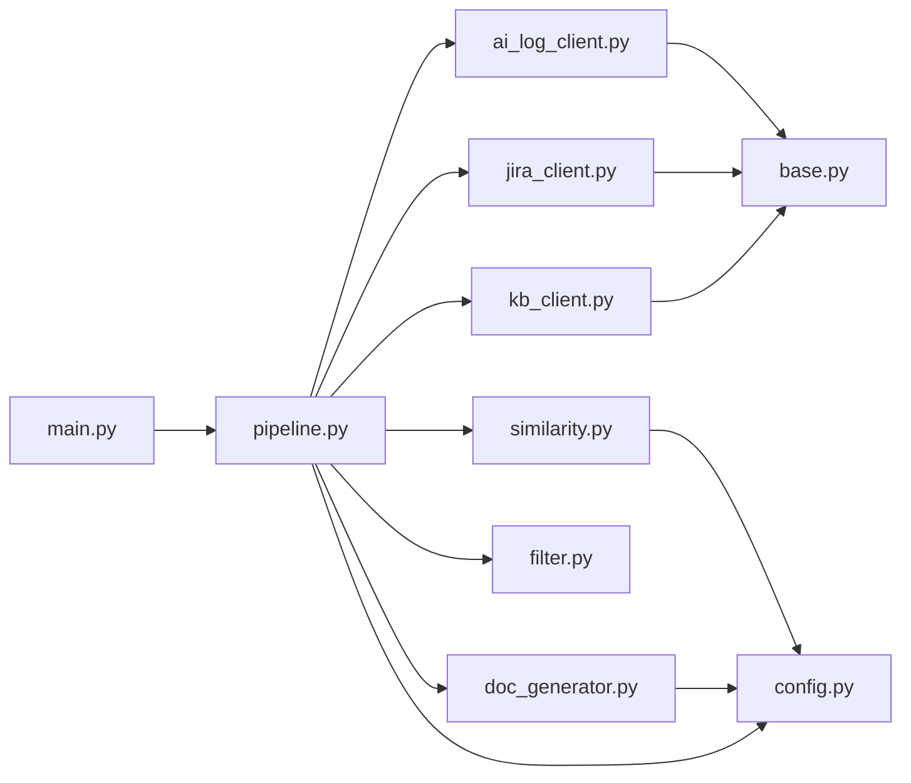

# 扩展点设计

<cite>
**本文引用的文件**
- [src/clients/base.py](file://src/clients/base.py)
- [src/clients/jira_client.py](file://src/clients/jira_client.py)
- [src/clients/kb_client.py](file://src/clients/kb_client.py)
- [src/clients/ai_log_client.py](file://src/clients/ai_log_client.py)
- [src/core/similarity.py](file://src/core/similarity.py)
- [src/core/filter.py](file://src/core/filter.py)
- [src/core/doc_generator.py](file://src/core/doc_generator.py)
- [src/config.py](file://src/config.py)
- [config/config.yaml](file://config/config.yaml)
- [src/pipeline.py](file://src/pipeline.py)
- [src/main.py](file://src/main.py)
- [src/db.py](file://src/db.py)
- [README.md](file://README.md)
</cite>

## 目录
1. [简介](#简介)
2. [项目结构](#项目结构)
3. [核心组件](#核心组件)
4. [架构总览](#架构总览)
5. [详细组件分析](#详细组件分析)
6. [依赖关系分析](#依赖关系分析)
7. [性能考量](#性能考量)
8. [故障排查指南](#故障排查指南)
9. [结论](#结论)
10. [附录：扩展示例与最佳实践](#附录扩展示例与最佳实践)

## 简介
本文件面向“可扩展性”主题，系统性说明如何通过继承 base.Client（实际为 HTTP 客户端封装）添加新的外部接口支持；如何在配置文件中定义新的 API 端点与参数；如何扩展相似度算法以支持不同比对策略。文档同时给出插件化架构的设计原理（接口抽象、依赖注入、配置驱动），并提供新增外部客户端、自定义过滤器的步骤与最佳实践，以及向后兼容性与版本升级策略。

## 项目结构
系统采用分层与模块化组织：
- 入口与编排：main.py、pipeline.py
- 外部客户端：clients/*（AI 日志、Jira、知识库），统一基于 base.py 的 HTTP 能力
- 核心处理：core/*（相似性、评论过滤、文档生成、报表、审计）
- 配置与日志：config.py、config/config.yaml
- 数据层：db.py（只读查询，用于去重与抽查）

图表来源
- [src/main.py:1-111](file://src/main.py#L1-L111)
- [src/pipeline.py:1-105](file://src/pipeline.py#L1-L105)
- [src/clients/base.py:1-39](file://src/clients/base.py#L1-L39)
- [src/clients/ai_log_client.py:1-56](file://src/clients/ai_log_client.py#L1-L56)
- [src/clients/jira_client.py:1-54](file://src/clients/jira_client.py#L1-L54)
- [src/clients/kb_client.py:1-24](file://src/clients/kb_client.py#L1-L24)
- [src/core/doc_generator.py:1-79](file://src/core/doc_generator.py#L1-L79)
- [src/core/filter.py:1-49](file://src/core/filter.py#L1-L49)
- [src/core/similarity.py:1-75](file://src/core/similarity.py#L1-L75)
- [src/config.py:1-59](file://src/config.py#L1-L59)
- [config/config.yaml:1-63](file://config/config.yaml#L1-L63)

章节来源
- [README.md:1-76](file://README.md#L1-L76)

## 核心组件
- HTTP 基础封装：提供带重试、超时、错误日志的 GET/POST 能力，作为所有外部客户端的统一底座。
- 外部客户端：AI 日志分析、Jira、知识库，均通过配置开关 mock 模式，便于开发与测试。
- 核心处理：评论过滤（规则+预留 LLM Agent）、相似性比对（TF-IDF 余弦相似度+根因关键词命中）、文档生成与解析。
- 配置与日志：集中管理 YAML 配置与按日归档日志。
- 流程编排：串联去重、AI 分析、文档生成、Jira 比对、结论报表输出。

章节来源
- [src/clients/base.py:1-39](file://src/clients/base.py#L1-L39)
- [src/clients/ai_log_client.py:1-56](file://src/clients/ai_log_client.py#L1-L56)
- [src/clients/jira_client.py:1-54](file://src/clients/jira_client.py#L1-L54)
- [src/clients/kb_client.py:1-24](file://src/clients/kb_client.py#L1-L24)
- [src/core/filter.py:1-49](file://src/core/filter.py#L1-L49)
- [src/core/similarity.py:1-75](file://src/core/similarity.py#L1-L75)
- [src/core/doc_generator.py:1-79](file://src/core/doc_generator.py#L1-L79)
- [src/config.py:1-59](file://src/config.py#L1-L59)
- [config/config.yaml:1-63](file://config/config.yaml#L1-L63)
- [src/pipeline.py:1-105](file://src/pipeline.py#L1-L105)

## 架构总览
系统遵循“配置驱动 + 接口抽象 + 依赖注入”的插件化原则：
- 接口抽象：每个外部服务通过独立客户端模块暴露稳定函数（如 fetch_issue、analyze_logs、store_to_knowledge_base）。
- 依赖注入：pipeline 仅依赖抽象后的客户端函数，不关心具体实现；可通过配置切换 mock/真实实现。
- 配置驱动：YAML 中声明 URL、超时、字段映射、阈值等，运行时由 config 加载并缓存。

图表来源
- [src/main.py:1-111](file://src/main.py#L1-L111)
- [src/pipeline.py:1-105](file://src/pipeline.py#L1-L105)
- [src/clients/ai_log_client.py:1-56](file://src/clients/ai_log_client.py#L1-L56)
- [src/clients/jira_client.py:1-54](file://src/clients/jira_client.py#L1-L54)
- [src/core/doc_generator.py:1-79](file://src/core/doc_generator.py#L1-L79)
- [src/core/similarity.py:1-75](file://src/core/similarity.py#L1-L75)
- [src/config.py:1-59](file://src/config.py#L1-L59)

## 详细组件分析

### 外部客户端扩展点（继承 base.Client 风格）
- 统一底座：base.py 提供 http_get/http_post，内置重试、超时、错误日志。
- 客户端实现：ai_log_client、jira_client、kb_client 分别封装业务语义，内部调用 base 的 HTTP 方法。
- 扩展方式：新增外部服务时，新建客户端模块，复用 base 的 HTTP 能力，并在 pipeline 中注入调用。

图表来源
- [src/clients/base.py:1-39](file://src/clients/base.py#L1-L39)
- [src/clients/ai_log_client.py:1-56](file://src/clients/ai_log_client.py#L1-L56)
- [src/clients/jira_client.py:1-54](file://src/clients/jira_client.py#L1-L54)
- [src/clients/kb_client.py:1-24](file://src/clients/kb_client.py#L1-L24)

章节来源
- [src/clients/base.py:1-39](file://src/clients/base.py#L1-L39)
- [src/clients/ai_log_client.py:1-56](file://src/clients/ai_log_client.py#L1-L56)
- [src/clients/jira_client.py:1-54](file://src/clients/jira_client.py#L1-L54)
- [src/clients/kb_client.py:1-24](file://src/clients/kb_client.py#L1-L24)

### 配置文件扩展点（API 端点与参数）
- 配置位置：config/config.yaml
- 可配置项：各外部接口的 url、timeout、mock 开关、入参字段映射（如 bugid_field、trigger_time_field、content_field）
- 读取机制：config.py 的 load_config 全局缓存，避免重复 IO
- 扩展建议：新增外部接口时，在 YAML 增加对应段，并在客户端中通过 load_config 读取

图表来源
- [src/config.py:1-59](file://src/config.py#L1-L59)
- [config/config.yaml:1-63](file://config/config.yaml#L1-L63)

章节来源
- [src/config.py:1-59](file://src/config.py#L1-L59)
- [config/config.yaml:1-63](file://config/config.yaml#L1-L63)

### 相似度算法扩展点（比对策略）
- 当前策略：TF-IDF 余弦相似度 + 根因关键词命中比例
- 扩展点：similarity.py 中的 compare_steps、compare_root_cause、judge_result
- 扩展方式：
  - 新增比对函数（如 LLM 打分、向量相似度）
  - 在 judge_result 中接入新阈值或策略组合
  - 通过配置项控制启用哪种策略（例如 similarity.strategy）

图表来源
- [src/core/similarity.py:1-75](file://src/core/similarity.py#L1-L75)
- [config/config.yaml:37-43](file://config/config.yaml#L37-L43)

章节来源
- [src/core/similarity.py:1-75](file://src/core/similarity.py#L1-L75)
- [config/config.yaml:37-43](file://config/config.yaml#L37-L43)

### 评论过滤扩展点（自定义过滤器）
- 当前实现：规则 + 关键词过滤，预留 _agent_filter 占位以便接入 LLM Agent
- 扩展方式：在 filter.py 中替换 _agent_filter 逻辑，或新增策略选择器（基于配置）
- 适用场景：复杂语义提炼、多语言、领域术语增强

章节来源
- [src/core/filter.py:1-49](file://src/core/filter.py#L1-L49)

### 流程编排与集成点
- pipeline.py 串联 AI 分析、文档生成、Jira 比对、相似性判定、报表输出
- 失败容错：单个 bug 失败不影响整体流程，记录到当日报表
- 手工入库：store_bug 将最新文档推送到知识库（开发确认后执行）

图表来源
- [src/pipeline.py:1-105](file://src/pipeline.py#L1-L105)
- [src/clients/ai_log_client.py:1-56](file://src/clients/ai_log_client.py#L1-L56)
- [src/core/doc_generator.py:1-79](file://src/core/doc_generator.py#L1-L79)
- [src/clients/jira_client.py:1-54](file://src/clients/jira_client.py#L1-L54)
- [src/core/similarity.py:1-75](file://src/core/similarity.py#L1-L75)

章节来源
- [src/pipeline.py:1-105](file://src/pipeline.py#L1-L105)

## 依赖关系分析
- 低耦合：pipeline 仅依赖客户端抽象函数，不感知底层 HTTP 细节
- 高内聚：每个客户端模块职责单一，易于替换与测试
- 配置解耦：YAML 集中管理外部接口与阈值，无需修改代码即可调整行为
- 潜在循环：当前无循环依赖；若新增模块需确保单向依赖

图表来源
- [src/main.py:1-111](file://src/main.py#L1-L111)
- [src/pipeline.py:1-105](file://src/pipeline.py#L1-L105)
- [src/clients/base.py:1-39](file://src/clients/base.py#L1-L39)
- [src/config.py:1-59](file://src/config.py#L1-L59)

章节来源
- [src/main.py:1-111](file://src/main.py#L1-L111)
- [src/pipeline.py:1-105](file://src/pipeline.py#L1-L105)
- [src/clients/base.py:1-39](file://src/clients/base.py#L1-L39)
- [src/config.py:1-59](file://src/config.py#L1-L59)

## 性能考量
- HTTP 重试与超时：base.py 默认重试次数与超时时间可配置，避免长尾请求影响吞吐
- 相似度计算：TF-IDF 在小样本下高效；大规模文本可考虑批量向量化或缓存向量
- 日志与 I/O：按日归档日志减少单文件大小；文档与报表按日期分目录，提升检索效率
- 数据库只读：db.py 仅进行只读查询，降低锁竞争与写入开销

[本节为通用指导，不直接分析具体文件]

## 故障排查指南
- 外部接口失败：检查 config.yaml 中对应段的 url、timeout、mock 开关与字段映射；查看日志中的 POST/GET 失败记录
- 报告内容缺失：确认 AI 客户端 extract_report 能正确解析 data.report；必要时调整字段名映射
- 相似度异常：核对 similarity.threshold 与 root_cause_hit_ratio；检查分词与停用词设置
- 文档未生成：确认 doc_generator.save_document 的路径与权限；检查 get_path 的输出目录是否存在
- 流程中断：pipeline 对单个 bug 失败做容错，关注当日报表中 error_msg 字段定位问题

章节来源
- [src/clients/base.py:12-38](file://src/clients/base.py#L12-L38)
- [src/clients/ai_log_client.py:32-56](file://src/clients/ai_log_client.py#L32-L56)
- [src/core/similarity.py:69-75](file://src/core/similarity.py#L69-L75)
- [src/core/doc_generator.py:14-29](file://src/core/doc_generator.py#L14-L29)
- [src/pipeline.py:67-86](file://src/pipeline.py#L67-L86)

## 结论
本系统通过清晰的接口抽象、配置驱动与模块化设计，提供了良好的可扩展性。新增外部接口只需实现客户端模块并注入 pipeline；扩展相似度算法可在 similarity.py 中新增策略并通过配置启用；评论过滤也预留了 LLM Agent 接入点。配合完善的日志与容错机制，系统在保持稳定的同时具备高度的可定制性。

[本节为总结性内容，不直接分析具体文件]

## 附录：扩展示例与最佳实践

### 新增外部服务（客户端）的步骤
- 创建客户端模块：参考 ai_log_client/jira_client/kb_client，封装业务语义函数
- 复用 HTTP 能力：调用 base.py 的 http_get/http_post，设置超时与重试
- 配置接入：在 config.yaml 新增对应段（url、timeout、字段映射、mock）
- 注入流程：在 pipeline.py 中调用新客户端，参与分析或入库流程
- 验证与测试：开启 mock 模式，编写用例覆盖成功/失败分支

章节来源
- [src/clients/ai_log_client.py:1-56](file://src/clients/ai_log_client.py#L1-L56)
- [src/clients/jira_client.py:1-54](file://src/clients/jira_client.py#L1-L54)
- [src/clients/kb_client.py:1-24](file://src/clients/kb_client.py#L1-L24)
- [src/clients/base.py:1-39](file://src/clients/base.py#L1-L39)
- [config/config.yaml:10-36](file://config/config.yaml#L10-L36)
- [src/pipeline.py:18-51](file://src/pipeline.py#L18-L51)

### 自定义分析逻辑（相似度算法）的实现方法
- 新增比对函数：在 similarity.py 中添加新算法（如向量相似度、LLM 打分）
- 策略选择：在 judge_result 中根据配置选择策略（例如 similarity.strategy）
- 阈值配置：在 config.yaml 的 similarity 段新增阈值或开关
- 回退兼容：保留原有算法作为默认策略，确保升级平滑

章节来源
- [src/core/similarity.py:1-75](file://src/core/similarity.py#L1-L75)
- [config/config.yaml:37-43](file://config/config.yaml#L37-L43)

### 配置文件扩展语法与验证规则
- 语法：YAML 键值对，支持嵌套对象与布尔/数字/字符串类型
- 必填项：各外部接口需配置 url、timeout、字段映射；similarity 需配置 threshold 与 root_cause_hit_ratio
- 校验建议：在 load_config 后增加 schema 校验（可选），对缺失字段抛出明确错误
- 环境隔离：通过不同配置文件或环境变量切换（可扩展 config.py 支持）

章节来源
- [config/config.yaml:1-63](file://config/config.yaml#L1-L63)
- [src/config.py:17-25](file://src/config.py#L17-L25)

### 插件化架构设计原理
- 接口抽象：每个外部服务通过独立模块暴露稳定函数，屏蔽底层差异
- 依赖注入：pipeline 仅依赖抽象函数，便于替换实现与单元测试
- 配置驱动：YAML 集中管理外部接口与阈值，无需改代码即可调整行为
- 可扩展点：客户端、相似度算法、评论过滤器均为可插拔单元

章节来源
- [src/pipeline.py:1-105](file://src/pipeline.py#L1-L105)
- [src/clients/base.py:1-39](file://src/clients/base.py#L1-L39)
- [src/core/filter.py:1-49](file://src/core/filter.py#L1-L49)
- [src/core/similarity.py:1-75](file://src/core/similarity.py#L1-L75)
- [src/config.py:1-59](file://src/config.py#L1-L59)

### 向后兼容性与版本升级策略
- 配置兼容：新增配置项应提供默认值，旧配置仍可运行
- 算法兼容：新增相似度策略默认关闭，通过配置显式启用
- 客户端兼容：新增客户端不影响现有流程，仅在 pipeline 中按需调用
- 日志与报表：保持既有字段与格式，新增字段可追加但不破坏解析
- 升级步骤：更新配置 → 灰度启用新策略 → 监控日志与报表 → 全量上线

章节来源
- [config/config.yaml:1-63](file://config/config.yaml#L1-L63)
- [src/core/similarity.py:69-75](file://src/core/similarity.py#L69-L75)
- [src/pipeline.py:67-86](file://src/pipeline.py#L67-L86)