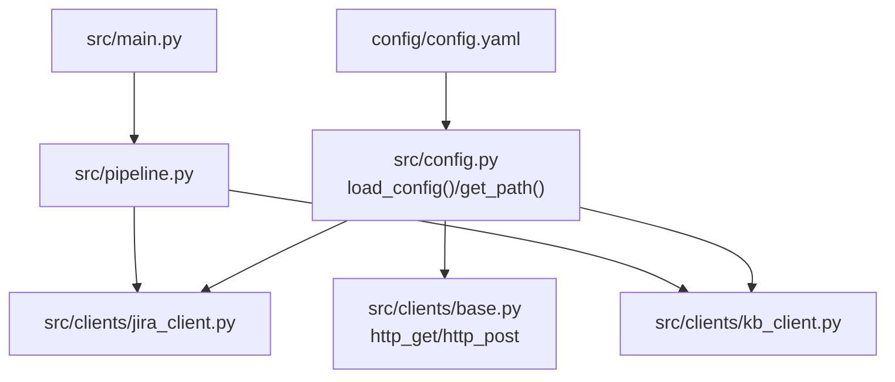
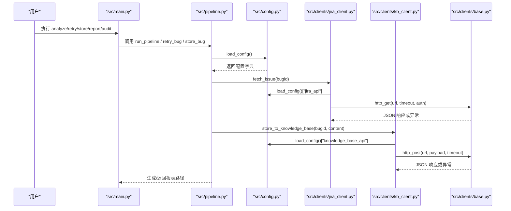
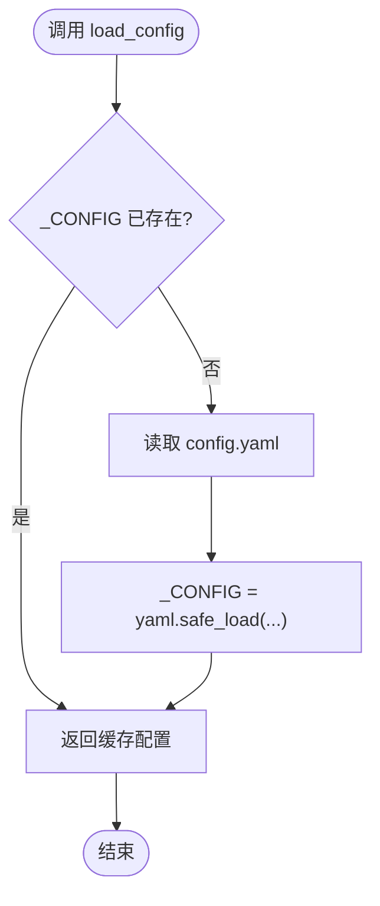
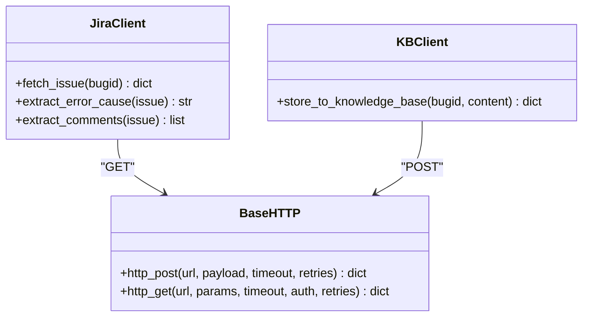
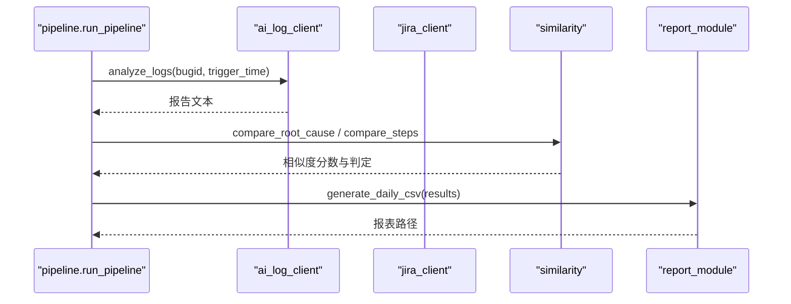
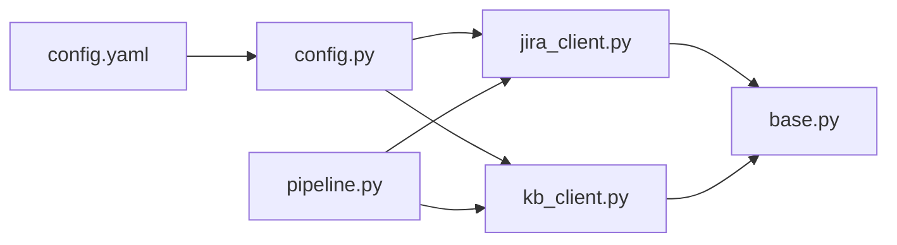

# 配置扩展

<cite>
**本文引用的文件**
- [config/config.yaml](file://config/config.yaml)
- [src/config.py](file://src/config.py)
- [src/main.py](file://src/main.py)
- [src/pipeline.py](file://src/pipeline.py)
- [src/clients/base.py](file://src/clients/base.py)
- [src/clients/jira_client.py](file://src/clients/jira_client.py)
- [src/clients/kb_client.py](file://src/clients/kb_client.py)
- [README.md](file://README.md)
</cite>

## 目录
1. [简介](#简介)
2. [项目结构](#项目结构)
3. [核心组件](#核心组件)
4. [架构总览](#架构总览)
5. [详细组件分析](#详细组件分析)
6. [依赖关系分析](#依赖关系分析)
7. [性能考虑](#性能考虑)
8. [故障排查指南](#故障排查指南)
9. [结论](#结论)
10. [附录：扩展示例与最佳实践](#附录扩展示例与最佳实践)

## 简介
本文件面向“配置扩展”主题，说明如何在 YAML 配置文件中定义新的 API 端点与参数、如何扩展外部服务集成（连接参数、认证信息、超时设置）、以及当前配置加载机制与环境变量覆盖能力。同时提供可操作的扩展示例（新增外部服务、自定义阈值、环境变量映射）与配置最佳实践（安全性、版本管理、环境隔离）。

## 项目结构
- 配置文件位于 config/config.yaml，集中管理数据库、AI 日志分析接口、Jira 接口、知识库接口、相似性阈值、抽查审计、输出路径等。
- 配置加载由 src/config.py 实现，提供全局缓存的 load_config() 与路径工具 get_path()，并初始化日志。
- 各客户端模块通过 load_config() 读取对应服务的配置项，如 jira_api、knowledge_base_api 等。
- 主流程在 src/pipeline.py 中编排调用 AI 分析、Jira 比对、报告生成；CLI 入口在 src/main.py。

**图表来源**
- [config/config.yaml:1-63](file://config/config.yaml#L1-L63)
- [src/config.py:17-34](file://src/config.py#L17-L34)
- [src/clients/jira_client.py:32-43](file://src/clients/jira_client.py#L32-L43)
- [src/clients/kb_client.py:8-23](file://src/clients/kb_client.py#L8-L23)
- [src/clients/base.py:12-38](file://src/clients/base.py#L12-L38)
- [src/pipeline.py:18-51](file://src/pipeline.py#L18-L51)
- [src/main.py:63-106](file://src/main.py#L63-L106)

**章节来源**
- [config/config.yaml:1-63](file://config/config.yaml#L1-L63)
- [src/config.py:1-59](file://src/config.py#L1-L59)
- [src/pipeline.py:1-105](file://src/pipeline.py#L1-L105)
- [src/main.py:1-111](file://src/main.py#L1-L111)

## 核心组件
- 配置加载器：负责读取 YAML、缓存结果、提供路径工具与日志初始化。
- 外部服务客户端：封装 HTTP 请求、重试、超时、认证，按配置驱动行为（mock/真实）。
- 流程编排：串联去重、AI 分析、Jira 比对、报表生成，使用配置中的阈值与字段映射。
- CLI：解析命令与参数，触发流程，输出结果路径。

**章节来源**
- [src/config.py:17-59](file://src/config.py#L17-L59)
- [src/clients/base.py:12-38](file://src/clients/base.py#L12-L38)
- [src/pipeline.py:18-105](file://src/pipeline.py#L18-L105)
- [src/main.py:63-106](file://src/main.py#L63-L106)

## 架构总览
下图展示了配置如何从 YAML 注入到各客户端与流程中，形成端到端的运行链路。

**图表来源**
- [src/main.py:63-106](file://src/main.py#L63-L106)
- [src/pipeline.py:18-105](file://src/pipeline.py#L18-L105)
- [src/config.py:17-34](file://src/config.py#L17-L34)
- [src/clients/jira_client.py:32-43](file://src/clients/jira_client.py#L32-L43)
- [src/clients/kb_client.py:8-23](file://src/clients/kb_client.py#L8-L23)
- [src/clients/base.py:12-38](file://src/clients/base.py#L12-L38)

## 详细组件分析

### 配置加载与路径工具
- 加载逻辑：load_config() 读取 YAML 并缓存为全局 _CONFIG，避免重复 IO。
- 路径工具：get_path(key) 根据 output 下的相对路径拼接项目根目录，确保目录存在后返回绝对路径。
- 日志初始化：setup_logger() 统一控制台与文件日志，文件按日期归档。

**图表来源**
- [src/config.py:17-25](file://src/config.py#L17-L25)

**章节来源**
- [src/config.py:17-34](file://src/config.py#L17-L34)
- [src/config.py:37-59](file://src/config.py#L37-L59)

### 外部服务客户端（Jira、知识库）
- Jira 客户端：根据配置中的 mock 开关选择 Mock 数据或真实 RESTAPI；支持 username/token 认证；超时来自配置。
- 知识库客户端：根据配置构造 payload（bugid_field、content_field），POST 到 url，超时来自配置。
- 通用 HTTP 基础：base.py 提供 http_get/http_post，内置重试与错误日志。

**图表来源**
- [src/clients/jira_client.py:32-54](file://src/clients/jira_client.py#L32-L54)
- [src/clients/kb_client.py:8-23](file://src/clients/kb_client.py#L8-L23)
- [src/clients/base.py:12-38](file://src/clients/base.py#L12-L38)

**章节来源**
- [src/clients/jira_client.py:1-54](file://src/clients/jira_client.py#L1-L54)
- [src/clients/kb_client.py:1-24](file://src/clients/kb_client.py#L1-L24)
- [src/clients/base.py:1-39](file://src/clients/base.py#L1-L39)

### 流程编排与配置使用
- pipeline.run_pipeline 调用 AI 分析、文档生成、Jira 比对，并使用 similarity 模块依据配置阈值判定一致/不一致。
- 失败分支记录错误信息，不中断整体流程，最终汇总生成当日 CSV 报表。
- store_bug 将最新文档推入知识库（仅手工触发）。

**图表来源**
- [src/pipeline.py:18-86](file://src/pipeline.py#L18-L86)

**章节来源**
- [src/pipeline.py:18-105](file://src/pipeline.py#L18-L105)

## 依赖关系分析
- 配置依赖：YAML 中的 ai_log_api、jira_api、knowledge_base_api 分别被对应客户端读取；similarity.threshold 与 root_cause_hit_ratio 影响比对判定。
- 运行时依赖：requests 用于 HTTP 请求；yaml 用于解析配置；logging 用于日志。
- 耦合度：客户端与配置强耦合（通过 load_config() 获取），但通过 mock 开关降低对真实服务的依赖；流程层与客户端松耦合（通过函数调用）。

**图表来源**
- [config/config.yaml:1-63](file://config/config.yaml#L1-L63)
- [src/config.py:17-34](file://src/config.py#L17-L34)
- [src/clients/jira_client.py:32-43](file://src/clients/jira_client.py#L32-L43)
- [src/clients/kb_client.py:8-23](file://src/clients/kb_client.py#L8-L23)
- [src/clients/base.py:12-38](file://src/clients/base.py#L12-L38)
- [src/pipeline.py:18-86](file://src/pipeline.py#L18-L86)

**章节来源**
- [config/config.yaml:1-63](file://config/config.yaml#L1-L63)
- [src/config.py:17-34](file://src/config.py#L17-L34)
- [src/clients/base.py:12-38](file://src/clients/base.py#L12-L38)
- [src/pipeline.py:18-86](file://src/pipeline.py#L18-L86)

## 性能考虑
- 配置加载缓存：load_config() 全局缓存减少重复 IO。
- HTTP 重试：base.py 默认重试 3 次，避免瞬时网络抖动导致失败。
- 超时控制：各客户端通过配置指定超时，防止阻塞。
- 单点失败隔离：pipeline 中单个 bug 分析失败不影响整体流程，保证批量处理稳定性。

[本节为通用性能建议，无需特定文件引用]

## 故障排查指南
- 接口请求失败：检查 base.py 的重试与日志输出，确认 URL、超时、认证是否正确。
- 配置缺失或类型错误：确认 config.yaml 中对应键存在且类型正确（如布尔、字符串、数字）。
- 路径问题：get_path() 会创建目录，若仍失败请检查项目根目录权限与磁盘空间。
- 日志定位：查看 logs/app_YYYY-MM-DD.log，结合 logger 名称（如 jira、kb、http）快速定位。

**章节来源**
- [src/clients/base.py:12-38](file://src/clients/base.py#L12-L38)
- [src/config.py:28-34](file://src/config.py#L28-L34)
- [src/config.py:37-59](file://src/config.py#L37-L59)

## 结论
当前系统通过集中式 YAML 配置与全局缓存加载机制，实现了对外部服务的灵活接入与参数化控制。客户端基于配置进行 mock/真实切换、认证与超时管理，流程层依据配置阈值进行比对判定。建议在后续迭代中引入环境变量覆盖与热重载机制，以增强多环境部署与动态调整能力。

[本节为总结性内容，无需特定文件引用]

## 附录：扩展示例与最佳实践

### 在 YAML 中定义新的 API 端点与参数
- 新增外部服务段：例如新增一个“告警平台”配置块，包含 url、timeout、认证字段、入参字段映射等。
- 字段命名规范：保持与现有 ai_log_api、jira_api、knowledge_base_api 一致的键名风格（如 url、timeout、username、token、*_field）。
- 验证规则：建议在客户端入口处校验必填字段（如 url、timeout），并在 mock=false 时强制要求认证字段存在。

示例结构（概念性描述，非代码）：
- 新增 section: alert_api
  - url: 字符串
  - timeout: 整数秒
  - username/token: 可选字符串
  - alert_id_field/content_field: 字符串映射

**章节来源**
- [config/config.yaml:10-36](file://config/config.yaml#L10-L36)
- [src/clients/jira_client.py:32-43](file://src/clients/jira_client.py#L32-L43)
- [src/clients/kb_client.py:8-23](file://src/clients/kb_client.py#L8-L23)

### 扩展外部服务集成的连接参数、认证信息与超时
- 连接参数：url 必须为完整地址；如需协议前缀（https/http），需在配置中明确。
- 认证信息：username/token 仅在 mock=false 时生效；建议在客户端构建 auth tuple 并传入 http_get。
- 超时设置：timeout 为整数秒，建议根据服务 SLA 合理设置；base.py 默认 30 秒，可在配置中覆盖。

**章节来源**
- [src/clients/base.py:12-38](file://src/clients/base.py#L12-L38)
- [src/clients/jira_client.py:32-43](file://src/clients/jira_client.py#L32-L43)
- [src/clients/kb_client.py:8-23](file://src/clients/kb_client.py#L8-L23)

### 配置的热重载机制与环境变量覆盖功能
- 当前实现：load_config() 使用全局缓存 _CONFIG，首次加载后不会自动重新读取文件；因此不支持热重载。
- 环境变量覆盖：当前代码未读取环境变量来覆盖配置；如需支持，可在 load_config() 中增加环境变量读取逻辑（例如 APP_JIRA_URL、APP_KB_TIMEOUT 等），并按优先级合并到配置字典。
- 建议方案：
  - 启动时读取环境变量，覆盖对应配置项。
  - 提供 reload_config() 方法，允许在运行时重新加载配置（谨慎使用，需考虑并发与状态一致性）。

**章节来源**
- [src/config.py:17-25](file://src/config.py#L17-L25)

### 具体扩展示例
- 添加新的外部服务配置：
  - 在 config.yaml 新增 alert_api 段，填写 url、timeout、认证字段与入参映射。
  - 新建 clients/alert_client.py，复用 base.py 的 http_post/http_get，读取配置并实现业务方法。
  - 在 pipeline 中按需调用新客户端，参与流程。
- 自定义阈值参数：
  - 在 similarity 段新增自定义阈值键（如 step_threshold_v2），并在 pipeline/similarity 中使用该值进行判定。
  - 确保阈值范围校验（如 0~1），并在日志中记录实际使用的阈值。
- 环境变量映射：
  - 在 load_config() 中读取环境变量（如 APP_DB_URL、APP_JIRA_TOKEN），覆盖对应配置项。
  - 提供文档说明环境变量命名约定与优先级（环境变量 > YAML 默认值）。

**章节来源**
- [config/config.yaml:37-43](file://config/config.yaml#L37-L43)
- [src/pipeline.py:18-51](file://src/pipeline.py#L18-L51)
- [src/config.py:17-25](file://src/config.py#L17-L25)

### 配置最佳实践
- 安全性考虑：
  - 敏感信息（用户名、令牌）不要硬编码进仓库；建议使用环境变量或密钥管理服务注入。
  - 在日志中避免打印敏感字段；必要时对日志内容进行脱敏。
- 版本管理：
  - 对配置变更进行版本化管理（如 config/v1.yaml、config/v2.yaml），并在客户端中兼容旧版本字段。
  - 在 README 中维护配置字段清单与变更历史。
- 环境隔离：
  - 为不同环境（开发、测试、生产）准备独立配置文件或环境变量集合。
  - 通过环境变量或命令行参数选择配置文件路径，避免混用。

**章节来源**
- [README.md:21-29](file://README.md#L21-L29)
- [src/config.py:37-59](file://src/config.py#L37-L59)