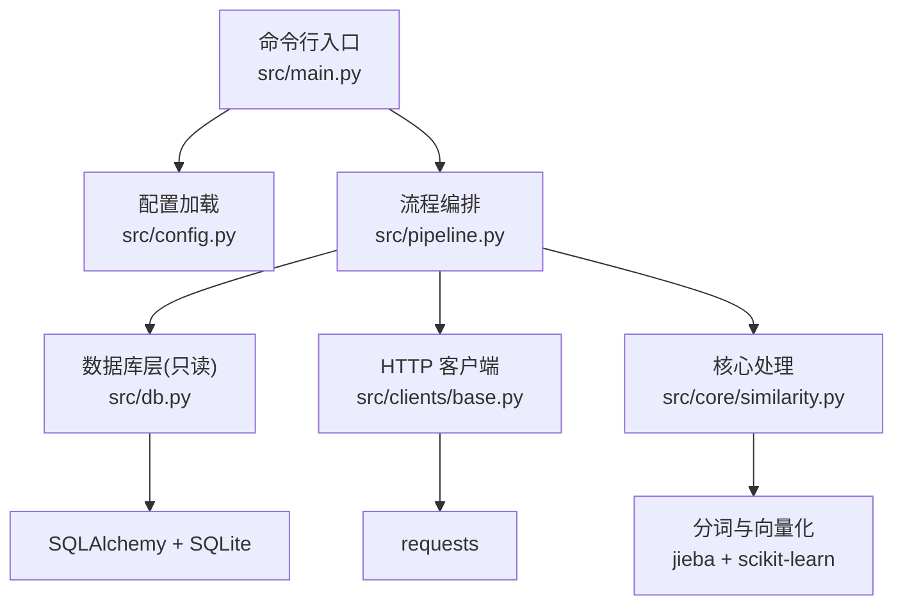
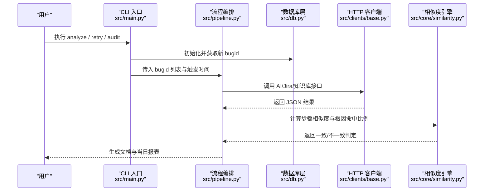
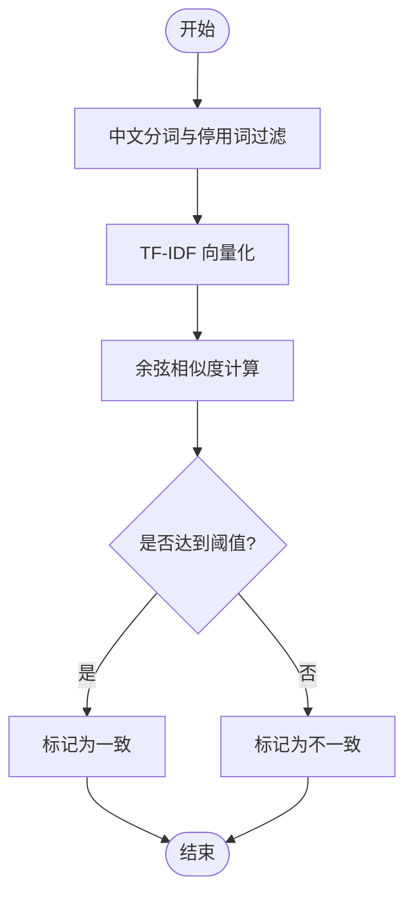
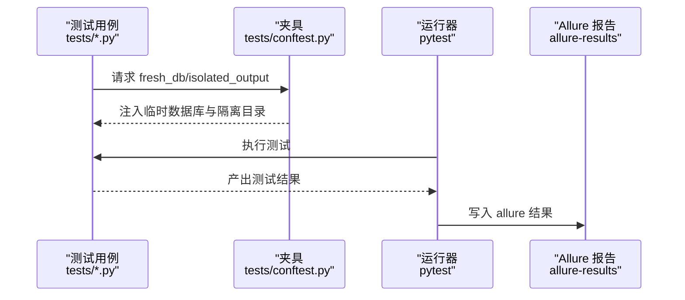

# 技术选型说明

<cite>
**本文引用的文件**
- [README.md](file://README.md)
- [requirements.txt](file://requirements.txt)
- [config/config.yaml](file://config/config.yaml)
- [src/main.py](file://src/main.py)
- [src/config.py](file://src/config.py)
- [src/db.py](file://src/db.py)
- [src/clients/base.py](file://src/clients/base.py)
- [src/core/similarity.py](file://src/core/similarity.py)
- [tests/conftest.py](file://tests/conftest.py)
- [conftest.py](file://conftest.py)
- [tests/test_similarity.py](file://tests/test_similarity.py)
- [tests/test_db.py](file://tests/test_db.py)
</cite>

## 目录
1. [简介](#简介)
2. [项目结构](#项目结构)
3. [核心组件](#核心组件)
4. [架构总览](#架构总览)
5. [详细组件分析](#详细组件分析)
6. [依赖与版本兼容性](#依赖与版本兼容性)
7. [性能考量](#性能考量)
8. [故障排查指南](#故障排查指南)
9. [结论](#结论)
10. [附录：技术栈对比表](#附录技术栈对比表)

## 简介
本项目是一个“Bug 文档沉淀工具”，围绕“bugid 去重 → AI 日志分析生成文档 → Jira 报错原因/评论比对 → 每日结论报表 → 知识库手工入库”的闭环流程，提供命令行入口、配置管理、数据库只读查询、HTTP 客户端封装、文本相似度计算与测试报告生成等能力。整体采用 Python 语言，SQLite 作为默认轻量级存储，scikit-learn 与 jieba 实现中文文本相似度计算，requests 统一 HTTP 调用，pytest + allure 完成测试与可视化报告。

## 项目结构
- 配置集中管理：通过 YAML 统一管理数据库连接、外部接口地址、相似性阈值、输出路径等。
- 分层清晰：CLI 入口（main）、流程编排（pipeline）、数据层（db）、HTTP 客户端（clients）、核心处理（core）。
- 测试隔离：每个用例使用独立临时数据库与隔离的输出目录，避免污染。
- 产物规范：按日期生成 docs 与 reports，日志按日归档。

图表来源
- [src/main.py:1-111](file://src/main.py#L1-L111)
- [src/config.py:1-59](file://src/config.py#L1-L59)
- [src/db.py:1-132](file://src/db.py#L1-L132)
- [src/clients/base.py:1-39](file://src/clients/base.py#L1-L39)
- [src/core/similarity.py:1-75](file://src/core/similarity.py#L1-L75)

章节来源
- [README.md:62-76](file://README.md#L62-L76)
- [src/main.py:1-111](file://src/main.py#L1-L111)
- [src/config.py:1-59](file://src/config.py#L1-L59)

## 核心组件
- 配置中心：YAML 驱动，支持路径解析、日志初始化、全局缓存。
- 数据库层：基于 SQLAlchemy，默认 SQLite，仅做只读查询（bugid 去重、抽查候选池、已入库字段读取）。
- HTTP 客户端：统一封装 GET/POST，内置超时、重试与错误日志。
- 相似度引擎：中文分词（jieba）+ TF-IDF 向量（scikit-learn）+ 余弦相似度；根因关键词命中比例判定。
- 测试框架：pytest 组织用例，allure-pytest 生成可视化报告；夹具隔离数据库与输出目录。

章节来源
- [src/config.py:17-59](file://src/config.py#L17-L59)
- [src/db.py:19-132](file://src/db.py#L19-L132)
- [src/clients/base.py:12-39](file://src/clients/base.py#L12-L39)
- [src/core/similarity.py:17-75](file://src/core/similarity.py#L17-L75)
- [tests/conftest.py:1-34](file://tests/conftest.py#L1-L34)

## 架构总览
系统以 CLI 为入口，根据子命令分发到不同流程：analyze/retry/store/report/audit。所有流程不写库，仅生成文档与 CSV 报表；知识库入库由开发手工触发。相似度模块负责将 AI 生成的步骤与 Jira 评论提取的步骤进行匹配，并结合根因关键词命中比例给出一致性判断。

图表来源
- [src/main.py:29-60](file://src/main.py#L29-L60)
- [src/db.py:67-88](file://src/db.py#L67-L88)
- [src/clients/base.py:12-39](file://src/clients/base.py#L12-L39)
- [src/core/similarity.py:34-75](file://src/core/similarity.py#L34-L75)

## 详细组件分析

### 语言与生态：Python
- 简洁性与可读性：脚本化能力强，适合快速构建数据处理与集成流水线。
- 丰富的库生态：NLP（jieba）、机器学习（scikit-learn）、ORM（SQLAlchemy）、HTTP（requests）、测试（pytest/allure）等成熟稳定。
- AI 集成友好：便于对接外部 AI 日志分析接口，并以最小成本扩展后续 LLM 评判逻辑。

章节来源
- [requirements.txt:1-9](file://requirements.txt#L1-L9)
- [src/core/similarity.py:1-4](file://src/core/similarity.py#L1-L4)

### 数据存储：SQLite
- 轻量级与零配置：默认 sqlite:///data/app.db，开箱即用，无需额外服务部署。
- 适合单机部署：满足 bugid 去重、抽查候选池读取、已入库字段读取等只读场景。
- 可替换性强：可通过配置切换至 MySQL 等关系型数据库。

章节来源
- [config/config.yaml:3-8](file://config/config.yaml#L3-L8)
- [src/db.py:42-57](file://src/db.py#L42-L57)
- [src/db.py:91-132](file://src/db.py#L91-L132)

### 文本相似度：scikit-learn 与 jieba
- jieba 中文分词：过滤停用词与单字，提升语义表达质量。
- scikit-learn TF-IDF + 余弦相似度：对两段文本或步骤集合进行相似度打分。
- 根因关键词命中比例：统计报错原因关键词在分析文档中的出现比例，结合阈值判定一致性。
- 可扩展性：预留 LLM 评判接口，可在 compare_steps 中替换为模型打分。

图表来源
- [src/core/similarity.py:17-31](file://src/core/similarity.py#L17-L31)
- [src/core/similarity.py:34-49](file://src/core/similarity.py#L34-L49)
- [src/core/similarity.py:52-75](file://src/core/similarity.py#L52-L75)

章节来源
- [src/core/similarity.py:17-75](file://src/core/similarity.py#L17-L75)

### HTTP 客户端：requests
- 优势：简洁 API、自动 JSON 编解码、易于设置超时与认证。
- 工程化封装：统一 http_get/http_post，内置重试与错误日志，降低调用方复杂度。
- 适用场景：AI 日志分析接口、Jira RESTAPI、知识库入库接口。

章节来源
- [src/clients/base.py:12-39](file://src/clients/base.py#L12-L39)
- [config/config.yaml:10-35](file://config/config.yaml#L10-L35)

### 测试框架：pytest 与 Allure
- pytest 组织用例：模块化测试相似性、数据库层等核心能力。
- Allure 报告：通过 allure-pytest 插件生成结构化报告，便于查看 feature/story 与断言结果。
- 测试隔离：每个测试使用独立临时数据库与隔离输出目录，避免相互影响。

图表来源
- [tests/conftest.py:8-34](file://tests/conftest.py#L8-L34)
- [tests/test_similarity.py:1-72](file://tests/test_similarity.py#L1-L72)
- [tests/test_db.py:1-54](file://tests/test_db.py#L1-L54)
- [README.md:52-60](file://README.md#L52-L60)

章节来源
- [tests/conftest.py:1-34](file://tests/conftest.py#L1-L34)
- [tests/test_similarity.py:1-72](file://tests/test_similarity.py#L1-L72)
- [tests/test_db.py:1-54](file://tests/test_db.py#L1-L54)
- [README.md:52-60](file://README.md#L52-L60)

### 配置文件管理：YAML
- 集中式配置：数据库 URL、外部接口地址、超时、阈值、抽样数量、输出路径等均在 config.yaml。
- 运行时路径解析：get_path 确保输出目录存在，并按日期生成日志与报表。
- 灵活切换：mock 开关便于本地调试，真实环境关闭 mock 并填写 url 与字段映射。

章节来源
- [config/config.yaml:1-63](file://config/config.yaml#L1-L63)
- [src/config.py:17-34](file://src/config.py#L17-L34)

## 依赖与版本兼容性
- Python 生态依赖：
  - requests>=2.31.0：HTTP 客户端基础能力。
  - SQLAlchemy>=2.0.0：ORM 与数据库抽象。
  - pandas>=2.1.0：报表与数据处理。
  - scikit-learn>=1.3.0：TF-IDF 与相似度计算。
  - PyYAML>=6.0：配置文件解析。
  - jieba>=0.42.1：中文分词。
  - pytest>=7.4.0：测试框架。
  - allure-pytest>=2.13.0：测试报告插件。
- 版本策略：使用最低兼容版本约束，保证在新环境中可安装且行为稳定。
- 平台注意：Windows 控制台编码切换以避免中文乱码。

章节来源
- [requirements.txt:1-9](file://requirements.txt#L1-L9)
- [src/main.py:93-106](file://src/main.py#L93-L106)

## 性能考量
- 相似度计算：
  - 文本规模较小，TF-IDF + 余弦相似度开销可控。
  - 建议对大规模步骤集合进行分批计算与缓存，减少重复向量化。
- HTTP 调用：
  - 合理设置 timeout 与 retries，避免长尾请求阻塞主流程。
  - 对外部接口增加熔断与降级策略（如 mock 模式），提高鲁棒性。
- 数据库访问：
  - 当前为只读查询，SQLite 在并发读场景下表现良好。
  - 若未来引入写入或高并发，需评估迁移至 MySQL/PostgreSQL。

[本节为通用指导，不直接分析具体文件]

## 故障排查指南
- 接口请求失败：
  - 检查 config.yaml 中对应接口的 mock 开关与 url、timeout、字段映射。
  - 查看 logs 目录下当日日志，确认重试次数与错误信息。
- 相似度结果为 0：
  - 检查输入文本是否为空或分词后为空；确认停用词与单字过滤逻辑。
  - 调整 similarity.threshold 与 root_cause_hit_ratio 阈值。
- 数据库相关：
  - 确认 database.url 指向正确路径；SQLite 相对路径会基于项目根目录解析。
  - 抽查功能依赖 kb_table 与字段映射，需与实际库结构一致。
- 测试与环境：
  - 使用 pytest 运行测试，并通过 --alluredir=allure-results 生成报告。
  - 确保 conftest 夹具生效，避免用例间数据污染。

章节来源
- [src/clients/base.py:12-39](file://src/clients/base.py#L12-L39)
- [src/core/similarity.py:17-75](file://src/core/similarity.py#L17-L75)
- [src/db.py:42-57](file://src/db.py#L42-L57)
- [config/config.yaml:10-63](file://config/config.yaml#L10-L63)
- [README.md:52-60](file://README.md#L52-L60)

## 结论
本方案以 Python 为核心，结合 SQLite、scikit-learn、jieba、requests、pytest/allure 等成熟组件，构建了轻量、可维护、易扩展的 Bug 文档沉淀工具。通过 YAML 集中配置与分层架构，实现了清晰的职责划分与良好的可观测性。相似度引擎兼顾实用性与可扩展性，测试体系保障质量与回归稳定性。对于单机部署与快速迭代场景，该技术栈具备显著优势。

[本节为总结性内容，不直接分析具体文件]

## 附录：技术栈对比表
- 语言与生态
  - Python：简洁、生态丰富、AI 集成友好；适用于快速开发与数据处理。
  - 备选：Go/Java 更适合高并发服务端，但生态与上手成本更高。
- 数据库
  - SQLite：轻量、零配置、适合单机与只读场景；可切换 MySQL。
  - 备选：PostgreSQL/MySQL 适合多写或多机并发，但运维成本更高。
- 文本相似度
  - jieba + scikit-learn：成本低、效果好、易扩展；适合中文文本。
  - 备选：深度学习模型（如 Sentence-BERT）精度更高但资源消耗大。
- HTTP 客户端
  - requests：简洁易用、广泛使用；配合重试与日志提升稳定性。
  - 备选：httpx/aiohttp 支持异步，但复杂度高。
- 测试与报告
  - pytest + allure：模块化、插件丰富、报告美观；便于持续集成。
  - 备选：unittest 更原生但生态较弱；其他报告工具不如 allure 直观。

[本节为概念性对比，不直接分析具体文件]