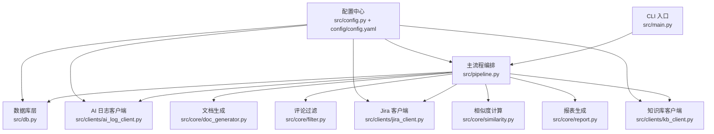
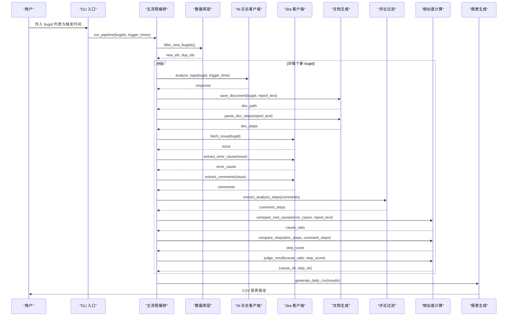
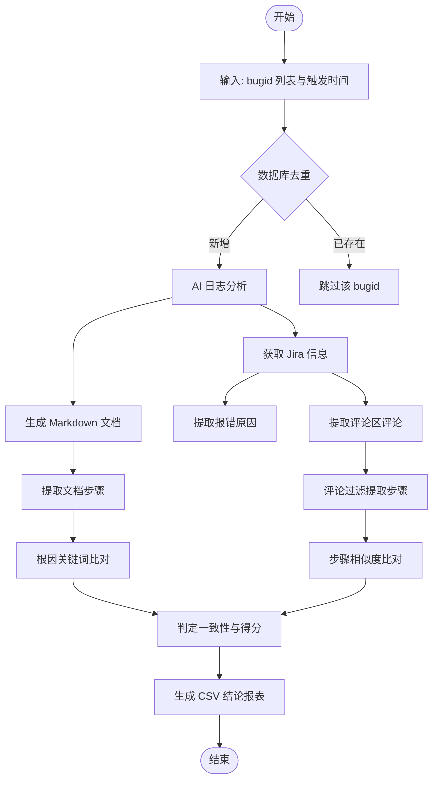
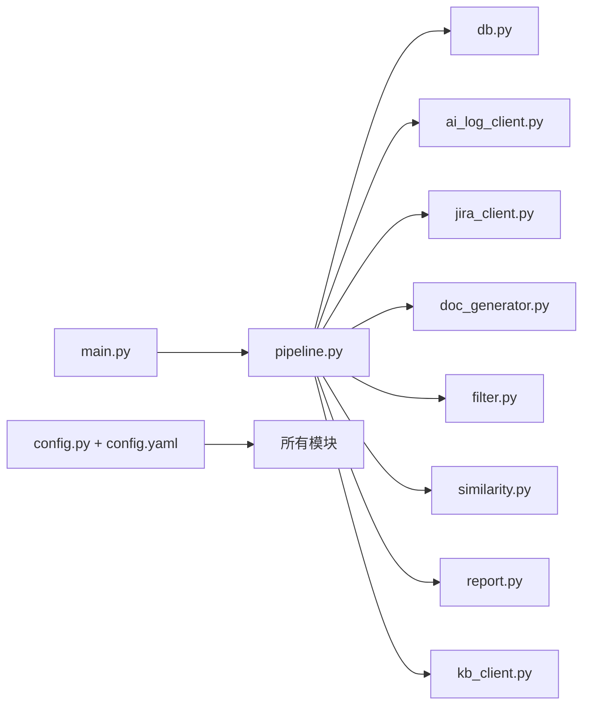

# 数据流设计

<cite>
**本文引用的文件**   
- [src/main.py](file://src/main.py)
- [src/pipeline.py](file://src/pipeline.py)
- [src/config.py](file://src/config.py)
- [config/config.yaml](file://config/config.yaml)
- [src/db.py](file://src/db.py)
- [src/core/filter.py](file://src/core/filter.py)
- [src/core/similarity.py](file://src/core/similarity.py)
- [src/core/doc_generator.py](file://src/core/doc_generator.py)
- [src/core/report.py](file://src/core/report.py)
- [src/clients/jira_client.py](file://src/clients/jira_client.py)
- [src/clients/ai_log_client.py](file://src/clients/ai_log_client.py)
- [src/clients/kb_client.py](file://src/clients/kb_client.py)
- [README.md](file://README.md)
</cite>

## 目录
1. [简介](#简介)
2. [项目结构](#项目结构)
3. [核心组件](#核心组件)
4. [架构总览](#架构总览)
5. [详细组件分析](#详细组件分析)
6. [依赖关系分析](#依赖关系分析)
7. [性能考量](#性能考量)
8. [故障排查指南](#故障排查指南)
9. [结论](#结论)
10. [附录](#附录)

## 简介
本文件面向“Bug 文档沉淀工具”的数据流设计，完整描述从 CLI 接收 bugid 列表开始，到数据库去重过滤、AI 日志分析、Jira 信息获取、相似度计算，最终生成 Markdown 文档与 CSV 报表的全链路。重点说明每个阶段的数据转换：原始 bugid → 去重后的新 bugid → AI 分析报告 → Jira 问题信息 → 相似度分数 → 最终结果；并解释数据存储策略（SQLite 用于去重检查、文件系统存储生成的文档、CSV 用于结论报表）以及数据校验与一致性保证机制。文末提供数据流图，展示数据在各组件间的流转过程与状态变化。

## 项目结构
- CLI 入口负责参数解析与命令分发，初始化数据库连接后调用主流程编排。
- 主流程编排串联步骤1（去重）、步骤2（AI 分析与文档生成）、步骤3（Jira 比对与结论报表）。
- 外部客户端封装 AI 日志分析接口、Jira RESTAPI、知识库入库接口，支持 mock 模式。
- 核心模块包含评论过滤、相似性计算、文档生成、报表生成等。
- 配置中心统一加载 YAML 配置，管理输出路径与日志。

图表来源
- [src/main.py:63-106](file://src/main.py#L63-L106)
- [src/pipeline.py:18-86](file://src/pipeline.py#L18-L86)
- [src/db.py:42-88](file://src/db.py#L42-L88)
- [src/clients/ai_log_client.py:32-56](file://src/clients/ai_log_client.py#L32-L56)
- [src/clients/jira_client.py:32-53](file://src/clients/jira_client.py#L32-L53)
- [src/core/doc_generator.py:14-79](file://src/core/doc_generator.py#L14-L79)
- [src/core/filter.py:29-48](file://src/core/filter.py#L29-L48)
- [src/core/similarity.py:34-75](file://src/core/similarity.py#L34-L75)
- [src/core/report.py:46-65](file://src/core/report.py#L46-L65)
- [src/clients/kb_client.py:8-23](file://src/clients/kb_client.py#L8-L23)
- [src/config.py:17-58](file://src/config.py#L17-L58)
- [config/config.yaml:1-63](file://config/config.yaml#L1-L63)

章节来源
- [src/main.py:1-111](file://src/main.py#L1-L111)
- [src/pipeline.py:1-105](file://src/pipeline.py#L1-L105)
- [config/config.yaml:1-63](file://config/config.yaml#L1-L63)

## 核心组件
- CLI 入口：解析子命令 analyze/retry/store/report/audit，初始化数据库并分发处理逻辑。
- 主流程编排：串联去重、AI 分析、文档生成、Jira 比对、相似度计算、结论报表生成。
- 数据库层：只读查询，实现 bugid 去重与抽查候选池读取。
- 外部客户端：AI 日志分析、Jira RESTAPI、知识库入库，均支持 mock。
- 核心处理：评论过滤、相似性计算、文档生成、报表生成。
- 配置中心：加载 YAML 配置，提供路径管理与日志初始化。

章节来源
- [src/main.py:63-106](file://src/main.py#L63-L106)
- [src/pipeline.py:18-86](file://src/pipeline.py#L18-L86)
- [src/db.py:67-88](file://src/db.py#L67-L88)
- [src/clients/ai_log_client.py:32-56](file://src/clients/ai_log_client.py#L32-L56)
- [src/clients/jira_client.py:32-53](file://src/clients/jira_client.py#L32-L53)
- [src/clients/kb_client.py:8-23](file://src/clients/kb_client.py#L8-L23)
- [src/core/filter.py:29-48](file://src/core/filter.py#L29-L48)
- [src/core/similarity.py:34-75](file://src/core/similarity.py#L34-L75)
- [src/core/doc_generator.py:14-79](file://src/core/doc_generator.py#L14-L79)
- [src/core/report.py:46-65](file://src/core/report.py#L46-L65)
- [src/config.py:17-58](file://src/config.py#L17-L58)

## 架构总览
整体数据流遵循“输入→去重→分析→提取→比对→输出”的流水线式结构，关键节点如下：
- 输入：CLI 接收 bugid 列表与可选触发时间映射。
- 去重：通过 SQLite 数据库进行只读比对，过滤已存在与本批重复的 bugid。
- 分析：调用 AI 日志分析接口，生成 Markdown 文档并提取分析步骤。
- 提取：从 Jira 问题中提取报错原因与评论区评论，评论经规则过滤得到分析步骤。
- 比对：根因关键词命中比例与步骤 TF-IDF 余弦相似度双重比对，判定一致性与得分。
- 输出：生成每日 CSV 结论报表（按日期合并），同时保存 Markdown 文档。

图表来源
- [src/main.py:29-33](file://src/main.py#L29-L33)
- [src/pipeline.py:18-86](file://src/pipeline.py#L18-L86)
- [src/db.py:67-88](file://src/db.py#L67-L88)
- [src/clients/ai_log_client.py:32-56](file://src/clients/ai_log_client.py#L32-L56)
- [src/core/doc_generator.py:14-40](file://src/core/doc_generator.py#L14-L40)
- [src/clients/jira_client.py:32-53](file://src/clients/jira_client.py#L32-L53)
- [src/core/filter.py:29-48](file://src/core/filter.py#L29-L48)
- [src/core/similarity.py:34-75](file://src/core/similarity.py#L34-L75)
- [src/core/report.py:46-65](file://src/core/report.py#L46-L65)

## 详细组件分析

### 数据流阶段与数据转换
- 原始输入：bugid 列表与可选触发时间映射。
- 去重后新 bugid：仅保留数据库中不存在且本批未重复的 bugid。
- AI 分析报告：Markdown 格式，包含根因结论与分析步骤。
- Jira 问题信息：报错原因（description）与评论区评论。
- 相似度分数：根因关键词命中比例与步骤 TF-IDF 余弦相似度。
- 最终结果：内存中的分析结果字典，写入当日 CSV 报表。

图表来源
- [src/pipeline.py:18-86](file://src/pipeline.py#L18-L86)
- [src/db.py:67-88](file://src/db.py#L67-L88)
- [src/clients/ai_log_client.py:32-56](file://src/clients/ai_log_client.py#L32-L56)
- [src/core/doc_generator.py:14-40](file://src/core/doc_generator.py#L14-L40)
- [src/clients/jira_client.py:32-53](file://src/clients/jira_client.py#L32-L53)
- [src/core/filter.py:29-48](file://src/core/filter.py#L29-L48)
- [src/core/similarity.py:34-75](file://src/core/similarity.py#L34-L75)
- [src/core/report.py:46-65](file://src/core/report.py#L46-L65)

章节来源
- [src/pipeline.py:18-86](file://src/pipeline.py#L18-L86)
- [src/db.py:67-88](file://src/db.py#L67-L88)
- [src/clients/ai_log_client.py:32-56](file://src/clients/ai_log_client.py#L32-L56)
- [src/core/doc_generator.py:14-40](file://src/core/doc_generator.py#L14-L40)
- [src/clients/jira_client.py:32-53](file://src/clients/jira_client.py#L32-L53)
- [src/core/filter.py:29-48](file://src/core/filter.py#L29-L48)
- [src/core/similarity.py:34-75](file://src/core/similarity.py#L34-L75)
- [src/core/report.py:46-65](file://src/core/report.py#L46-L65)

### 组件职责与交互
- CLI 入口：解析参数、初始化数据库、分发命令。
- 主流程编排：协调各组件执行，捕获异常并记录失败结果。
- 数据库层：只读查询，确保去重与抽查候选池读取。
- 外部客户端：封装 HTTP 请求，支持 mock 模式便于测试。
- 核心处理：评论过滤使用规则与关键词；相似性计算采用 TF-IDF 与余弦相似度；文档生成按日期分文件夹；报表生成按 bugid 覆盖合并。

章节来源
- [src/main.py:63-106](file://src/main.py#L63-L106)
- [src/pipeline.py:18-86](file://src/pipeline.py#L18-L86)
- [src/db.py:67-88](file://src/db.py#L67-L88)
- [src/clients/ai_log_client.py:32-56](file://src/clients/ai_log_client.py#L32-L56)
- [src/clients/jira_client.py:32-53](file://src/clients/jira_client.py#L32-L53)
- [src/core/filter.py:29-48](file://src/core/filter.py#L29-L48)
- [src/core/similarity.py:34-75](file://src/core/similarity.py#L34-L75)
- [src/core/doc_generator.py:14-79](file://src/core/doc_generator.py#L14-L79)
- [src/core/report.py:46-65](file://src/core/report.py#L46-L65)

### 数据校验与一致性保证
- 去重校验：数据库层对输入 bugid 进行集合比对，避免重复处理。
- 报告完整性校验：AI 接口返回必须包含报告内容，否则抛出明确错误。
- 文档路径校验：读取文档时若文件不存在则抛出明确错误。
- 报表合并一致性：同日多次运行按 bugid 去重合并，新结果覆盖旧行。
- 阈值判定：相似性比对依据配置阈值判定一致性与得分。

章节来源
- [src/db.py:67-88](file://src/db.py#L67-L88)
- [src/clients/ai_log_client.py:51-56](file://src/clients/ai_log_client.py#L51-L56)
- [src/core/doc_generator.py:59-79](file://src/core/doc_generator.py#L59-L79)
- [src/core/report.py:46-65](file://src/core/report.py#L46-L65)
- [src/core/similarity.py:69-75](file://src/core/similarity.py#L69-L75)

## 依赖关系分析
- CLI 依赖主流程编排与配置中心。
- 主流程编排依赖数据库层、外部客户端、核心处理模块。
- 外部客户端依赖配置中心与基础 HTTP 工具。
- 核心处理模块依赖配置中心与日志初始化。

图表来源
- [src/main.py:63-106](file://src/main.py#L63-L106)
- [src/pipeline.py:1-105](file://src/pipeline.py#L1-L105)
- [src/config.py:17-58](file://src/config.py#L17-L58)
- [config/config.yaml:1-63](file://config/config.yaml#L1-L63)

章节来源
- [src/main.py:63-106](file://src/main.py#L63-L106)
- [src/pipeline.py:1-105](file://src/pipeline.py#L1-L105)
- [src/config.py:17-58](file://src/config.py#L17-L58)
- [config/config.yaml:1-63](file://config/config.yaml#L1-L63)

## 性能考量
- 去重查询：使用 SQL IN 查询批量匹配，减少往返次数。
- 相似度计算：TF-IDF 向量化与余弦相似度适用于中等规模文本，注意分词与停用词优化。
- 并发与重试：单个 bug 失败不中断整体流程，提升鲁棒性。
- 文件 I/O：文档与报表按日期组织，避免单目录过大影响性能。

[本节为通用性能讨论，无需特定文件引用]

## 故障排查指南
- AI 接口无报告内容：检查返回值结构，确认 data.report 字段存在。
- 文档路径不存在：确认 analyze 已执行并生成对应日期与 bugid 的文档。
- 报表合并异常：检查同日 CSV 是否存在及编码格式（utf-8-sig）。
- 数据库连接失败：检查配置文件中的 database.url 与权限。
- 外部接口超时：调整 timeout 配置或检查网络连通性。

章节来源
- [src/clients/ai_log_client.py:51-56](file://src/clients/ai_log_client.py#L51-L56)
- [src/core/doc_generator.py:59-79](file://src/core/doc_generator.py#L59-L79)
- [src/core/report.py:46-65](file://src/core/report.py#L46-L65)
- [src/db.py:42-57](file://src/db.py#L42-L57)
- [config/config.yaml:10-35](file://config/config.yaml#L10-L35)

## 结论
本数据流设计以 CLI 为入口，通过数据库去重、AI 日志分析、Jira 信息提取、相似度计算，最终生成 Markdown 文档与 CSV 报表。存储策略清晰：SQLite 用于去重检查，文件系统存储文档，CSV 用于结论报表。数据校验与一致性机制完善，包括去重、报告完整性、路径校验与阈值判定。整体架构模块化、可扩展性强，支持 mock 模式便于测试与调试。

[本节为总结性内容，无需特定文件引用]

## 附录
- 配置项说明：详见配置文件，包括数据库、外部接口、相似性阈值、输出路径等。
- 使用方式：详见 README，包含 analyze/retry/store/report/audit 命令示例。
- 测试与报告：支持 pytest 与 Allure 报告生成。

章节来源
- [config/config.yaml:1-63](file://config/config.yaml#L1-L63)
- [README.md:15-76](file://README.md#L15-L76)