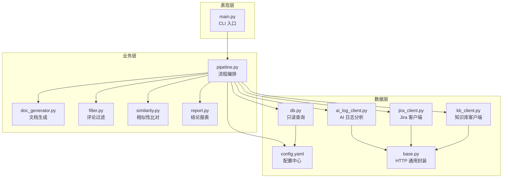
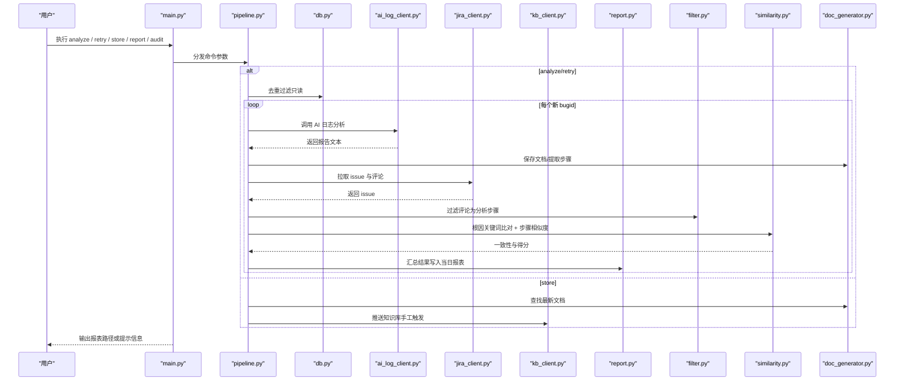
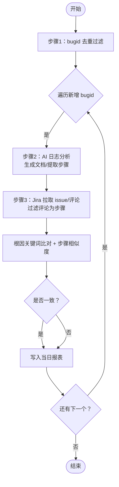
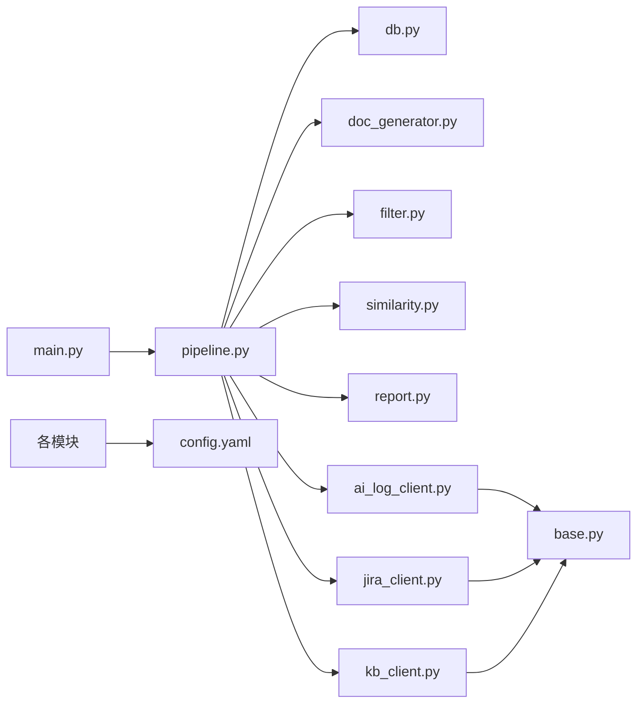

# 整体架构概览

<cite>
**本文引用的文件**
- [src/main.py](file://src/main.py)
- [src/pipeline.py](file://src/pipeline.py)
- [src/config.py](file://src/config.py)
- [config/config.yaml](file://config/config.yaml)
- [src/db.py](file://src/db.py)
- [src/clients/base.py](file://src/clients/base.py)
- [src/clients/jira_client.py](file://src/clients/jira_client.py)
- [src/clients/kb_client.py](file://src/clients/kb_client.py)
- [src/core/doc_generator.py](file://src/core/doc_generator.py)
- [src/core/filter.py](file://src/core/filter.py)
- [src/core/similarity.py](file://src/core/similarity.py)
- [src/core/report.py](file://src/core/report.py)
- [README.md](file://README.md)
</cite>

## 目录
1. [简介](#简介)
2. [项目结构](#项目结构)
3. [核心组件](#核心组件)
4. [架构总览](#架构总览)
5. [详细组件分析](#详细组件分析)
6. [依赖关系分析](#依赖关系分析)
7. [性能与可扩展性](#性能与可扩展性)
8. [故障排查指南](#故障排查指南)
9. [结论](#结论)
10. [附录：部署与环境要求](#附录部署与环境要求)

## 简介
本系统是一个“Bug 文档沉淀工具”，围绕“bugid 输入 → AI 日志分析 → Jira 比对 → 文档与报表输出 → 知识库手工入库”的闭环流程，提供可复用的 CLI、流程编排与外部集成能力。系统采用三层架构：
- 表现层（CLI）：通过命令行暴露 analyze/retry/store/report/audit 等子命令，负责参数解析与调度。
- 业务层（Pipeline）：编排去重过滤、AI 分析、文档生成、Jira 比对、相似性判定与报表生成的完整链路。
- 数据层（Clients/DB）：封装与 AI 日志分析工具、Jira、知识库系统的 HTTP 交互，以及本地 SQLite/MySQL 的只读查询。

设计原则：
- 模块化：按职责划分 CLI、流程、客户端、核心处理与配置，便于独立演进。
- 配置驱动：所有外部服务地址、超时、阈值、路径等均通过 YAML 配置集中管理。
- 错误隔离：单个 bug 分析失败不影响整体流程；HTTP 请求具备重试与统一错误日志。

系统边界：
- 与 AI 日志分析工具：调用其接口获取分析报告并提取步骤与根因结论。
- 与 Jira：拉取 issue 描述与评论，用于根因关键词匹配与步骤相似度比对。
- 与知识库：仅支持开发手动触发 store 命令推送已确认的分析文档，不做自动化入库。

## 项目结构
- 入口与编排
  - src/main.py：CLI 入口，定义子命令与参数解析，初始化数据库后分发到 pipeline。
  - src/pipeline.py：主流程编排，串联去重、AI 分析、文档生成、Jira 比对、相似性判定与报表生成。
- 数据与外部集成
  - src/db.py：SQLite/MySQL 连接与只读查询（bugid 去重、抽查候选池、已入库字段读取）。
  - src/clients/*：封装 AI 日志分析、Jira、知识库的 HTTP 调用，内置 mock 模式便于联调。
  - config/config.yaml：全局配置（数据库、外部接口、相似性阈值、审计抽样、输出路径等）。
- 核心处理
  - src/core/doc_generator.py：Markdown 文档生成、步骤提取、结论段落提取。
  - src/core/filter.py：从 Jira 评论中过滤噪音，提取分析步骤。
  - src/core/similarity.py：根因关键词命中比例与步骤 TF-IDF 余弦相似度计算。
  - src/core/report.py：每日结论 CSV 报表生成与合并。
- 运行产物
  - docs/YYYY-MM-DD/bugid.md：分析文档。
  - reports/YYYY-MM-DD_daily.csv：当日结论报表。
  - logs/app_YYYY-MM-DD.log：按日归档的运行日志。

图表来源
- [src/main.py:63-106](file://src/main.py#L63-L106)
- [src/pipeline.py:18-105](file://src/pipeline.py#L18-L105)
- [src/config.py:17-59](file://src/config.py#L17-L59)
- [config/config.yaml:1-63](file://config/config.yaml#L1-L63)
- [src/clients/base.py:12-39](file://src/clients/base.py#L12-L39)
- [src/clients/jira_client.py:32-54](file://src/clients/jira_client.py#L32-L54)
- [src/clients/kb_client.py:8-24](file://src/clients/kb_client.py#L8-L24)
- [src/core/doc_generator.py:14-79](file://src/core/doc_generator.py#L14-L79)
- [src/core/filter.py:29-49](file://src/core/filter.py#L29-L49)
- [src/core/similarity.py:23-75](file://src/core/similarity.py#L23-L75)
- [src/core/report.py:46-66](file://src/core/report.py#L46-L66)

章节来源
- [README.md:1-76](file://README.md#L1-L76)
- [src/main.py:1-111](file://src/main.py#L1-L111)
- [src/pipeline.py:1-105](file://src/pipeline.py#L1-L105)
- [config/config.yaml:1-63](file://config/config.yaml#L1-L63)

## 核心组件
- CLI（表现层）
  - 提供 analyze/retry/store/report/audit 五个子命令，分别对应“分析、重试、入库、查看报表、随机抽查”。
  - 统一异常捕获与退出码，保证命令执行失败时能明确反馈。
- Pipeline（业务层）
  - 步骤1：bugid 去重（基于数据库只读比对）。
  - 步骤2：调用 AI 日志分析工具，生成 Markdown 文档并提取步骤。
  - 步骤3：拉取 Jira issue 与评论，过滤评论为分析步骤，进行根因与步骤双重比对，写入当日报表。
  - 错误隔离：单条失败不中断整体流程，记录失败信息到报表。
- 数据层（Clients/DB）
  - db.py：SQLite/MySQL 连接、自动建表、只读查询（bugid 去重、抽查候选池、已入库字段）。
  - clients/*：对外部服务的 HTTP 封装，支持 mock 模式与重试机制。
- 核心处理（Core）
  - doc_generator.py：按日期分目录生成 bugid.md，提取步骤与结论。
  - filter.py：规则+关键词过滤评论，提取分析步骤。
  - similarity.py：TF-IDF 余弦相似度与根因关键词命中比例，阈值判定一致性。
  - report.py：生成/合并当日 CSV 结论报表，中文表头与 Excel 友好编码。

章节来源
- [src/main.py:29-90](file://src/main.py#L29-L90)
- [src/pipeline.py:18-105](file://src/pipeline.py#L18-L105)
- [src/db.py:42-132](file://src/db.py#L42-L132)
- [src/clients/base.py:12-39](file://src/clients/base.py#L12-L39)
- [src/clients/jira_client.py:32-54](file://src/clients/jira_client.py#L32-L54)
- [src/clients/kb_client.py:8-24](file://src/clients/kb_client.py#L8-L24)
- [src/core/doc_generator.py:14-79](file://src/core/doc_generator.py#L14-L79)
- [src/core/filter.py:29-49](file://src/core/filter.py#L29-L49)
- [src/core/similarity.py:23-75](file://src/core/similarity.py#L23-L75)
- [src/core/report.py:46-66](file://src/core/report.py#L46-L66)

## 架构总览
系统采用“表现层—业务层—数据层”的清晰分层，并通过配置驱动与错误隔离提升可维护性与健壮性。

图表来源
- [src/main.py:29-90](file://src/main.py#L29-L90)
- [src/pipeline.py:18-105](file://src/pipeline.py#L18-L105)
- [src/db.py:67-88](file://src/db.py#L67-L88)
- [src/clients/jira_client.py:32-54](file://src/clients/jira_client.py#L32-L54)
- [src/clients/kb_client.py:8-24](file://src/clients/kb_client.py#L8-L24)
- [src/core/filter.py:29-49](file://src/core/filter.py#L29-L49)
- [src/core/similarity.py:34-75](file://src/core/similarity.py#L34-L75)
- [src/core/doc_generator.py:14-79](file://src/core/doc_generator.py#L14-L79)
- [src/core/report.py:46-66](file://src/core/report.py#L46-L66)

## 详细组件分析

### 表现层：CLI（main.py）
- 功能要点
  - 构建子命令：analyze（分析）、retry（重试）、store（入库）、report（查看报表）、audit（抽查）。
  - 参数解析：支持 --trigger-time 多次指定，格式 bugid=时间。
  - 异常处理：统一捕获异常并记录日志，非零退出码。
- 关键路径
  - cmd_analyze：调用 pipeline.run_pipeline，输出当日报表路径。
  - cmd_retry：调用 pipeline.retry_bug，更新当日报表。
  - cmd_store：调用 pipeline.store_bug，推送知识库。
  - cmd_report：根据日期拼接报表路径并校验存在性。
  - cmd_audit：调用 core.audit 模块进行随机抽查。

章节来源
- [src/main.py:18-90](file://src/main.py#L18-L90)
- [src/main.py:93-111](file://src/main.py#L93-L111)

### 业务层：流程编排（pipeline.py）
- 功能要点
  - _analyze_single：对单个 bugid 执行 AI 分析、文档生成、Jira 比对、相似性判定。
  - run_pipeline：步骤1~3 完整流程，失败隔离，生成/合并当日报表。
  - retry_bug：失败重试，更新报表。
  - store_bug：查找最新文档并推送到知识库。
- 数据流
  - 输入：bugids 列表、可选 trigger_times。
  - 中间态：内存中的分析结果字典（包含状态、相似度、文档路径、错误信息等）。
  - 输出：CSV 报表路径。

图表来源
- [src/pipeline.py:18-87](file://src/pipeline.py#L18-L87)
- [src/core/filter.py:29-49](file://src/core/filter.py#L29-L49)
- [src/core/similarity.py:34-75](file://src/core/similarity.py#L34-L75)
- [src/core/report.py:46-66](file://src/core/report.py#L46-L66)

章节来源
- [src/pipeline.py:18-105](file://src/pipeline.py#L18-L105)

### 数据层：外部集成（clients/*）
- base.py：统一的 HTTP GET/POST 封装，带超时与重试，统一错误日志。
- jira_client.py：mock/真实模式切换，拉取 issue 与评论，提取报错原因与评论列表。
- kb_client.py：知识库入库接口，mock/真实模式切换，构造 payload 并发送。
- ai_log_client.py：AI 日志分析接口（在 pipeline 中调用），支持 mock 样例数据。

章节来源
- [src/clients/base.py:12-39](file://src/clients/base.py#L12-L39)
- [src/clients/jira_client.py:18-54](file://src/clients/jira_client.py#L18-L54)
- [src/clients/kb_client.py:8-24](file://src/clients/kb_client.py#L8-L24)

### 核心处理：文档、过滤、相似性、报表
- doc_generator.py：按日期分目录生成 bugid.md，提取步骤行与结论段落。
- filter.py：规则+关键词过滤评论，提取分析步骤，预留 LLM Agent 扩展点。
- similarity.py：TF-IDF 余弦相似度与根因关键词命中比例，阈值判定一致性。
- report.py：生成/合并当日 CSV 报表，中文表头与 Excel 友好编码。

章节来源
- [src/core/doc_generator.py:14-79](file://src/core/doc_generator.py#L14-L79)
- [src/core/filter.py:29-49](file://src/core/filter.py#L29-L49)
- [src/core/similarity.py:23-75](file://src/core/similarity.py#L23-L75)
- [src/core/report.py:46-66](file://src/core/report.py#L46-L66)

### 配置与日志（config.py + config.yaml）
- config.yaml：集中管理数据库连接、外部接口 URL/超时/字段映射、相似性阈值、审计抽样、输出路径。
- config.py：加载 YAML 配置并缓存，提供 get_path 与 setup_logger，确保输出目录存在与日志按日归档。

章节来源
- [config/config.yaml:1-63](file://config/config.yaml#L1-L63)
- [src/config.py:17-59](file://src/config.py#L17-L59)

## 依赖关系分析
- 模块耦合
  - main.py 依赖 pipeline、db、config、core.audit。
  - pipeline 依赖 db、clients、core.doc_generator、core.filter、core.similarity、core.report。
  - clients/* 依赖 base 与 config。
  - core.* 依赖 config。
- 外部依赖
  - requests：HTTP 请求。
  - sqlalchemy：数据库 ORM。
  - pandas：CSV 报表生成。
  - jieba、scikit-learn：中文分词与 TF-IDF 相似度计算。
  - pyyaml：YAML 配置解析。

图表来源
- [src/main.py:63-106](file://src/main.py#L63-L106)
- [src/pipeline.py:8-13](file://src/pipeline.py#L8-L13)
- [src/clients/base.py:12-39](file://src/clients/base.py#L12-L39)
- [src/config.py:17-59](file://src/config.py#L17-L59)

章节来源
- [src/main.py:63-106](file://src/main.py#L63-L106)
- [src/pipeline.py:8-13](file://src/pipeline.py#L8-L13)
- [src/clients/base.py:12-39](file://src/clients/base.py#L12-L39)
- [src/config.py:17-59](file://src/config.py#L17-L59)

## 性能与可扩展性
- 性能特征
  - 去重过滤：数据库只读查询，批量 in 条件，避免重复分析。
  - 相似度计算：TF-IDF 向量空间模型，复杂度与文本长度线性相关；可通过停用词与分词优化减少噪声。
  - 报表合并：pandas 读取已有 CSV 并按 bugid 覆盖合并，适合增量更新。
- 可扩展点
  - filter.py 的 _agent_filter：预留 LLM Agent 接入点，替换规则过滤为语义提炼。
  - similarity.py 的 compare_steps：可替换为模型打分或更复杂的对齐算法。
  - clients/*：支持 mock/真实模式切换，便于开发与测试。
- 优化建议
  - 对大文本相似度计算引入缓存或批量化。
  - 对高并发场景考虑异步化或任务队列（如 Celery）。
  - 对日志与报表进行轮转与压缩，控制磁盘占用。

[本节为通用指导，不直接分析具体文件]

## 故障排查指南
- 常见问题定位
  - 接口请求失败：检查 base.py 的重试与日志，确认 config.yaml 中 URL、超时、认证是否正确。
  - 文档未生成：检查 doc_generator.save_document 的路径与权限，确认 output.doc_dir 是否存在。
  - 报表为空：检查 pipeline 的错误隔离逻辑，确认失败结果是否写入 error_msg。
  - 相似度异常：检查 filter.py 的评论过滤是否过严，调整 STOP_WORDS 与阈值。
- 日志与报表
  - 日志：logs/app_YYYY-MM-DD.log，按日归档，包含各模块日志。
  - 报表：reports/YYYY-MM-DD_daily.csv，包含 bugid、状态、相似度、错误信息等。
- 调试建议
  - 使用 mock 模式快速验证流程，再切换到真实接口。
  - 逐步缩小 bugid 范围，定位问题所在环节。
  - 结合 Allure 测试结果与日志，复现与定位问题。

章节来源
- [src/clients/base.py:12-39](file://src/clients/base.py#L12-L39)
- [src/core/doc_generator.py:14-79](file://src/core/doc_generator.py#L14-L79)
- [src/core/report.py:46-66](file://src/core/report.py#L46-L66)
- [src/core/filter.py:29-49](file://src/core/filter.py#L29-L49)
- [src/config.py:37-59](file://src/config.py#L37-L59)

## 结论
本系统以清晰的三层架构与配置驱动实现 Bug 文档沉淀的闭环流程，通过错误隔离保障稳定性，通过模块化与可扩展点支持后续演进。CLI 提供简洁的操作界面，Pipeline 编排完整链路，Clients 封装外部集成，Core 提供文档、过滤、相似性与报表能力。部署简单，环境要求低，适合团队内快速落地与持续优化。

[本节为总结性内容，不直接分析具体文件]

## 附录：部署与环境要求
- Python 环境
  - 安装依赖：pip install -r requirements.txt。
  - 推荐版本：Python 3.8+（依据依赖库要求）。
- 外部服务依赖
  - AI 日志分析工具：配置 ai_log_api.url 与字段映射，mock=true 时使用内置样例。
  - Jira RESTAPI：配置 jira_api.url、username/token，mock=true 时使用内置样例。
  - 知识库系统：配置 knowledge_base_api.url 与字段映射，mock=true 时使用内置样例。
- 数据库
  - 默认 SQLite：sqlite:///data/app.db，自动建表。
  - 可切换 MySQL：修改 database.url 为连接串。
- 输出路径
  - docs：分析文档目录。
  - reports：每日结论报表目录。
  - logs：运行日志目录。
- 运行方式
  - analyze：python -m src.main analyze BUG-xxx --trigger-time "BUG-xxx=时间"。
  - retry：python -m src.main retry BUG-xxx。
  - store：python -m src.main store BUG-xxx。
  - report：python -m src.main report --date YYYY-MM-DD。
  - audit：python -m src.main audit [--count N]。

章节来源
- [README.md:15-50](file://README.md#L15-L50)
- [config/config.yaml:1-63](file://config/config.yaml#L1-L63)
- [src/config.py:28-34](file://src/config.py#L28-L34)
- [src/db.py:42-57](file://src/db.py#L42-L57)