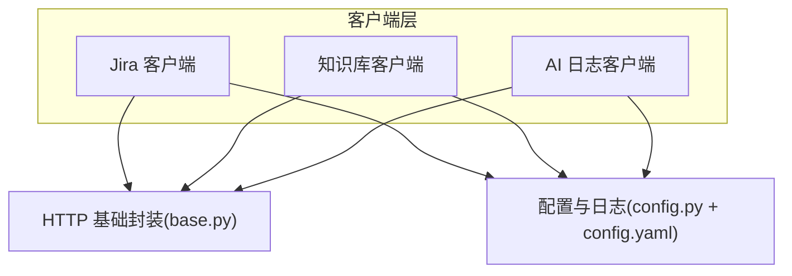
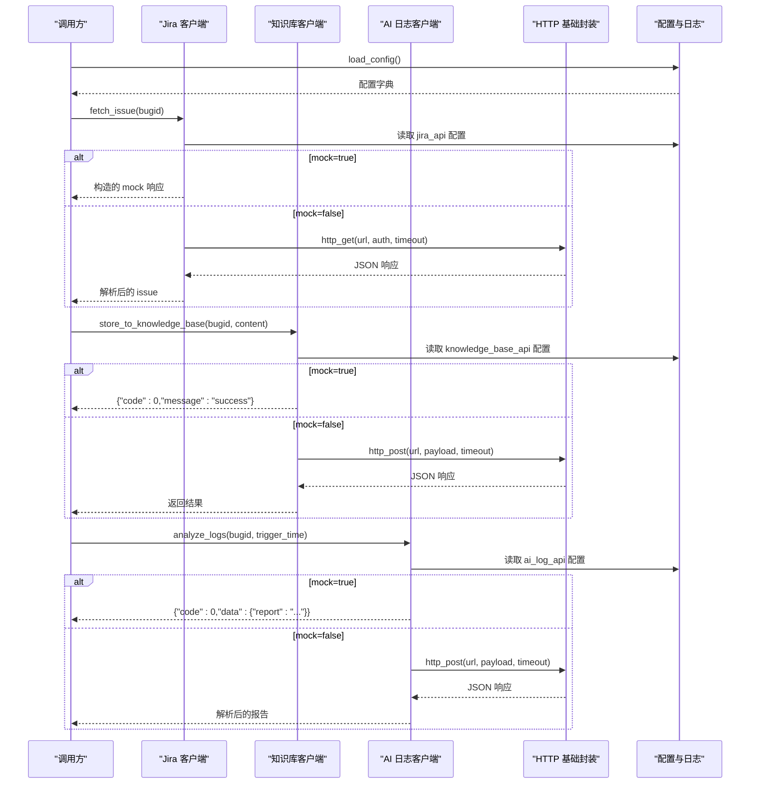
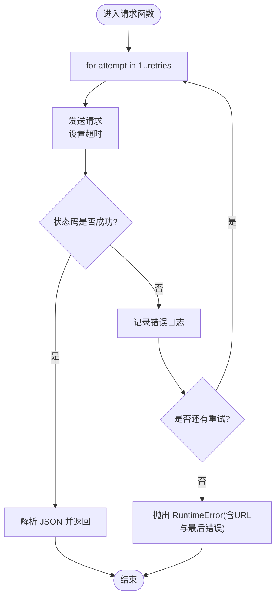
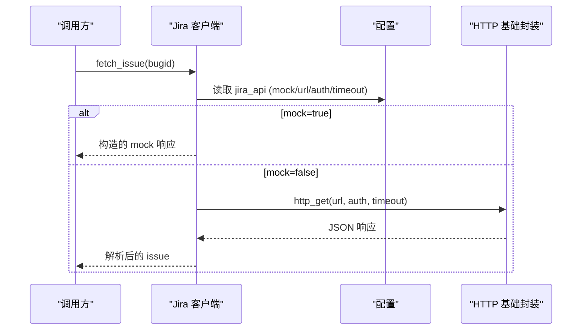
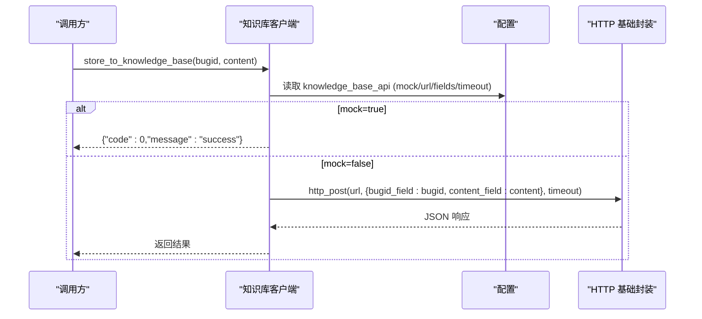
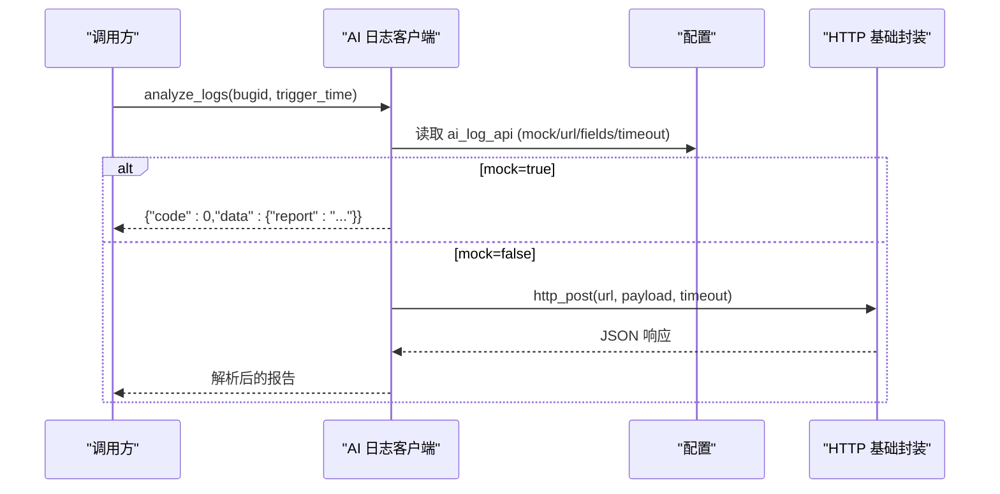
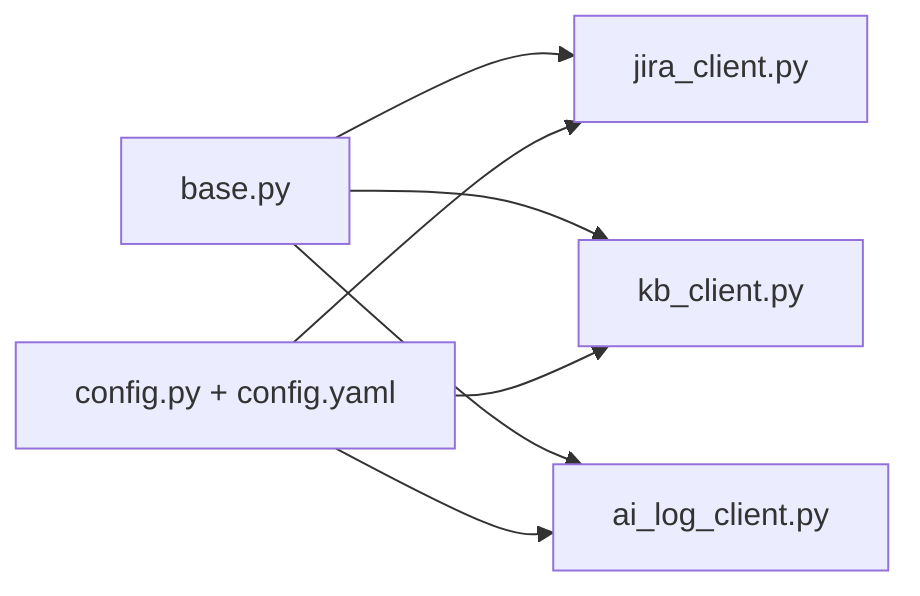

# HTTP客户端封装

<cite>
**本文引用的文件**
- [base.py](file://src/clients/base.py)
- [jira_client.py](file://src/clients/jira_client.py)
- [kb_client.py](file://src/clients/kb_client.py)
- [ai_log_client.py](file://src/clients/ai_log_client.py)
- [config.py](file://src/config.py)
- [config.yaml](file://config/config.yaml)
- [README.md](file://README.md)
</cite>

## 目录
1. [简介](#简介)
2. [项目结构](#项目结构)
3. [核心组件](#核心组件)
4. [架构总览](#架构总览)
5. [详细组件分析](#详细组件分析)
6. [依赖关系分析](#依赖关系分析)
7. [性能与稳定性](#性能与稳定性)
8. [故障排查指南](#故障排查指南)
9. [结论](#结论)
10. [附录：配置与使用示例](#附录配置与使用示例)

## 简介
本仓库实现了一套统一的 HTTP 客户端封装，围绕 base.py 提供 GET/POST 请求能力，内置重试、超时控制与错误日志；在此基础上实现了 Jira 客户端、知识库客户端以及 AI 日志分析客户端。所有客户端均支持通过配置文件在 Mock 模式与真实模式之间动态切换，便于开发与测试。

## 项目结构
- src/clients/base.py：通用 HTTP 请求封装（GET/POST），统一重试、超时、错误日志
- src/clients/jira_client.py：Jira REST API 客户端，支持 mock/真实模式
- src/clients/kb_client.py：知识库入库客户端，支持 mock/真实模式
- src/clients/ai_log_client.py：AI 日志分析客户端，支持 mock/真实模式
- src/config.py：全局配置加载与日志初始化
- config/config.yaml：外部接口配置（mock开关、URL、超时、字段映射等）
- README.md：使用说明与流程说明

图表来源
- [base.py:12-38](file://src/clients/base.py#L12-L38)
- [jira_client.py:32-43](file://src/clients/jira_client.py#L32-L43)
- [kb_client.py:8-23](file://src/clients/kb_client.py#L8-L23)
- [ai_log_client.py:32-48](file://src/clients/ai_log_client.py#L32-L48)
- [config.py:17-25](file://src/config.py#L17-L25)
- [config.yaml:19-35](file://config/config.yaml#L19-L35)

章节来源
- [base.py:1-39](file://src/clients/base.py#L1-L39)
- [jira_client.py:1-54](file://src/clients/jira_client.py#L1-L54)
- [kb_client.py:1-24](file://src/clients/kb_client.py#L1-L24)
- [ai_log_client.py:1-57](file://src/clients/ai_log_client.py#L1-L57)
- [config.py:1-59](file://src/config.py#L1-L59)
- [config.yaml:1-63](file://config/config.yaml#L1-L63)
- [README.md:1-76](file://README.md#L1-L76)

## 核心组件
- HTTP 基础封装（base.py）
  - 提供 http_get 与 http_post，统一处理超时、重试、异常捕获与日志记录
  - 默认重试次数为 3，可通过参数覆盖
- Jira 客户端（jira_client.py）
  - fetch_issue：根据 bugid 获取 issue，支持 mock/真实模式
  - extract_error_cause / extract_comments：从返回的 issue 中抽取报错原因与评论列表
- 知识库客户端（kb_client.py）
  - store_to_knowledge_base：将分析文档内容提交到知识库，支持 mock/真实模式
- AI 日志客户端（ai_log_client.py）
  - analyze_logs：调用 AI 日志分析接口或返回 mock 报告
  - extract_report：从响应中提取报告文本

章节来源
- [base.py:12-38](file://src/clients/base.py#L12-L38)
- [jira_client.py:32-53](file://src/clients/jira_client.py#L32-L53)
- [kb_client.py:8-23](file://src/clients/kb_client.py#L8-L23)
- [ai_log_client.py:32-56](file://src/clients/ai_log_client.py#L32-L56)

## 架构总览
整体采用“基础 HTTP 封装 + 领域客户端”的分层设计。各客户端通过配置模块读取接口地址、认证信息、超时与 mock 开关，再调用基础封装发起网络请求。Mock 模式下直接返回构造数据，避免真实网络访问。

图表来源
- [jira_client.py:32-43](file://src/clients/jira_client.py#L32-L43)
- [kb_client.py:8-23](file://src/clients/kb_client.py#L8-L23)
- [ai_log_client.py:32-48](file://src/clients/ai_log_client.py#L32-L48)
- [base.py:12-38](file://src/clients/base.py#L12-L38)
- [config.py:17-25](file://src/config.py#L17-L25)

## 详细组件分析

### HTTP 基础封装（base.py）
- 功能要点
  - http_post：发送 POST 请求，自动序列化 JSON，失败时重试并记录错误日志，最终抛出 RuntimeError
  - http_get：发送 GET 请求，支持 params 与 auth，失败时重试并记录错误日志，最终抛出 RuntimeError
  - 超时控制：timeout 参数默认 30s，可由上层传入
  - 重试机制：默认 3 次，循环内捕获异常并记录日志，最后一次失败抛出异常
- 复杂度与性能
  - 时间复杂度 O(retries)，空间复杂度 O(1)
  - 未使用连接池复用，每次请求新建连接；在高并发场景下建议引入会话级连接池以提升吞吐
- 错误处理
  - 捕获所有异常，记录 URL、尝试次数与错误信息
  - 最终统一抛出包含 URL 与最后错误信息的 RuntimeError，便于上层定位

图表来源
- [base.py:12-38](file://src/clients/base.py#L12-L38)

章节来源
- [base.py:1-39](file://src/clients/base.py#L1-L39)

### Jira 客户端（jira_client.py）
- 认证方式
  - 当配置中存在 username 与 token 时，以 Basic Auth 元组形式传入 http_get
- API 端点映射
  - URL 拼接规则：{url}/{bugid}
  - 请求方法：GET
  - 超时：从配置读取，默认 30s
- 数据格式转换
  - 返回结构包含 fields.description（报错原因）与 comments（评论列表）
  - 提供 extract_error_cause 与 extract_comments 进行字段提取
- Mock 模式
  - 当配置 jira_api.mock=true 时，直接返回构造的 mock 响应，不发起真实请求
  - 若 bugid 包含 FAIL，则返回与 AI 报告不一致的根因，用于验证比对失败分支

图表来源
- [jira_client.py:32-43](file://src/clients/jira_client.py#L32-L43)
- [base.py:26-38](file://src/clients/base.py#L26-L38)
- [config.yaml:19-27](file://config/config.yaml#L19-L27)

章节来源
- [jira_client.py:1-54](file://src/clients/jira_client.py#L1-L54)
- [config.yaml:19-27](file://config/config.yaml#L19-L27)

### 知识库客户端（kb_client.py）
- API 端点映射
  - URL：knowledge_base_api.url
  - 请求方法：POST
  - 超时：从配置读取，默认 30s
- 数据格式转换
  - 入参字段名由配置中的 bugid_field 与 content_field 指定，组装 payload 后发送
  - 返回值为接口原始 JSON
- Mock 模式
  - 当配置 knowledge_base_api.mock=true 时，直接返回成功标识，不发起真实请求

图表来源
- [kb_client.py:8-23](file://src/clients/kb_client.py#L8-L23)
- [base.py:12-23](file://src/clients/base.py#L12-L23)
- [config.yaml:29-35](file://config/config.yaml#L29-L35)

章节来源
- [kb_client.py:1-24](file://src/clients/kb_client.py#L1-L24)
- [config.yaml:29-35](file://config/config.yaml#L29-L35)

### AI 日志客户端（ai_log_client.py）
- API 端点映射
  - URL：ai_log_api.url
  - 请求方法：POST
  - 超时：从配置读取，默认 60s
- 数据格式转换
  - 入参字段名由配置中的 bugid_field 与 trigger_time_field 指定
  - 返回值期望包含 data.report，extract_report 会校验该字段存在
- Mock 模式
  - 当配置 ai_log_api.mock=true 时，返回构造的 Markdown 分析报告
  - 若 bugid 包含 FAIL，返回不一致的报告，用于验证比对失败分支

图表来源
- [ai_log_client.py:32-56](file://src/clients/ai_log_client.py#L32-L56)
- [base.py:12-23](file://src/clients/base.py#L12-L23)
- [config.yaml:10-18](file://config/config.yaml#L10-L18)

章节来源
- [ai_log_client.py:1-57](file://src/clients/ai_log_client.py#L1-L57)
- [config.yaml:10-18](file://config/config.yaml#L10-L18)

## 依赖关系分析
- 耦合关系
  - 三个业务客户端均依赖 base.py 的 http_get/http_post，形成稳定的底层抽象
  - 所有客户端依赖 config.py 的配置加载与日志初始化，保证行为一致
- 外部依赖
  - requests：HTTP 客户端库
  - yaml：配置文件解析
- 潜在风险
  - base.py 未复用连接，高并发下可能产生大量短连接
  - 未对服务端限流做退避策略，仅固定次数重试

图表来源
- [base.py:12-38](file://src/clients/base.py#L12-L38)
- [jira_client.py:1-54](file://src/clients/jira_client.py#L1-L54)
- [kb_client.py:1-24](file://src/clients/kb_client.py#L1-L24)
- [ai_log_client.py:1-57](file://src/clients/ai_log_client.py#L1-L57)
- [config.py:1-59](file://src/config.py#L1-L59)
- [config.yaml:1-63](file://config/config.yaml#L1-L63)

章节来源
- [base.py:1-39](file://src/clients/base.py#L1-L39)
- [jira_client.py:1-54](file://src/clients/jira_client.py#L1-L54)
- [kb_client.py:1-24](file://src/clients/kb_client.py#L1-L24)
- [ai_log_client.py:1-57](file://src/clients/ai_log_client.py#L1-L57)
- [config.py:1-59](file://src/config.py#L1-L59)
- [config.yaml:1-63](file://config/config.yaml#L1-L63)

## 性能与稳定性
- 连接池管理
  - 当前实现未显式创建会话或使用连接池，建议在高频调用场景引入 requests.Session 复用连接，减少握手开销
- 请求重试机制
  - 默认重试 3 次，无指数退避；可考虑增加随机抖动与退避策略以降低雪崩风险
- 超时控制
  - 各客户端均支持超时配置，建议根据服务 SLA 合理设置，避免长尾阻塞
- 错误处理
  - 统一捕获异常并记录日志，最终抛出明确异常；上层应做好异常分类与降级策略
- 日志与监控
  - 已按日期归档日志，建议结合指标埋点统计成功率、延迟分布与重试次数

[本节为通用指导，无需特定文件引用]

## 故障排查指南
- 常见问题定位
  - 网络不可达/超时：检查 config.yaml 中的 url 与 timeout，确认网络连通性与目标服务可用性
  - 认证失败：检查 jira_api.username 与 jira_api.token 是否正确填写
  - 字段映射错误：核对 ai_log_api/knowledge_base_api 的字段映射配置是否与真实接口一致
  - 响应结构不符：AI 客户端 extract_report 要求 data.report 存在，否则抛出 ValueError
- 日志查看
  - 控制台输出与 logs/app_YYYY-MM-DD.log 均有记录，关注 “第 N 次请求失败” 的错误信息
- 快速验证
  - 将对应接口的 mock 设置为 true，验证业务流程逻辑是否正确
  - 逐步关闭 mock，定位具体失败环节

章节来源
- [base.py:12-38](file://src/clients/base.py#L12-L38)
- [ai_log_client.py:51-56](file://src/clients/ai_log_client.py#L51-L56)
- [config.py:37-58](file://src/config.py#L37-L58)
- [config.yaml:10-35](file://config/config.yaml#L10-L35)

## 结论
本封装通过 base.py 统一了 HTTP 请求的重试、超时与错误日志，使上层客户端聚焦于业务语义。配合 config.yaml 的 mock 开关，可在开发测试阶段快速验证，在生产环境无缝切换到真实接口。建议后续引入连接池与更完善的重试退避策略，以进一步提升稳定性与性能。

[本节为总结性内容，无需特定文件引用]

## 附录：配置与使用示例
- 配置项说明
  - ai_log_api：mock、url、timeout、bugid_field、trigger_time_field
  - jira_api：mock、url、timeout、username、token
  - knowledge_base_api：mock、url、timeout、bugid_field、content_field
- 客户端初始化与调用示例（概念性描述）
  - Jira 客户端：读取配置 -> 判断 mock -> 调用 http_get -> 解析 issue -> 抽取报错原因与评论
  - 知识库客户端：读取配置 -> 判断 mock -> 组装 payload -> 调用 http_post -> 返回结果
  - AI 日志客户端：读取配置 -> 判断 mock -> 调用 http_post -> 提取 report
- 运行方式参考
  - 详见 README 的使用方式部分，包括 analyze、retry、store、report、audit 等命令

章节来源
- [config.yaml:10-35](file://config/config.yaml#L10-L35)
- [README.md:30-50](file://README.md#L30-L50)