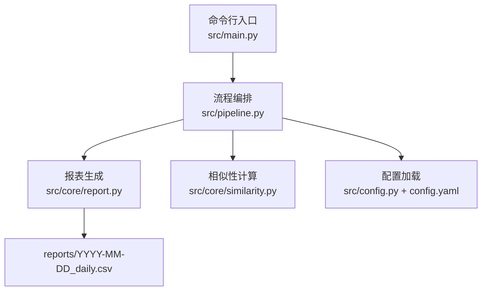
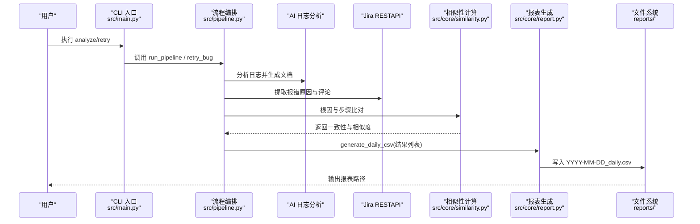
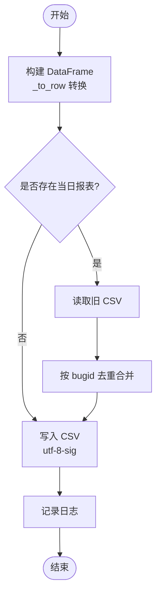
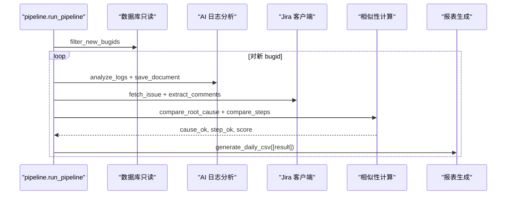
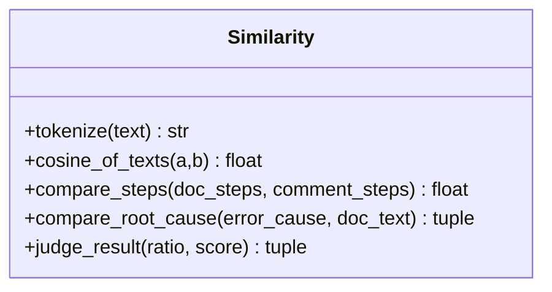
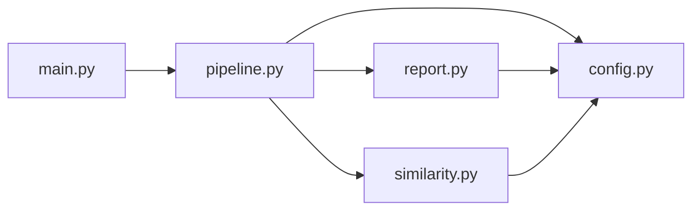

# 报表生成器

<cite>
**本文引用的文件**
- [report.py](file://src/core/report.py)
- [pipeline.py](file://src/pipeline.py)
- [similarity.py](file://src/core/similarity.py)
- [config.yaml](file://config/config.yaml)
- [config.py](file://src/config.py)
- [main.py](file://src/main.py)
- [README.md](file://README.md)
</cite>

## 目录
1. [简介](#简介)
2. [项目结构](#项目结构)
3. [核心组件](#核心组件)
4. [架构总览](#架构总览)
5. [详细组件分析](#详细组件分析)
6. [依赖关系分析](#依赖关系分析)
7. [性能考量](#性能考量)
8. [故障排查指南](#故障排查指南)
9. [结论](#结论)
10. [附录](#附录)

## 简介
本模块负责将 Bug 日志分析结果汇总为“每日结论报表”，以 CSV 形式输出，便于人工审阅与后续自动化处理。报表按天归档，同一日多次运行会按 bugid 覆盖合并，避免重复行。报表字段包含 BugID、状态、相似度分数、分析结果等关键信息，并支持历史趋势分析与扩展导出格式。

## 项目结构
- 入口命令：通过 CLI 触发 analyze/retry/store/report/audit 子命令，其中 analyze 与 retry 会生成或更新当日报表。
- 流程编排：pipeline 串联去重过滤、AI 分析、Jira 比对与结论报表生成。
- 报表生成：core/report 负责将内存中的分析结果转换为 CSV 并落盘。
- 相似性计算：core/similarity 提供根因关键词命中比例与步骤 TF-IDF 余弦相似度，用于判定一致性与相似度分数。
- 配置管理：config.yaml 定义输出路径、阈值、接口等；config.py 提供加载与路径解析。

图表来源
- [main.py:63-90](file://src/main.py#L63-L90)
- [pipeline.py:54-86](file://src/pipeline.py#L54-L86)
- [report.py:46-65](file://src/core/report.py#L46-L65)
- [config.py:17-34](file://src/config.py#L17-L34)
- [config.yaml:58-62](file://config/config.yaml#L58-L62)

章节来源
- [main.py:1-111](file://src/main.py#L1-L111)
- [pipeline.py:1-105](file://src/pipeline.py#L1-L105)
- [report.py:1-66](file://src/core/report.py#L1-L66)
- [config.py:1-59](file://src/config.py#L1-L59)
- [config.yaml:1-63](file://config/config.yaml#L1-L63)
- [README.md:1-76](file://README.md#L1-L76)

## 核心组件
- 报表生成器（report.py）
  - 负责将分析结果列表转换为 DataFrame，按日期写入 reports 目录下的 CSV，支持同日覆盖合并。
  - 提供列定义、布尔值中文转换、时间格式化等工具函数。
- 流程编排（pipeline.py）
  - 调用 AI 日志分析、文档生成、Jira 数据提取与评论过滤，执行根因与步骤双重比对，产出内存结果并调用报表生成器。
  - 失败不中断整体流程，记录失败行到报表。
- 相似性计算（similarity.py）
  - 基于 TF-IDF 与余弦相似度计算步骤一致性得分；基于关键词命中比例判定根因一致性。
  - 阈值来自配置文件 similarity.threshold 与 similarity.root_cause_hit_ratio。
- 配置管理（config.py + config.yaml）
  - 统一加载 YAML 配置，提供 get_path 获取绝对路径并确保目录存在。
  - 定义输出目录、接口参数映射、相似性阈值、审计抽样等。

章节来源
- [report.py:15-65](file://src/core/report.py#L15-L65)
- [pipeline.py:18-86](file://src/pipeline.py#L18-L86)
- [similarity.py:17-75](file://src/core/similarity.py#L17-L75)
- [config.py:17-34](file://src/config.py#L17-L34)
- [config.yaml:37-62](file://config/config.yaml#L37-L62)

## 架构总览
报表生成的端到端流程如下：
- CLI 接收 analyze/retry 命令，进入 pipeline。
- pipeline 对每个 bugid 执行 AI 分析、文档生成、Jira 数据提取与评论过滤。
- 使用 similarity 进行根因与步骤双重比对，得到 status、root_cause_match、step_match、similarity_score 等字段。
- 将结果列表交给 report.generate_daily_csv，生成或合并当日 CSV。
- 日志与路径由 config 统一管理。

图表来源
- [main.py:29-54](file://src/main.py#L29-L54)
- [pipeline.py:18-86](file://src/pipeline.py#L18-L86)
- [similarity.py:34-75](file://src/core/similarity.py#L34-L75)
- [report.py:46-65](file://src/core/report.py#L46-L65)

## 详细组件分析

### 报表生成器（report.py）
- 列定义与字段含义
  - bugid：唯一标识的 Bug 编号。
  - 触发时间：该次分析的触发时间点（可选）。
  - 分析状态：success 或 failed，表示本次分析是否成功。
  - 根因一致：根据 root_cause_hit_ratio 阈值判定是否为“是/否”。
  - 步骤一致：根据 similarity.threshold 阈值判定是否为“是/否”。
  - 步骤相似度：TF-IDF 余弦相似度平均值，保留三位小数。
  - 文档路径：AI 生成的分析文档路径。
  - 错误信息：异常时的错误摘要（截断至 1000 字符）。
  - 分析时间：本次分析完成的时间戳。
- 数据处理逻辑
  - 将内存结果字典列表转换为 DataFrame，列顺序固定。
  - 若当日 CSV 已存在，读取旧表并按 bugid 去重合并，新结果覆盖同 bugid 的旧行。
  - 使用 utf-8-sig 编码确保 Excel 打开中文不乱码。
- 历史趋势分析
  - 由于按日期分文件存储，可通过对比多日 CSV 观察指标变化（如步骤相似度均值、一致率、失败率等），实现趋势分析。

图表来源
- [report.py:29-65](file://src/core/report.py#L29-L65)

章节来源
- [report.py:15-65](file://src/core/report.py#L15-L65)

### 流程编排（pipeline.py）
- 单条分析流程
  - 调用 AI 日志分析并保存文档，解析文档步骤。
  - 从 Jira 提取报错原因与评论，评论经 Agent 过滤为分析步骤。
  - 使用 similarity.compare_root_cause 与 compare_steps 计算一致性与相似度。
  - 构造结果字典，包含 bugid、trigger_time、status、root_cause_match、step_match、similarity_score、doc_path、error_msg、analysis_time。
- 批量处理与失败容错
  - 遍历新 bugid 列表，单个失败不影响整体，记录失败行到报表。
  - 最终调用 report.generate_daily_csv 汇总生成/合并当日报表。
- 重试机制
  - retry_bug 重新执行步骤2~3，并将结果追加到当日报表。

图表来源
- [pipeline.py:18-86](file://src/pipeline.py#L18-L86)
- [similarity.py:34-75](file://src/core/similarity.py#L34-L75)
- [report.py:46-65](file://src/core/report.py#L46-L65)

章节来源
- [pipeline.py:18-86](file://src/pipeline.py#L18-L86)

### 相似性计算（similarity.py）
- 步骤相似度
  - 对文档步骤与评论步骤逐条取最佳匹配，计算 TF-IDF 余弦相似度后求平均。
  - 输入为空时返回 0.0，并记录警告日志。
- 根因一致性
  - 对报错原因进行分词去停用词，统计在分析文档中的命中比例。
  - 低于阈值则判定不一致。
- 判定逻辑
  - judge_result 读取配置阈值，返回 (root_cause_match, step_match)。

图表来源
- [similarity.py:17-75](file://src/core/similarity.py#L17-L75)

章节来源
- [similarity.py:17-75](file://src/core/similarity.py#L17-L75)

### 配置管理（config.py + config.yaml）
- 输出路径
  - output.report_dir 指定报表目录，默认 reports。
  - get_path 返回绝对路径并确保目录存在。
- 相似性阈值
  - similarity.threshold：步骤相似度阈值（默认 0.7）。
  - similarity.root_cause_hit_ratio：根因关键词命中比例阈值（默认 0.5）。
- 外部接口与审计
  - ai_log_api、jira_api、knowledge_base_api 支持 mock 模式与真实 URL。
  - audit.sample_count、audited_file、report_file 等用于随机抽查复核。

章节来源
- [config.py:17-34](file://src/config.py#L17-L34)
- [config.yaml:37-62](file://config/config.yaml#L37-L62)

## 依赖关系分析
- 模块耦合
  - pipeline 依赖 clients（AI、Jira）、core（doc_generator、filter、similarity）、report。
  - report 依赖 config 的路径与日志。
  - similarity 依赖 config 的阈值。
- 外部依赖
  - pandas：DataFrame 构建与 CSV 读写。
  - jieba、sklearn：文本分词与 TF-IDF 相似度计算。
  - yaml：配置文件加载。
- 潜在循环依赖
  - 当前结构无循环依赖，职责清晰。

图表来源
- [main.py:63-90](file://src/main.py#L63-L90)
- [pipeline.py:1-15](file://src/pipeline.py#L1-L15)
- [report.py:1-13](file://src/core/report.py#L1-L13)
- [similarity.py:1-11](file://src/core/similarity.py#L1-L11)
- [config.py:1-15](file://src/config.py#L1-L15)

章节来源
- [main.py:63-90](file://src/main.py#L63-L90)
- [pipeline.py:1-15](file://src/pipeline.py#L1-L15)
- [report.py:1-13](file://src/core/report.py#L1-L13)
- [similarity.py:1-11](file://src/core/similarity.py#L1-L11)
- [config.py:1-15](file://src/config.py#L1-L15)

## 性能考量
- 文本相似度计算
  - TF-IDF 向量化与余弦相似度在大数据量下可能较慢，建议对长文本进行分段或采样。
  - 可考虑缓存向量或增量更新以减少重复计算。
- CSV 合并
  - 同日多次运行会读取并合并旧 CSV，注意大文件 I/O 开销；必要时可按 bugid 分批写入临时文件再合并。
- 失败容错
  - 单个 bug 失败不中断流程，但大量失败会影响报表质量；建议在 pipeline 层增加重试与告警。
- 配置阈值调优
  - similarity.threshold 与 root_cause_hit_ratio 影响一致性与相似度分数，需结合业务场景调整。

[本节为通用性能讨论，无需特定文件引用]

## 故障排查指南
- 报表未生成
  - 检查 CLI 是否执行了 analyze 或 retry；确认 report_dir 路径存在且可写。
  - 查看 logs/app_YYYY-MM-DD.log 中是否有异常。
- 中文乱码
  - 报表使用 utf-8-sig 编码，Excel 打开应正常；若仍乱码，检查系统控制台编码设置。
- 相似度为 0
  - 检查文档步骤与评论步骤是否为空；确认 jieba 分词与停用词配置合理。
- 阈值不生效
  - 核对 config.yaml 中 similarity.threshold 与 root_cause_hit_ratio 是否正确加载。

章节来源
- [main.py:93-106](file://src/main.py#L93-L106)
- [config.py:37-59](file://src/config.py#L37-L59)
- [report.py:57-65](file://src/core/report.py#L57-L65)
- [similarity.py:34-49](file://src/core/similarity.py#L34-L49)

## 结论
报表生成器以简洁可靠的 CSV 输出为核心，结合相似性计算与配置化阈值，实现了 Bug 分析结果的标准化归档与趋势分析基础。通过 pipeline 的失败容错与同日覆盖合并策略，保证了报表的一致性与可追溯性。未来可扩展更多统计维度与导出格式，以满足更复杂的分析需求。

[本节为总结性内容，无需特定文件引用]

## 附录

### 报表字段定义与计算逻辑
- BugID：唯一标识，来源于上游传入或数据库过滤后的新 bugid。
- 状态：success 或 failed，取决于单次分析是否抛出异常。
- 相似度分数：步骤相似度平均值，采用 TF-IDF 余弦相似度，保留三位小数。
- 分析结果：
  - 根因一致：根因关键词命中比例 >= root_cause_hit_ratio 时为“是”。
  - 步骤一致：步骤相似度 >= threshold 时为“是”。
- 其他字段：触发时间、文档路径、错误信息、分析时间，分别来源于 AI 分析、Jira 数据与时间戳。

章节来源
- [pipeline.py:41-51](file://src/pipeline.py#L41-L51)
- [similarity.py:52-75](file://src/core/similarity.py#L52-L75)
- [report.py:29-43](file://src/core/report.py#L29-L43)

### 报表文件命名规范、存储位置与归档策略
- 命名规范：YYYY-MM-DD_daily.csv。
- 存储位置：reports 目录（由 config.output.report_dir 指定）。
- 归档策略：同日多次运行按 bugid 覆盖合并；跨日文件独立保存，便于历史趋势分析。

章节来源
- [config.yaml:58-62](file://config/config.yaml#L58-L62)
- [report.py:46-65](file://src/core/report.py#L46-L65)

### 如何扩展新的统计维度与导出格式
- 新增统计维度
  - 在 pipeline._analyze_single 的结果字典中添加新字段。
  - 在 report._to_row 中映射到新列，并在 COLUMNS 中声明。
  - 如需聚合统计，可在 pipeline 层计算后再写入报表。
- 新增导出格式
  - 复用 DataFrame 能力，添加 to_excel、to_json 等方法。
  - 保持编码与列顺序一致，确保下游系统兼容。

章节来源
- [pipeline.py:41-51](file://src/pipeline.py#L41-L51)
- [report.py:15-43](file://src/core/report.py#L15-L43)

### 报表样例展示与数据解读指南
- 样例字段示例（示意）
  - bugid: DEMO-1
  - 触发时间: 2026-08-12 10:00:00
  - 分析状态: success
  - 根因一致: 是
  - 步骤一致: 是
  - 步骤相似度: 0.856
  - 文档路径: docs/2026-08-12/DEMO-1.md
  - 错误信息: -
  - 分析时间: 2026-08-12 10:05:00
- 解读要点
  - 关注“步骤一致”与“步骤相似度”判断分析质量。
  - “根因一致”反映文档与 Jira 报错原因的契合度。
  - 失败行通过“错误信息”定位问题。

章节来源
- [pipeline.py:41-51](file://src/pipeline.py#L41-L51)
- [report.py:29-43](file://src/core/report.py#L29-L43)

### 报表自动化生成与定时任务配置方法
- 手动触发
  - 使用 CLI：python -m src.main analyze BUG-xxx --trigger-time "BUG-xxx=时间"
  - 重试失败：python -m src.main retry BUG-xxx
  - 查看报表：python -m src.main report --date YYYY-MM-DD
- 定时任务
  - 在操作系统级调度器（如 cron、Windows Task Scheduler）中定期执行上述 CLI 命令。
  - 结合 CI/CD 流水线，在测试或发布后自动触发 analyze，生成当日报表。
  - 注意环境变量与 Python 环境一致性，确保依赖安装完整。

章节来源
- [main.py:29-54](file://src/main.py#L29-L54)
- [README.md:32-49](file://README.md#L32-L49)