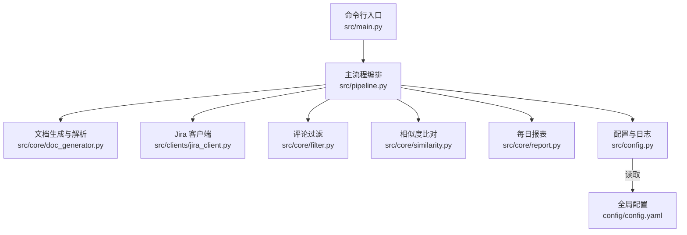
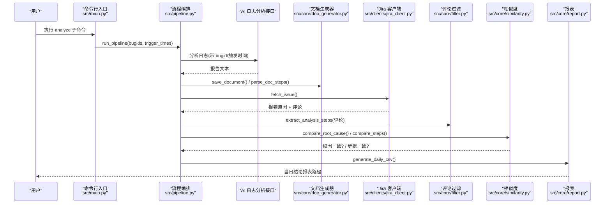
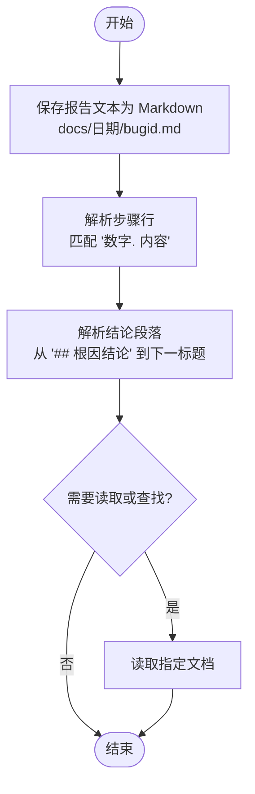
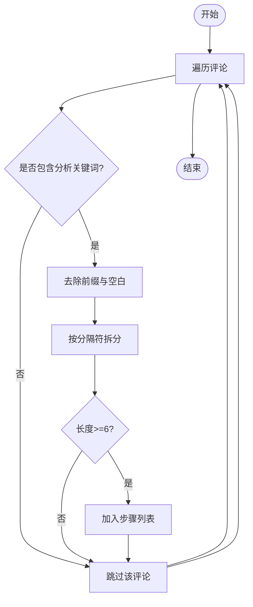
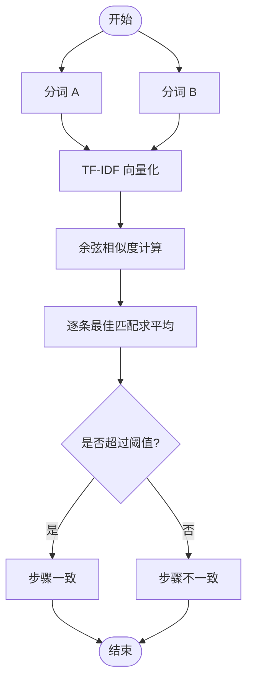
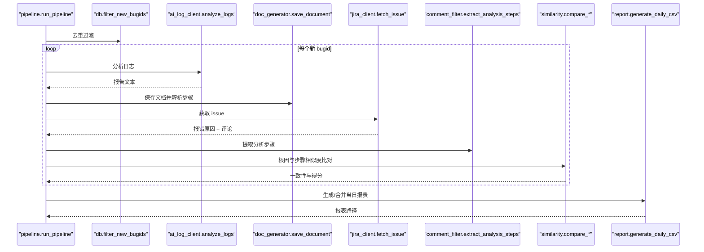
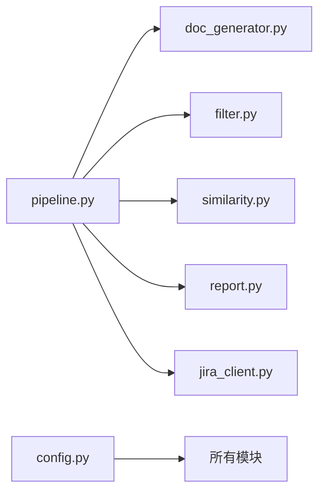

# 文档生成器

<cite>
**本文引用的文件**
- [src/core/doc_generator.py](file://src/core/doc_generator.py)
- [src/core/filter.py](file://src/core/filter.py)
- [src/pipeline.py](file://src/pipeline.py)
- [src/core/report.py](file://src/core/report.py)
- [src/clients/jira_client.py](file://src/clients/jira_client.py)
- [src/core/similarity.py](file://src/core/similarity.py)
- [src/config.py](file://src/config.py)
- [config/config.yaml](file://config/config.yaml)
- [README.md](file://README.md)
- [docs/2026-08-12/DEMO-1.md](file://docs/2026-08-12/DEMO-1.md)
- [tests/test_filter.py](file://tests/test_filter.py)
</cite>

## 目录
1. [简介](#简介)
2. [项目结构](#项目结构)
3. [核心组件](#核心组件)
4. [架构总览](#架构总览)
5. [详细组件分析](#详细组件分析)
6. [依赖关系分析](#依赖关系分析)
7. [性能与可扩展性](#性能与可扩展性)
8. [故障排查指南](#故障排查指南)
9. [结论](#结论)
10. [附录：Markdown 规范、版本管理与质量检查](#附录markdown-规范版本管理与质量检查)

## 简介
本工具围绕“Bug 文档沉淀”构建，实现从 AI 日志分析结果到标准化 Markdown 分析报告的自动生成，并结合 Jira 评论进行步骤与根因的双重相似性比对，输出每日结论报表。其目标是：
- 将非结构化日志分析结果转化为统一结构的 Bug 分析报告（按日期分目录、以 bugid 命名）
- 从 Jira 评论中自动提取有效的分析步骤，过滤噪音
- 通过相似度算法对“根因关键词命中比例”和“步骤相似度”进行量化评估
- 生成可追溯的每日 CSV 结论报表，支持失败重试与手工入库

## 项目结构
- src/main.py：命令行入口，提供 analyze/retry/store/report/audit 子命令
- src/pipeline.py：主流程编排，串联去重、AI 分析、Jira 抓取、相似度比对与报表生成
- src/core/doc_generator.py：报告文本保存、步骤解析、结论段落提取、最新文档查找
- src/core/filter.py：从 Jira 评论中提取有效分析步骤（规则 + 关键词）
- src/core/similarity.py：根因关键词命中比例与步骤 TF-IDF 余弦相似度计算
- src/core/report.py：每日结论 CSV 报表生成与合并
- src/clients/jira_client.py：Jira REST API 客户端（含 mock）
- src/config.py：配置加载、路径获取、日志初始化
- config/config.yaml：全局配置（数据库、接口、阈值、输出路径等）
- docs/：生成的分析报告（按日期分目录）
- reports/：每日结论报表与抽查记录
- tests/：测试用例（含评论过滤测试）

**图表来源**
- [src/main.py:63-106](file://src/main.py#L63-L106)
- [src/pipeline.py:18-86](file://src/pipeline.py#L18-L86)
- [src/core/doc_generator.py:14-79](file://src/core/doc_generator.py#L14-L79)
- [src/clients/jira_client.py:18-54](file://src/clients/jira_client.py#L18-L54)
- [src/core/filter.py:19-49](file://src/core/filter.py#L19-L49)
- [src/core/similarity.py:17-75](file://src/core/similarity.py#L17-L75)
- [src/core/report.py:15-66](file://src/core/report.py#L15-L66)
- [src/config.py:17-59](file://src/config.py#L17-L59)
- [config/config.yaml:1-63](file://config/config.yaml#L1-L63)

**章节来源**
- [README.md:1-76](file://README.md#L1-L76)
- [config/config.yaml:1-63](file://config/config.yaml#L1-L63)

## 核心组件
- 文档生成器（doc_generator.py）：负责将 AI 返回的报告文本保存为标准化 Markdown，并从中提取步骤与结论段落；支持读取与查找最新文档。
- 评论过滤器（filter.py）：基于关键词与正则表达式从 Jira 评论中清洗并拆分出有效分析步骤。
- 相似度模块（similarity.py）：使用中文分词与 TF-IDF 计算步骤相似度，并对根因关键词进行命中比例统计。
- 报表模块（report.py）：将每次运行结果写入当日 CSV，支持同日报表覆盖合并。
- 流程编排（pipeline.py）：串联去重、AI 分析、Jira 抓取、过滤、相似度比对与报表生成。
- Jira 客户端（jira_client.py）：封装 issue 获取与字段提取，内置 mock 数据便于开发与测试。
- 配置与日志（config.py + config.yaml）：集中管理外部接口、阈值、输出路径与日志格式。

**章节来源**
- [src/core/doc_generator.py:14-79](file://src/core/doc_generator.py#L14-L79)
- [src/core/filter.py:19-49](file://src/core/filter.py#L19-L49)
- [src/core/similarity.py:17-75](file://src/core/similarity.py#L17-L75)
- [src/core/report.py:15-66](file://src/core/report.py#L15-L66)
- [src/pipeline.py:18-105](file://src/pipeline.py#L18-L105)
- [src/clients/jira_client.py:18-54](file://src/clients/jira_client.py#L18-L54)
- [src/config.py:17-59](file://src/config.py#L17-L59)
- [config/config.yaml:1-63](file://config/config.yaml#L1-L63)

## 架构总览
整体工作流如下：
- 输入：bugid 列表与可选触发时间
- 步骤1：数据库只读去重（仅过滤已存在 bugid）
- 步骤2：调用 AI 日志分析接口，提取报告文本并生成 Markdown 文档（docs/日期/bugid.md）
- 步骤3：调用 Jira 接口获取报错原因与评论，评论经 Agent 过滤得到分析步骤
- 步骤4：相似度比对（根因关键词命中比例 + 步骤 TF-IDF 余弦相似度）
- 输出：每日结论 CSV（reports/日期_daily.csv），支持失败重试与手工入库

**图表来源**
- [src/main.py:63-106](file://src/main.py#L63-L106)
- [src/pipeline.py:18-86](file://src/pipeline.py#L18-L86)
- [src/core/doc_generator.py:14-79](file://src/core/doc_generator.py#L14-L79)
- [src/clients/jira_client.py:18-54](file://src/clients/jira_client.py#L18-L54)
- [src/core/filter.py:19-49](file://src/core/filter.py#L19-L49)
- [src/core/similarity.py:17-75](file://src/core/similarity.py#L17-L75)
- [src/core/report.py:15-66](file://src/core/report.py#L15-L66)

## 详细组件分析

### 文档生成器（doc_generator.py）
- 功能要点
  - 保存报告为 Markdown：按日期创建目录，文件名使用 bugid
  - 解析步骤：匹配“数字序号 + 内容”的行，提取步骤文本
  - 解析结论：定位“## 根因结论”标题后的段落内容
  - 读取与查找：读取指定文档或查找最新日期的文档
- 关键行为
  - 使用正则匹配步骤行，避免误匹配
  - 结论提取严格限定在“根因结论”标题至下一个标题之间
  - 未找到文档时抛出明确错误，便于上游处理

**图表来源**
- [src/core/doc_generator.py:14-79](file://src/core/doc_generator.py#L14-L79)

**章节来源**
- [src/core/doc_generator.py:14-79](file://src/core/doc_generator.py#L14-L79)

### 评论过滤（filter.py）
- 功能要点
  - 关键词判定：包含“日志分析/分析步骤/排查步骤/根因/定位”的评论视为相关
  - 前缀去除：去除“日志分析步骤：/分析步骤：/排查步骤：/日志分析”等引导词
  - 步骤拆分：按中英文分号、句号、换行拆分，过滤过短片段与纯序号片段
- 扩展点
  - 预留 _agent_filter 占位函数，后续可接入 LLM Agent 做语义提炼

**图表来源**
- [src/core/filter.py:19-49](file://src/core/filter.py#L19-L49)

**章节来源**
- [src/core/filter.py:19-49](file://src/core/filter.py#L19-L49)
- [tests/test_filter.py:7-36](file://tests/test_filter.py#L7-L36)

### 相似度比对（similarity.py）
- 功能要点
  - 中文分词：使用 jieba 分词，过滤停用词与单字
  - 步骤相似度：TF-IDF + 余弦相似度，逐条取最佳匹配后求平均
  - 根因比对：统计报错原因关键词在文档中的命中比例
  - 判定逻辑：根据配置阈值判断根因与步骤是否一致
- 复杂度与优化
  - 分词与向量化开销随文本长度线性增长
  - 可通过调整停用词集合与阈值提升稳定性

**图表来源**
- [src/core/similarity.py:17-75](file://src/core/similarity.py#L17-L75)

**章节来源**
- [src/core/similarity.py:17-75](file://src/core/similarity.py#L17-L75)

### 主流程编排（pipeline.py）
- 功能要点
  - 单个 bug 分析：调用 AI 接口生成文档，抓取 Jira 信息，过滤评论，相似度比对
  - 批量处理：去重后逐个分析，异常不中断整体流程
  - 报表生成：汇总本次结果生成/合并当日 CSV
  - 重试与入库：支持失败重试与手工入库
- 错误处理
  - 单个 bug 失败记录错误信息，继续处理其他 bug
  - 未找到文档时抛出 FileNotFoundError，由上层捕获

**图表来源**
- [src/pipeline.py:18-105](file://src/pipeline.py#L18-L105)

**章节来源**
- [src/pipeline.py:18-105](file://src/pipeline.py#L18-L105)

### Jira 客户端（jira_client.py）
- 功能要点
  - 获取 issue：支持 mock 模式与真实接口调用
  - 字段提取：description 作为报错原因，comments 作为评论列表
- Mock 数据
  - 内置评论包含噪音与分析步骤，便于验证过滤逻辑

**章节来源**
- [src/clients/jira_client.py:18-54](file://src/clients/jira_client.py#L18-L54)

### 配置与日志（config.py + config.yaml）
- 配置项
  - 数据库连接、AI/Jira/知识库接口地址与超时
  - 相似度阈值与根因命中比例
  - 输出路径（docs/reports/logs）
- 日志
  - 控制台 + 按日期归档的文件日志，便于问题追踪

**章节来源**
- [src/config.py:17-59](file://src/config.py#L17-L59)
- [config/config.yaml:1-63](file://config/config.yaml#L1-L63)

## 依赖关系分析
- 低耦合高内聚
  - pipeline 作为编排层，依赖各核心模块完成具体任务
  - doc_generator、filter、similarity、report 各自职责清晰
- 外部依赖
  - AI 日志分析接口、Jira REST API、知识库接口（均可 mock）
  - 第三方库：jieba、sklearn、pandas、pyyaml
- 潜在循环依赖
  - 当前模块间无循环导入，依赖方向清晰

**图表来源**
- [src/pipeline.py:1-105](file://src/pipeline.py#L1-L105)
- [src/core/doc_generator.py:1-79](file://src/core/doc_generator.py#L1-L79)
- [src/core/filter.py:1-49](file://src/core/filter.py#L1-L49)
- [src/core/similarity.py:1-75](file://src/core/similarity.py#L1-L75)
- [src/core/report.py:1-66](file://src/core/report.py#L1-L66)
- [src/clients/jira_client.py:1-54](file://src/clients/jira_client.py#L1-L54)
- [src/config.py:1-59](file://src/config.py#L1-L59)

**章节来源**
- [src/pipeline.py:1-105](file://src/pipeline.py#L1-L105)
- [src/config.py:1-59](file://src/config.py#L1-L59)

## 性能与可扩展性
- 性能特征
  - 步骤相似度计算受文本长度影响，建议控制单次分析文本规模
  - 批量处理时异常隔离，单个失败不影响整体进度
- 可扩展点
  - 评论过滤：可在 _agent_filter 接入 LLM Agent 进行语义提炼
  - 相似度比对：可在 compare_steps 替换为模型打分以提升准确性
  - 模板扩展：可在 doc_generator 中增加更多结构化字段与格式化规则

[本节为通用指导，无需特定文件引用]

## 故障排查指南
- 常见问题
  - 未找到分析文档：检查是否存在对应 bugid 的文档，或先执行 analyze 生成
  - 评论过滤结果为空：确认评论是否包含分析关键词，或调整关键词与前缀匹配规则
  - 相似度得分偏低：检查分词效果与停用词设置，必要时调整阈值
- 日志定位
  - 查看 logs/app_YYYY-MM-DD.log 获取详细执行日志
  - 关注 pipeline、doc_gen、filter、similarity、report 等模块日志

**章节来源**
- [src/core/doc_generator.py:60-79](file://src/core/doc_generator.py#L60-L79)
- [src/core/filter.py:19-49](file://src/core/filter.py#L19-L49)
- [src/core/similarity.py:17-75](file://src/core/similarity.py#L17-L75)
- [src/core/report.py:15-66](file://src/core/report.py#L15-L66)
- [src/config.py:37-59](file://src/config.py#L37-L59)

## 结论
该文档生成器实现了从 AI 日志分析到标准化 Markdown 报告的自动化生产，并通过 Jira 评论过滤与相似度比对形成闭环验证。其模块化设计便于扩展与维护，适合在生产环境中持续沉淀故障分析与排查经验。

[本节为总结，无需特定文件引用]

## 附录：Markdown 规范、版本管理与质量检查

### Markdown 文档结构规范
- 标题层级
  - 一级标题：Bug 编号与报告名称（如“# Bug DEMO-1 日志分析报告”）
  - 二级标题：根因结论、分析步骤等固定章节
- 代码块格式
  - 使用反引号包裹代码或日志片段，标注语言类型以便渲染
- 表格样式
  - 使用标准 Markdown 表格展示对比结果或指标
- 链接引用
  - 使用相对路径或绝对 URL 引用 Jira 工单、知识库条目等

示例参考：
- [docs/2026-08-12/DEMO-1.md](file://docs/2026-08-12/DEMO-1.md)

**章节来源**
- [docs/2026-08-12/DEMO-1.md:1-10](file://docs/2026-08-12/DEMO-1.md#L1-L10)

### 文档版本管理与更新策略
- 按日期分目录：docs/YYYY-MM-DD/bugid.md，便于回溯与归档
- 最新文档查找：find_latest_document 按字典序倒序查找，确保获取最近一次分析结果
- 报表合并：reports/YYYY-MM-DD_daily.csv 同日多次运行按 bugid 覆盖合并，避免重复行

**章节来源**
- [src/core/doc_generator.py:67-79](file://src/core/doc_generator.py#L67-L79)
- [src/core/report.py:46-66](file://src/core/report.py#L46-L66)

### 自定义模板扩展方法
- 在 doc_generator 中新增字段解析与格式化逻辑，例如：
  - 新增“影响范围”“修复方案”等章节
  - 增强步骤解析规则，支持更复杂的序号格式
- 在 similarity 中引入模型打分，替代或补充 TF-IDF 相似度
- 在 filter 中接入 LLM Agent，提升评论语义理解能力

[本节为通用指导，无需特定文件引用]

### 文档质量检查工具与格式化最佳实践
- 质量检查
  - 使用 pytest 运行测试用例，验证评论过滤与边界条件
  - 使用 Allure 生成可视化报告，便于回归测试
- 格式化最佳实践
  - 统一标题层级与章节顺序
  - 代码块与日志片段使用合适语言标注
  - 表格列名与单位保持一致
  - 链接指向权威来源（Jira、知识库、内部 Wiki）

**章节来源**
- [tests/test_filter.py:7-36](file://tests/test_filter.py#L7-L36)
- [README.md:52-60](file://README.md#L52-L60)