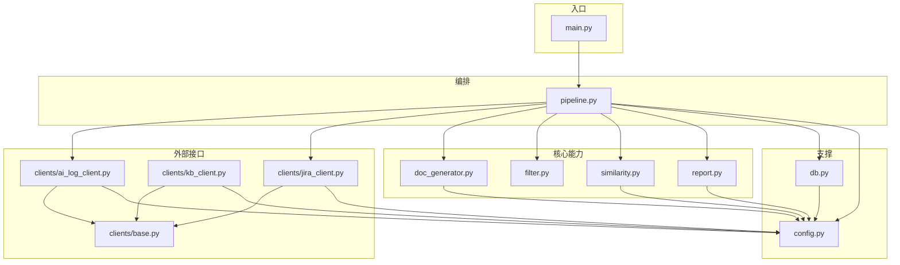
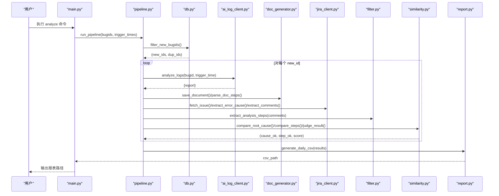
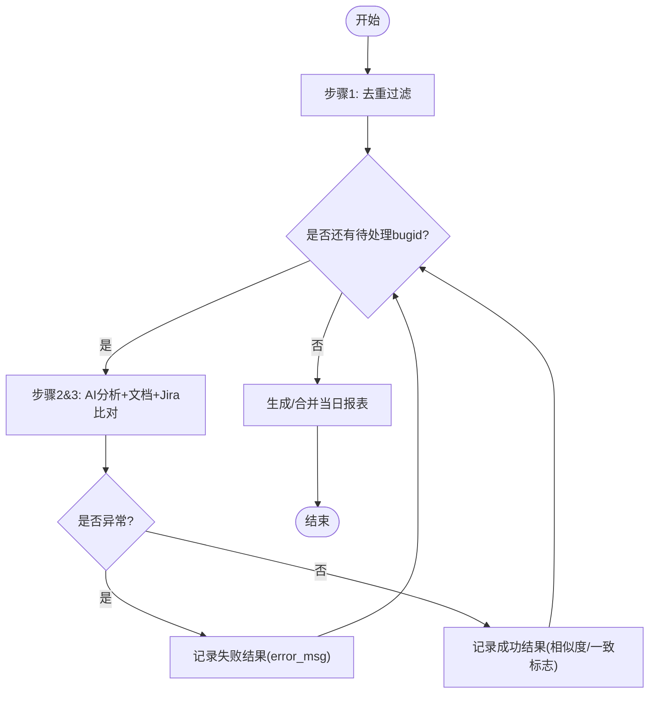
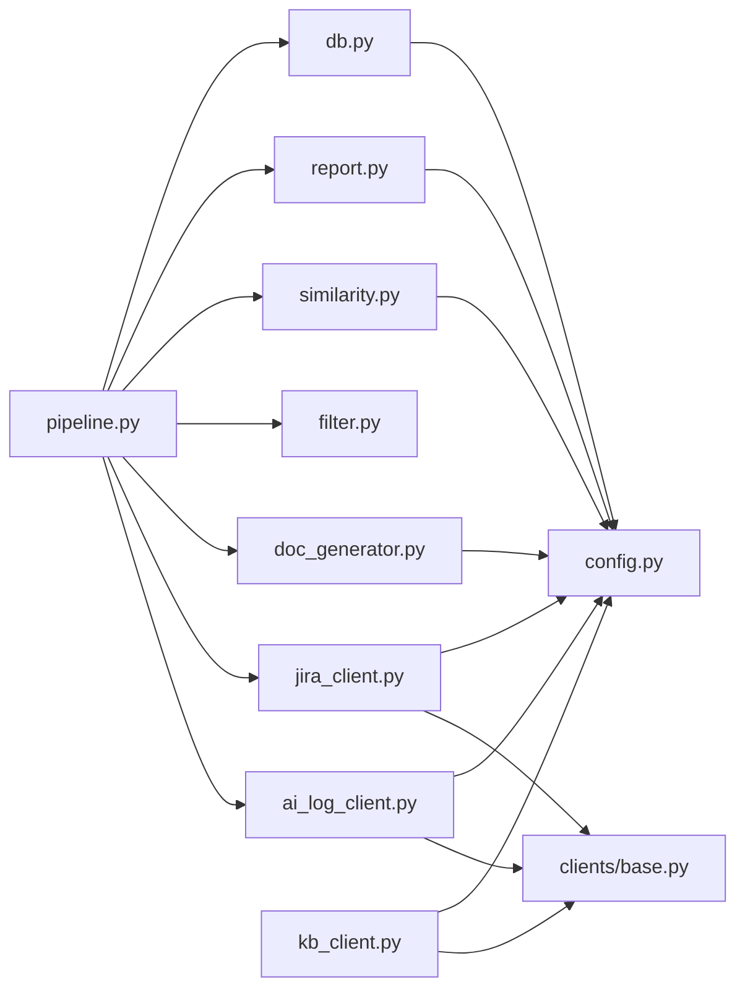
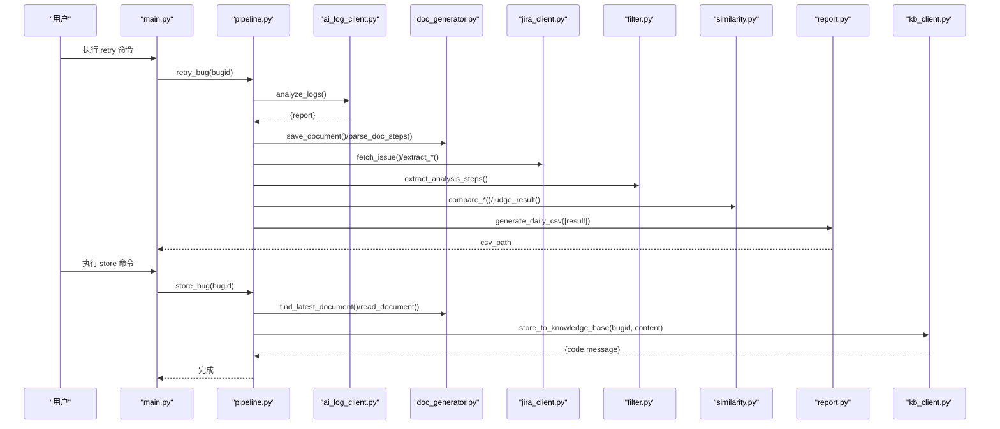

# 核心组件设计

<cite>
**本文引用的文件**
- [src/pipeline.py](file://src/pipeline.py)
- [src/clients/base.py](file://src/clients/base.py)
- [src/clients/jira_client.py](file://src/clients/jira_client.py)
- [src/clients/kb_client.py](file://src/clients/kb_client.py)
- [src/clients/ai_log_client.py](file://src/clients/ai_log_client.py)
- [src/core/doc_generator.py](file://src/core/doc_generator.py)
- [src/core/filter.py](file://src/core/filter.py)
- [src/core/similarity.py](file://src/core/similarity.py)
- [src/core/report.py](file://src/core/report.py)
- [src/config.py](file://src/config.py)
- [src/db.py](file://src/db.py)
- [src/main.py](file://src/main.py)
- [config/config.yaml](file://config/config.yaml)
</cite>

## 目录
1. [简介](#简介)
2. [项目结构](#项目结构)
3. [核心组件](#核心组件)
4. [架构总览](#架构总览)
5. [详细组件分析](#详细组件分析)
6. [依赖关系分析](#依赖关系分析)
7. [性能考量](#性能考量)
8. [故障排查指南](#故障排查指南)
9. [结论](#结论)
10. [附录](#附录)

## 简介
本仓库实现了一个“Bug 文档沉淀工具”，通过流水线编排串联去重、AI 分析、文档生成、Jira 比对与相似度评估，最终输出标准化 Markdown 文档与每日 CSV 结论报表。系统对外提供 CLI 命令（analyze/retry/store/report/audit），支持 mock 模式快速验证，并预留 LLM 评判扩展点。

## 项目结构
- src：核心代码
  - clients：外部接口封装（HTTP 客户端、Jira、知识库、AI 日志）
  - core：业务核心（文档生成、评论过滤、相似度计算、报表生成）
  - pipeline：主流程编排器
  - config：配置加载与日志初始化
  - db：数据库只读访问（用于去重与审计）
  - main：CLI 入口
- config/config.yaml：全局配置（API 开关、超时、阈值、输出路径等）
- docs/reports/logs：运行时产物（Markdown 文档、CSV 报表、日志）

图表来源
- [src/main.py:63-90](file://src/main.py#L63-L90)
- [src/pipeline.py:54-86](file://src/pipeline.py#L54-L86)
- [src/clients/base.py:12-38](file://src/clients/base.py#L12-L38)
- [src/clients/jira_client.py:32-53](file://src/clients/jira_client.py#L32-L53)
- [src/clients/kb_client.py:8-23](file://src/clients/kb_client.py#L8-L23)
- [src/clients/ai_log_client.py:32-56](file://src/clients/ai_log_client.py#L32-L56)
- [src/core/doc_generator.py:14-78](file://src/core/doc_generator.py#L14-L78)
- [src/core/filter.py:29-48](file://src/core/filter.py#L29-L48)
- [src/core/similarity.py:17-74](file://src/core/similarity.py#L17-L74)
- [src/core/report.py:46-65](file://src/core/report.py#L46-L65)
- [src/config.py:17-58](file://src/config.py#L17-L58)
- [src/db.py:67-88](file://src/db.py#L67-L88)

章节来源
- [src/main.py:1-111](file://src/main.py#L1-L111)
- [config/config.yaml:1-63](file://config/config.yaml#L1-L63)

## 核心组件
- 主流程编排器（pipeline.py）：串联步骤1（去重）、步骤2（AI 分析与文档生成）、步骤3（Jira 比对与相似度判定），汇总生成当日 CSV 报表；支持失败重试与手工入库。
- HTTP 客户端封装（base.py）：统一 POST/GET 调用，内置超时、重试与错误日志，所有外部接口复用此基础能力。
- 文档生成器（doc_generator.py）：将 AI 报告保存为按日期分目录的 Markdown，解析步骤行与根因结论，支持读取最新文档。
- 相似度引擎（similarity.py）：基于 TF-IDF 余弦相似度进行步骤比对，基于关键词命中比例进行根因比对，并提供阈值判定。
- 评论过滤（filter.py）：从 Jira 评论区提取“日志分析步骤”，屏蔽噪音评论，预留 Agent 接入点。
- 报表生成（report.py）：将内存结果转换为标准列的 CSV，同日多次运行自动合并覆盖。
- 配置与日志（config.py）：集中管理 YAML 配置、路径解析与日志初始化。
- 数据库层（db.py）：仅做只读查询，用于 bugid 去重与审计抽样。

章节来源
- [src/pipeline.py:18-105](file://src/pipeline.py#L18-L105)
- [src/clients/base.py:1-39](file://src/clients/base.py#L1-L39)
- [src/core/doc_generator.py:1-79](file://src/core/doc_generator.py#L1-L79)
- [src/core/similarity.py:1-75](file://src/core/similarity.py#L1-L75)
- [src/core/filter.py:1-49](file://src/core/filter.py#L1-L49)
- [src/core/report.py:1-66](file://src/core/report.py#L1-L66)
- [src/config.py:1-59](file://src/config.py#L1-L59)
- [src/db.py:1-132](file://src/db.py#L1-L132)

## 架构总览
系统采用分层与模块化设计：
- 入口层：CLI 接收参数，初始化数据库后分发到具体命令处理函数。
- 编排层：pipeline 负责顺序执行各阶段，捕获异常并记录失败结果。
- 能力层：core 模块提供文档生成、相似度计算、评论过滤、报表生成等能力。
- 集成层：clients 封装外部系统（AI 日志工具、Jira、知识库），通过 base 提供的 HTTP 能力统一通信。
- 支撑层：config 提供配置与日志；db 提供只读数据源。

图表来源
- [src/main.py:29-33](file://src/main.py#L29-L33)
- [src/pipeline.py:54-86](file://src/pipeline.py#L54-L86)
- [src/db.py:67-88](file://src/db.py#L67-L88)
- [src/clients/ai_log_client.py:32-56](file://src/clients/ai_log_client.py#L32-L56)
- [src/core/doc_generator.py:14-40](file://src/core/doc_generator.py#L14-L40)
- [src/clients/jira_client.py:32-53](file://src/clients/jira_client.py#L32-L53)
- [src/core/filter.py:29-48](file://src/core/filter.py#L29-L48)
- [src/core/similarity.py:34-74](file://src/core/similarity.py#L34-L74)
- [src/core/report.py:46-65](file://src/core/report.py#L46-L65)

## 详细组件分析

### 主流程编排器（pipeline.py）
- 职责
  - 步骤1：调用 db.filter_new_bugids 进行去重，跳过已存在或批内重复项。
  - 步骤2：调用 ai_log_client.analyze_logs 获取分析报告，使用 doc_generator.save_document 持久化 Markdown，并用 parse_doc_steps 提取步骤。
  - 步骤3：调用 jira_client 获取 issue 信息，提取报错原因与评论；通过 filter.extract_analysis_steps 清洗评论得到步骤；使用 similarity.compare_root_cause 与 compare_steps 进行双重比对，并通过 judge_result 依据配置阈值判定一致性。
  - 汇总：将每次分析结果（含成功/失败）传入 report.generate_daily_csv 生成/合并当日 CSV。
  - 辅助：retry_bug 重新分析单个 bug；store_bug 手工推送文档至知识库。
- 关键流程
  - 单个 bug 分析：_analyze_single 串联 AI、文档、Jira、过滤、相似度与判定。
  - 批量分析：run_pipeline 遍历新 bugid，异常不中断整体流程，统一落盘报表。
- 错误处理
  - 单个 bug 异常被捕获并记录 error_msg，继续处理后续条目。
  - 日志通过 setup_logger 输出控制台与按日归档文件。

图表来源
- [src/pipeline.py:54-86](file://src/pipeline.py#L54-L86)
- [src/pipeline.py:18-51](file://src/pipeline.py#L18-L51)

章节来源
- [src/pipeline.py:18-105](file://src/pipeline.py#L18-L105)

### HTTP 客户端封装（base.py）
- 职责
  - 提供 http_post/http_get 两个通用方法，封装 requests 调用。
  - 统一超时、重试次数与错误日志记录，失败时抛出明确异常。
- 设计要点
  - 默认重试次数可配置，便于在不同环境调整稳定性。
  - 所有 clients 均通过该模块发起网络请求，保证行为一致。

章节来源
- [src/clients/base.py:1-39](file://src/clients/base.py#L1-L39)

### 文档生成器（doc_generator.py）
- 职责
  - save_document：将 AI 报告保存为 Markdown，按日期分目录并以 bugid 命名。
  - parse_doc_steps：正则匹配带序号的步骤行，提取步骤列表。
  - parse_conclusion：提取“根因结论”段落内容。
  - read_document/find_latest_document：读取指定 bugid 的最新文档。
- 关键点
  - 使用 get_path("doc_dir") 获取输出目录并确保存在。
  - 文件不存在时抛出 FileNotFoundError，便于上层明确错误。

章节来源
- [src/core/doc_generator.py:1-79](file://src/core/doc_generator.py#L1-L79)

### 相似度计算引擎（similarity.py）
- 职责
  - tokenize：中文分词，过滤停用词与单字。
  - cosine_of_texts：TF-IDF + 余弦相似度计算两段文本相似度。
  - compare_steps：逐条文档步骤与评论步骤取最佳匹配，求平均得分。
  - compare_root_cause：将报错原因分词为关键词，统计在文档中的命中比例。
  - judge_result：根据配置阈值判定根因与步骤是否一致。
- 复杂度与优化
  - 步骤比对时间复杂度近似 O(N*M)，N 为文档步骤数，M 为评论步骤数；可通过缓存向量或减少候选集优化。
  - 预留 LLM 评判接口，可在 compare_steps 中替换打分策略。

章节来源
- [src/core/similarity.py:1-75](file://src/core/similarity.py#L1-L75)

### 评论过滤（filter.py）
- 职责
  - 从 Jira 评论区筛选与日志分析相关的评论，去除引导前缀并按分隔符拆分步骤。
  - 过滤过短片段与纯序号片段，保留有效步骤。
  - 预留 _agent_filter 占位，后续可接入 LLM Agent 做语义提炼。
- 关键点
  - 关键词集合与正则规则可配置化扩展。

章节来源
- [src/core/filter.py:1-49](file://src/core/filter.py#L1-L49)

### 报表生成（report.py）
- 职责
  - 将内存分析结果转换为标准列的 DataFrame，写入 reports/YYYY-MM-DD_daily.csv。
  - 同日多次运行按 bugid 去重合并，新结果覆盖旧行。
  - 使用 utf-8-sig 编码确保 Excel 打开中文不乱码。
- 关键点
  - 布尔值转中文展示，None 显示为“-”。

章节来源
- [src/core/report.py:1-66](file://src/core/report.py#L1-L66)

### 外部客户端（Jira/Knowledge Base/AI Log）
- Jira 客户端（jira_client.py）
  - 支持 mock 模式返回固定 issue 与评论，便于测试。
  - 真实模式下通过 http_get 调用 REST API，支持认证。
  - 提供 extract_error_cause/extract_comments 提取必要字段。
- 知识库客户端（kb_client.py）
  - 支持 mock 模式直接返回成功标识。
  - 真实模式下通过 http_post 提交 bugid 与内容。
- AI 日志客户端（ai_log_client.py）
  - 支持 mock 模式返回结构化报告（包含根因结论与分析步骤）。
  - 真实模式下通过 http_post 提交 bugid 与可选触发时间。
  - extract_report 校验返回值结构，缺失时报错。

章节来源
- [src/clients/jira_client.py:1-54](file://src/clients/jira_client.py#L1-L54)
- [src/clients/kb_client.py:1-24](file://src/clients/kb_client.py#L1-L24)
- [src/clients/ai_log_client.py:1-57](file://src/clients/ai_log_client.py#L1-L57)

### 配置与日志（config.py）
- 职责
  - load_config：加载 YAML 配置并缓存。
  - get_path：解析输出目录并创建。
  - setup_logger：初始化控制台与按日归档的文件日志。
- 关键点
  - 所有模块通过统一 logger 输出，便于追踪问题。

章节来源
- [src/config.py:1-59](file://src/config.py#L1-L59)

### 数据库层（db.py）
- 职责
  - 仅做只读查询：bugid 去重、审计候选池读取、已入库分析字段读取。
  - 自动建表，SQLite 相对路径基于项目根目录解析。
- 关键点
  - filter_new_bugids 同时过滤数据库已存在与本批重复项。

章节来源
- [src/db.py:1-132](file://src/db.py#L1-L132)

## 依赖关系分析
- 耦合与内聚
  - pipeline 高内聚地编排各能力，低耦合地依赖 clients 与 core 模块。
  - clients 统一依赖 base，避免重复实现网络逻辑。
  - core 模块之间通过函数级接口交互，无全局状态。
- 外部依赖
  - requests：HTTP 调用。
  - jieba、sklearn：中文分词与 TF-IDF 相似度计算。
  - pandas：CSV 报表生成。
  - sqlalchemy：数据库连接与查询。
  - yaml：配置文件解析。
- 循环依赖
  - 未发现循环导入；模块间依赖方向清晰。

图表来源
- [src/pipeline.py:8-13](file://src/pipeline.py#L8-L13)
- [src/clients/ai_log_client.py:1-5](file://src/clients/ai_log_client.py#L1-L5)
- [src/clients/jira_client.py:1-5](file://src/clients/jira_client.py#L1-L5)
- [src/clients/kb_client.py:1-4](file://src/clients/kb_client.py#L1-L4)
- [src/core/doc_generator.py:1-7](file://src/core/doc_generator.py#L1-L7)
- [src/core/filter.py:1-7](file://src/core/filter.py#L1-L7)
- [src/core/similarity.py:1-9](file://src/core/similarity.py#L1-L9)
- [src/core/report.py:1-11](file://src/core/report.py#L1-L11)
- [src/db.py:1-12](file://src/db.py#L1-L12)

章节来源
- [src/pipeline.py:8-13](file://src/pipeline.py#L8-L13)
- [src/clients/base.py:1-39](file://src/clients/base.py#L1-L39)

## 性能考量
- 相似度计算
  - 步骤比对为 N×M 次余弦相似度计算，建议对大输入进行采样或向量化缓存。
  - 可考虑引入更高效的文本相似度库或模型评分以替代 TF-IDF。
- I/O 与并发
  - 当前为串行处理，若需提升吞吐，可对 _analyze_single 进行并行化（注意外部接口限流与重试）。
- 配置调优
  - 通过 config.yaml 调整超时、重试次数与相似度阈值，平衡准确性与性能。

[本节为通用指导，无需特定文件引用]

## 故障排查指南
- 常见问题定位
  - 接口请求失败：检查 base.py 的重试与日志，确认 URL、认证与超时配置。
  - AI 报告缺失：ai_log_client.extract_report 会抛出 ValueError，检查返回结构。
  - 文档未找到：doc_generator.find_latest_document 抛出 FileNotFoundError，先执行 analyze。
  - 报表为空：确认 pipeline 是否成功写入 results，检查 report.generate_daily_csv 的输出路径。
- 日志查看
  - 控制台与 logs/app_YYYY-MM-DD.log 中按模块名区分日志（pipeline、http、doc_gen、similarity、jira、ai_log、kb、report、db）。
- 调试技巧
  - 开启 mock 模式快速验证流程，逐步关闭 mock 切换真实接口。
  - 使用 retry 命令针对失败 bug 单独重跑，观察 error_msg 定位问题。

章节来源
- [src/clients/base.py:12-38](file://src/clients/base.py#L12-L38)
- [src/clients/ai_log_client.py:51-56](file://src/clients/ai_log_client.py#L51-L56)
- [src/core/doc_generator.py:67-78](file://src/core/doc_generator.py#L67-L78)
- [src/core/report.py:46-65](file://src/core/report.py#L46-L65)
- [src/config.py:37-58](file://src/config.py#L37-L58)

## 结论
本系统通过清晰的模块化设计与统一的 HTTP 封装，实现了 Bug 分析的端到端自动化：去重、AI 分析、文档生成、Jira 比对与相似度评估，最终输出标准化文档与报表。通过配置化开关与阈值，兼顾了开发与测试效率。未来可扩展 LLM 评判、并行化处理与更丰富的过滤策略，进一步提升准确性与性能。

[本节为总结性内容，无需特定文件引用]

## 附录

### 设计模式应用
- 工厂模式（客户端实例）
  - 各客户端（ai_log_client、jira_client、kb_client）根据配置动态选择 mock 或真实实现，形成隐式工厂行为。
- 策略模式（mock/真实模式切换）
  - 通过 config.yaml 的 mock 开关，切换不同策略（本地构造数据 vs 远程接口调用）。
- 模板方法模式（统一 API 调用流程）
  - base.py 的 http_post/http_get 统一封装重试、超时与日志，各客户端复用该模板，减少重复代码。

章节来源
- [src/clients/ai_log_client.py:32-48](file://src/clients/ai_log_client.py#L32-L48)
- [src/clients/jira_client.py:32-43](file://src/clients/jira_client.py#L32-L43)
- [src/clients/kb_client.py:8-23](file://src/clients/kb_client.py#L8-L23)
- [src/clients/base.py:12-38](file://src/clients/base.py#L12-L38)
- [config/config.yaml:10-35](file://config/config.yaml#L10-L35)

### 关键业务流程时序图（重试与入库）

图表来源
- [src/main.py:36-45](file://src/main.py#L36-L45)
- [src/pipeline.py:89-105](file://src/pipeline.py#L89-L105)
- [src/clients/ai_log_client.py:32-56](file://src/clients/ai_log_client.py#L32-L56)
- [src/core/doc_generator.py:14-78](file://src/core/doc_generator.py#L14-L78)
- [src/clients/jira_client.py:32-53](file://src/clients/jira_client.py#L32-L53)
- [src/core/filter.py:29-48](file://src/core/filter.py#L29-L48)
- [src/core/similarity.py:34-74](file://src/core/similarity.py#L34-L74)
- [src/core/report.py:46-65](file://src/core/report.py#L46-L65)
- [src/clients/kb_client.py:8-23](file://src/clients/kb_client.py#L8-L23)