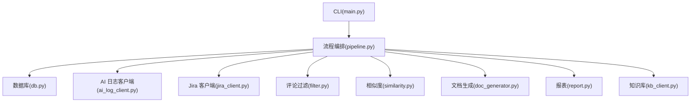
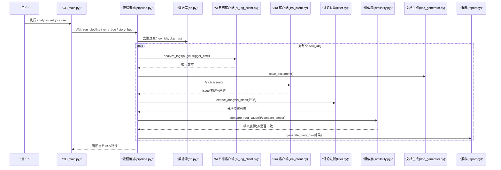
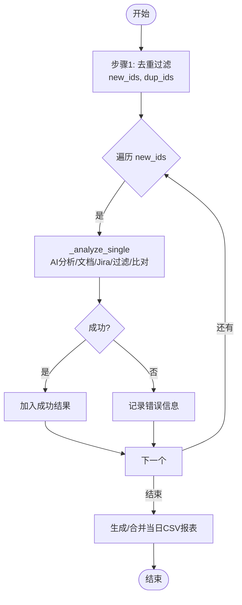
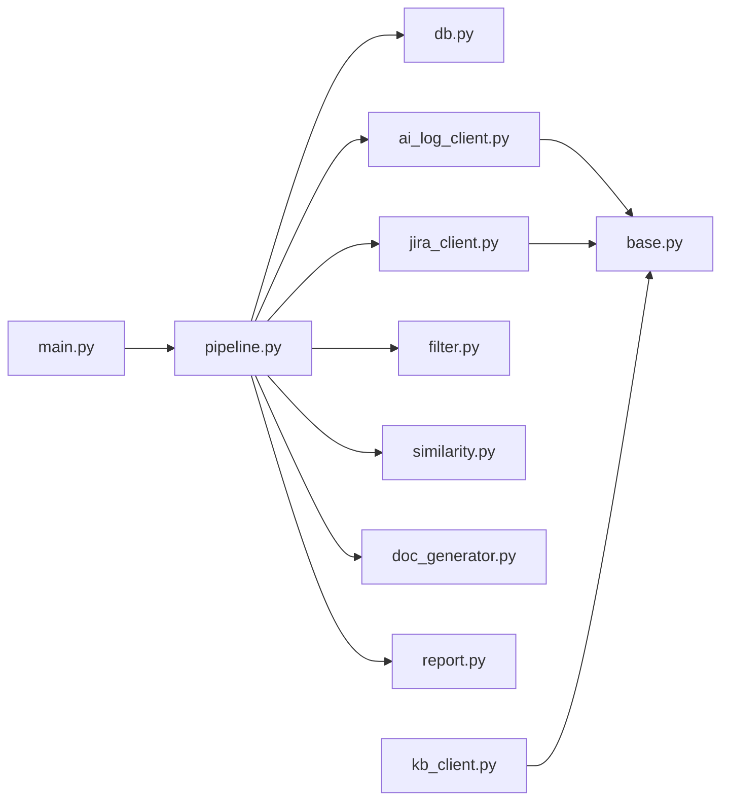

# 流程编排器

<cite>
**本文引用的文件**
- [src/pipeline.py](file://src/pipeline.py)
- [src/main.py](file://src/main.py)
- [src/config.py](file://src/config.py)
- [config/config.yaml](file://config/config.yaml)
- [src/core/filter.py](file://src/core/filter.py)
- [src/core/similarity.py](file://src/core/similarity.py)
- [src/core/doc_generator.py](file://src/core/doc_generator.py)
- [src/core/report.py](file://src/core/report.py)
- [src/clients/jira_client.py](file://src/clients/jira_client.py)
- [src/clients/ai_log_client.py](file://src/clients/ai_log_client.py)
- [src/clients/kb_client.py](file://src/clients/kb_client.py)
- [src/clients/base.py](file://src/clients/base.py)
- [src/db.py](file://src/db.py)
- [README.md](file://README.md)
</cite>

## 目录
1. [简介](#简介)
2. [项目结构](#项目结构)
3. [核心组件](#核心组件)
4. [架构总览](#架构总览)
5. [详细组件分析](#详细组件分析)
6. [依赖关系分析](#依赖关系分析)
7. [性能考量](#性能考量)
8. [故障排查指南](#故障排查指南)
9. [结论](#结论)
10. [附录：配置参数说明](#附录：配置参数说明)

## 简介
本工具围绕“Bug 文档沉淀与故障分析闭环”构建，以 pipeline.py 为核心协调器，串联以下关键步骤：
- 步骤1：BugID 去重过滤（只读比对，不写库）
- 步骤2：调用 AI 日志分析工具生成分析报告并落盘为 Markdown 文档
- 步骤3：从 Jira 提取报错原因与评论，经 Agent 过滤后与文档进行双重相似性比对（根因关键词命中 + 步骤 TF-IDF 余弦相似度）
- 输出：生成标准化文档与每日 CSV 结论报表；知识库入库由开发手工触发，不做自动化

该编排器支持失败重试、错误隔离、统一日志归档与可配置的阈值判定。

## 项目结构
- CLI 入口：main.py（analyze/retry/store/report/audit 子命令）
- 流程编排：pipeline.py（主流程、单 bug 分析、重试、入库）
- 外部客户端：ai_log_client、jira_client、kb_client（均支持 mock）
- 核心处理：filter（评论过滤）、similarity（相似度计算）、doc_generator（文档生成）、report（报表生成）
- 数据库层：db.py（仅用于去重与抽查的只读查询）
- 配置与日志：config.py、config/config.yaml

图表来源
- [src/main.py:29-60](file://src/main.py#L29-L60)
- [src/pipeline.py:18-105](file://src/pipeline.py#L18-L105)
- [src/db.py:67-88](file://src/db.py#L67-L88)
- [src/clients/ai_log_client.py:32-57](file://src/clients/ai_log_client.py#L32-L57)
- [src/clients/jira_client.py:32-54](file://src/clients/jira_client.py#L32-L54)
- [src/core/filter.py:29-49](file://src/core/filter.py#L29-L49)
- [src/core/similarity.py:34-75](file://src/core/similarity.py#L34-L75)
- [src/core/doc_generator.py:14-79](file://src/core/doc_generator.py#L14-L79)
- [src/core/report.py:46-66](file://src/core/report.py#L46-L66)
- [src/clients/kb_client.py:8-24](file://src/clients/kb_client.py#L8-L24)

章节来源
- [README.md:1-76](file://README.md#L1-L76)

## 核心组件
- 流程编排器（pipeline.py）
  - run_pipeline：执行步骤1~3，返回当日 CSV 路径
  - _analyze_single：对单个 bugid 完成 AI 分析、文档生成、Jira 数据获取、双重比对与结果汇总
  - retry_bug：失败重试，重新执行步骤2~3并更新当日报表
  - store_bug：手工将分析文档推入知识库（不自动校验）
- 外部客户端
  - ai_log_client：调用 AI 日志分析接口或返回 mock 报告
  - jira_client：获取 issue 描述与评论列表（mock 或真实）
  - kb_client：推送分析文档到知识库（mock 或真实）
  - base：通用 HTTP 封装，内置超时与重试
- 核心处理
  - filter：从评论中提取“日志分析步骤”，过滤噪音
  - similarity：根因关键词命中比例 + 步骤 TF-IDF 余弦相似度，按阈值判定一致性
  - doc_generator：保存 Markdown 文档、解析步骤行、读取最新文档
  - report：生成/合并当日 CSV 结论报表（UTF-8-SIG 兼容 Excel）
- 数据库（db.py）
  - filter_new_bugids：只读去重（数据库+批内重复）
  - fetch_audit_candidates/fetch_stored_analysis：抽查与已入库字段读取（只读）

章节来源
- [src/pipeline.py:18-105](file://src/pipeline.py#L18-L105)
- [src/clients/ai_log_client.py:32-57](file://src/clients/ai_log_client.py#L32-L57)
- [src/clients/jira_client.py:32-54](file://src/clients/jira_client.py#L32-L54)
- [src/clients/kb_client.py:8-24](file://src/clients/kb_client.py#L8-L24)
- [src/clients/base.py:12-39](file://src/clients/base.py#L12-L39)
- [src/core/filter.py:29-49](file://src/core/filter.py#L29-L49)
- [src/core/similarity.py:34-75](file://src/core/similarity.py#L34-L75)
- [src/core/doc_generator.py:14-79](file://src/core/doc_generator.py#L14-L79)
- [src/core/report.py:46-66](file://src/core/report.py#L46-L66)
- [src/db.py:67-88](file://src/db.py#L67-L88)

## 架构总览
下图展示了从 CLI 到各模块的调用链路与数据流向。

图表来源
- [src/main.py:29-60](file://src/main.py#L29-L60)
- [src/pipeline.py:54-86](file://src/pipeline.py#L54-L86)
- [src/db.py:67-88](file://src/db.py#L67-L88)
- [src/clients/ai_log_client.py:32-57](file://src/clients/ai_log_client.py#L32-L57)
- [src/clients/jira_client.py:32-54](file://src/clients/jira_client.py#L32-L54)
- [src/core/filter.py:29-49](file://src/core/filter.py#L29-L49)
- [src/core/similarity.py:34-75](file://src/core/similarity.py#L34-L75)
- [src/core/doc_generator.py:14-79](file://src/core/doc_generator.py#L14-L79)
- [src/core/report.py:46-66](file://src/core/report.py#L46-L66)

## 详细组件分析

### 流程编排器（pipeline.py）
- 职责
  - 协调步骤1（去重）、步骤2（AI 分析与文档生成）、步骤3（Jira 数据获取、评论过滤、双重比对）
  - 管理异常：单个 bug 失败不影响整体流程，记录失败结果到报表
  - 提供重试与手工入库能力
- 输入/输出
  - run_pipeline：输入 bugids 与可选 trigger_times；输出当日 CSV 路径
  - _analyze_single：输入 bugid 与 trigger_time；输出内存中的分析结果字典
  - retry_bug：输入 bugid；输出当日 CSV 路径（追加/覆盖）
  - store_bug：输入 bugid；无返回值（写入知识库）
- 错误处理与重试
  - 单个分析异常被捕获，写入 error_msg 并继续处理后续 bugid
  - 重试通过 retry_bug 手动触发，重新执行步骤2~3
- 并发与异步
  - 当前实现为顺序执行；如需并发，可在 _analyze_single 外层引入线程池/任务队列，注意共享资源（如日志、文件写入）的并发安全
- 日志
  - 使用 config.setup_logger 初始化控制台与按日归档的文件日志

图表来源
- [src/pipeline.py:54-86](file://src/pipeline.py#L54-L86)
- [src/pipeline.py:18-51](file://src/pipeline.py#L18-L51)

章节来源
- [src/pipeline.py:18-105](file://src/pipeline.py#L18-L105)

### 评论过滤（filter.py）
- 功能：从 Jira 评论区中筛选与“日志分析”相关的评论，去除引导词前缀并按分隔符拆分为独立步骤，过滤过短片段
- 扩展点：预留 _agent_filter 占位，未来可接入 LLM Agent 做语义提炼
- 复杂度：线性扫描评论列表，拆分与正则匹配开销较小

章节来源
- [src/core/filter.py:1-49](file://src/core/filter.py#L1-L49)

### 相似度计算（similarity.py）
- 根因比对：对报错原因分词去停用词，统计在文档中的命中比例
- 步骤比对：对文档步骤与评论步骤逐条取最佳匹配的 TF-IDF 余弦相似度，再求平均
- 判定：依据配置阈值（root_cause_hit_ratio、threshold）得出是否一致
- 复杂度：TF-IDF 向量化与相似度计算随文本长度线性增长；批量场景建议缓存向量或分批处理

章节来源
- [src/core/similarity.py:1-75](file://src/core/similarity.py#L1-L75)

### 文档生成（doc_generator.py）
- 功能：将 AI 报告保存为 Markdown（按日期分目录），解析带序号的步骤行，读取最新文档
- 错误处理：文件不存在时抛出明确异常，便于上游定位问题
- 路径策略：基于配置 output.doc_dir，自动创建目录

章节来源
- [src/core/doc_generator.py:1-79](file://src/core/doc_generator.py#L1-L79)

### 报表生成（report.py）
- 功能：将内存结果转换为中文表头的 CSV，同日多次运行按 bugid 覆盖合并
- 编码：使用 utf-8-sig 保证 Excel 打开不乱码
- 列定义：bugid、触发时间、分析状态、根因一致、步骤一致、步骤相似度、文档路径、错误信息、分析时间

章节来源
- [src/core/report.py:1-66](file://src/core/report.py#L1-L66)

### 外部客户端
- AI 日志客户端（ai_log_client.py）
  - 支持 mock 模式与真实接口切换；extract_report 严格校验返回结构
- Jira 客户端（jira_client.py）
  - 获取 issue 描述与评论列表；mock 数据包含噪音评论以验证过滤逻辑
- 知识库客户端（kb_client.py）
  - 推送分析文档内容；mock 模式直接返回成功标识
- 通用 HTTP（base.py）
  - 统一 POST/GET 封装，内置超时与重试（默认 3 次），失败记录日志并抛出异常

章节来源
- [src/clients/ai_log_client.py:1-57](file://src/clients/ai_log_client.py#L1-L57)
- [src/clients/jira_client.py:1-54](file://src/clients/jira_client.py#L1-L54)
- [src/clients/kb_client.py:1-24](file://src/clients/kb_client.py#L1-L24)
- [src/clients/base.py:1-39](file://src/clients/base.py#L1-L39)

### 数据库层（db.py）
- 去重：filter_new_bugids 同时考虑数据库已有记录与本批输入重复项
- 抽查：fetch_audit_candidates 读取已入库候选池；fetch_stored_analysis 读取指定 bugid 的已入库字段
- 设计原则：工具不写库，仅只读查询；SQLite 相对路径自动解析为绝对路径

章节来源
- [src/db.py:1-132](file://src/db.py#L1-L132)

## 依赖关系分析
- pipeline.py 依赖 db、ai_log_client、jira_client、doc_generator、filter、similarity、report
- main.py 作为 CLI 入口，负责参数解析与命令分发
- 所有客户端依赖 base 的 HTTP 封装
- 配置与日志由 config.py 统一管理

图表来源
- [src/pipeline.py:8-13](file://src/pipeline.py#L8-L13)
- [src/main.py:11-13](file://src/main.py#L11-L13)
- [src/clients/base.py:1-39](file://src/clients/base.py#L1-L39)

章节来源
- [src/pipeline.py:1-105](file://src/pipeline.py#L1-L105)
- [src/main.py:1-111](file://src/main.py#L1-L111)

## 性能考量
- 并发模型
  - 当前为串行处理；若需提升吞吐，可在 _analyze_single 外层引入线程池/协程，但需注意：
    - 文件写入（文档、报表）的并发安全
    - 日志输出的线程安全
    - 外部接口限流与超时控制
- I/O 优化
  - 文档与报表写入采用顺序追加/覆盖，避免频繁小文件操作
  - 报表合并使用 pandas，适合中小规模数据；大数据量时可考虑增量写入或分片
- 相似度计算
  - TF-IDF 向量化与余弦相似度计算随文本规模增长；可对长文本分段或采样以提升性能
- 网络请求
  - 客户端已内置重试与超时；可根据外部服务稳定性调整 retries 与 timeout
- 配置调优
  - 合理设置 similarity.threshold 与 root_cause_hit_ratio，平衡误判与漏判

[本节为通用指导，无需特定文件引用]

## 故障排查指南
- 常见问题
  - AI 接口未返回 report：extract_report 会抛出 ValueError，检查接口返回结构与配置字段映射
  - Jira 认证失败：检查 username/token 与 URL；启用 mock 快速验证流程
  - 文档路径不存在：find_latest_document 抛出 FileNotFoundError，确认 analyze 已执行且路径正确
  - 报表为空：确认有新增 bugid 通过去重；检查 generate_daily_csv 是否被调用
- 日志定位
  - 查看 logs/app_YYYY-MM-DD.log，关注 pipeline、http、ai_log、jira、filter、similarity、report 等模块日志
  - 失败重试：使用 retry 命令重新分析，观察错误信息变化
- 重试与恢复
  - 单个 bug 失败不会中断整体流程；可通过 retry 单独重跑
  - 知识库入库失败：检查 kb_client 配置与接口连通性

章节来源
- [src/clients/ai_log_client.py:51-57](file://src/clients/ai_log_client.py#L51-L57)
- [src/clients/jira_client.py:32-43](file://src/clients/jira_client.py#L32-L43)
- [src/core/doc_generator.py:67-79](file://src/core/doc_generator.py#L67-L79)
- [src/core/report.py:46-66](file://src/core/report.py#L46-L66)
- [src/clients/base.py:12-39](file://src/clients/base.py#L12-L39)

## 结论
pipeline.py 作为核心协调器，清晰地将 Bug 分析生命周期划分为去重、AI 分析、Jira 比对与报表输出四个阶段，具备完善的错误隔离、重试机制与可配置阈值判定。结合 mock 支持与统一日志归档，便于开发与测试环境快速验证与排障。建议在大规模场景下评估并发改造与相似度计算优化，进一步提升吞吐与稳定性。

[本节为总结，无需特定文件引用]

## 附录：配置参数说明
- database
  - url：数据库连接串（默认 SQLite，可切换 MySQL）
  - table_name：去重比对所用表名（默认 bug_records）
- ai_log_api
  - mock：是否使用内置样例数据
  - url：AI 日志分析接口地址
  - timeout：请求超时秒数
  - bugid_field/trigger_time_field：入参字段名映射
- jira_api
  - mock：是否使用内置样例数据
  - url：Jira RESTAPI 地址
  - timeout：请求超时秒数
  - bugid_field：入参字段名映射
  - username/token：认证信息（真实接口按需填写）
- knowledge_base_api
  - mock：是否使用内置样例数据
  - url：知识库入库接口地址
  - timeout：请求超时秒数
  - bugid_field/content_field：入参字段名映射
- similarity
  - threshold：步骤相似性判定阈值（0~1）
  - root_cause_hit_ratio：根因关键词最低命中比例
- audit
  - sample_count：随机抽查数量
  - audited_file/report_file：已抽查记录与审核表格文件名
  - kb_table/各字段映射：对接真实库时按实际表结构修改
- output
  - doc_dir：分析文档目录（默认 docs）
  - report_dir：每日报表目录（默认 reports）
  - log_dir：运行日志目录（默认 logs）

章节来源
- [config/config.yaml:1-63](file://config/config.yaml#L1-L63)
- [src/config.py:17-59](file://src/config.py#L17-L59)