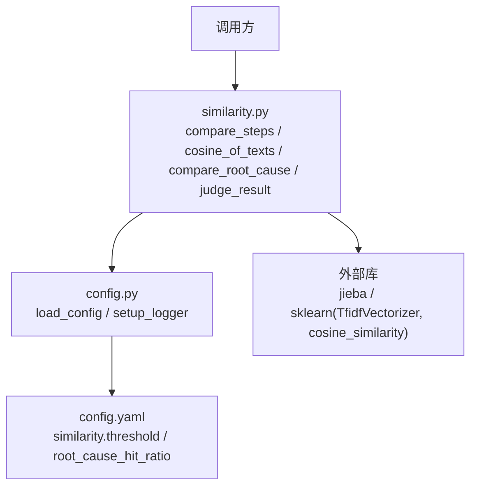
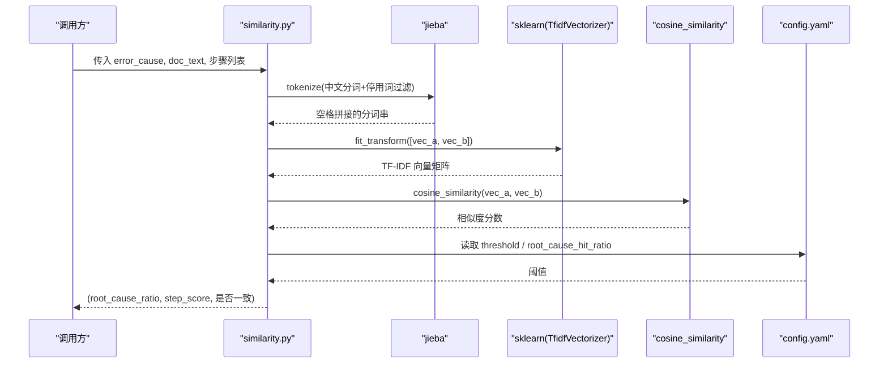
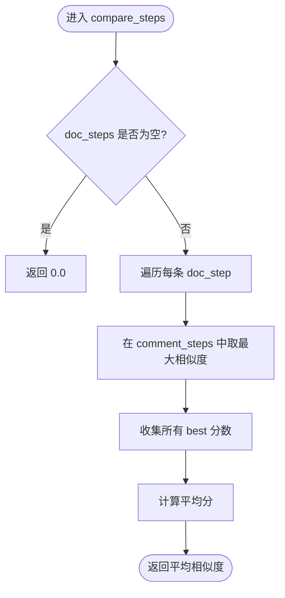
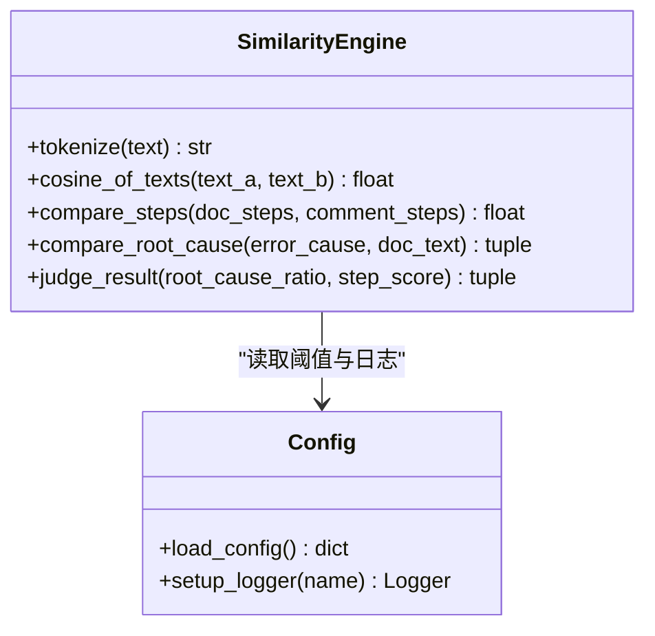
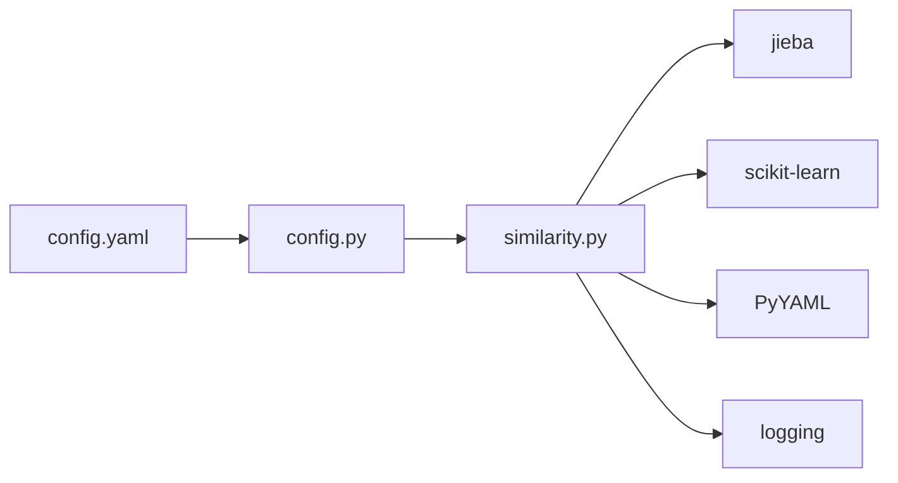

# 相似度计算引擎

<cite>
**本文引用的文件**
- [similarity.py](file://src/core/similarity.py)
- [config.yaml](file://config/config.yaml)
- [config.py](file://src/config.py)
- [test_similarity.py](file://tests/test_similarity.py)
- [requirements.txt](file://requirements.txt)
</cite>

## 目录
1. [简介](#简介)
2. [项目结构](#项目结构)
3. [核心组件](#核心组件)
4. [架构总览](#架构总览)
5. [详细组件分析](#详细组件分析)
6. [依赖关系分析](#依赖关系分析)
7. [性能与优化](#性能与优化)
8. [故障排查指南](#故障排查指南)
9. [结论](#结论)
10. [附录：参数调优与扩展接口](#附录参数调优与扩展接口)

## 简介
本相似度计算引擎用于智能结果验证，围绕“根因关键词匹配 + 步骤相似性比对 + 综合评分判定”构建。其核心能力包括：
- 中文分词与停用词过滤（基于 jieba）
- TF-IDF 向量化与余弦相似度计算（基于 scikit-learn）
- 根因关键词命中比例统计
- 步骤级最佳匹配与平均相似度聚合
- 基于配置的阈值判定（根因一致、步骤一致）
- 可扩展预留 LLM 评判接口位置

该引擎适用于将“文档步骤/分析结论”与“评论或外部来源的步骤/原因”进行一致性校验，辅助自动化质量保障与知识沉淀。

## 项目结构
相似度计算相关代码集中在 src/core/similarity.py，配置在 config/config.yaml，日志与配置加载在 src/config.py，单元测试在 tests/test_similarity.py，依赖声明在 requirements.txt。

图表来源
- [similarity.py:1-75](file://src/core/similarity.py#L1-L75)
- [config.py:17-25](file://src/config.py#L17-L25)
- [config.yaml:37-42](file://config/config.yaml#L37-L42)

章节来源
- [similarity.py:1-75](file://src/core/similarity.py#L1-L75)
- [config.yaml:37-42](file://config/config.yaml#L37-L42)
- [config.py:17-25](file://src/config.py#L17-L25)

## 核心组件
- 中文分词与清洗：tokenize(text)
- 文本相似度：cosine_of_texts(text_a, text_b)
- 步骤相似度：compare_steps(doc_steps, comment_steps)
- 根因关键词匹配：compare_root_cause(error_cause, doc_text)
- 阈值判定：judge_result(root_cause_ratio, step_score)

章节来源
- [similarity.py:17-74](file://src/core/similarity.py#L17-L74)

## 架构总览
相似度引擎由“输入预处理 → 特征表示 → 相似度度量 → 阈值判定”的流水线构成。配置项集中管理阈值，日志统一输出到按日归档的文件与控制台。

图表来源
- [similarity.py:17-74](file://src/core/similarity.py#L17-L74)
- [config.yaml:37-42](file://config/config.yaml#L37-L42)

## 详细组件分析

### 中文分词与停用词处理
- 使用 jieba.cut 对输入文本进行分词
- 过滤长度小于 2 的词与预设停用词集合 STOP_WORDS
- 将有效词以空格拼接为后续 TF-IDF 的语料形式

复杂度与影响
- 时间复杂度近似 O(N)，N 为文本字符数
- 停用词与单字过滤降低噪声，提升后续相似度稳定性

章节来源
- [similarity.py:13-20](file://src/core/similarity.py#L13-L20)

### TF-IDF 向量化与余弦相似度
- 对两段已分词的文本分别构造 TF-IDF 向量
- 使用余弦相似度计算两向量夹角余弦值，取值范围 [0, 1]
- 空输入或分词后为空时返回 0.0，避免异常

算法要点
- TF-IDF 衡量词频与逆文档频率，抑制常见词权重
- 余弦相似度关注方向而非模长，适合短文本语义比较

章节来源
- [similarity.py:23-31](file://src/core/similarity.py#L23-L31)

### 步骤相似性比对
- 对每条文档步骤，在评论步骤中取最高相似度作为该步得分
- 对所有文档步骤求平均，得到整体步骤相似度
- 若任一输入为空，返回 0.0 并记录警告日志

流程示意

图表来源
- [similarity.py:34-49](file://src/core/similarity.py#L34-L49)

章节来源
- [similarity.py:34-49](file://src/core/similarity.py#L34-L49)

### 根因关键词匹配
- 对报错原因进行分词与去重，保留顺序
- 统计这些关键词在分析文档中的命中数量与比例
- 返回命中比例与命中关键词列表

边界处理
- 任一输入为空返回 0.0 与空列表
- 无有效关键词返回 0.0 与空列表

章节来源
- [similarity.py:52-66](file://src/core/similarity.py#L52-L66)

### 阈值判定与综合评分
- 从配置中读取 similarity.threshold 与 similarity.root_cause_hit_ratio
- 根据两个指标分别判断“步骤一致”和“根因一致”
- 返回布尔元组供上层决策

章节来源
- [similarity.py:69-74](file://src/core/similarity.py#L69-L74)
- [config.yaml:37-42](file://config/config.yaml#L37-L42)

### 类图（函数式模块视角）

图表来源
- [similarity.py:17-74](file://src/core/similarity.py#L17-L74)
- [config.py:17-25](file://src/config.py#L17-L25)

## 依赖关系分析
- jieba：中文分词
- scikit-learn：TF-IDF 向量化与余弦相似度
- PyYAML：配置文件解析
- logging：日志输出（控制台 + 文件）

图表来源
- [requirements.txt:1-9](file://requirements.txt#L1-L9)
- [similarity.py:5-11](file://src/core/similarity.py#L5-L11)
- [config.py:1-59](file://src/config.py#L1-L59)

章节来源
- [requirements.txt:1-9](file://requirements.txt#L1-L9)

## 性能与优化
当前实现特点
- 每次相似度计算都重新实例化 TfidfVectorizer 并 fit_transform 两条文本
- 步骤比对采用逐条最佳匹配，时间复杂度约为 O(M×N)，M 为文档步骤数，N 为评论步骤数

可优化点
- 批量向量化：将多条文本一次性 fit_transform，减少重复训练开销
- 缓存机制：对相同文本对的 TF-IDF 向量或相似度结果做缓存（如内存字典），避免重复计算
- 分词缓存：对高频文本进行分词结果缓存
- 阈值自适应：结合业务数据分布动态调整 threshold 与 root_cause_hit_ratio
- 并行化：对独立文本对或步骤对使用线程池/进程池并行计算

监控建议
- 记录关键耗时：分词、向量化、相似度计算、阈值判定
- 记录命中率与相似度分布，便于定位阈值偏差
- 通过日志观察空输入与低质量输入占比

[本节为通用性能建议，不直接分析具体文件]

## 故障排查指南
常见问题与定位
- 相似度始终偏低：检查停用词是否过严、分词效果是否合理；确认输入文本是否包含有效关键词
- 步骤比对结果为 0：检查是否存在空输入；确认步骤列表非空且分词后有内容
- 阈值判定不符合预期：核对 config.yaml 中 similarity.threshold 与 root_cause_hit_ratio 的设置
- 日志缺失：确认日志目录存在且写入权限正常；检查 setup_logger 初始化是否成功

定位方法
- 查看 similarity 模块日志输出，关注“步骤相似度比对完成”“根因比对完成”等关键信息
- 通过单元测试验证边界情况与典型场景

章节来源
- [similarity.py:39-48](file://src/core/similarity.py#L39-L48)
- [similarity.py:57-66](file://src/core/similarity.py#L57-L66)
- [config.py:37-58](file://src/config.py#L37-L58)

## 结论
该相似度计算引擎以简洁可靠的算法组合实现了“根因关键词匹配 + 步骤 TF-IDF 余弦相似度 + 阈值判定”的智能结果验证。通过配置化管理阈值、完善的日志与测试覆盖，具备较好的可维护性与扩展性。建议在大规模使用时引入批量向量化、缓存与并行策略以提升吞吐与稳定性。

[本节为总结性内容，不直接分析具体文件]

## 附录：参数调优与扩展接口

### 参数说明与调优
- similarity.threshold：步骤相似性判定阈值，默认 0.7。提高阈值更严格，降低阈值更宽松
- similarity.root_cause_hit_ratio：根因关键词最低命中比例，默认 0.5。提高阈值要求更高命中比例
- STOP_WORDS：停用词集合，可根据领域术语调整，避免误删关键业务词
- 分词策略：如需更细粒度或领域词典，可在 tokenize 中集成自定义词典或规则

调优建议
- 基于历史标注数据绘制 ROC 曲线，选择合适阈值平衡召回与精确率
- 针对特定领域扩充停用词与领域词典，改善分词质量
- 对长文本与短文本分别评估阈值，必要时分层阈值

章节来源
- [config.yaml:37-42](file://config/config.yaml#L37-L42)
- [similarity.py:13-20](file://src/core/similarity.py#L13-L20)

### 扩展接口
- LLM 评判替换：在 compare_steps 中预留接口，可将传统相似度打分替换为模型打分，保持上层调用不变
- 自定义相似度算法：可新增 compare_custom(texts_a, texts_b) 并在 judge_result 前接入，形成多策略融合评分
- 配置扩展：在 config.yaml 的 similarity 节点下增加新字段，并在 judge_result 中读取与应用

章节来源
- [similarity.py:1-4](file://src/core/similarity.py#L1-L4)
- [similarity.py:69-74](file://src/core/similarity.py#L69-L74)

### 效果评估方法
- 单元测试覆盖：完全相同文本、不同文本、高/低相似度步骤、空输入、阈值判定
- 离线评测：使用标注数据集计算准确率、召回率、F1，对比不同阈值下的表现
- 在线监控：跟踪相似度分布、命中率、误判案例，持续迭代阈值与分词策略

章节来源
- [test_similarity.py:7-71](file://tests/test_similarity.py#L7-L71)