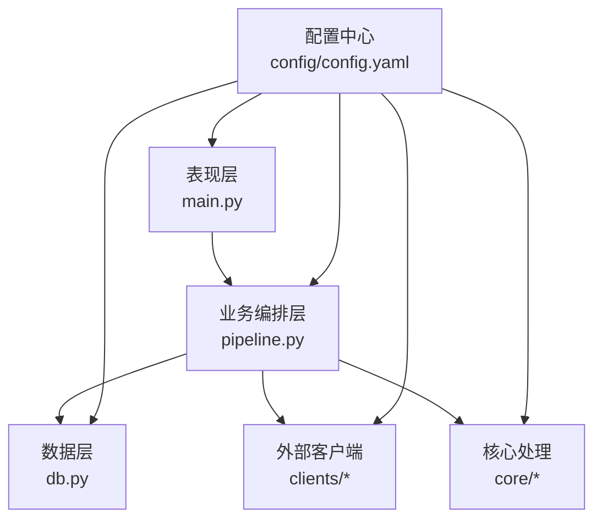
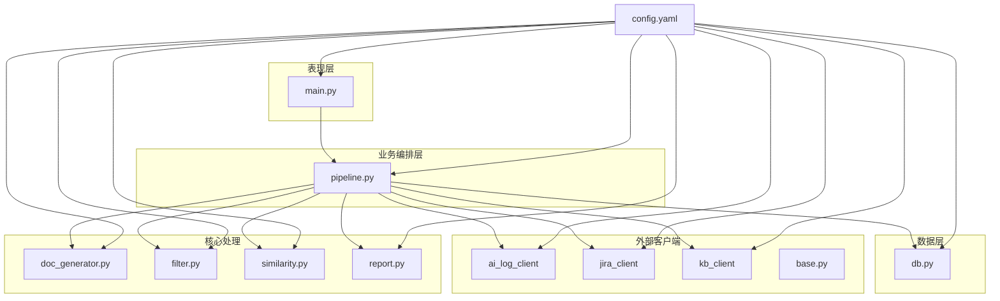
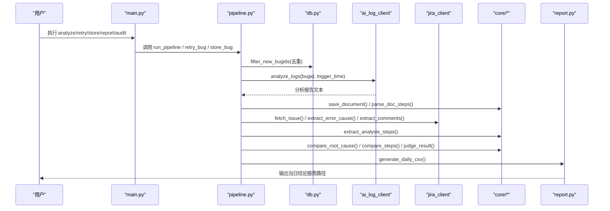
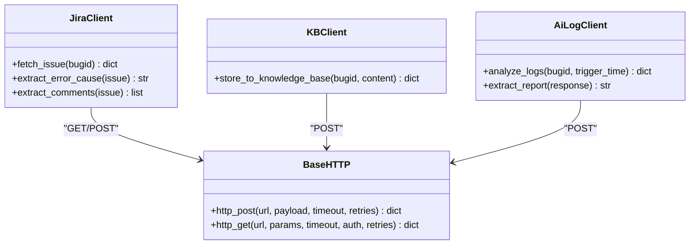
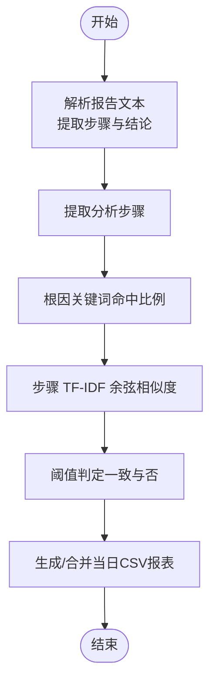
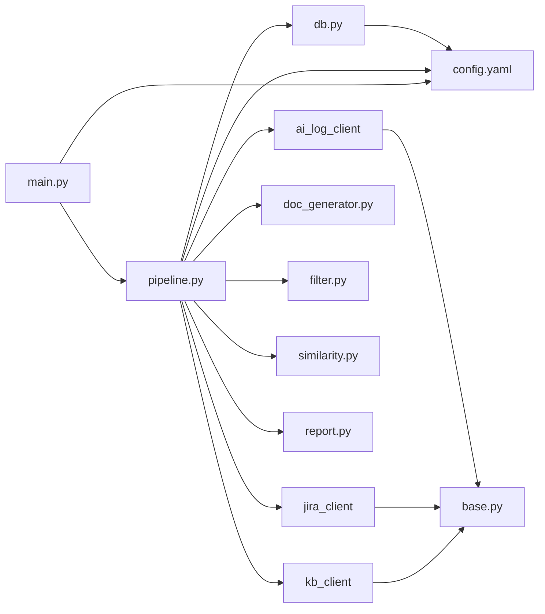

# 系统架构

<cite>
**本文引用的文件**
- [src/main.py](file://src/main.py)
- [src/pipeline.py](file://src/pipeline.py)
- [src/db.py](file://src/db.py)
- [src/config.py](file://src/config.py)
- [config/config.yaml](file://config/config.yaml)
- [src/clients/base.py](file://src/clients/base.py)
- [src/clients/jira_client.py](file://src/clients/jira_client.py)
- [src/clients/kb_client.py](file://src/clients/kb_client.py)
- [src/core/doc_generator.py](file://src/core/doc_generator.py)
- [src/core/filter.py](file://src/core/filter.py)
- [src/core/similarity.py](file://src/core/similarity.py)
- [src/core/report.py](file://src/core/report.py)
- [README.md](file://README.md)
</cite>

## 目录
1. [简介](#简介)
2. [项目结构](#项目结构)
3. [核心组件](#核心组件)
4. [架构总览](#架构总览)
5. [详细组件分析](#详细组件分析)
6. [依赖关系分析](#依赖关系分析)
7. [性能考量](#性能考量)
8. [故障排查指南](#故障排查指南)
9. [结论](#结论)
10. [附录](#附录)

## 简介
本系统为“Bug 文档沉淀工具”，围绕 bugid 输入，完成去重过滤、AI 日志分析、文档生成、Jira 信息抽取与评论过滤、相似度比对、每日结论报表输出，以及可选的知识库手工入库。整体采用分层架构：表现层（CLI）、业务编排层（pipeline）、数据层（db）与外部客户端（clients），并通过配置中心（config）统一管理。

## 项目结构
- 表现层：命令行入口 main.py，提供 analyze/retry/store/report/audit 子命令
- 业务编排层：pipeline.py 串联步骤1~3，并驱动各模块协作
- 数据层：db.py 负责 SQLite 连接与只读查询（bugid 去重、抽查候选池、已入库字段读取）
- 外部客户端：clients/* 封装 AI 日志接口、Jira RESTAPI、知识库入库接口，支持 mock
- 核心处理：core/* 包含文档生成、评论过滤、相似性比对、报表生成等
- 配置：config/config.yaml 集中管理数据库、接口、阈值、输出路径等
- 产物：docs/ 按日期存放分析文档；reports/ 存放每日结论 CSV 与审核表格；logs/ 存放运行日志

**图表来源**
- [src/main.py:63-110](file://src/main.py#L63-L110)
- [src/pipeline.py:54-86](file://src/pipeline.py#L54-L86)
- [src/db.py:42-88](file://src/db.py#L42-L88)
- [config/config.yaml:1-63](file://config/config.yaml#L1-L63)

**章节来源**
- [README.md:62-76](file://README.md#L62-L76)
- [src/main.py:63-110](file://src/main.py#L63-L110)
- [src/pipeline.py:1-105](file://src/pipeline.py#L1-L105)
- [src/db.py:1-132](file://src/db.py#L1-L132)
- [config/config.yaml:1-63](file://config/config.yaml#L1-L63)

## 核心组件
- 主流程编排器（pipeline.py）
  - 职责：步骤1（去重）、步骤2（AI 分析+文档生成）、步骤3（Jira 提取+评论过滤+相似度比对+报表生成）
  - 关键函数：run_pipeline、_analyze_single、retry_bug、store_bug
- 外部客户端模块（clients/*）
  - ai_log_client：调用 AI 日志分析接口或返回 mock 数据
  - jira_client：获取 issue、提取报错原因与评论
  - kb_client：将分析文档推入知识库（mock 或真实接口）
  - base：通用 HTTP GET/POST 封装，含超时与重试
- 核心处理模块（core/*）
  - doc_generator：生成 Markdown 文档、解析步骤与结论、读取最新文档
  - filter：从 Jira 评论中过滤并提取分析步骤（规则 + 预留 LLM Agent）
  - similarity：根因关键词命中比例 + 步骤 TF-IDF 余弦相似度，阈值判定
  - report：生成/合并当日 CSV 结论报表
- 数据存储层（db.py）
  - 仅只读：bugid 去重、抽查候选池、已入库字段读取
  - 使用 SQLAlchemy 与 SQLite（可切换 MySQL）

**章节来源**
- [src/pipeline.py:18-105](file://src/pipeline.py#L18-L105)
- [src/clients/base.py:1-39](file://src/clients/base.py#L1-L39)
- [src/clients/jira_client.py:1-54](file://src/clients/jira_client.py#L1-L54)
- [src/clients/kb_client.py:1-24](file://src/clients/kb_client.py#L1-L24)
- [src/core/doc_generator.py:1-79](file://src/core/doc_generator.py#L1-L79)
- [src/core/filter.py:1-49](file://src/core/filter.py#L1-L49)
- [src/core/similarity.py:1-75](file://src/core/similarity.py#L1-L75)
- [src/core/report.py:1-66](file://src/core/report.py#L1-L66)
- [src/db.py:1-132](file://src/db.py#L1-L132)

## 架构总览
系统采用分层架构与模块化设计：
- 表现层（main.py）：定义 CLI 子命令，初始化日志与数据库，分发任务
- 业务编排层（pipeline.py）：编排步骤1~3，协调 clients 与 core 模块
- 数据层（db.py）：SQLite/SQLAlchemy 只读访问，保障去重与审计
- 外部客户端（clients/*）：统一封装 HTTP 请求、重试与错误日志，支持 mock
- 核心处理（core/*）：文档生成、评论过滤、相似度计算、报表输出
- 配置中心（config/config.yaml）：集中管理数据库、接口、阈值、输出路径

**图表来源**
- [src/main.py:63-110](file://src/main.py#L63-L110)
- [src/pipeline.py:54-105](file://src/pipeline.py#L54-L105)
- [src/db.py:42-132](file://src/db.py#L42-L132)
- [src/clients/base.py:12-39](file://src/clients/base.py#L12-L39)
- [src/clients/jira_client.py:32-54](file://src/clients/jira_client.py#L32-L54)
- [src/clients/kb_client.py:8-24](file://src/clients/kb_client.py#L8-L24)
- [src/core/doc_generator.py:14-79](file://src/core/doc_generator.py#L14-L79)
- [src/core/filter.py:29-49](file://src/core/filter.py#L29-L49)
- [src/core/similarity.py:17-75](file://src/core/similarity.py#L17-L75)
- [src/core/report.py:46-66](file://src/core/report.py#L46-L66)
- [config/config.yaml:1-63](file://config/config.yaml#L1-L63)

## 详细组件分析

### 主流程编排器（pipeline.py）
- 步骤1：通过 db.filter_new_bugids 进行 bugid 去重（本地重复与数据库已存在均过滤）
- 步骤2：调用 ai_log_client.analyze_logs 与 extract_report，生成文档并解析步骤
- 步骤3：调用 jira_client 获取 issue，提取报错原因与评论；通过 filter.extract_analysis_steps 提取分析步骤；使用 similarity.compare_root_cause 与 compare_steps 做双重比对；judge_result 依据阈值判定一致与否；最终由 report.generate_daily_csv 生成/合并当日报表
- retry_bug：对失败 bug 重新执行步骤2~3，更新当日报表
- store_bug：读取最新文档并推送至知识库（mock 或真实接口）

**图表来源**
- [src/main.py:29-60](file://src/main.py#L29-L60)
- [src/pipeline.py:18-105](file://src/pipeline.py#L18-L105)
- [src/db.py:67-88](file://src/db.py#L67-L88)
- [src/core/doc_generator.py:14-40](file://src/core/doc_generator.py#L14-L40)
- [src/core/filter.py:29-49](file://src/core/filter.py#L29-L49)
- [src/core/similarity.py:34-75](file://src/core/similarity.py#L34-L75)
- [src/core/report.py:46-66](file://src/core/report.py#L46-L66)

**章节来源**
- [src/pipeline.py:18-105](file://src/pipeline.py#L18-L105)

### 外部客户端模块（clients/*）
- base.py：统一封装 http_get/http_post，带超时与重试，记录错误日志
- jira_client.py：根据配置启用 mock，构造或拉取 issue，提取 description 与 comments
- kb_client.py：根据配置启用 mock，提交 bugid 与内容到知识库接口
- ai_log_client.py：根据配置启用 mock，调用 AI 日志分析接口或返回样例数据

**图表来源**
- [src/clients/base.py:12-39](file://src/clients/base.py#L12-L39)
- [src/clients/jira_client.py:32-54](file://src/clients/jira_client.py#L32-L54)
- [src/clients/kb_client.py:8-24](file://src/clients/kb_client.py#L8-L24)

**章节来源**
- [src/clients/base.py:1-39](file://src/clients/base.py#L1-L39)
- [src/clients/jira_client.py:1-54](file://src/clients/jira_client.py#L1-L54)
- [src/clients/kb_client.py:1-24](file://src/clients/kb_client.py#L1-L24)

### 核心处理模块（core/*）
- doc_generator.py：保存 Markdown 文档、解析步骤行、提取结论段落、读取最新文档
- filter.py：基于关键词与正则过滤评论，提取分析步骤；预留 _agent_filter 扩展点接入 LLM
- similarity.py：TF-IDF 余弦相似度计算、根因关键词命中比例、阈值判定
- report.py：生成/合并当日 CSV 报表，中文表头，覆盖同 bugid 旧行

**图表来源**
- [src/core/doc_generator.py:14-79](file://src/core/doc_generator.py#L14-L79)
- [src/core/filter.py:29-49](file://src/core/filter.py#L29-L49)
- [src/core/similarity.py:17-75](file://src/core/similarity.py#L17-L75)
- [src/core/report.py:46-66](file://src/core/report.py#L46-L66)

**章节来源**
- [src/core/doc_generator.py:1-79](file://src/core/doc_generator.py#L1-L79)
- [src/core/filter.py:1-49](file://src/core/filter.py#L1-L49)
- [src/core/similarity.py:1-75](file://src/core/similarity.py#L1-L75)
- [src/core/report.py:1-66](file://src/core/report.py#L1-L66)

### 数据存储层（db.py）
- 使用 SQLAlchemy 与 SQLite（可切换 MySQL），自动建表
- 只读操作：filter_new_bugids（去重）、fetch_audit_candidates（抽查候选池）、fetch_stored_analysis（读取已入库字段）
- 配置化表名与字段映射，便于对接不同数据库结构

**章节来源**
- [src/db.py:1-132](file://src/db.py#L1-L132)
- [config/config.yaml:1-10](file://config/config.yaml#L1-L10)

## 依赖关系分析
- main.py 依赖 pipeline、db、config、core.audit
- pipeline.py 依赖 db、clients（ai_log_client、jira_client、kb_client）、core（doc_generator、filter、report、similarity）
- clients/* 依赖 base 与 config
- core/* 依赖 config 与各自第三方库（如 jieba、sklearn、pandas）
- db.py 依赖 config 与 SQLAlchemy

**图表来源**
- [src/main.py:6-15](file://src/main.py#L6-L15)
- [src/pipeline.py:6-14](file://src/pipeline.py#L6-L14)
- [src/clients/base.py:1-6](file://src/clients/base.py#L1-L6)
- [src/db.py:9-14](file://src/db.py#L9-L14)
- [config/config.yaml:1-63](file://config/config.yaml#L1-L63)

**章节来源**
- [src/main.py:6-15](file://src/main.py#L6-L15)
- [src/pipeline.py:6-14](file://src/pipeline.py#L6-L14)
- [src/clients/base.py:1-6](file://src/clients/base.py#L1-L6)
- [src/db.py:9-14](file://src/db.py#L9-L14)
- [config/config.yaml:1-63](file://config/config.yaml#L1-L63)

## 性能考量
- 去重阶段：使用 SQL IN 查询批量过滤，减少网络与内存开销
- 相似度计算：TF-IDF 向量构建与余弦相似度在小样本场景下高效；若规模扩大可考虑缓存向量或增量更新
- 重试机制：HTTP 请求默认重试 3 次，避免瞬时抖动导致失败
- I/O 优化：日志按天归档，报表按日合并，避免频繁写盘
- 可扩展性：阈值与字段映射集中在配置，便于调优与适配

[本节为通用指导，不直接分析具体文件]

## 故障排查指南
- 接口请求失败：检查 clients/base.py 的重试与错误日志；确认 config.yaml 中 url、timeout、认证信息
- 文档未生成：确认 doc_generator.save_document 是否成功写入 docs/日期/bugid.md；检查 get_path("doc_dir") 路径权限
- 相似度异常：检查 similarity.tokenize 分词结果与 STOP_WORDS；调整 config.yaml 中 threshold 与 root_cause_hit_ratio
- 报表为空或覆盖异常：确认 report.generate_daily_csv 的编码与合并逻辑；查看 reports/日期_daily.csv
- 数据库连接问题：检查 db.init_db 的 URL 与相对路径解析；确认 data/app.db 所在目录存在且可写

**章节来源**
- [src/clients/base.py:12-39](file://src/clients/base.py#L12-L39)
- [src/core/doc_generator.py:14-79](file://src/core/doc_generator.py#L14-L79)
- [src/core/similarity.py:17-75](file://src/core/similarity.py#L17-L75)
- [src/core/report.py:46-66](file://src/core/report.py#L46-L66)
- [src/db.py:42-57](file://src/db.py#L42-L57)

## 结论
本系统以分层架构与模块化设计实现 Bug 文档沉淀闭环：从 bugid 去重、AI 分析、文档生成、Jira 信息抽取与评论过滤、相似度比对到报表输出与知识库入库。通过配置中心统一管理外部接口与阈值，具备良好扩展性与可维护性。未来可在评论过滤与相似度评判中引入 LLM 提升准确率，并在大规模场景下优化相似度计算与 I/O 性能。

[本节为总结性内容，不直接分析具体文件]

## 附录

### 技术选型决策
- Python：生态丰富、易集成 AI 与数据处理库（jieba、sklearn、pandas），开发效率高
- SQLite：开箱即用、零配置、适合单机与轻量场景；可通过配置切换 MySQL 满足更大规模需求
- scikit-learn：TF-IDF 与余弦相似度成熟稳定，便于快速实现文本相似性比对
- requests：简洁可靠的 HTTP 客户端，配合重试与超时控制提升稳定性

**章节来源**
- [config/config.yaml:1-10](file://config/config.yaml#L1-L10)
- [src/core/similarity.py:1-75](file://src/core/similarity.py#L1-L75)
- [src/clients/base.py:1-39](file://src/clients/base.py#L1-L39)

### 扩展点设计
- 新增外部接口支持：在 clients/* 中新增客户端类，复用 base.py 的 http_get/http_post；在 config.yaml 中添加对应接口配置；在 pipeline.py 中编排调用
- 自定义分析逻辑：在 core/filter.py 的 _agent_filter 中接入 LLM Agent 进行语义提炼；在 core/similarity.py 的 compare_steps 中替换为模型打分；在 config.yaml 中调整阈值与字段映射

**章节来源**
- [src/clients/base.py:12-39](file://src/clients/base.py#L12-L39)
- [src/core/filter.py:24-27](file://src/core/filter.py#L24-L27)
- [src/core/similarity.py:34-75](file://src/core/similarity.py#L34-L75)
- [config/config.yaml:37-56](file://config/config.yaml#L37-L56)

### 部署拓扑与环境要求
- 运行环境：Python 环境，安装 requirements.txt 依赖
- 配置文件：编辑 config/config.yaml，设置 database.url、ai_log_api、jira_api、knowledge_base_api、similarity 阈值、audit 配置与 output 路径
- 运行方式：通过 python -m src.main 执行 analyze/retry/store/report/audit 子命令
- 产物位置：docs/ 生成分析文档；reports/ 生成结论报表与审核表格；logs/ 生成运行日志

**章节来源**
- [README.md:15-50](file://README.md#L15-L50)
- [config/config.yaml:1-63](file://config/config.yaml#L1-L63)