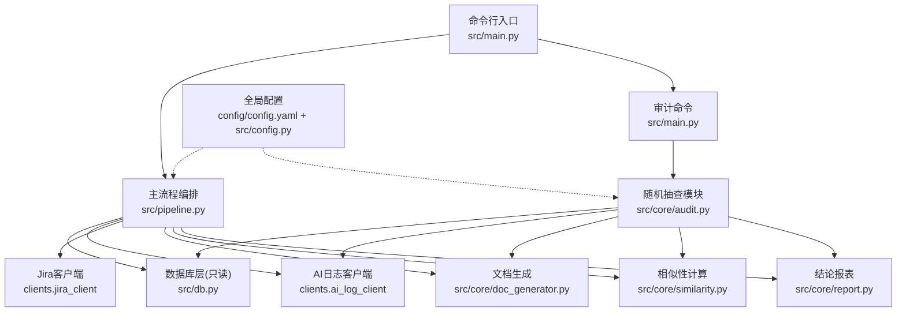
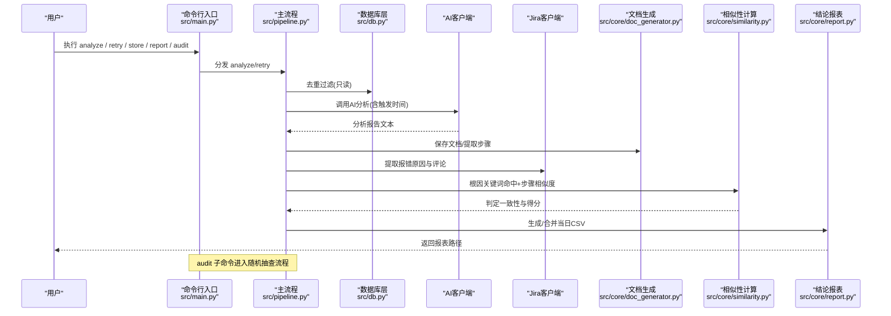
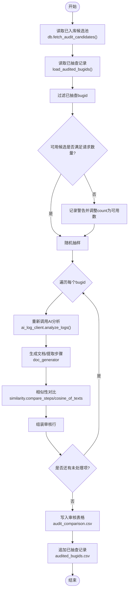
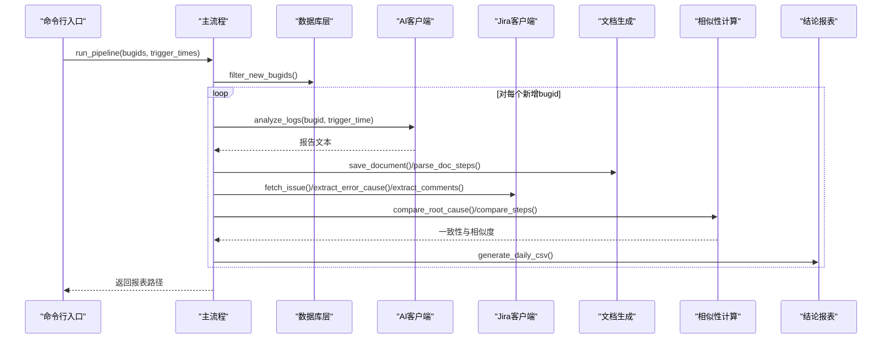
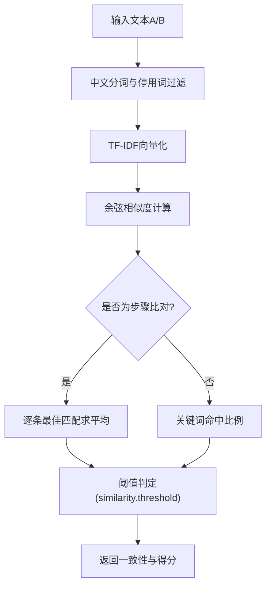
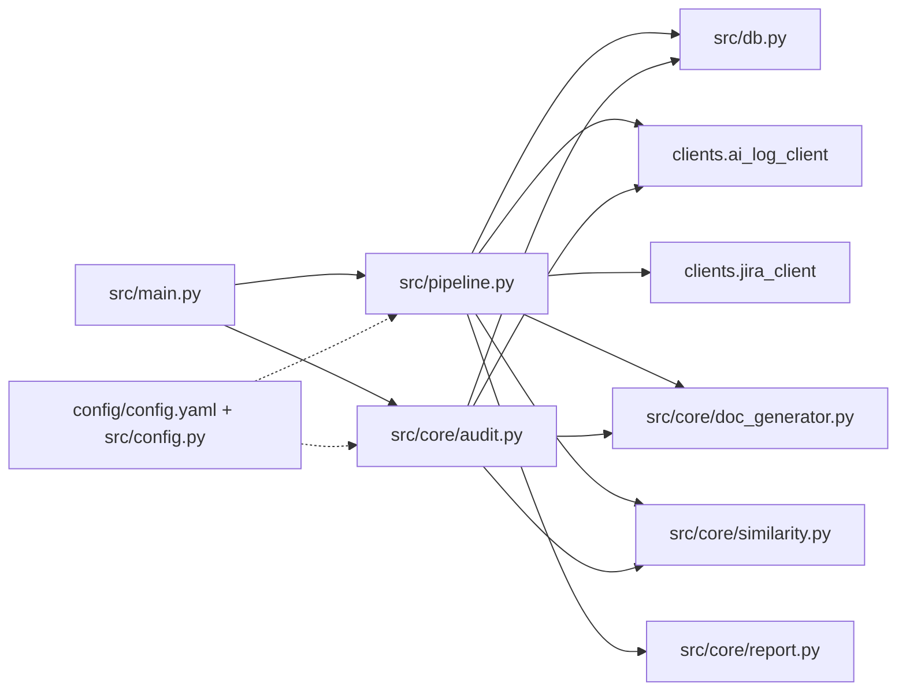

# 质量保证

<cite>
**本文引用的文件**
- [main.py](file://src/main.py)
- [pipeline.py](file://src/pipeline.py)
- [config.yaml](file://config/config.yaml)
- [config.py](file://src/config.py)
- [db.py](file://src/db.py)
- [similarity.py](file://src/core/similarity.py)
- [report.py](file://src/core/report.py)
- [doc_generator.py](file://src/core/doc_generator.py)
- [audit.py](file://src/core/audit.py)
- [test_audit.py](file://tests/test_audit.py)
</cite>

## 目录
1. [简介](#简介)
2. [项目结构](#项目结构)
3. [核心组件](#核心组件)
4. [架构总览](#架构总览)
5. [详细组件分析](#详细组件分析)
6. [依赖关系分析](#依赖关系分析)
7. [性能考虑](#性能考虑)
8. [故障排查指南](#故障排查指南)
9. [结论](#结论)
10. [附录](#附录)

## 简介
本文件面向质量保证机制，围绕“随机抽查”与“人工审核”两大主线，说明从数据库已入库表中随机抽取 bugid、排除历史已抽查记录、重新调用 AI 分析、与库存储字段进行相似性对比的完整流程；并给出人工审核表格生成、差异标注、结果记录的规范。同时定义质量指标（相似度阈值、通过率统计、质量趋势），提供抽查配置与自定义规则扩展方法，以及质量问题识别修复指导、最佳实践与常见问题解决方案。

## 项目结构
系统采用分层模块化设计：
- 入口与命令分发：命令行入口负责解析参数、初始化数据库、分发子命令（analyze/retry/store/report/audit）。
- 主流程编排：串联去重过滤、AI 分析与文档生成、Jira 比对、结论报表输出。
- 数据访问层：只读查询已入库表，用于去重与抽查候选池构建。
- 核心算法：文本分词、TF-IDF 余弦相似度、步骤匹配、根因关键词命中比例。
- 报告与文档：按日生成 Markdown 文档与 CSV 结论报表；抽查生成审核表格与已抽查记录。
- 配置管理：YAML 集中配置数据库、接口、相似度阈值、抽查策略与输出路径。

图表来源
- [main.py:29-60](file://src/main.py#L29-L60)
- [pipeline.py:18-86](file://src/pipeline.py#L18-L86)
- [audit.py:96-141](file://src/core/audit.py#L96-L141)
- [db.py:67-132](file://src/db.py#L67-L132)
- [similarity.py:17-74](file://src/core/similarity.py#L17-L74)
- [report.py:46-65](file://src/core/report.py#L46-L65)
- [doc_generator.py:14-78](file://src/core/doc_generator.py#L14-L78)
- [config.yaml:3-63](file://config/config.yaml#L3-L63)
- [config.py:17-58](file://src/config.py#L17-L58)

章节来源
- [main.py:29-60](file://src/main.py#L29-L60)
- [pipeline.py:1-105](file://src/pipeline.py#L1-L105)
- [audit.py:1-142](file://src/core/audit.py#L1-L142)
- [db.py:1-132](file://src/db.py#L1-L132)
- [similarity.py:1-75](file://src/core/similarity.py#L1-L75)
- [report.py:1-66](file://src/core/report.py#L1-L66)
- [doc_generator.py:1-79](file://src/core/doc_generator.py#L1-L79)
- [config.yaml:1-63](file://config/config.yaml#L1-L63)
- [config.py:1-59](file://src/config.py#L1-L59)

## 核心组件
- 命令行入口：提供 analyze/retry/store/report/audit 子命令，统一初始化数据库并分发执行。
- 主流程编排：对单个 bugid 执行 AI 分析、文档生成、Jira 提取与双重比对（根因关键词命中+步骤相似度），汇总生成当日 CSV 结论报表。
- 随机抽查模块：从已入库表抽样，排除历史已抽查记录，重新分析并与库存储字段做相似性对比，输出人工审核表格与已抽查记录。
- 相似性计算：中文分词、停用词过滤、TF-IDF 向量与余弦相似度；步骤逐条最佳匹配求平均；根因关键词命中比例判定。
- 报告与文档：按日期生成 Markdown 文档；每日结论报表合并更新；抽查审核表格持久化。
- 数据访问层：只读查询 bug_records 与 kb_analysis，支持候选池读取与已入库分析字段获取。
- 配置管理：YAML 集中配置数据库、接口、相似度阈值、抽查策略与输出路径；运行时加载并缓存。

章节来源
- [main.py:29-60](file://src/main.py#L29-L60)
- [pipeline.py:18-86](file://src/pipeline.py#L18-L86)
- [audit.py:22-141](file://src/core/audit.py#L22-L141)
- [similarity.py:17-74](file://src/core/similarity.py#L17-L74)
- [report.py:15-65](file://src/core/report.py#L15-L65)
- [db.py:67-132](file://src/db.py#L67-L132)
- [config.yaml:37-63](file://config/config.yaml#L37-L63)

## 架构总览
系统以“输入→处理→输出”为主线，关键交互如下：
- 正常分析：CLI → pipeline.run_pipeline → 去重过滤 → AI 分析 → 文档生成 → Jira 提取 → 相似性比对 → 结论报表。
- 随机抽查：CLI audit → audit.sample_and_audit → 候选池读取 → 排除已抽查 → 重新分析 → 与库存储字段对比 → 审核表格与已抽查记录。
- 知识库入库：CLI store → 查找最新文档 → 推送至知识库（手工确认）。

图表来源
- [main.py:29-60](file://src/main.py#L29-L60)
- [pipeline.py:18-86](file://src/pipeline.py#L18-L86)
- [db.py:67-88](file://src/db.py#L67-L88)
- [doc_generator.py:14-40](file://src/core/doc_generator.py#L14-L40)
- [similarity.py:34-74](file://src/core/similarity.py#L34-L74)
- [report.py:46-65](file://src/core/report.py#L46-L65)

## 详细组件分析

### 随机抽查与人工审核流程
- 候选池构建：从已入库表读取 bugid 与触发时间，作为抽查候选池。
- 排除历史已抽查：读取 audited_bugids.csv，过滤掉已抽查过的 bugid。
- 抽样与重新分析：随机抽取指定数量（默认30），按 bugid 与触发时间重新调用 AI 分析工具，生成新文档。
- 相似性对比：
  - 根因相似度：新结论与库中 root_cause 文本的 TF-IDF 余弦相似度。
  - 流程相似度：新文档步骤与库中 analysis_process 拆分后的步骤列表的逐条最佳匹配平均相似度。
- 审核表格生成：输出 audit_comparison.csv，包含新旧字段与相似度、文档路径、抽查时间、人工审核结论列（留空待人工填写）。
- 已抽查记录更新：将本次抽查的 bugid 与抽查时间追加到 audited_bugids.csv，供下次排除。

图表来源
- [audit.py:96-141](file://src/core/audit.py#L96-L141)
- [db.py:91-132](file://src/db.py#L91-L132)
- [doc_generator.py:14-78](file://src/core/doc_generator.py#L14-L78)
- [similarity.py:17-74](file://src/core/similarity.py#L17-L74)

章节来源
- [audit.py:22-141](file://src/core/audit.py#L22-L141)
- [db.py:91-132](file://src/db.py#L91-L132)
- [doc_generator.py:14-78](file://src/core/doc_generator.py#L14-L78)
- [similarity.py:17-74](file://src/core/similarity.py#L17-L74)

### 主流程（分析/重试/入库）
- 去重过滤：基于数据库中的 bug_records 表进行只读比对，过滤重复与已存在 bugid。
- AI 分析与文档生成：调用 AI 日志分析工具，提取报告文本并保存为 Markdown 文档，同时提取步骤列表。
- Jira 提取与比对：提取报错原因与评论，评论经 Agent 过滤为分析步骤；进行根因关键词命中比例与步骤相似度双重比对。
- 结论报表：将每次分析结果转换为中文表头行，生成或合并当日 CSV 报表。
- 重试与入库：失败重试仅重跑分析步骤；入库由开发确认后手工执行，推送最新文档至知识库。

图表来源
- [pipeline.py:18-86](file://src/pipeline.py#L18-L86)
- [db.py:67-88](file://src/db.py#L67-L88)
- [doc_generator.py:14-40](file://src/core/doc_generator.py#L14-L40)
- [similarity.py:34-74](file://src/core/similarity.py#L34-L74)
- [report.py:46-65](file://src/core/report.py#L46-L65)

章节来源
- [pipeline.py:18-86](file://src/pipeline.py#L18-L86)
- [report.py:15-65](file://src/core/report.py#L15-L65)
- [doc_generator.py:14-78](file://src/core/doc_generator.py#L14-L78)
- [similarity.py:34-74](file://src/core/similarity.py#L34-L74)

### 相似性计算与阈值判定
- 文本预处理：中文分词、过滤停用词与单字，拼接为空格分隔文本。
- 余弦相似度：TF-IDF 向量化后计算两段文本相似度（0~1）。
- 步骤比对：文档步骤与目标步骤逐条取最佳匹配，求平均值作为流程相似度。
- 根因比对：报错原因关键词在分析文档中的命中比例。
- 阈值判定：从配置加载 similarity.threshold 与 similarity.root_cause_hit_ratio，分别判定步骤一致与根因一致。

图表来源
- [similarity.py:17-74](file://src/core/similarity.py#L17-L74)
- [config.yaml:37-42](file://config/config.yaml#L37-L42)

章节来源
- [similarity.py:17-74](file://src/core/similarity.py#L17-L74)
- [config.yaml:37-42](file://config/config.yaml#L37-L42)

### 报告与文档生成
- 文档生成：按日期创建目录，以 bugid 命名 Markdown 文档；支持提取步骤与根因结论段落。
- 结论报表：将内存分析结果转为中文表头行，同日多次运行按 bugid 覆盖合并；使用 utf-8-sig 编码避免 Excel 乱码。
- 审核表格：抽查流程输出 audit_comparison.csv，包含新旧字段与相似度、人工审核结论列（留空待填）。
- 已抽查记录：audited_bugids.csv 记录每次抽查的 bugid 与抽查时间，供下次排除。

章节来源
- [doc_generator.py:14-78](file://src/core/doc_generator.py#L14-L78)
- [report.py:15-65](file://src/core/report.py#L15-L65)
- [audit.py:22-52](file://src/core/audit.py#L22-L52)

### 数据访问层
- 去重过滤：查询 bug_records 表，过滤批内重复与数据库中已存在的 bugid。
- 抽查候选池：读取 kb_analysis 表的 bugid 与 trigger_time，构造候选池。
- 已入库分析字段：按 bugid 查询 root_cause 与 analysis_process，供抽查对比。

章节来源
- [db.py:67-132](file://src/db.py#L67-L132)

## 依赖关系分析
- 入口依赖：main.py 依赖 db、pipeline、core.audit 与 config。
- 主流程依赖：pipeline 依赖 db、ai_log_client、jira_client、doc_generator、filter、report、similarity。
- 抽查模块依赖：audit 依赖 db、ai_log_client、doc_generator、similarity、config。
- 配置依赖：所有模块通过 config.load_config 获取 YAML 配置，确保一致性。

图表来源
- [main.py:29-60](file://src/main.py#L29-L60)
- [pipeline.py:1-105](file://src/pipeline.py#L1-L105)
- [audit.py:1-142](file://src/core/audit.py#L1-L142)
- [db.py:1-132](file://src/db.py#L1-L132)
- [config.yaml:1-63](file://config/config.yaml#L1-L63)
- [config.py:1-59](file://src/config.py#L1-L59)

章节来源
- [main.py:29-60](file://src/main.py#L29-L60)
- [pipeline.py:1-105](file://src/pipeline.py#L1-L105)
- [audit.py:1-142](file://src/core/audit.py#L1-L142)
- [db.py:1-132](file://src/db.py#L1-L132)
- [config.yaml:1-63](file://config/config.yaml#L1-L63)
- [config.py:1-59](file://src/config.py#L1-L59)

## 性能考虑
- 文本相似度计算：TF-IDF 向量化与余弦相似度适用于中小规模文本；若批量较大，建议缓存向量或分批处理以降低内存占用。
- 步骤比对复杂度：逐条最佳匹配的时间复杂度为 O(N×M)，N 为文档步骤数，M 为目标步骤数；可通过限制步骤长度或提前截断优化。
- 数据库只读查询：去重与候选池读取均为只读操作，注意索引与分页以提升大表查询性能。
- 并发与重试：单个 bug 失败不中断整体流程，适合异步化改造以提升吞吐；重试逻辑可结合指数退避减少外部服务压力。

[本节为通用性能讨论，不直接分析具体文件]

## 故障排查指南
- 候选池为空：当 kb_analysis 表无记录时，抽查会抛出异常；需先确保知识库中有已入库分析记录。
- 可用候选不足：当剩余候选少于请求数量时，会记录警告并抽查全部可用候选；若仍不足，需补充知识库数据。
- 分析失败：单个 bug 分析失败不会中断整批抽查，失败行会进入审核表格并标注错误信息；需检查 AI 接口与 Jira 接口连通性与超时设置。
- 报表与文档缺失：若未找到分析文档，store 命令会抛出明确错误；需先执行 analyze 生成文档后再入库。
- 配置错误：相似度阈值、接口 URL、超时等配置错误会导致比对或调用失败；请核对 config.yaml 与对应客户端配置。

章节来源
- [audit.py:96-141](file://src/core/audit.py#L96-L141)
- [db.py:91-132](file://src/db.py#L91-L132)
- [pipeline.py:67-86](file://src/pipeline.py#L67-L86)
- [doc_generator.py:59-78](file://src/core/doc_generator.py#L59-L78)
- [config.yaml:10-36](file://config/config.yaml#L10-L36)

## 结论
本质量保证机制通过“随机抽查 + 相似性对比 + 人工审核”形成闭环，既保证了已入库分析的质量可控，又提供了灵活的可观测性与可追溯性。通过配置化的阈值与规则，系统可在不同业务场景下快速适配；通过测试用例与日志输出，便于问题定位与持续改进。

[本节为总结性内容，不直接分析具体文件]

## 附录

### 质量指标定义与统计
- 相似度阈值：
  - 步骤相似度阈值：similarity.threshold（默认0.7），大于等于该值判定为一致。
  - 根因命中比例阈值：similarity.root_cause_hit_ratio（默认0.5），大于等于该值判定为一致。
- 通过率统计：
  - 日常分析：依据结论报表中的“根因一致”“步骤一致”列统计通过率。
  - 抽查审核：依据审核表格中的“根因相似度”“流程相似度”列，结合阈值统计通过率。
- 质量趋势分析：
  - 按日聚合结论报表与审核表格，绘制相似度分布与通过率趋势图，识别波动与异常点。

章节来源
- [config.yaml:37-42](file://config/config.yaml#L37-L42)
- [report.py:15-65](file://src/core/report.py#L15-L65)
- [audit.py:22-141](file://src/core/audit.py#L22-L141)

### 抽查配置选项与自定义规则
- 抽样数量：audit.sample_count（默认30），可通过命令行 --count 覆盖。
- 已抽查记录文件：audit.audited_file（默认 audited_bugids.csv），存放于 reports 目录。
- 审核表格文件名：audit.report_file（默认 audit_comparison.csv），存放于 reports 目录。
- 知识库表与字段映射：
  - kb_table：已入库分析表名（默认 kb_analysis）。
  - bugid_column、trigger_time_column、root_cause_column、process_column：字段映射，可按实际库结构调整。
- 自定义规则扩展：
  - 新增相似度维度：在 similarity.py 中扩展新的比对函数，并在 audit.py 与 pipeline.py 中集成。
  - 新增阈值与判定：在 config.yaml 中添加新阈值键，并在 judge_result 或审核逻辑中引用。
  - 新增审核结论规则：在 audit.py 中根据相似度与业务规则自动填充“人工审核结论”，或保留人工填写。

章节来源
- [config.yaml:44-56](file://config/config.yaml#L44-L56)
- [audit.py:22-141](file://src/core/audit.py#L22-L141)
- [similarity.py:69-74](file://src/core/similarity.py#L69-L74)

### 质量问题识别与修复指导
- 根因不一致：
  - 现象：根因相似度低于阈值或命中比例不足。
  - 处理：检查 AI 分析输入（bugid、触发时间）、Jira 报错原因提取是否正确；必要时调整关键词集合或阈值。
- 流程不一致：
  - 现象：流程相似度低于阈值。
  - 处理：核对文档步骤提取规则与库中分析流程格式；优化步骤拆分逻辑或引入更鲁棒的文本对齐算法。
- 接口异常：
  - 现象：AI/Jira 调用超时或返回异常。
  - 处理：检查接口 URL、认证、超时配置；启用 mock 模式进行回归测试。
- 数据缺失：
  - 现象：kb_analysis 表无记录或字段为空。
  - 处理：补全知识库数据，确保 bugid、trigger_time、root_cause、analysis_process 字段完整。

章节来源
- [pipeline.py:18-86](file://src/pipeline.py#L18-L86)
- [audit.py:65-93](file://src/core/audit.py#L65-L93)
- [db.py:91-132](file://src/db.py#L91-L132)
- [config.yaml:10-36](file://config/config.yaml#L10-L36)

### 扩展新质量检查规则的最佳实践
- 单一职责：每个规则封装为独立函数，便于测试与维护。
- 配置驱动：阈值与开关集中在 config.yaml，运行时加载，避免硬编码。
- 可观测性：记录关键中间结果与日志，便于回溯与调优。
- 渐进式上线：先在 mock 模式下验证，再逐步接入真实接口；配合测试用例保障稳定性。
- 版本兼容：保持接口向后兼容，新增字段默认空值，避免破坏现有流程。

[本节为通用最佳实践，不直接分析具体文件]

### 常见问题解决方案
- 抽查无法继续：已抽查记录累积导致候选池耗尽；清理 audited_bugids.csv 或增加知识库数据。
- 相似度偏低：文本噪声或分词效果不佳；优化停用词与分词策略，或引入领域词典。
- 报表乱码：确保使用 utf-8-sig 编码；Excel 打开时选择相应编码。
- 命令执行失败：检查命令行参数格式（如 --trigger-time 的 bugid=时间），确认数据库连接与表结构正确。

章节来源
- [audit.py:96-141](file://src/core/audit.py#L96-L141)
- [report.py:46-65](file://src/core/report.py#L46-L65)
- [main.py:18-26](file://src/main.py#L18-L26)