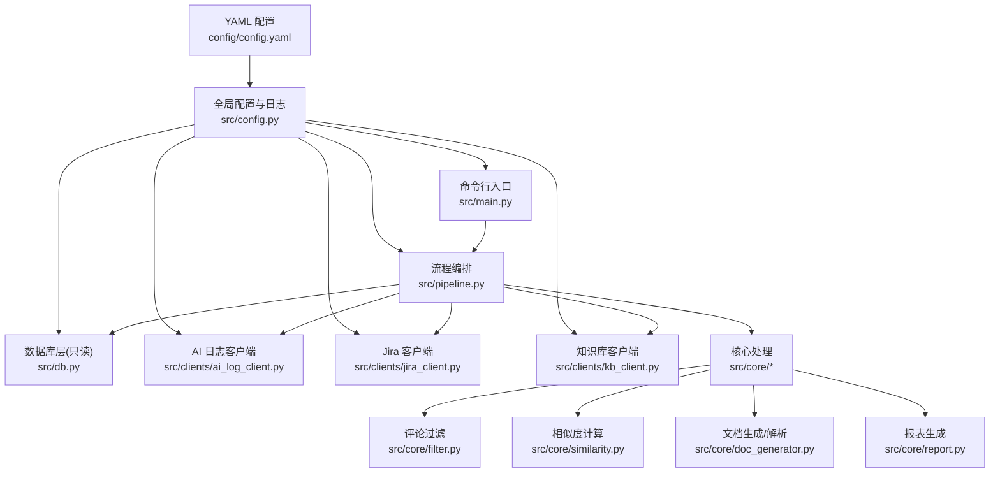
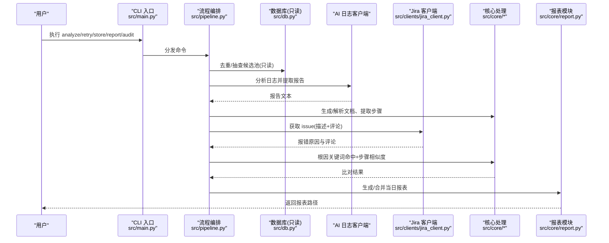
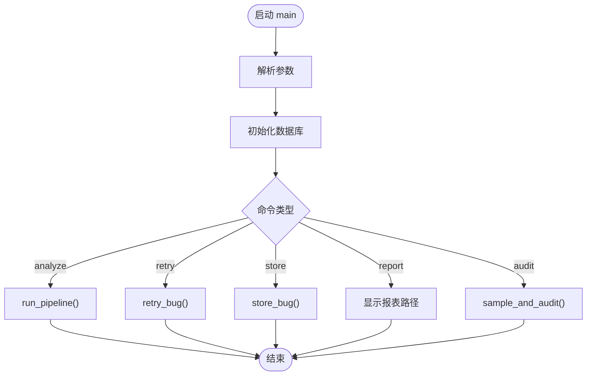
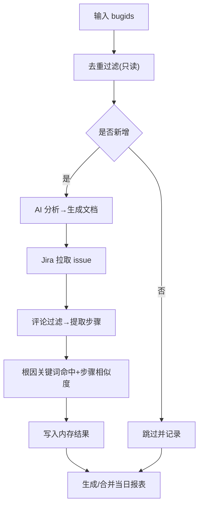
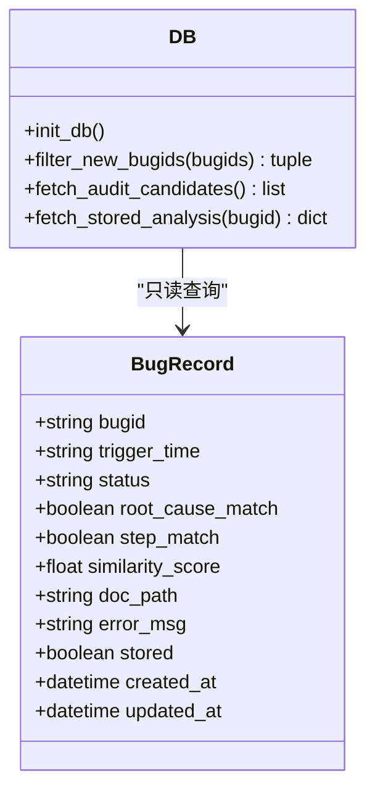
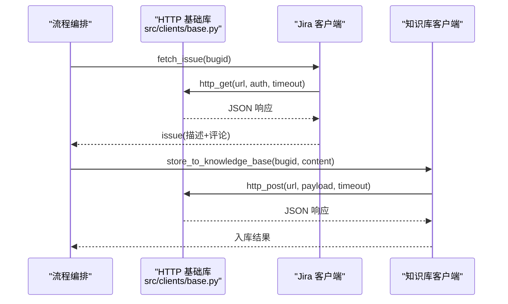
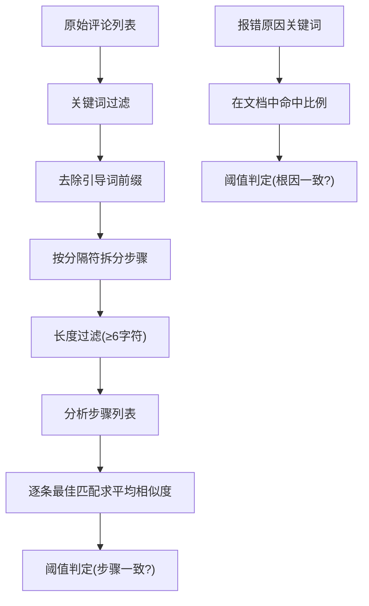
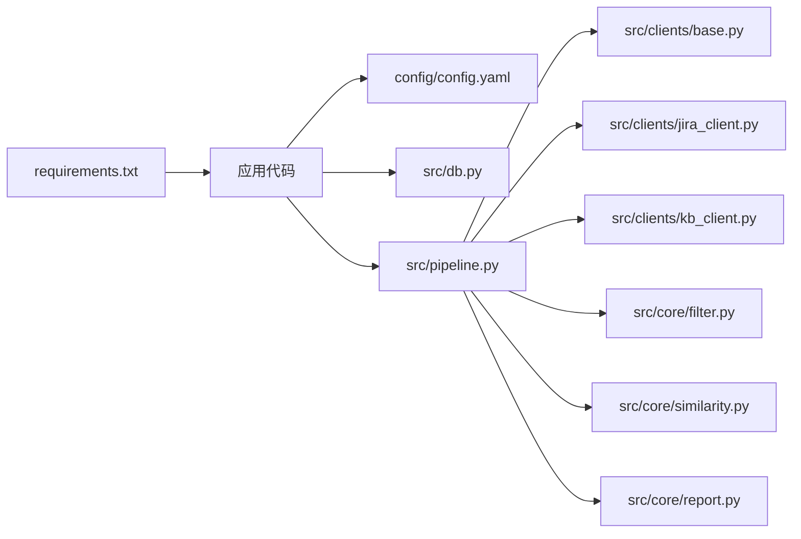

# 部署运维

<cite>
**本文引用的文件**
- [README.md](file://README.md)
- [requirements.txt](file://requirements.txt)
- [config/config.yaml](file://config/config.yaml)
- [src/main.py](file://src/main.py)
- [src/config.py](file://src/config.py)
- [src/db.py](file://src/db.py)
- [src/pipeline.py](file://src/pipeline.py)
- [src/core/report.py](file://src/core/report.py)
- [src/clients/base.py](file://src/clients/base.py)
- [src/clients/jira_client.py](file://src/clients/jira_client.py)
- [src/clients/kb_client.py](file://src/clients/kb_client.py)
- [src/core/filter.py](file://src/core/filter.py)
- [src/core/similarity.py](file://src/core/similarity.py)
</cite>

## 目录
1. [简介](#简介)
2. [项目结构](#项目结构)
3. [核心组件](#核心组件)
4. [架构总览](#架构总览)
5. [详细组件分析](#详细组件分析)
6. [依赖关系分析](#依赖关系分析)
7. [性能与扩容](#性能与扩容)
8. [监控与日志](#监控与日志)
9. [故障排查指南](#故障排查指南)
10. [备份与恢复策略](#备份与恢复策略)
11. [安全加固措施](#安全加固措施)
12. [自动化部署与运维脚本](#自动化部署与运维脚本)
13. [结论](#结论)

## 简介
本指南面向生产环境的部署与运维，覆盖 Python 环境配置、依赖管理、配置文件部署；日志与监控；故障排查；备份与恢复；扩容优化；安全加固；以及自动化部署方案。工具以 CLI 驱动，运行结果不写入数据库，仅生成文档与每日 CSV 结论报表；知识库入库由开发手工触发。

## 项目结构
- 配置：全局 YAML 配置（数据库、外部接口、相似性阈值、输出路径等）
- 源码：CLI 入口、流程编排、数据库只读访问、客户端封装、核心处理（评论过滤、相似度、文档生成、报表）
- 数据与产物：docs（按日期分目录的 bug 文档）、reports（每日结论 CSV）、logs（按日归档的运行日志）
- 测试与报告：pytest + allure 测试结果

图表来源
- [src/main.py:1-111](file://src/main.py#L1-L111)
- [src/pipeline.py:1-105](file://src/pipeline.py#L1-L105)
- [src/db.py:1-132](file://src/db.py#L1-L132)
- [src/config.py:1-59](file://src/config.py#L1-L59)
- [config/config.yaml:1-63](file://config/config.yaml#L1-L63)

章节来源
- [README.md:1-76](file://README.md#L1-L76)
- [config/config.yaml:1-63](file://config/config.yaml#L1-L63)

## 核心组件
- CLI 入口：提供 analyze/retry/store/report/audit 子命令，统一初始化日志与数据库并分发任务
- 流程编排：串联去重、AI 分析、文档生成、Jira 比对、结论报表生成；失败不中断整体流程
- 数据库层：只读查询，用于 bugid 去重与抽查候选池读取
- 客户端封装：HTTP GET/POST 通用重试与错误日志；Jira、知识库、AI 日志客户端
- 核心处理：评论过滤、TF-IDF 余弦相似度、根因关键词命中比例、文档生成与解析、每日报表
- 配置与日志：YAML 配置加载与缓存；控制台与按日归档的文件日志

章节来源
- [src/main.py:1-111](file://src/main.py#L1-L111)
- [src/pipeline.py:1-105](file://src/pipeline.py#L1-L105)
- [src/db.py:1-132](file://src/db.py#L1-L132)
- [src/clients/base.py:1-39](file://src/clients/base.py#L1-L39)
- [src/core/filter.py:1-49](file://src/core/filter.py#L1-L49)
- [src/core/similarity.py:1-75](file://src/core/similarity.py#L1-L75)
- [src/core/report.py:1-66](file://src/core/report.py#L1-L66)
- [src/config.py:1-59](file://src/config.py#L1-L59)

## 架构总览
系统通过 CLI 触发主流程，依次执行：
1) 从数据库只读比对 bugid 去重
2) 调用 AI 日志分析接口生成文档
3) 调用 Jira REST API 获取报错原因与评论，经评论过滤提取步骤
4) 基于 TF-IDF 余弦相似度与关键词命中比例进行双重比对
5) 生成/合并当日 CSV 结论报表
6) 支持手工 store 将分析文档推入知识库

图表来源
- [src/main.py:1-111](file://src/main.py#L1-L111)
- [src/pipeline.py:1-105](file://src/pipeline.py#L1-L105)
- [src/db.py:1-132](file://src/db.py#L1-L132)
- [src/clients/jira_client.py:1-54](file://src/clients/jira_client.py#L1-L54)
- [src/core/report.py:1-66](file://src/core/report.py#L1-L66)

## 详细组件分析

### CLI 入口与命令分发
- 提供 analyze/retry/store/report/audit 五个子命令
- Windows 平台自动切换 stdout/stderr 编码为 UTF-8
- 统一初始化日志与数据库，异常捕获并记录错误日志

图表来源
- [src/main.py:1-111](file://src/main.py#L1-L111)

章节来源
- [src/main.py:1-111](file://src/main.py#L1-L111)

### 流程编排与数据处理
- 单个 bug 的分析链路：AI 分析 → 文档生成 → Jira 拉取 → 评论过滤 → 相似度比对 → 结果汇总
- 批量分析时，单个失败不影响整体，结果写入当日报表
- retry 针对指定 bug 重新分析并更新报表
- store 读取最新文档并推送至知识库

图表来源
- [src/pipeline.py:1-105](file://src/pipeline.py#L1-L105)
- [src/core/filter.py:1-49](file://src/core/filter.py#L1-L49)
- [src/core/similarity.py:1-75](file://src/core/similarity.py#L1-L75)
- [src/core/report.py:1-66](file://src/core/report.py#L1-L66)

章节来源
- [src/pipeline.py:1-105](file://src/pipeline.py#L1-L105)

### 数据库层（只读）
- 使用 SQLAlchemy 连接 SQLite/MySQL，自动建表
- filter_new_bugids：批内去重 + 数据库已存在去重
- fetch_audit_candidates/fetch_stored_analysis：随机抽查与已入库字段读取（只读）

图表来源
- [src/db.py:1-132](file://src/db.py#L1-L132)

章节来源
- [src/db.py:1-132](file://src/db.py#L1-L132)

### 客户端封装与外部集成
- base：统一 HTTP GET/POST，默认重试 3 次，超时可配，错误日志记录
- jira_client：mock 模式或真实 Jira REST API，提取 description 与 comments
- kb_client：mock 模式或真实知识库入库接口

图表来源
- [src/clients/base.py:1-39](file://src/clients/base.py#L1-L39)
- [src/clients/jira_client.py:1-54](file://src/clients/jira_client.py#L1-L54)
- [src/clients/kb_client.py:1-24](file://src/clients/kb_client.py#L1-L24)

章节来源
- [src/clients/base.py:1-39](file://src/clients/base.py#L1-L39)
- [src/clients/jira_client.py:1-54](file://src/clients/jira_client.py#L1-L54)
- [src/clients/kb_client.py:1-24](file://src/clients/kb_client.py#L1-L24)

### 核心处理：评论过滤与相似度
- 评论过滤：关键词匹配 + 前缀清理 + 分割规则，预留 LLM Agent 扩展点
- 相似度：TF-IDF 余弦相似度计算步骤平均得分；根因关键词命中比例判定

图表来源
- [src/core/filter.py:1-49](file://src/core/filter.py#L1-L49)
- [src/core/similarity.py:1-75](file://src/core/similarity.py#L1-L75)

章节来源
- [src/core/filter.py:1-49](file://src/core/filter.py#L1-L49)
- [src/core/similarity.py:1-75](file://src/core/similarity.py#L1-L75)

### 报表生成
- 列定义包含中文表头，便于 Excel 直接打开
- 同日多次运行按 bugid 覆盖合并，避免重复行
- 输出路径由配置控制，确保目录存在

章节来源
- [src/core/report.py:1-66](file://src/core/report.py#L1-L66)

## 依赖关系分析
- 运行时依赖：requests、SQLAlchemy、pandas、scikit-learn、PyYAML、jieba、pytest、allure-pytest
- 模块耦合：main 依赖 pipeline、db、config、core；pipeline 依赖 db、clients、core；clients 依赖 base 与 config；core 依赖 config 与 jieba/sklearn

图表来源
- [requirements.txt:1-9](file://requirements.txt#L1-L9)
- [src/main.py:1-111](file://src/main.py#L1-L111)
- [src/pipeline.py:1-105](file://src/pipeline.py#L1-L105)

章节来源
- [requirements.txt:1-9](file://requirements.txt#L1-L9)

## 性能与扩容
- 并发处理优化
  - 批量分析可在 pipeline 层引入线程池或进程池并行处理多个 bugid，注意外部接口限流与重试退避
  - 对 Jira/AI 接口设置合理的超时与重试次数，避免阻塞
- API 限流配置
  - 在 clients/base.py 中可扩展令牌桶或滑动窗口限流器，结合配置项控制并发与速率
  - 对高延迟接口增加指数退避重试，降低瞬时压力
- 资源调优
  - 调整 Python 解释器参数（如 -u 无缓冲输出），配合日志按日归档避免单文件过大
  - 大数据集相似度计算可考虑向量缓存与增量更新，减少重复计算
- 指标收集建议
  - 统计每次运行的 bug 数量、成功/失败率、平均耗时、接口调用次数与失败次数
  - 将关键指标输出到日志或上报至监控系统（Prometheus/Grafana）

[本节为通用指导，不直接分析具体文件]

## 监控与日志
- 日志级别与输出
  - 默认 INFO 级别，控制台与文件双输出
  - 文件按天归档：logs/app_YYYY-MM-DD.log
- 日志轮转
  - 当前实现按天创建新文件；生产环境建议使用 logrotate 或容器化日志采集（如 Filebeat/Fluent Bit）
- 关键指标
  - 接口调用成功率、重试次数、超时次数
  - 相似度分数分布、根因命中率
  - 每日报表行数、失败条目占比
- 监控建议
  - 对 logs 目录做健康检查与告警（文件大小、最近写入时间）
  - 对 reports 目录做完整性校验（是否存在当日 CSV）
  - 对外部接口（AI/Jira/知识库）可用性进行探针检测

章节来源
- [src/config.py:37-59](file://src/config.py#L37-L59)
- [src/core/report.py:46-66](file://src/core/report.py#L46-L66)

## 故障排查指南
- 常见错误诊断
  - 接口请求失败：检查 URL、认证、超时与重试；查看 base 客户端错误日志
  - 数据库连接失败：确认连接串、权限与网络连通性；SQLite 路径需绝对路径
  - 报表未生成：确认输出目录权限与配置路径正确
- 性能瓶颈分析
  - 相似度计算耗时：关注 TF-IDF 向量化与余弦相似度计算；可对大文本分块或缓存向量
  - 外部接口延迟：增加超时与重试，必要时引入熔断与降级
- 内存泄漏检测
  - 长时间运行场景下，避免全局大对象累积；定期释放 Session 与临时变量
  - 使用内存分析工具（如 memory_profiler）定位热点
- 快速定位步骤
  - 查看当日日志：logs/app_YYYY-MM-DD.log
  - 查看当日报表：reports/YYYY-MM-DD_daily.csv
  - 核对配置：config/config.yaml 中的接口地址、超时、阈值

章节来源
- [src/clients/base.py:12-39](file://src/clients/base.py#L12-L39)
- [src/db.py:42-57](file://src/db.py#L42-L57)
- [src/core/report.py:46-66](file://src/core/report.py#L46-L66)

## 备份与恢复策略
- 数据库备份
  - SQLite：直接复制 data/app.db 文件；MySQL：使用 mysqldump 定时备份
  - 备份频率：至少每日一次，变更前后额外备份
- 配置文件管理
  - 将 config/config.yaml 纳入版本控制与配置中心；敏感信息（如 token）使用环境变量或密钥管理服务
- 文档归档
  - docs 目录按日期组织，建议定期打包归档至对象存储或共享盘
  - reports 目录保留历史报表，便于审计与回溯
- 恢复流程
  - 停止服务 → 恢复数据库与配置 → 验证日志与报表 → 启动服务 → 冒烟测试

[本节为通用指导，不直接分析具体文件]

## 安全加固措施
- API 密钥管理
  - 将 Jira 用户名/令牌、知识库凭证等敏感信息放入环境变量或密钥管理系统，不在 YAML 明文存放
  - 限制最小权限原则，仅授予必要接口访问权
- 访问权限控制
  - 对外部接口启用 IP 白名单与 TLS 加密
  - 对 CLI 执行者进行身份鉴权（如 CI/CD 流水线中的凭据注入）
- 数据传输加密
  - 所有 HTTP 请求强制 HTTPS；服务端证书有效且受信任
  - 本地通信（如 SQLite）确保文件系统权限最小化
- 审计与合规
  - 记录所有外部接口调用与结果（含失败），便于审计追踪
  - 定期审查配置与凭据轮换

[本节为通用指导，不直接分析具体文件]

## 自动化部署与运维脚本
- 环境准备
  - 安装 Python 3.x 与 pip，创建虚拟环境
  - 安装依赖：pip install -r requirements.txt
- 配置部署
  - 部署 config/config.yaml，填写数据库连接串与外部接口地址
  - 设置环境变量（如数据库密码、API Token）
- 启动与运行
  - 使用 systemd/supervisor/docker 管理进程
  - 定时任务（cron/systemd timer）执行 analyze/audit
- 监控与告警
  - 日志采集与聚合（ELK/Loki）
  - 指标上报（Prometheus Exporter）
- 回滚与升级
  - 版本化发布，灰度上线，快速回滚
  - 数据库迁移脚本与兼容性检查

[本节为通用指导，不直接分析具体文件]

## 结论
本指南提供了从环境搭建、配置管理、监控日志、故障排查、备份恢复、扩容优化到安全加固与自动化部署的全链路运维方案。结合项目的 CLI 驱动与模块化设计，可在生产环境中稳定运行并持续演进。建议在上线前完成压测与演练，确保各外部接口与数据源可用，并建立完善的监控与告警体系。