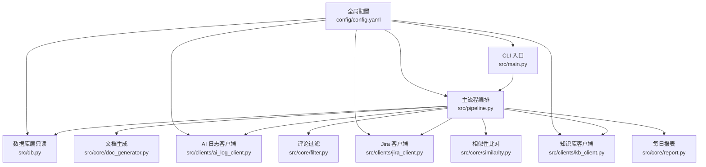
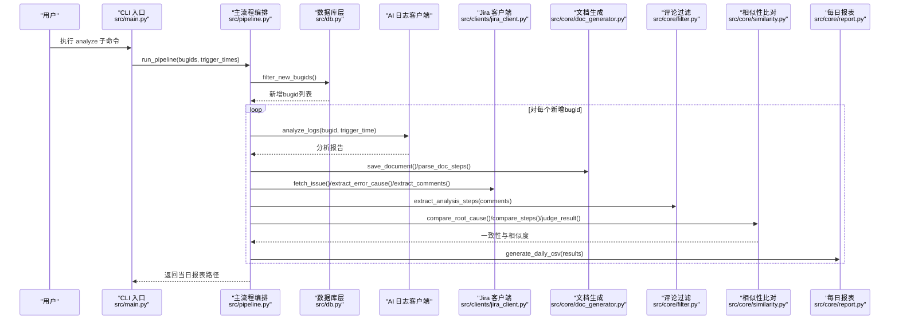
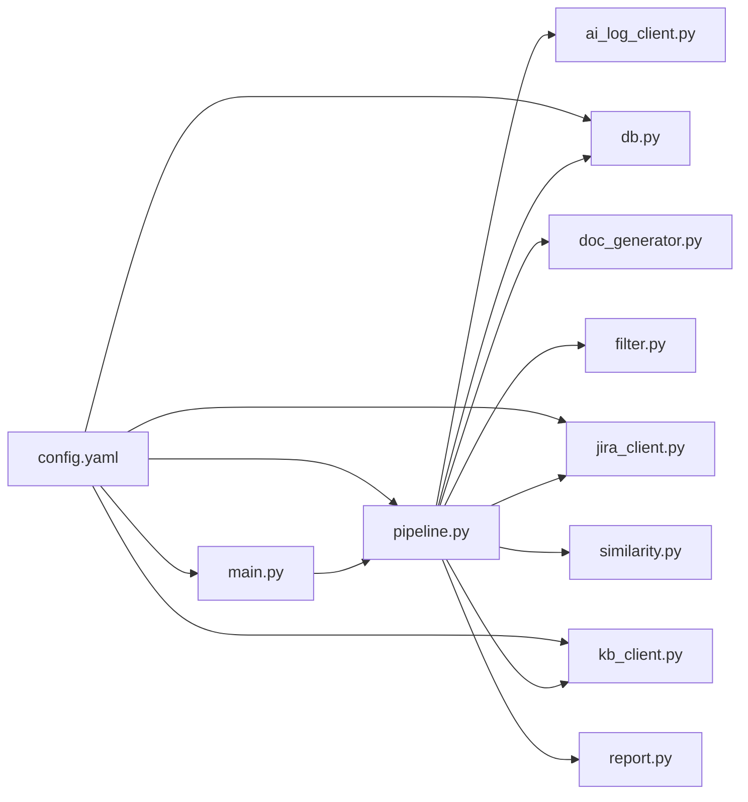

# 项目概述

<cite>
**本文引用的文件**
- [README.md](file://README.md)
- [src/main.py](file://src/main.py)
- [src/pipeline.py](file://src/pipeline.py)
- [src/config.py](file://src/config.py)
- [src/db.py](file://src/db.py)
- [src/core/filter.py](file://src/core/filter.py)
- [src/core/similarity.py](file://src/core/similarity.py)
- [src/core/doc_generator.py](file://src/core/doc_generator.py)
- [src/core/report.py](file://src/core/report.py)
- [src/clients/base.py](file://src/clients/base.py)
- [src/clients/jira_client.py](file://src/clients/jira_client.py)
- [src/clients/kb_client.py](file://src/clients/kb_client.py)
- [config/config.yaml](file://config/config.yaml)
- [requirements.txt](file://requirements.txt)
</cite>

## 目录
1. [简介](#简介)
2. [项目结构](#项目结构)
3. [核心组件](#核心组件)
4. [架构总览](#架构总览)
5. [详细组件分析](#详细组件分析)
6. [依赖关系分析](#依赖关系分析)
7. [性能考量](#性能考量)
8. [故障排查指南](#故障排查指南)
9. [结论](#结论)
10. [附录：快速开始与使用示例](#附录快速开始与使用示例)

## 简介
本工具围绕“基于 AI 日志分析工具的 Bug 文档沉淀与故障分析闭环”构建，实现从 bugid 去重、AI 分析生成文档、Jira 报错原因/评论比对、每日结论报表到知识库手工入库的完整流程。其价值在于自动化重复性分析工作，提高故障处理效率，并通过相似性算法与随机抽查复核机制保障分析质量。

主要特性
- 智能去重过滤：基于数据库只读比对，自动过滤已存在或批内重复的 bugid，减少无效分析。
- AI 日志分析集成：调用 AI 日志分析接口，提取报告并生成按日期分目录的分析文档。
- 相似性算法验证：对根因关键词命中比例与步骤 TF-IDF 余弦相似度进行双重比对，输出一致性与得分。
- 随机抽查复核机制：从已入库表抽样重新分析，与库中存储字段对比，生成人工审核表格，持续校验质量。

适用场景与人群
- 运维与研发工程师：日常故障复盘、问题定位与知识沉淀。
- 质量保障与测试团队：通过抽查复核保障分析一致性。
- 项目管理与负责人：通过每日结论报表掌握当日分析进展与结果。

## 项目结构
仓库采用分层组织：入口命令、流程编排、外部客户端、核心处理、配置与数据输出等模块职责清晰。

图表来源
- [src/main.py:1-111](file://src/main.py#L1-L111)
- [src/pipeline.py:1-105](file://src/pipeline.py#L1-L105)
- [src/db.py:1-132](file://src/db.py#L1-L132)
- [src/clients/jira_client.py:1-54](file://src/clients/jira_client.py#L1-L54)
- [src/clients/kb_client.py:1-24](file://src/clients/kb_client.py#L1-L24)
- [src/core/doc_generator.py:1-79](file://src/core/doc_generator.py#L1-L79)
- [src/core/filter.py:1-49](file://src/core/filter.py#L1-L49)
- [src/core/similarity.py:1-75](file://src/core/similarity.py#L1-L75)
- [src/core/report.py:1-66](file://src/core/report.py#L1-L66)
- [config/config.yaml:1-63](file://config/config.yaml#L1-L63)

章节来源
- [README.md:1-76](file://README.md#L1-L76)
- [src/main.py:1-111](file://src/main.py#L1-L111)
- [src/pipeline.py:1-105](file://src/pipeline.py#L1-L105)
- [config/config.yaml:1-63](file://config/config.yaml#L1-L63)

## 核心组件
- CLI 入口：提供 analyze/retry/store/report/audit 子命令，统一参数解析与异常处理。
- 主流程编排：串联去重、AI 分析、文档生成、Jira 比对、结论报表生成；失败不中断整体流程。
- 数据库层：仅用于 bugid 去重与抽查候选池读取，遵循只读原则。
- 外部客户端：封装 HTTP 请求、重试与错误日志；支持 mock 模式便于本地调试。
- 核心处理：评论过滤、相似性比对、文档生成、报表生成、随机抽查复核。
- 配置与日志：YAML 配置集中管理；日志按日归档，控制台与文件双输出。

章节来源
- [src/main.py:1-111](file://src/main.py#L1-L111)
- [src/pipeline.py:1-105](file://src/pipeline.py#L1-L105)
- [src/db.py:1-132](file://src/db.py#L1-L132)
- [src/clients/base.py:1-39](file://src/clients/base.py#L1-L39)
- [src/clients/jira_client.py:1-54](file://src/clients/jira_client.py#L1-L54)
- [src/clients/kb_client.py:1-24](file://src/clients/kb_client.py#L1-L24)
- [src/core/filter.py:1-49](file://src/core/filter.py#L1-L49)
- [src/core/similarity.py:1-75](file://src/core/similarity.py#L1-L75)
- [src/core/doc_generator.py:1-79](file://src/core/doc_generator.py#L1-L79)
- [src/core/report.py:1-66](file://src/core/report.py#L1-L66)
- [src/config.py:1-59](file://src/config.py#L1-L59)
- [config/config.yaml:1-63](file://config/config.yaml#L1-L63)

## 架构总览
系统以 CLI 为入口，主流程编排协调各模块完成端到端分析闭环。对外部系统（AI 日志分析、Jira、知识库）通过客户端抽象，屏蔽差异并支持 mock。核心处理模块负责文本抽取、相似度计算与报表生成。所有运行产物（文档、报表、日志）落盘，不写数据库。

图表来源
- [src/main.py:29-34](file://src/main.py#L29-L34)
- [src/pipeline.py:18-86](file://src/pipeline.py#L18-L86)
- [src/db.py:67-88](file://src/db.py#L67-L88)
- [src/clients/jira_client.py:32-54](file://src/clients/jira_client.py#L32-L54)
- [src/core/doc_generator.py:14-40](file://src/core/doc_generator.py#L14-L40)
- [src/core/filter.py:29-49](file://src/core/filter.py#L29-L49)
- [src/core/similarity.py:34-75](file://src/core/similarity.py#L34-L75)
- [src/core/report.py:46-66](file://src/core/report.py#L46-L66)

## 详细组件分析

### CLI 入口（analyze/retry/store/report/audit）
- 职责：解析命令行参数、初始化数据库、分发子命令、统一异常处理。
- 关键点：Windows 控制台编码切换；触发时间参数解析；子命令参数校验。

章节来源
- [src/main.py:1-111](file://src/main.py#L1-L111)

### 主流程编排（run_pipeline / retry_bug / store_bug）
- 职责：串联去重、AI 分析、文档生成、Jira 比对、结论报表生成；失败容错与覆盖合并。
- 关键点：单个 bug 失败不影响整体；同日多次运行按 bugid 覆盖合并；store 为纯手工触发。

章节来源
- [src/pipeline.py:1-105](file://src/pipeline.py#L1-L105)

### 数据库层（只读查询）
- 职责：bugid 去重、抽查候选池读取、已入库分析字段读取。
- 关键点：SQLite/MySQL 连接串；相对路径规范化；事务安全与异常记录。

章节来源
- [src/db.py:1-132](file://src/db.py#L1-L132)

### 外部客户端（HTTP 基础封装、Jira、知识库）
- 职责：统一超时、重试、错误日志；mock 模式支持；认证与入参映射。
- 关键点：http_post/http_get 通用方法；Jira 评论与描述提取；知识库入库 payload 构造。

章节来源
- [src/clients/base.py:1-39](file://src/clients/base.py#L1-L39)
- [src/clients/jira_client.py:1-54](file://src/clients/jira_client.py#L1-L54)
- [src/clients/kb_client.py:1-24](file://src/clients/kb_client.py#L1-L24)

### 评论过滤（Agent 过滤）
- 职责：从 Jira 评论区评论中提取与分析相关的步骤信息。
- 关键点：关键词判定、前缀去除、分隔符拆分、长度过滤；预留 LLM Agent 扩展点。

章节来源
- [src/core/filter.py:1-49](file://src/core/filter.py#L1-L49)

### 相似性比对（根因 + 步骤）
- 职责：根因关键词命中比例与步骤 TF-IDF 余弦相似度计算；阈值判定。
- 关键点：停用词过滤、中文分词、最佳匹配平均得分、可配置阈值。

章节来源
- [src/core/similarity.py:1-75](file://src/core/similarity.py#L1-L75)

### 文档生成（保存、解析、查找）
- 职责：将分析报告保存为 Markdown 文档；提取序号步骤；查找最新文档。
- 关键点：按日期分目录；文件名使用 bugid；未找到时抛出明确错误。

章节来源
- [src/core/doc_generator.py:1-79](file://src/core/doc_generator.py#L1-L79)

### 每日报表（CSV 生成与合并）
- 职责：将内存中的分析结果转换为 CSV；同日多次运行按 bugid 覆盖合并。
- 关键点：UTF-8-SIG 编码避免 Excel 乱码；列定义与布尔值中文展示。

章节来源
- [src/core/report.py:1-66](file://src/core/report.py#L1-L66)

### 配置与日志
- 职责：加载 YAML 配置；输出目录创建；日志按日归档。
- 关键点：全局缓存配置；路径获取与目录确保；控制台与文件双输出。

章节来源
- [src/config.py:1-59](file://src/config.py#L1-L59)
- [config/config.yaml:1-63](file://config/config.yaml#L1-L63)

## 依赖关系分析
- 模块耦合：pipeline 作为编排中心，依赖 db、clients、core 各模块；main 仅负责入口与分发。
- 外部依赖：requests、SQLAlchemy、pandas、scikit-learn、PyYAML、jieba、pytest、allure-pytest。
- 潜在风险：外部接口可用性（AI/Jira/Knowledge Base）；数据库只读约束需严格保持；相似度阈值需随业务调整。

图表来源
- [src/main.py:1-111](file://src/main.py#L1-L111)
- [src/pipeline.py:1-105](file://src/pipeline.py#L1-L105)
- [src/db.py:1-132](file://src/db.py#L1-L132)
- [src/clients/jira_client.py:1-54](file://src/clients/jira_client.py#L1-L54)
- [src/clients/kb_client.py:1-24](file://src/clients/kb_client.py#L1-L24)
- [src/core/doc_generator.py:1-79](file://src/core/doc_generator.py#L1-L79)
- [src/core/filter.py:1-49](file://src/core/filter.py#L1-L49)
- [src/core/similarity.py:1-75](file://src/core/similarity.py#L1-L75)
- [src/core/report.py:1-66](file://src/core/report.py#L1-L66)
- [config/config.yaml:1-63](file://config/config.yaml#L1-L63)

章节来源
- [requirements.txt:1-9](file://requirements.txt#L1-L9)
- [config/config.yaml:1-63](file://config/config.yaml#L1-L63)

## 性能考量
- 相似度计算：TF-IDF 向量构建与余弦相似度在大批量步骤比对时可能成为瓶颈，建议控制步骤数量与文本长度，必要时引入缓存或模型打分优化。
- 外部接口：AI/Jira/Knowledge Base 调用具备重试与超时保护，建议根据网络环境调优 timeout 与 retries。
- 报表合并：同日多次运行按 bugid 覆盖合并，注意大文件读写开销，可在生产环境考虑增量写入策略。
- 数据库：只读查询，避免锁竞争；SQLite 适合轻量场景，MySQL 更适合并发与规模扩展。

[本节为通用指导，无需特定文件引用]

## 故障排查指南
- 接口请求失败：检查 config.yaml 中 url、timeout、认证字段；确认 mock 开关与实际接口状态；查看 logs/app_YYYY-MM-DD.log 中的错误日志。
- 评论过滤为空：确认 Jira 评论是否包含分析相关关键词；必要时扩展关键词或接入 LLM Agent。
- 相似度得分过低：调整 similarity.threshold 与 root_cause_hit_ratio；检查分词与停用词配置。
- 报表缺失或乱码：确认 reports 目录权限与 UTF-8-SIG 编码；检查 pandas 版本与依赖。
- 知识库入库失败：确认 kb_client 的 content_field 与 bugid_field 映射；检查知识库接口返回码与消息。

章节来源
- [src/clients/base.py:12-39](file://src/clients/base.py#L12-L39)
- [src/clients/jira_client.py:18-54](file://src/clients/jira_client.py#L18-L54)
- [src/core/filter.py:19-49](file://src/core/filter.py#L19-L49)
- [src/core/similarity.py:17-75](file://src/core/similarity.py#L17-L75)
- [src/core/report.py:46-66](file://src/core/report.py#L46-L66)
- [src/clients/kb_client.py:8-24](file://src/clients/kb_client.py#L8-L24)
- [src/config.py:37-59](file://src/config.py#L37-L59)

## 结论
该工具通过标准化流程与自动化手段，显著提升了 Bug 分析与知识沉淀的效率与质量。结合智能去重、AI 分析、相似性比对与随机抽查复核，形成完整的故障分析闭环。建议在真实环境中逐步替换 mock 配置，并根据业务特点调优相似度阈值与过滤规则，以获得更稳定的分析效果。

[本节为总结性内容，无需特定文件引用]

## 附录：快速开始与使用示例
- 安装依赖：pip install -r requirements.txt
- 配置接口：编辑 config/config.yaml，设置 database.url、ai_log_api、jira_api、knowledge_base_api、similarity 与 audit 相关项。
- 基本命令：
  - 分析 bugid 列表（可选触发时间）：python -m src.main analyze BUG-1001 BUG-1002 --trigger-time "BUG-1001=2026-08-12 10:00:00"
  - 失败重试：python -m src.main retry BUG-1001
  - 手工入库：python -m src.main store BUG-1001
  - 查看当日报表：python -m src.main report --date 2026-08-12
  - 随机抽查：python -m src.main audit 或 --count 指定抽样数

章节来源
- [README.md:15-50](file://README.md#L15-L50)
- [config/config.yaml:1-63](file://config/config.yaml#L1-L63)
- [src/main.py:63-90](file://src/main.py#L63-L90)