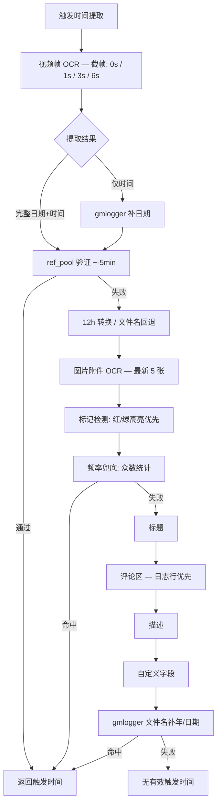

# 触发时间提取优化日志


## 当前时间提取逻辑

### 提取优先级



> **ref_pool 验证池**：包内 main.log 时间（权威）> 外层 gmlogger 文件名时间（补充）


## 自学习闭环机制

```
批量提取 → records/records_YYYY-MM-DD.csv（按日分文件）
                          │
                          ▼
              _timestudy_analyze()
                          │
            ┌────────────┼────────────┐
            ▼            ▼            ▼
    统计概览+断点    模式生命周期    本批次表格
                          │
               ┌──────┼──────┐
               ▼        ▼        ▼
          resolved   new    ongoing/improving
       (自动检测修复) (新问题)   (持续/改善)
               │
               ▼
      自动追加修复记录 → _TIMESTUDY_FIX_LOG → 历史变更记录
```

| 状态 | 含义 | 触发条件 |
|------|------|----------|
| ✅ resolved | 已修复 | 上次存在的错误类型本次消失 |
| 🆕 new | 新发现 | 上次不存在本次新出现 |
| ⚠️ ongoing | 持续中 | 两次都存在，数量未明显下降 |
| 📉 improving | 改善中 | 两次都存在，数量下降 >50% |


## 历史变更记录

<details>
<summary><b>1. 封面帧小字时钟 OCR 识别修复（2026-10-09）</b></summary>

- **问题描述**：封面帧有清晰时钟但 OCR 读成乱码，时间提取失败
- **相关Bug号**：VCU-553755
- **根因**：EasyOCR 默认画布 1280 导致大图下采样，小字号/低对比度时钟识别能力不足
- **解决方案**：新增 `_ocr_readtext` 使用 canvas_size=2560、mag_ratio=1.5、降低阈值，统一应用到三处 OCR 调用点

</details>

<details>
<summary><b>2. gmlogger 包内 main 文件日期遗漏修复（2026-10-10）</b></summary>

- **问题描述**：视频封面读出 6:17，但未能匹配到包内 `58-main.log_2026_10_10_6_18_4.gz` 的正确日期
- **相关Bug号**：VCU-553973
- **根因**：① `main_names[:5]` 只取前 5 个 main 文件，30+ 文件时遗漏目标日期；② 外层 gmlogger 文件名有旧日期时不触发包内回退，ref_pool 全是旧日期
- **解决方案**：遍历所有 main 文件解析时间（头读限 10 个）；始终下载包内取权威日期，包内优先、外层仅补充

</details>

<details>
<summary><b>3. 标题仅时间时用创建日期补全导致日期错误（2026-10-10）</b></summary>

- **问题描述**：标题含 `10:31`，评论区有完整 `2026-10-6 10:31:00`，但系统用 Jira 创建日期补全成 `2026-10-09 10:31:00`
- **相关Bug号**：VCU-553601
- **根因**：标题仅含时间无日期时，用 `created_date` 补全，但创建日期可能比实际事件晚几天；评论区有正确日期但未被检查
- **解决方案**：标题仅时间时，先从评论区查找同一时间的完整日期（时间差≤1秒），命中则用评论日期；未命中再回退 gmlogger 补充

</details>

<details>
<summary><b>4. 视频 OCR 低置信度误识别过滤（2026-10-10）</b></summary>

- **问题描述**：视频帧手机屏幕显示 `10:08`，清晰度低被 OCR 误读为 `16:50`，提取错误时间
- **相关Bug号**：VCU-553491
- **根因**：OCR 置信度被完全忽略，低置信度误识别文本直接参与时间提取，模糊帧数字易被错读
- **解决方案**：在 `_ocr_readtext` 中过滤置信度<0.3 的时间类文本（仅含数字/冒号/斜杠），三处 OCR 调用点统一生效

</details>
