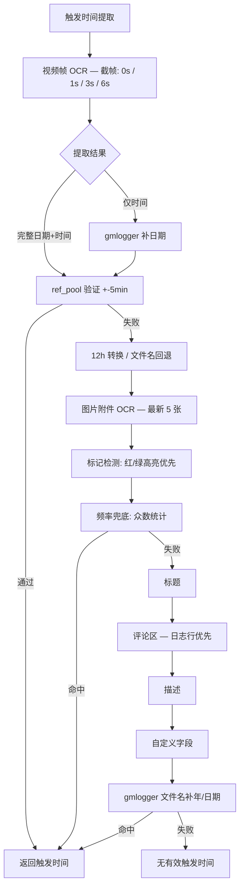

# 触发时间提取优化日志

本文档为触发时间提取的学习总结：仅记录**通用时间提取逻辑**的变更总结（逻辑变更时自动追加到历史变更记录）；
偶发失败、或无需修改提取逻辑的失败不入库。
失败原始记录（含顺便排查的根因）见 `timestudy/records/records_YYYY-MM-DD.csv`；分析快照见 `timestudy/error_patterns*.json`。

## 当前时间提取逻辑

### 提取优先级

```mermaid
flowchart TD
    A["触发时间提取"] --> B["视频帧 OCR — 截帧: 0s / 1s / 3s / 6s"]
    B --> C{提取结果}
    C -->|"完整日期+时间"| D["ref_pool 验证 +-5min"]
    C -->|"仅时间"| E["gmlogger 补日期"]
    E --> D
    D -->|"通过"| R["返回触发时间"]
    D -->|"失败"| F["12h 转换 / 文件名回退"]
    F --> G["图片附件 OCR — 最新 5 张"]
    G --> H["标记检测: 红/绿高亮优先"]
    H --> I["频率兜底: 众数统计"]
    I -->|"命中"| R
    I -->|"失败"| J["标题"]
    J --> K["评论区 — 日志行优先"]
    K --> L["描述"]
    L --> M["自定义字段"]
    M --> N["gmlogger 文件名补年/日期"]
    N -->|"命中"| R
    N -->|"失败"| X["无有效触发时间"]
```

> **ref_pool 验证池**：包内 main.log 时间（权威）> 外层 gmlogger 文件名时间（补充）

## 历史变更记录

<b>1. 封面帧小字时钟 OCR 识别修复（2026-10-09）</b>

- **问题描述**：封面帧有清晰时钟但 OCR 读成乱码，时间提取失败
- **相关Bug号**：VCU-553755
- **根因**：EasyOCR 默认画布 1280 导致大图下采样，小字号/低对比度时钟识别能力不足
- **解决方案**：新增 _ocr_readtext 使用 canvas_size=2560、mag_ratio=1.5、降低阈值，统一应用到三处 OCR 调用点

<b>2. gmlogger 包内 main 文件日期遗漏修复（2026-10-10）</b>

- **问题描述**：视频封面读出 6:17，但未能匹配到包内 58-main.log_2026_10_10_6_18_4.gz 的正确日期
- **相关Bug号**：VCU-553973
- **根因**：① main_names[:5] 只取前 5 个 main 文件，30+ 文件时遗漏目标日期；② 外层 gmlogger 文件名有旧日期时不触发包内回退
- **解决方案**：遍历所有 main 文件解析时间（头读限 10 个）；始终下载包内取权威日期，包内优先、外层仅补充

<b>3. 标题仅时间时用创建日期补全导致日期错误（2026-10-10）</b>

- **问题描述**：标题含 10:31，评论区有完整 2026-10-6 10:31:00，但系统用 Jira 创建日期 2026-10-09 补全成 2026-10-09 10:31:00
- **相关Bug号**：VCU-553601
- **根因**：标题仅含时间无日期时，_extract_times_from_text 用 created_date 补全，但创建日期可能比实际事件日期晚几天；评论区有正确日期但未被检查
- **解决方案**：标题仅时间时，先从评论区查找同一时间的完整日期（时间差≤1秒），命中则用评论日期；未命中再回退 gmlogger 补充

<b>4. 视频 OCR 低置信度误识别过滤（2026-10-10）</b>

- **问题描述**：视频帧中手机屏幕显示 10:08，因清晰度低被 OCR 误读为 16:50，导致提取错误时间
- **相关Bug号**：VCU-553491
- **根因**：OCR 结果的置信度完全被忽略，低置信度的误识别文本直接参与时间提取，模糊帧的数字容易被错读
- **解决方案**：在 _ocr_readtext 中过滤置信度<0.3 的时间类文本（仅含数字/冒号/斜杠），三处 OCR 调用点统一生效

<b>5. 排查诊断未解压时视频OCR无条件覆盖文本提取结果（2026-10-10）</b>

- **问题描述**：文本路径已正确提取到 13:44:00（Initial Setting），但排查诊断仍返回视频 OCR 的 16:50:53
- **相关Bug号**：VCU-553491
- **根因**：gmlogger 未解压时 ref_pool 为空，视频 OCR 结果不经任何验证直接返回 success，覆盖了正确的文本提取时间
- **解决方案**：调整 _diag_verify_suggestion 中无包内时间戳分支的优先级：文本路径已提取有效时间时优先与 gmlogger 文件名时间印证，仅在文本无结果时才回退视频 OCR

<b>6. 水印相机时间过滤——优先使用设备屏幕时间（2026-10-10）</b>

- **问题描述**：视频帧同时存在水印相机时间(16:13)和设备屏幕时间(17:37)，OCR 误用水印时间
- **相关Bug号**：VCU-553532
- **根因**：水印相机叠加的时间往往不准确，但 OCR 不区分来源，水印时间可能被优先匹配
- **解决方案**：在 _ocr_readtext 中检测水印关键词(“水印”/“相机真实可靠”)，计算水印区域 bbox，过滤该区域内的时间类文本

<b>7. 视频未命中gmlogger时新增非视频图片OCR时钟兜底（2026-10-11）</b>

- **问题描述**：视频提取时间(17:27)与gmlogger包内/文件名时间(20:05)不命中，直接走兜底或返回空；附件中车机时钟截图(20:01)未被利用，导致提取失败
- **相关Bug号**：VCU-550243
- **根因**：图片OCR兜底 _diag_extract_time_from_images 仅在诊断流程且gmlogger组数>10时调用，主提取链路 _diag_extract_time_from_video_simple 在视频未命中gmlogger时从不参考非视频图片
- **解决方案**：新增 _image_fallback_time：视频未命中gmlogger后调用图片OCR，图片时钟(20:01)与参考时间(20:05)按时分接近(容差10分钟)则用参考日期+图片时间拼接返回；差距过大弃用回退原逻辑

